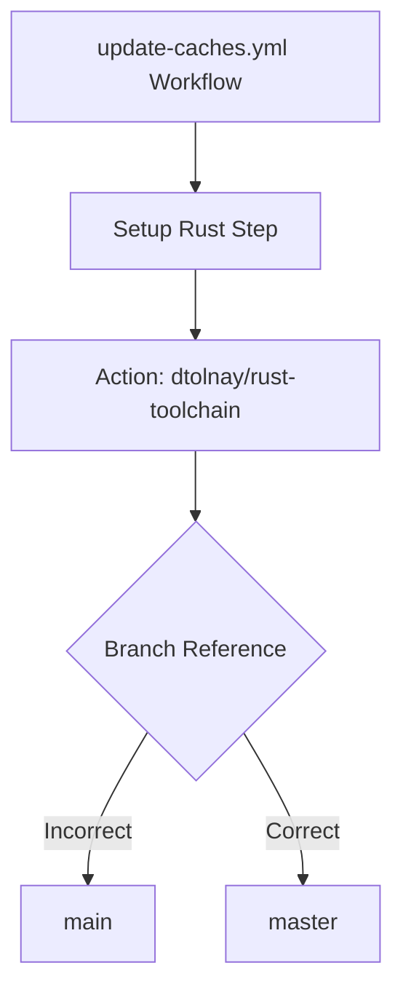

+++
title = "#20239 fix branch name when installing rust in cache update action"
date = "2025-07-22T00:00:00"
draft = false
template = "pull_request_page.html"
in_search_index = true

[taxonomies]
list_display = ["show"]

[extra]
current_language = "en"
available_languages = {"en" = { name = "English", url = "/pull_request/bevy/2025-07/pr-20239-en-20250722" }, "zh-cn" = { name = "中文", url = "/pull_request/bevy/2025-07/pr-20239-zh-cn-20250722" }}
labels = ["C-Bug", "A-Build-System"]
+++

# Analysis of PR #20239: fix branch name when installing rust in cache update action

## Basic Information
- **Title**: fix branch name when installing rust in cache update action 
- **PR Link**: https://github.com/bevyengine/bevy/pull/20239
- **Author**: mockersf
- **Status**: MERGED
- **Labels**: C-Bug, A-Build-System, S-Ready-For-Review
- **Created**: 2025-07-22T02:26:31Z
- **Merged**: 2025-07-22T03:04:13Z
- **Merged By**: alice-i-cecile

## Description Translation
# Objective

- the new cache action (#20144) is currently failing on the install rust step

## Solution

- Use the correct branch name

## The Story of This Pull Request

The GitHub Actions workflow for updating caches was failing during the Rust installation step after the introduction of a new cache action in PR #20144. The root cause was an incorrect branch reference in the workflow configuration. 

In the workflow file `.github/workflows/update-caches.yml`, the step for setting up Rust was referencing the `dtolnay/rust-toolchain` action using the `@main` branch tag:

```yaml
uses: dtolnay/rust-toolchain@main
```

This was incorrect because the `dtolnay/rust-toolchain` repository maintains its primary branch as `master` rather than `main`. The `main` branch did not exist in that repository, causing the workflow to fail when attempting to resolve the action reference.

The failure manifested as a workflow execution error during the "Setup Rust" step, preventing the cache update process from completing successfully. This was a critical issue because it broke the CI pipeline for cache management shortly after the new cache system was implemented.

The fix was straightforward but essential: update the branch reference from `main` to `master` to correctly point to the existing branch in the external repository:

```yaml
uses: dtolnay/rust-toolchain@master
```

This single-character change restored the workflow's ability to locate and execute the Rust toolchain setup action. The modification addressed a common pitfall when integrating third-party GitHub Actions - ensuring branch references match the actual branch names in the target repository.

The change demonstrates the importance of verifying external dependencies in CI configurations, especially after introducing new tooling. While small in scope, this fix was crucial for maintaining the stability of Bevy's build system and ensuring the new cache optimization could function as intended.

## Visual Representation



## Key Files Changed

### .github/workflows/update-caches.yml
This GitHub Actions workflow file manages cache updates for the Bevy project. The modification corrects a branch reference in the Rust installation step.

**Key modification:**
```yaml
# Before:
- name: Setup Rust
  id: rust
  uses: dtolnay/rust-toolchain@main

# After:
- name: Setup Rust
  id: rust
  uses: dtolnay/rust-toolchain@master
```

The change replaces `@main` with `@master` in the action reference, resolving the failure in the Rust installation step. This fix ensures the workflow can properly set up the Rust toolchain when updating caches.

## Further Reading
1. [dtolnay/rust-toolchain GitHub Action](https://github.com/dtolnay/rust-toolchain) - Documentation for the Rust toolchain setup action
2. [GitHub Actions Syntax Reference](https://docs.github.com/en/actions/using-workflows/workflow-syntax-for-github-actions) - Official documentation for workflow configuration
3. [PR #20144](https://github.com/bevyengine/bevy/pull/20144) - The original cache implementation that introduced the workflow

## Full Code Diff
```diff
diff --git a/.github/workflows/update-caches.yml b/.github/workflows/update-caches.yml
index e08eb6dedc432..6a4ce6dba9b9a 100644
--- a/.github/workflows/update-caches.yml
+++ b/.github/workflows/update-caches.yml
@@ -97,7 +97,7 @@ jobs:
 
       - name: Setup Rust
         id: rust
-        uses: dtolnay/rust-toolchain@main
+        uses: dtolnay/rust-toolchain@master
         with:
           toolchain: ${{ matrix.toolchain }}
           target: ${{ matrix.target }}
```