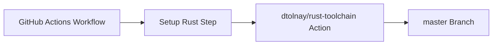

+++
title = "#20239 fix branch name when installing rust in cache update action"
date = "2025-07-22T00:00:00"
draft = false
template = "pull_request_page.html"
in_search_index = false

[extra]
current_language = "zh-cn"
available_languages = {"en" = { name = "English", url = "/pull_request/bevy/2025-07/pr-20239-en-20250722" }, "zh-cn" = { name = "中文", url = "/pull_request/bevy/2025-07/pr-20239-zh-cn-20250722" }}
+++

# PR 分析报告：修复缓存更新操作中的 Rust 安装分支名问题

## 基础信息
- **标题**: fix branch name when installing rust in cache update action
- **PR 链接**: https://github.com/bevyengine/bevy/pull/20239
- **作者**: mockersf
- **状态**: 已合并
- **标签**: C-Bug, A-Build-System, S-Ready-For-Final-Review
- **创建时间**: 2025-07-22T02:26:31Z
- **合并时间**: 2025-07-22T03:04:13Z
- **合并者**: alice-i-cecile

## 问题描述
缓存更新工作流(cache update workflow)在安装 Rust 工具链时失败，具体发生在 CI 管道的 Setup Rust 步骤。问题根源在于引用的第三方 GitHub Action `dtolnay/rust-toolchain` 使用了错误的分支名 `main`，而该仓库的实际默认分支名是 `master`。这个配置错误导致工作流无法定位到正确的 Action 实现。

## 解决方案
将 GitHub Actions 工作流文件中引用的分支名从 `@main` 改为 `@master`：
```yaml
- uses: dtolnay/rust-toolchain@main  # 错误的分支名
+ uses: dtolnay/rust-toolchain@master # 正确的分支名
```

## 关键文件变更
### `.github/workflows/update-caches.yml`
**变更原因**：修正第三方 Action 的分支引用错误  
**变更影响**：修复 CI 管道中 Rust 工具链安装步骤的失败问题

```yaml
# 变更前：
- name: Setup Rust
  id: rust
  uses: dtolnay/rust-toolchain@main
  with:
    toolchain: ${{ matrix.toolchain }}
    target: ${{ matrix.target }}

# 变更后：
- name: Setup Rust
  id: rust
  uses: dtolnay/rust-toolchain@master
  with:
    toolchain: ${{ matrix.toolchain }}
    target: ${{ matrix.target }}
```

## 技术分析
### 问题定位
该问题源于 PR #20144 引入的新缓存工作流。在配置中错误假设了 `dtolnay/rust-toolchain` 使用 `main` 分支，而实际上该仓库保持传统的 `master` 分支命名：
```yaml
# 错误配置
uses: dtolnay/rust-toolchain@main
```

### 解决方案选择
直接修改分支引用是最有效修复方式，因为：
1. 不需要修改 Action 参数或工作流逻辑
2. 保持与上游仓库的默认分支一致
3. 避免引入额外依赖或复杂逻辑

### 影响与教训
1. **立即影响**：修复后 CI 管道能正确安装 Rust 工具链
2. **配置管理经验**：验证第三方 Action 分支名应作为 CI 配置的基本检查项
3. **错误预防**：建议在 CI 配置中添加分支存在性验证（需额外工具支持）

## 组件关系图


## 完整代码变更
```diff
diff --git a/.github/workflows/update-caches.yml b/.github/workflows/update-caches.yml
index e08eb6dedc432..6a4ce6dba9b9a 100644
--- a/.github/workflows/update-caches.yml
+++ b/.github/workflows/update-caches.yml
@@ -97,7 +97,7 @@ jobs:
 
       - name: Setup Rust
         id: rust
-        uses: dtolnay/rust-toolchain@main
+        uses: dtolnay/rust-toolchain@master
         with:
           toolchain: ${{ matrix.toolchain }}
           target: ${{ matrix.target }}
```

## 延伸阅读
1. [GitHub Actions 官方文档](https://docs.github.com/en/actions)
2. [rust-toolchain Action 仓库](https://github.com/dtolnay/rust-toolchain)
3. [分支命名最佳实践](https://github.com/github/renaming)