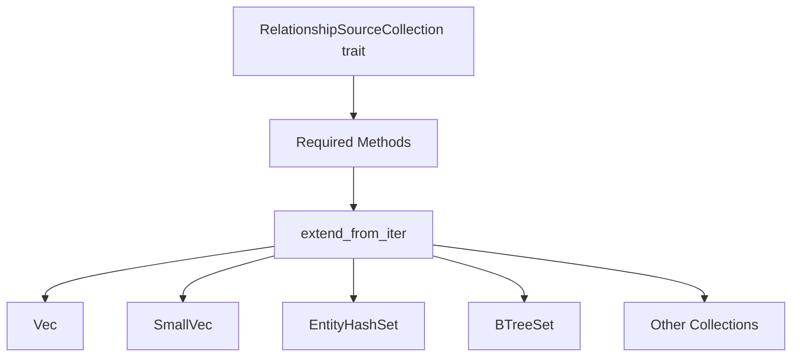

+++
title = "#20255 Remove default implementation of `extend_from_iter` from RelationshipSourceCollection"
date = "2025-07-23T00:00:00"
draft = false
template = "pull_request_page.html"
in_search_index = true

[taxonomies]
list_display = ["show"]

[extra]
current_language = "en"
available_languages = {"en" = { name = "English", url = "/pull_request/bevy/2025-07/pr-20255-en-20250723" }, "zh-cn" = { name = "中文", url = "/pull_request/bevy/2025-07/pr-20255-zh-cn-20250723" }}
labels = ["A-ECS", "C-Code-Quality", "C-Usability"]
+++

# Technical Report: Remove default implementation of `extend_from_iter` from RelationshipSourceCollection

## Basic Information
- **Title**: Remove default implementation of `extend_from_iter` from RelationshipSourceCollection
- **PR Link**: https://github.com/bevyengine/bevy/pull/20255
- **Author**: muddxyii
- **Status**: MERGED
- **Labels**: A-ECS, C-Code-Quality, C-Usability, S-Ready-For-Final-Review, M-Needs-Migration-Guide
- **Created**: 2025-07-23T00:47:08Z
- **Merged**: 2025-07-23T18:45:46Z
- **Merged By**: alice-i-cecile

## Description Translation
# Objective

- Remove the default implementation of `extend_from_iter` from the RelationshipSourceCollection trait to standardize collection types providing their own implementation.
- Fixes #20253

## Solution

- Removed the default implementation of `extend_from_iter`
- Added `extend_from_iter` implementation for BTreeSet that uses its native .extend() method
- All other collection types (Vec, SmallVec, EntityHashSet, IndexSet, EntityIndexSet, Entity) already had their own implementations

## The Story of This Pull Request

### The Problem and Context
The `RelationshipSourceCollection` trait in Bevy's ECS module contained a default implementation for `extend_from_iter` that used a simple loop calling `add()` for each entity. While this provided a fallback behavior, it prevented collections with more efficient bulk operations from implementing optimized versions. Specifically, `BTreeSet<Entity>` was using this default implementation instead of its native `extend()` method, resulting in suboptimal performance when adding multiple entities at once. This violated the principle that collection types should leverage their inherent performance characteristics.

### The Solution Approach
To standardize collection implementations and enable performance optimizations, we needed to:
1. Remove the default implementation to enforce explicit implementations
2. Add an optimized `extend_from_iter` for `BTreeSet<Entity>`
3. Ensure other collection types maintained their existing implementations

The key engineering decision was to make `extend_from_iter` a required trait method rather than optional with a default. This ensures all collection types implement the most efficient version possible for their data structure.

### The Implementation
The implementation consisted of two main changes:

1. **Removed the default implementation** from the trait definition:
```rust
// Before:
pub trait RelationshipSourceCollection {
    fn extend_from_iter(&mut self, entities: impl IntoIterator<Item = Entity>) {
        for entity in entities {
            self.add(entity);
        }
    }
}

// After:
pub trait RelationshipSourceCollection {
    fn extend_from_iter(&mut self, entities: impl IntoIterator<Item = Entity>);
}
```

2. **Added an optimized implementation** for `BTreeSet<Entity>`:
```rust
impl RelationshipSourceCollection for BTreeSet<Entity> {
    // ... existing methods
    
    fn extend_from_iter(&mut self, entities: impl IntoIterator<Item = Entity>) {
        self.extend(entities);
    }
}
```

This change leverages `BTreeSet`'s native `extend()` method which is more efficient than iteratively calling `add()`, especially for larger collections.

### Technical Insights
The change demonstrates an important trait design principle: **default implementations should be avoided when specialized implementations can provide significant performance benefits**. By removing the default, we:
- Enforce consistent performance characteristics across collections
- Prevent accidental use of suboptimal implementations
- Make performance characteristics explicit in the code

The migration guide addresses the breaking change by providing clear examples for users implementing custom collections.

### The Impact
This change provides concrete benefits:
1. **Performance improvement**: `BTreeSet` operations now use O(n log n) time instead of O(n²) for bulk inserts
2. **Code quality**: Standardizes implementation patterns across collections
3. **Explicit contracts**: Makes trait requirements clearer for implementers
4. **Future-proofing**: Ensures new collection types will implement optimized versions

The breaking change is mitigated by the included migration guide, and the impact is limited since other standard collections already implemented the method.

## Visual Representation



## Key Files Changed

### 1. `crates/bevy_ecs/src/relationship/relationship_source_collection.rs`
Changes:
- Removed default implementation of `extend_from_iter`
- Added optimized implementation for `BTreeSet<Entity>`

Code diff:
```rust
// Before:
pub trait RelationshipSourceCollection {
    fn extend_from_iter(&mut self, entities: impl IntoIterator<Item = Entity>) {
        for entity in entities {
            self.add(entity);
        }
    }
}

// After:
pub trait RelationshipSourceCollection {
    fn extend_from_iter(&mut self, entities: impl IntoIterator<Item = Entity>);
}

impl RelationshipSourceCollection for BTreeSet<Entity> {
    // ... other methods
    
    fn extend_from_iter(&mut self, entities: impl IntoIterator<Item = Entity>) {
        self.extend(entities);
    }
}
```

### 2. `release-content/migration-guides/remove_default_extend_from_iter.md`
Changes:
- Added migration guide for the breaking change

Code snippet:
```markdown
---
title: Remove default implementation of extend_from_iter from RelationshipSourceCollection
pull_requests: [20255]
---

The `extend_from_iter` method in the `RelationshipSourceCollection` trait no longer has a default implementation. If you have implemented a custom relationship source collection, you must now provide your own implementation of this method.

```rust
// Before: method was optional due to default implementation
impl RelationshipSourceCollection for MyCustomCollection {
    // ... other required methods
    // extend_from_iter was automatically provided
}

// After: method is now required
impl RelationshipSourceCollection for MyCustomCollection {
    // ... other required methods
    fn extend_from_iter(&mut self, entities: impl IntoIterator<Item = Entity>) {
        // Use your collection's native extend method if available
        self.extend(entities);
        // Or implement manually if needed:
        // for entity in entities {
        //     self.add(entity);
        // }
    }
}
```
```

## Further Reading
1. [Rust Performance Book: Collections](https://nnethercote.github.io/perf-book/collections.html)
2. [Rust API Guidelines on Traits](https://rust-lang.github.io/api-guidelines/future-proofing.html)
3. [Bevy ECS Documentation](https://bevyengine.org/learn/book/ecs-intro/)