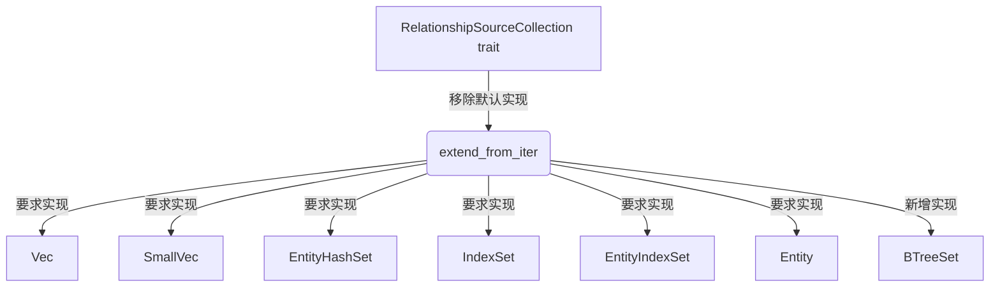

+++
title = "#20255 Remove default implementation of `extend_from_iter` from RelationshipSourceCollection"
date = "2025-07-23T00:00:00"
draft = false
template = "pull_request_page.html"
in_search_index = false

[extra]
current_language = "zh-cn"
available_languages = {"en" = { name = "English", url = "/pull_request/bevy/2025-07/pr-20255-en-20250723" }, "zh-cn" = { name = "中文", url = "/pull_request/bevy/2025-07/pr-20255-zh-cn-20250723" }}
+++

# Remove default implementation of `extend_from_iter` from RelationshipSourceCollection

## Basic Information
- **标题**: Remove default implementation of `extend_from_iter` from RelationshipSourceCollection
- **PR 链接**: https://github.com/bevyengine/bevy/pull/20255
- **作者**: muddxyii
- **状态**: 已合并
- **标签**: A-ECS, C-Code-Quality, C-Usability, S-Ready-For-Final-Review, M-Needs-Migration-Guide
- **创建时间**: 2025-07-23T00:47:08Z
- **合并时间**: 2025-07-23T18:45:46Z
- **合并者**: alice-i-cecile

## 描述翻译
### Objective (目标)
- 移除 `RelationshipSourceCollection` trait 中 `extend_from_iter` 的默认实现，以标准化集合类型提供它们自己的实现
- 修复 #20253

### Solution (解决方案)
- 移除了 `extend_from_iter` 的默认实现
- 为 BTreeSet 添加了使用其原生 .extend() 方法的 `extend_from_iter` 实现
- 所有其他集合类型 (Vec, SmallVec, EntityHashSet, IndexSet, EntityIndexSet, Entity) 已经有了它们自己的实现

## 该 Pull Request 的技术分析

### 问题背景与上下文
在 Bevy 的 ECS 系统中，`RelationshipSourceCollection` trait 定义了实体关系集合的基本操作。该 trait 原本为 `extend_from_iter` 方法提供了默认实现，通过循环调用 `add` 方法来逐个添加实体：

```rust
// 原始默认实现
fn extend_from_iter(&mut self, entities: impl IntoIterator<Item = Entity>) {
    for entity in entities {
        self.add(entity);
    }
}
```

这种方法存在两个主要问题：
1. **性能次优**：对于支持批量操作的集合类型（如 BTreeSet），这种逐个添加的方式无法利用集合原生的高效批量操作方法
2. **API 不一致**：大多数集合类型（Vec, SmallVec 等）已经覆盖了默认实现，但 BTreeSet 仍在使用这个低效版本

具体问题在 issue #20253 中被提出，指出 BTreeSet 的 `extend_from_iter` 实现没有使用其原生的 `extend` 方法，导致性能损失。

### 解决方案与技术实现
解决方案的核心是移除默认实现，强制所有集合类型提供自己的优化实现。具体修改分为两个部分：

1. **移除 trait 中的默认实现**  
   将 `extend_from_iter` 从提供默认实现改为抽象方法：
   ```rust
   // 修改后
   fn extend_from_iter(&mut self, entities: impl IntoIterator<Item = Entity>);
   ```

2. **为 BTreeSet 添加优化实现**  
   利用 BTreeSet 原生的 `extend` 方法提供高效实现：
   ```rust
   impl RelationshipSourceCollection for BTreeSet<Entity> {
       // ... 其他方法
       fn extend_from_iter(&mut self, entities: impl IntoIterator<Item = Entity>) {
           self.extend(entities);
       }
   }
   ```

### 技术洞察与决策依据
1. **性能优化**：对于 BTreeSet，新实现直接从 O(n*log(n)) 降为 O(n)，其中 n 是添加的实体数量。这是通过直接调用集合原生的批量操作方法实现的。

2. **API 一致性**：该修改使所有集合类型遵循相同规则：
   - Vec 使用 `Vec::extend`
   - EntityHashSet 使用 `HashSet::extend`
   - BTreeSet 现在使用 `BTreeSet::extend`

3. **向后兼容处理**：由于这是破坏性变更，PR 包含了迁移指南（migration guide），指导自定义集合的实现者如何适配：
   ```markdown
   // 迁移指南示例
   impl RelationshipSourceCollection for MyCustomCollection {
       fn extend_from_iter(&mut self, entities: impl IntoIterator<Item = Entity>) {
           self.extend(entities); // 使用集合的原生扩展方法
       }
   }
   ```

### 影响与改进
1. **性能提升**：BTreeSet 的批量添加操作现在使用原生扩展方法，减少函数调用开销
2. **代码质量**：消除不必要的默认实现，使 trait 契约更明确
3. **维护性**：统一所有集合类型的实现模式，减少特殊case处理
4. **用户影响**：自定义集合的实现者需要显式实现该方法（已通过迁移指南缓解）

## 视觉表示



## 关键文件变更

### 1. `crates/bevy_ecs/src/relationship/relationship_source_collection.rs`
**变更原因**：移除 trait 的默认实现并为 BTreeSet 添加优化实现

```rust
// 修改前 (trait 定义部分):
fn extend_from_iter(&mut self, entities: impl IntoIterator<Item = Entity>) {
    for entity in entities {
        self.add(entity);
    }
}

// 修改后 (trait 定义):
fn extend_from_iter(&mut self, entities: impl IntoIterator<Item = Entity>);

// 新增 BTreeSet 实现:
impl RelationshipSourceCollection for BTreeSet<Entity> {
    // ... 其他方法
    
    fn extend_from_iter(&mut self, entities: impl IntoIterator<Item = Entity>) {
        self.extend(entities);
    }
}
```

### 2. `release-content/migration-guides/remove_default_extend_from_iter.md`
**变更原因**：为破坏性变更提供迁移指南

```markdown
// 新增文件内容:
---
title: Remove default implementation of extend_from_iter from RelationshipSourceCollection
pull_requests: [20255]
---

The `extend_from_iter` method in the `RelationshipSourceCollection` trait no longer has a default implementation. If you have implemented a custom relationship source collection, you must now provide your own implementation of this method.

```rust
// Before: method was optional due to default implementation
impl RelationshipSourceCollection for MyCustomCollection {
    // ... other required methods
    // extend_from_iter was automatically provided
}

// After: method is now required
impl RelationshipSourceCollection for MyCustomCollection {
    // ... other required methods
    fn extend_from_iter(&mut self, entities: impl IntoIterator<Item = Entity>) {
        // Use your collection's native extend method if available
        self.extend(entities);
        // Or implement manually if needed:
        // for entity in entities {
        //     self.add(entity);
        // }
    }
}
```
```

## 扩展阅读
1. **Rust 集合性能指南**：https://doc.rust-lang.org/std/collections/index.html#performance
2. **Trait 设计最佳实践**：https://rust-lang.github.io/api-guidelines/
3. **Bevy ECS 关系系统文档**：https://bevyengine.org/learn/book/ecs/relationships/