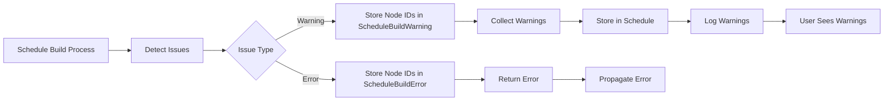

+++
title = "#20256 Better `ScheduleBuildError` introspection and handling"
date = "2025-07-24T00:00:00"
draft = false
template = "pull_request_page.html"
in_search_index = true

[taxonomies]
list_display = ["show"]

[extra]
current_language = "en"
available_languages = {"en" = { name = "English", url = "/pull_request/bevy/2025-07/pr-20256-en-20250724" }, "zh-cn" = { name = "中文", url = "/pull_request/bevy/2025-07/pr-20256-zh-cn-20250724" }}
labels = ["A-ECS", "C-Code-Quality", "D-Modest"]
+++

# Technical Analysis of PR #20256: Better `ScheduleBuildError` introspection and handling

## Basic Information
- **Title**: Better `ScheduleBuildError` introspection and handling
- **PR Link**: https://github.com/bevyengine/bevy/pull/20256
- **Author**: ItsDoot
- **Status**: MERGED
- **Labels**: A-ECS, C-Code-Quality, S-Ready-For-Final-Review, D-Modest
- **Created**: 2025-07-23T02:29:27Z
- **Merged**: 2025-07-24T05:43:20Z
- **Merged By**: alice-i-cecile

## Description
### Objective
- Part of #20115

I want to pull out the ad-hoc graph manipulation and analysis functions into generalized reusable functions, but in doing so encounter some borrow-checker issues. This is because the graphs are mutably borrowed during the build process at the points where we need to render warning and error messages (which require full access to the `ScheduleGraph`).

### Solution
So, lets defer message rendering until the consumer actually needs it:
- Replaced `String`s in `ScheduleBuildError` variants with just the `NodeId`/`SystemKey`/`SystemSetKey`.
- Added `ScheduleBuildError::to_string` to render the messages as they were previously.
- Added `ScheduleBuildWarning`, a subset of the error enum of just the possible warnings.
- Collected warnings into a `Vec` and returned them from the build process, caching them in the `Schedule` and made accessible via `Schedule::warnings`. Additionally automatically `warn!()` these warnings after the schedule is built.
- Exposed `ScheduleGraph::get_node_name` so external consumers can do any special rendering themselves.
- Finally, moved `ScheduleBuildError` and `ScheduleBuildWarning` to their own files to help incrementally minimize the large `schedule.rs` module.

### Testing
Reusing current tests.

## The Story of This Pull Request

### The Problem and Context
When working on refactoring Bevy's ECS schedule graph manipulation code, the author encountered borrow checker conflicts. The core issue was that schedule graph analysis functions needed to generate human-readable error messages while still holding mutable references to the graph. This required accessing node names (which required the graph) during error construction, creating a conflict between the mutable borrow for graph analysis and the immutable borrow needed for name resolution.

The existing implementation stored fully formatted error strings in `ScheduleBuildError` variants. This required resolving node names immediately during error detection, which in turn required access to the `ScheduleGraph`. Since the graph was being mutated during analysis, this created a borrow checker violation when attempting to extract node names for error messages.

### The Solution Approach
The solution involved decoupling error detection from message formatting:
1. Store minimal identifiers (NodeId/SystemKey/SystemSetKey) in errors instead of formatted strings
2. Defer string formatting until error display time
3. Separate non-fatal warnings into their own type
4. Collect warnings separately during schedule building
5. Expose node name resolution publicly for custom formatting

This approach allows the graph analysis to complete without needing to format messages during mutable borrows. The actual string formatting happens later when the errors or warnings are handled, at which point the graph is no longer mutably borrowed.

### The Implementation
The implementation consisted of several key changes:

1. **Error type refactoring**:
   - `ScheduleBuildError` variants now store identifiers instead of strings
   - Added `to_string()` method that takes `&ScheduleGraph` and `&World` for formatting
   - Created new `ScheduleBuildWarning` type for non-fatal issues

```rust
// Before
#[error("System set `{0}` contains itself.")]
HierarchyLoop(String),

// After
#[error("System set `{0:?}` contains itself.")]
HierarchyLoop(NodeId),
```

2. **Warning collection**:
   - Added `warnings` field to `Schedule` struct
   - Modified build process to return warnings
   - Added automatic warning logging after schedule initialization

```rust
pub struct Schedule {
    // ...
    warnings: Vec<ScheduleBuildWarning>,
}

impl Schedule {
    pub fn initialize(&mut self, world: &mut World) -> Result<(), ScheduleBuildError> {
        // ...
        self.warnings = self.graph
            .update_schedule(world, &mut self.executable, &ignored_ambiguities)?;
        for warning in &self.warnings {
            warn!(
                "{:?} schedule built successfully, however: {}",
                self.label,
                warning.to_string(&self.graph, world)
            );
        }
        // ...
    }
}
```

3. **Public name resolution**:
   - Made `ScheduleGraph::get_node_name` public for external formatting
   - This allows consumers to format custom messages using the same name resolution

```rust
impl ScheduleGraph {
    pub fn get_node_name(&self, id: &NodeId) -> String {
        // ... implementation ...
    }
}
```

4. **Code organization**:
   - Moved error types to new `error.rs` file
   - Reduced `schedule.rs` size by ~114 lines

### Technical Insights
The key insight was separating data collection (error detection) from presentation (message formatting). By storing only identifiers in errors, the graph analysis can complete without formatting strings. The actual formatting happens later when:
1. An error is handled (via `to_string()`)
2. Warnings are logged after schedule initialization
3. Users access warnings via `Schedule::warnings()`

This approach resolves the borrow checker conflict because:
- Graph mutation happens during analysis when we have mutable access
- Message formatting happens later with immutable access

### The Impact
1. **Borrow checker compliance**: Enables graph analysis refactoring by resolving mutable borrow conflicts
2. **Improved warning handling**:
   - Warnings are now properly separated from errors
   - Warnings are collected and exposed via API
   - Automatic logging after schedule build
3. **Better error introspection**:
   - Access to raw identifiers enables custom error handling
   - `to_string()` provides the same formatted messages as before
4. **Code organization**:
   - Reduced `schedule.rs` size by moving errors to dedicated module
   - Clearer separation of concerns

## Visual Representation


## Key Files Changed

### `crates/bevy_ecs/src/schedule/error.rs` (+261/-0)
New file containing error and warning definitions and formatting logic:
```rust
pub enum ScheduleBuildError {
    #[error("System set `{0:?}` contains itself.")]
    HierarchyLoop(NodeId),
    // ... other variants ...
}

impl ScheduleBuildError {
    pub fn to_string(&self, graph: &ScheduleGraph, world: &World) -> String {
        match self {
            ScheduleBuildError::HierarchyLoop(node_id) => {
                Self::hierarchy_loop_to_string(node_id, graph)
            }
            // ... other cases ...
        }
    }
    
    fn hierarchy_loop_to_string(node_id: &NodeId, graph: &ScheduleGraph) -> String {
        format!(
            "{} `{}` contains itself",
            node_id.kind(),
            graph.get_node_name(node_id)
    }
}

pub enum ScheduleBuildWarning {
    #[error("The hierarchy of system sets contains redundant edges: {0:?}")]
    HierarchyRedundancy(Vec<(NodeId, NodeId)>),
    // ... other variants ...
}
```

### `crates/bevy_ecs/src/schedule/schedule.rs` (+92/-206)
Major changes to error handling and warning collection:
```rust
// Before
fn get_hierarchy_cycles_error_message(&self, cycles: &[Vec<N>]) -> String {
    // Complex string formatting
}

// After: Removed all message formatting functions

// Added warnings field
pub struct Schedule {
    // ...
    warnings: Vec<ScheduleBuildWarning>,
}

impl Schedule {
    pub fn initialize(&mut self, world: &mut World) -> Result<(), ScheduleBuildError> {
        // ...
        self.warnings = self.graph
            .update_schedule(world, &mut self.executable, &ignored_ambiguities)?;
        for warning in &self.warnings {
            warn!(
                "{:?} schedule built successfully, however: {}",
                self.label,
                warning.to_string(&self.graph, world)
            );
        }
        // ...
    }
    
    pub fn warnings(&self) -> &[ScheduleBuildWarning] {
        &self.warnings
    }
}

// Made node name resolution public
impl ScheduleGraph {
    pub fn get_node_name(&self, id: &NodeId) -> String {
        // ... implementation ...
    }
}
```

### `crates/bevy_ecs/src/schedule/mod.rs` (+17/-13)
Integration of new error module:
```rust
// Before
// ... existing imports ...

// After
mod error;
// ...
pub use self::{condition::*, config::*, error::*, executor::*, node::*, schedule::*, set::*};
```

### `release-content/migration-guides/schedule_cleanup.md` (+10/-1)
Migration guide updates:
```markdown
- `ScheduleBuildError` variants now contain `NodeId` or type-specific keys, rather than `String`s.
  Use `ScheduleBuildError::to_string` to render the nodes' names and get the old error messages.
- `ScheduleGraph::build_schedule` now returns a `Vec<ScheduleBuildWarning>` in addition to the built
  `SystemSchedule`. Use standard `Result` functions to grab just the `SystemSchedule`, if needed.

The following enum variants were replaced:

- `ScheduleBuildError::HierarchyRedundancy` with `ScheduleBuildError::Elevated(ScheduleBuildWarning::HierarchyRedundancy)`
- `ScheduleBuildError::Ambiguity` with `ScheduleBuildError::Elevated(ScheduleBuildWarning::Ambiguity)`
```

## Further Reading
1. [Rust Borrow Checker Documentation](https://doc.rust-lang.org/book/ch04-02-references-and-borrowing.html)
2. [Bevy ECS Architecture](https://bevyengine.org/learn/book/ecs/)
3. [Error Handling in Rust](https://doc.rust-lang.org/book/ch09-00-error-handling.html)