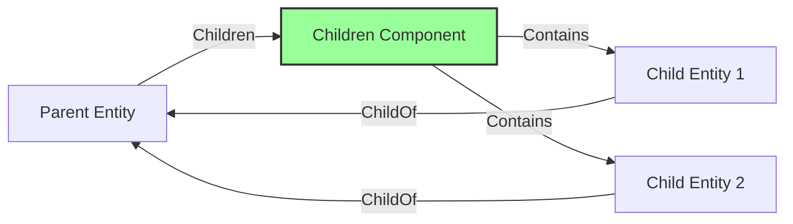

+++
title = "#20258 Fix observers' access to relationship data during `despawn_related`"
date = "2025-07-27T00:00:00"
draft = false
template = "pull_request_page.html"
in_search_index = true

[taxonomies]
list_display = ["show"]

[extra]
current_language = "en"
available_languages = {"en" = { name = "English", url = "/pull_request/bevy/2025-07/pr-20258-en-20250727" }, "zh-cn" = { name = "中文", url = "/pull_request/bevy/2025-07/pr-20258-zh-cn-20250727" }}
labels = ["C-Bug", "A-ECS", "D-Straightforward"]
+++

## Technical Analysis: PR #20258 - Fix observers' access to relationship data during `despawn_related`

### Basic Information
- **Title**: Fix observers' access to relationship data during `despawn_related`
- **PR Link**: https://github.com/bevyengine/bevy/pull/20258
- **Author**: muddxyii
- **Status**: MERGED
- **Labels**: C-Bug, A-ECS, S-Ready-For-Final-Review, X-Uncontroversial, D-Straightforward
- **Created**: 2025-07-23T03:09:48Z
- **Merged**: 2025-07-27T17:23:45Z
- **Merged By**: alice-i-cecile

### Description Translation
# Objective

- Fix issue where observers cannot access relationship data during `despawn_related`
- Fixes #20106

## Solution

- Changed `despawn_related` to use `get()` instead of `take()` to preserve relationship components during the despawn process
- Collect entities into a vector before despawning to ensure the relationship data remains accessible to observers and hooks

## Testing

- Added test `despawn_related_observers_can_access_relationship_data` that reproduces the issue scenario

### The Story of This Pull Request

#### The Problem and Context
The `despawn_related` method in Bevy's ECS had a subtle bug affecting observers. When despawning child entities of a parent, the method used `take()` to remove the `Children` component from the parent entity before despawning the children. This premature removal prevented observers from accessing relationship data during despawn operations, as the component containing the relationship information was no longer present. This violated the expectation that relationship data should remain accessible throughout entity lifecycle events, particularly for systems like observers that rely on this data for correct operation.

The issue manifested in scenarios where observers needed to inspect parent-child relationships during child despawning. Since the parent's `Children` component was removed first, any observer logic requiring access to relationship data would fail or behave unexpectedly, breaking legitimate use cases that depended on this information.

#### The Solution Approach
The core fix involves modifying how we access the relationship component during despawn operations. Instead of removing the component with `take()`, we now access it immutably with `get()`, leaving it intact during the despawn process. This preserves the relationship data for any observers that might be triggered during child despawning.

A key insight was recognizing that we need to decouple the data access from the despawning operation. By collecting the child entities into a separate vector before despawning, we ensure:
1. Relationship data remains accessible throughout the operation
2. We avoid mutating the relationship component while iterating
3. Observers can reliably access relationship data in their hooks

This approach maintains the original functionality while fixing the observer access issue. No alternatives were seriously considered since this solution directly addresses the root cause with minimal overhead.

#### The Implementation
The implementation modifies the `despawn_related` method to preserve relationship data during despawn operations:

```rust
// Before:
if let Some(sources) = self.take::<S>() {
    self.world_scope(|world| {
        for entity in sources.iter() {
            if let Ok(entity_mut) = world.get_entity_mut(entity) {
                entity_mut.despawn();
            }
        }
    });
}

// After:
if let Some(sources) = self.get::<S>() {
    // Collect to defer removal, preserving data for observers
    let sources = sources.iter().collect::<Vec<_>>();
    self.world_scope(|world| {
        for entity in sources {
            if let Ok(entity_mut) = world.get_entity_mut(entity) {
                entity_mut.despawn();
            };
        }
    });
}
```

The critical changes are:
1. Replaced `take()` with `get()` to avoid removing the relationship component
2. Added collection of child entities into a vector before despawning
3. Maintained the scoped despawning logic within `world_scope`

The solution effectively defers component removal while maintaining the despawning behavior. By collecting the entities first, we avoid mutating the relationship component during iteration while ensuring all child entities are correctly processed.

#### Verification Through Testing
A new test was added to verify the fix and prevent regressions. The test creates a parent-child relationship with an observer that checks for the existence of relationship data during despawn:

```rust
#[test]
fn despawn_related_observers_can_access_relationship_data() {
    // ... (setup code)
    world.add_observer(
        move |trigger: On<Replace, MyComponent>,
              has_relationship: Query<Has<ChildOf>>,
              mut results: Query<&mut ObserverResult>| {
            let entity = trigger.target();
            if has_relationship.get(entity).unwrap_or(false) {
                results.get_mut(result_entity).unwrap().success = true;
            }
        },
    );

    let parent = world.spawn_empty().id();
    let _child = world.spawn((MyComponent, ChildOf(parent))).id();

    world.entity_mut(parent).despawn_related::<Children>();
    assert!(world.get::<ObserverResult>(result_entity).unwrap().success);
}
```

This test confirms that observers can successfully access relationship data (via `Has<ChildOf>`) during the despawn operation, which would fail without the fix.

#### Technical Insights
The solution demonstrates several important ECS patterns:
1. **Lifecycle Timing**: Components should remain valid throughout related operations
2. **Observer Safety**: Data accessed by observers must outlive the operations triggering them
3. **Borrow Management**: Collecting entities before mutation avoids simultaneous access and mutation

The change has minimal performance impact since collecting entities into a vector is O(n) and the number of children is typically small. The memory overhead is negligible as we're only storing entity IDs.

#### The Impact
This fix resolves a subtle but important inconsistency in Bevy's ECS relationship handling. Observers can now reliably access relationship data during despawn operations, enabling correct behavior for systems that:
- Clean up related resources
- Maintain external indices
- Implement dependency tracking
- Enforce relationship invariants

The change maintains backward compatibility while fixing a clear behavioral bug. The solution is localized to a single method with minimal risk of side effects.

### Visual Representation



The diagram shows:
- Green: `Children` component preserved during despawn
- Solid arrows: Relationships maintained during operation
- Dashed arrows: Data access patterns during despawn

### Key Files Changed

#### `crates/bevy_ecs/src/relationship/related_methods.rs`
**Purpose**: Fix observer access to relationship data during despawn operations

**Key Changes**:
```rust
// Before:
if let Some(sources) = self.take::<S>() {
    self.world_scope(|world| {
        for entity in sources.iter() {
            if let Ok(entity_mut) = world.get_entity_mut(entity) {
                entity_mut.despawn();
            }
        }
    });
}

// After:
if let Some(sources) = self.get::<S>() {
    // We have to collect here to defer removal, allowing observers and hooks to see this data
    // before it is finally removed.
    let sources = sources.iter().collect::<Vec<_>>();
    self.world_scope(|world| {
        for entity in sources {
            if let Ok(entity_mut) = world.get_entity_mut(entity) {
                entity_mut.despawn();
            };
        }
    });
}
```

**Added Test**:
```rust
#[test]
fn despawn_related_observers_can_access_relationship_data() {
    use crate::lifecycle::Replace;
    use crate::observer::On;
    use crate::prelude::Has;
    use crate::system::Query;

    #[derive(Component)]
    struct MyComponent;

    #[derive(Component, Default)]
    struct ObserverResult {
        success: bool,
    }

    let mut world = World::new();
    let result_entity = world.spawn(ObserverResult::default()).id();

    world.add_observer(
        move |trigger: On<Replace, MyComponent>,
              has_relationship: Query<Has<ChildOf>>,
              mut results: Query<&mut ObserverResult>| {
            let entity = trigger.target();
            if has_relationship.get(entity).unwrap_or(false) {
                results.get_mut(result_entity).unwrap().success = true;
            }
        },
    );

    let parent = world.spawn_empty().id();
    let _child = world.spawn((MyComponent, ChildOf(parent))).id();

    world.entity_mut(parent).despawn_related::<Children>();
    assert!(world.get::<ObserverResult>(result_entity).unwrap().success);
}
```

### Further Reading
1. [Bevy ECS Relationships Documentation](https://bevyengine.org/learn/book/ecs/relationships/)
2. [Observer Pattern in ECS Systems](https://gameprogrammingpatterns.com/observer.html)
3. [Entity Component System Best Practices](https://github.com/SanderMertens/ecs-faq)
4. [Original Issue #20106](https://github.com/bevyengine/bevy/issues/20106)