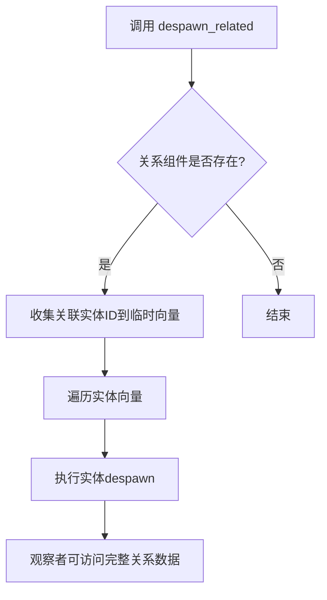

+++
title = "#20258 Fix observers' access to relationship data during `despawn_related`"
date = "2025-07-27T00:00:00"
draft = false
template = "pull_request_page.html"
in_search_index = false

[extra]
current_language = "zh-cn"
available_languages = {"en" = { name = "English", url = "/pull_request/bevy/2025-07/pr-20258-en-20250727" }, "zh-cn" = { name = "中文", url = "/pull_request/bevy/2025-07/pr-20258-zh-cn-20250727" }}
labels = ["C-Bug", "A-ECS", "D-Straightforward"]
+++

# Fix observers' access to relationship data during `despawn_related`

## Basic Information
- **Title**: Fix observers' access to relationship data during `despawn_related`
- **PR Link**: https://github.com/bevyengine/bevy/pull/20258
- **Author**: muddxyii
- **Status**: MERGED
- **Labels**: C-Bug, A-ECS, S-Ready-For-Final-Review, X-Uncontroversial, D-Straightforward
- **Created**: 2025-07-23T03:09:48Z
- **Merged**: 2025-07-27T17:23:45Z
- **Merged By**: alice-i-cecile

## Description Translation
### 目标
- 修复观察者(observers)在`despawn_related`执行期间无法访问关系数据(relationship data)的问题
- 修复 #20106

### 解决方案
- 将`despawn_related`中的`take()`改为`get()`，以在despawn过程中保留关系组件(relationship components)
- 在despawn前将实体(entities)收集到向量(vector)中，确保关系数据对观察者和钩子(hooks)保持可访问

### 测试
- 新增测试`despawn_related_observers_can_access_relationship_data`，复现问题场景

## The Story of This Pull Request

### 问题背景
在Bevy的ECS系统中，`despawn_related`方法用于销毁与指定实体有关联关系的所有实体。原始实现使用`take()`方法获取关系组件(relationship component)，这会立即从实体中移除该组件。当观察者(observer)系统在实体销毁过程中尝试访问关系数据时，由于组件已被提前移除，导致观察者无法获取必要的关系信息（如ChildOf组件）。这在需要基于实体关系执行清理操作或状态更新的场景中会造成功能缺陷。

### 解决方案分析
核心问题在于组件移除时序：`take()`操作在实体实际销毁前就移除了关系组件，使观察者无法在despawn生命周期事件中访问这些数据。解决方案需要确保关系数据在整个despawn操作期间保持有效。

修改方案：
1. 将`take::<S>()`替换为`get::<S>()`，保留关系组件不被移除
2. 将关联实体ID收集到临时向量(vector)中
3. 在world作用域内遍历该向量执行despawn操作

这种方法延迟了关系组件的移除时机，使观察者能在despawn前正确访问关系数据。该修改属于局部调整，不改变现有API或影响其他系统。

### 实现细节
修改集中在`despawn_related`方法的实现逻辑上：
```rust
// 原始实现
if let Some(sources) = self.take::<S>() {
    self.world_scope(|world| {
        for entity in sources.iter() {
            if let Ok(entity_mut) = world.get_entity_mut(entity) {
                entity_mut.despawn();
            }
        }
    });
}

// 修改后实现
if let Some(sources) = self.get::<S>() {
    // 收集实体到临时向量，延迟移除
    let sources = sources.iter().collect::<Vec<_>>();
    self.world_scope(|world| {
        for entity in sources {
            if let Ok(entity_mut) = world.get_entity_mut(entity) {
                entity_mut.despawn();
            };
        }
    });
}
```
关键改进点：
- `get()`替代`take()`保留关系组件
- 使用`collect::<Vec<_>>()`创建实体ID的临时副本
- 在world作用域内使用该副本进行迭代

### 测试验证
新增的集成测试验证了观察者在despawn过程中访问关系数据的能力：
```rust
#[test]
fn despawn_related_observers_can_access_relationship_data() {
    // 设置观察者系统
    world.add_observer(
        move |trigger: On<Replace, MyComponent>,
              has_relationship: Query<Has<ChildOf>>,
              mut results: Query<&mut ObserverResult>| {
            // 检查目标实体是否仍有ChildOf关系
            if has_relationship.get(entity).unwrap_or(false) {
                results.get_mut(result_entity).unwrap().success = true;
            }
        },
    );
    
    // 创建父子实体
    let parent = world.spawn_empty().id();
    let _child = world.spawn((MyComponent, ChildOf(parent))).id();
    
    // 触发despawn_related
    world.entity_mut(parent).despawn_related::<Children>();
    
    // 验证观察者成功访问了关系数据
    assert!(world.get::<ObserverResult>(result_entity).unwrap().success);
}
```
测试模拟了实际使用场景：
1. 注册观察者监听组件替换事件
2. 创建具有ChildOf关系的父子实体
3. 调用`despawn_related`销毁子实体
4. 验证观察者在回调中成功检测到ChildOf关系

### 影响分析
该修复：
1. 保持了原有API的兼容性
2. 不影响性能（临时向量仅在关系存在时创建）
3. 解决了观察者系统访问关系数据的可靠性问题
4. 为依赖实体关系的系统提供了正确的事件时序

## Visual Representation



## Key Files Changed

### crates/bevy_ecs/src/relationship/related_methods.rs
- **修改目的**：修复`despawn_related`方法中关系数据过早移除的问题
- **关键变更**：
```rust
// 修改前
if let Some(sources) = self.take::<S>() {
    self.world_scope(|world| {
        for entity in sources.iter() {
            if let Ok(entity_mut) = world.get_entity_mut(entity) {
                entity_mut.despawn();
            }
        }
    });
}

// 修改后
if let Some(sources) = self.get::<S>() {
    let sources = sources.iter().collect::<Vec<_>>();
    self.world_scope(|world| {
        for entity in sources {
            if let Ok(entity_mut) = world.get_entity_mut(entity) {
                entity_mut.despawn();
            };
        }
    });
}
```
- **新增测试**：
```rust
#[test]
fn despawn_related_observers_can_access_relationship_data() {
    use crate::lifecycle::Replace;
    use crate::observer::On;
    use crate::prelude::Has;
    use crate::system::Query;

    #[derive(Component)]
    struct MyComponent;

    #[derive(Component, Default)]
    struct ObserverResult {
        success: bool,
    }

    // ... 测试实现 ...
}
```

## Further Reading
1. [Bevy ECS Observers 官方文档](https://bevyengine.org/learn/book/ecs/observers)
2. [Entity Relationships RFC](https://github.com/bevyengine/rfcs/blob/main/rfcs/53-entity-relationships.md)
3. [ECS 组件生命周期管理](https://github.com/SanderMertens/ecs-faq#component-lifecycle)
4. [Rust 向量性能考量](https://doc.rust-lang.org/std/vec/struct.Vec.html#performance)