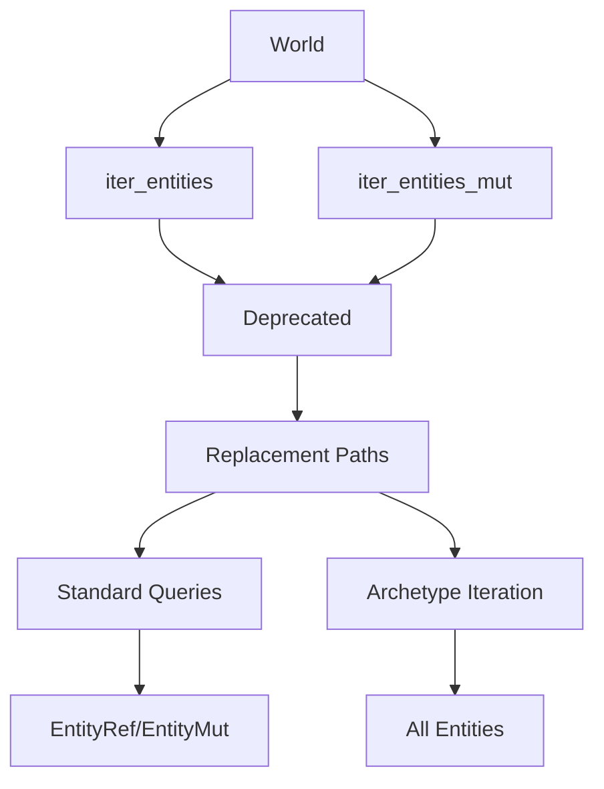

+++
title = "#20260 Deprecate `iter_entities` and `iter_entities_mut`"
date = "2025-07-23T00:00:00"
draft = false
template = "pull_request_page.html"
in_search_index = true

[taxonomies]
list_display = ["show"]

[extra]
current_language = "en"
available_languages = {"en" = { name = "English", url = "/pull_request/bevy/2025-07/pr-20260-en-20250723" }, "zh-cn" = { name = "中文", url = "/pull_request/bevy/2025-07/pr-20260-zh-cn-20250723" }}
labels = ["A-ECS", "C-Code-Quality", "D-Modest"]
+++

# Deprecate `iter_entities` and `iter_entities_mut`

## Basic Information
- **Title**: Deprecate `iter_entities` and `iter_entities_mut`
- **PR Link**: https://github.com/bevyengine/bevy/pull/20260
- **Author**: Trashtalk217
- **Status**: MERGED
- **Labels**: A-ECS, C-Code-Quality, S-Ready-For-Final-Review, D-Modest
- **Created**: 2025-07-23T09:42:28Z
- **Merged**: 2025-07-23T20:32:25Z
- **Merged By**: alice-i-cecile

## Description Translation
# Objective

Both `iter_entities()` and `iter_entities_mut` are awkward functions as they both return _all_ entities, which is something you (should) rarely want.

## Solution

Deprecate both functions and substitute them where they are used.

## Testing

Not necessary.

## The Story of This Pull Request

### Problem and Context
The `World::iter_entities()` and `World::iter_entities_mut()` methods provided direct access to all entities in the ECS world, bypassing Bevy's entity disabling system. This created several issues:

1. **Inconsistent behavior**: These methods ignored default query filters that automatically exclude disabled entities
2. **Poor ergonomics**: Most use cases don't require iterating over every entity
3. **Maintenance burden**: The methods required special handling in tests and benchmarks
4. **Bypassing systems**: They allowed direct access to entities that should be filtered out by Bevy's entity disabling mechanism

The entity disabling system works through global default query filters that automatically exclude entities with specific components. Using `iter_entities` bypassed this system, potentially exposing entities that should be ignored.

### Solution Approach
The solution involved three key steps:

1. Deprecate both methods with clear migration instructions
2. Replace existing usages with more appropriate alternatives
3. Update documentation to explain proper handling of disabled entities

For migration, two main alternatives were provided:
- For most cases: Use `world.query::<EntityRef>()` or `world.query::<EntityMut>()`
- For cases needing all entities (including disabled): Direct archetype iteration

### Implementation Details
The deprecation was implemented by adding `#[deprecated]` attributes to both methods with migration notes:

```rust
// crates/bevy_ecs/src/world/mod.rs
#[deprecated(since = "0.17.0", note = "use world.query::<EntityRef>()` instead")]
pub fn iter_entities(&self) -> impl Iterator<Item = EntityRef<'_>> + '_ {
    // ...
}

#[deprecated(since = "0.17.0", note = "use world.query::<EntityMut>()` instead")]
pub fn iter_entities_mut(&mut self) -> impl Iterator<Item = EntityMut<'_>> + '_ {
    // ...
}
```

Test cases were updated to suppress deprecation warnings and note future removal:

```rust
// crates/bevy_ecs/src/world/mod.rs
#[expect(deprecated, reason = "remove this test in in 0.17.0")]
for entity in world.iter_entities() {
    // ...
}
```

The benchmark was updated to use more efficient entity collection during spawning:

```rust
// benches/benches/bevy_ecs/world/despawn.rs
let entities: Vec<Entity> = world
    .spawn_batch((0..entity_count).map(|_| (A(Mat4::default()), B(Vec4::default())))
    .collect();
```

Scene building was updated to directly iterate archetypes, ensuring disabled entities are included while avoiding deprecated methods:

```rust
// crates/bevy_scene/src/dynamic_scene.rs
world
    .archetypes()
    .iter()
    .flat_map(bevy_ecs::archetype::Archetype::entities)
    .map(bevy_ecs::archetype::ArchetypeEntity::id)
```

### Technical Insights
Key technical considerations:
1. **Entity disabling**: Bevy implements entity disabling through a `DefaultQueryFilters` resource that automatically filters queries
2. **Archetype access**: Direct archetype iteration provides low-level access to all entities, including disabled ones
3. **Query filters**: The `Allows<Component>` filter enables including specific disabled components in queries
4. **Resource scoping**: Temporarily removing `DefaultQueryFilters` via `resource_scope` allows accessing all entities

### Impact
These changes:
1. Improve API consistency by aligning entity iteration with Bevy's query system
2. Maintain functionality for edge cases needing all entities via archetype iteration
3. Reduce maintenance burden by removing special-case methods
4. Enhance documentation around entity disabling and query filtering
5. Prepare for complete removal in future versions

## Visual Representation



## Key Files Changed

1. `crates/bevy_ecs/src/world/mod.rs` (+4/-0)
   - Added deprecation attributes to both methods
   - Annotated test cases with deprecation expectations

```rust
// Before:
pub fn iter_entities(&self) -> impl Iterator<Item = EntityRef<'_>> + '_ {
    // ...
}

// After:
#[deprecated(since = "0.17.0", note = "use world.query::<EntityRef>()` instead")]
pub fn iter_entities(&self) -> impl Iterator<Item = EntityRef<'_>> + '_ {
    // ...
}
```

2. `benches/benches/bevy_ecs/world/despawn.rs` (+8/-7)
   - Optimized entity collection during spawning
   - Removed deprecated method usage

```rust
// Before:
for _ in 0..entity_count {
    world.spawn((A(Mat4::default()), B(Vec4::default())));
}
let ents = world.iter_entities().map(|e| e.id()).collect::<Vec<_>>();

// After:
let entities: Vec<Entity> = world
    .spawn_batch((0..entity_count).map(|_| (A(Mat4::default()), B(Vec4::default())))
    .collect();
```

3. `crates/bevy_scene/src/dynamic_scene.rs` (+9/-1)
   - Implemented direct archetype access for scene serialization
   - Maintained inclusion of disabled entities

```rust
// After:
.extract_entities(
    world
        .archetypes()
        .iter()
        .flat_map(bevy_ecs::archetype::Archetype::entities)
        .map(bevy_ecs::archetype::ArchetypeEntity::id),
)
```

4. `crates/bevy_scene/src/lib.rs` (+9/-1)
   - Updated test to use filtered queries
   - Maintained test coverage with proper entity filtering

```rust
// After:
let entities: Vec<Entity> = scene
    .world
    .query_filtered::<Entity, Allows<Internal>>()
    .iter(&scene.world)
    .collect();
```

5. `release-content/migration-guides/deprecate_iter_entities.md` (+9/-0)
   - Created migration documentation
   - Explained alternatives and edge cases

```markdown
---
title: Deprecate `iter_entities` and `iter_entities_mut`.
pull_requests: [20260]
---

In Bevy 0.17.0 we deprecate `world.iter_entities()` and `world.iter_entities_mut()`.
Use `world.query::<EntityMut>().iter(&world)` and `world.query::<EntityRef>().iter(&mut world)` instead.

This may not return every single entity, because of [default filter queries](https://docs.rs/bevy/latest/bevy/ecs/entity_disabling/index.html). If you really intend to query disabled entities too, consider removing the `DefaultQueryFilters` resource from the world before querying the elements. You can also add an `Allows<Component>` filter to allow a specific disabled `Component`, to show up in the query.
```

## Further Reading
1. [Bevy ECS Query System](https://docs.rs/bevy_ecs/latest/bevy_ecs/system/struct.Query.html)
2. [Entity Disabling Documentation](https://docs.rs/bevy/latest/bevy/ecs/entity_disabling/index.html)
3. [Rust Deprecation Attributes](https://doc.rust-lang.org/reference/attributes/diagnostics.html#the-deprecated-attribute)