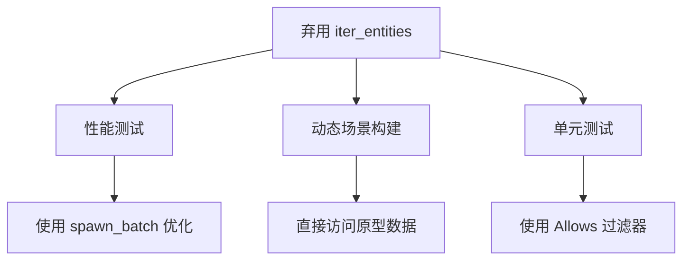

+++
title = "#20260 Deprecate `iter_entities` and `iter_entities_mut`"
date = "2025-07-23T00:00:00"
draft = false
template = "pull_request_page.html"
in_search_index = false

[extra]
current_language = "zh-cn"
available_languages = {"en" = { name = "English", url = "/pull_request/bevy/2025-07/pr-20260-en-20250723" }, "zh-cn" = { name = "中文", url = "/pull_request/bevy/2025-07/pr-20260-zh-cn-20250723" }}
labels = ["A-ECS", "C-Code-Quality", "D-Modest"]
+++

# Deprecate `iter_entities` and `iter_entities_mut`

## Basic Information
- **Title**: Deprecate `iter_entities` and `iter_entities_mut`
- **PR Link**: https://github.com/bevyengine/bevy/pull/20260
- **Author**: Trashtalk217
- **Status**: MERGED
- **Labels**: A-ECS, C-Code-Quality, S-Ready-For-Final-Review, D-Modest
- **Created**: 2025-07-23T09:42:28Z
- **Merged**: 2025-07-23T20:32:25Z
- **Merged By**: alice-i-cecile

## Description Translation
### 目标
`iter_entities()` 和 `iter_entities_mut` 这两个函数都返回所有实体，这在实际使用中很少需要。

### 解决方案
弃用这两个函数，并在它们被使用的地方进行替换。

### 测试
不需要额外测试。

## The Story of This Pull Request

### 问题背景
在 Bevy ECS 中，`World::iter_entities()` 和 `World::iter_entities_mut()` 提供了遍历所有实体的能力。然而，这种设计存在两个关键问题：
1. **实际需求罕见**：大多数系统只需要处理特定组件组合的实体，而非所有实体
2. **与实体禁用机制冲突**：Bevy 的实体禁用功能通过全局默认查询过滤器（default query filters）实现，但这两个方法会绕过过滤器返回所有实体

在引入了实体禁用功能后，直接遍历所有实体可能导致不一致的行为，因为被禁用的实体不应出现在常规查询中。同时，这两个方法在性能敏感的代码路径（如反序列化场景）中使用时效率较低。

### 解决方案
核心解决方案是弃用这两个方法并替换其所有使用场景：
1. 添加 `#[deprecated]` 属性标记方法
2. 使用更精确的查询替代原有调用
3. 添加迁移指南文档

在实现上，根据具体场景采用不同的替代方案：
- 需要所有实体（包括被禁用的）：直接访问原型（archetype）数据
- 需要过滤特定条件：使用标准查询（queries）
- 批量生成实体：使用 `spawn_batch()`

### 关键实现细节
**实体禁用机制**：Bevy 通过 `DefaultQueryFilters` 资源实现实体禁用。常规查询会自动排除被标记为禁用的实体，但 `iter_entities()` 会绕过此机制。迁移后的代码显式处理禁用实体问题，确保行为一致。

**性能优化**：在性能测试（benchmark）中，将手动收集实体替换为 `spawn_batch().collect()`，减少不必要的迭代：
```rust
// 修改前：
for _ in 0..entity_count {
    world.spawn((A(Mat4::default()), B(Vec4::default())));
}
let ents = world.iter_entities().map(|e| e.id()).collect::<Vec<_>>();

// 修改后：
let entities: Vec<Entity> = world
    .spawn_batch((0..entity_count).map(|_| (A(Mat4::default()), B(Vec4::default())))
    .collect();
```

**场景序列化**：动态场景构建需要包含所有实体（包括被禁用的）。新实现直接访问原型数据，完全绕过查询系统：
```rust
world
    .archetypes()
    .iter()
    .flat_map(bevy_ecs::archetype::Archetype::entities)
    .map(bevy_ecs::archetype::ArchetypeEntity::id)
```

### 迁移策略
迁移指南明确指出替代方案：
```markdown
Use `world.query::<EntityMut>().iter(&world)` and `world.query::<EntityRef>().iter(&mut world)` instead.

This may not return every single entity, because of [default filter queries]. If you really intend to query disabled entities too, consider removing the `DefaultQueryFilters` resource from the world before querying the elements.
```

### 影响与收益
1. **API 清理**：移除不推荐使用的全局遍历方法
2. **行为一致性**：确保所有实体访问路径都遵守默认查询过滤规则
3. **性能提升**：在修改的用例中获得更优的性能表现
4. **文档完善**：通过迁移指南提供明确的升级路径

## Visual Representation



## Key Files Changed

### `crates/bevy_ecs/src/world/mod.rs` (+4/-0)
添加弃用标记并更新测试：
```rust
// 添加弃用警告
#[deprecated(since = "0.17.0", note = "use world.query::<EntityRef>()` instead")]
pub fn iter_entities(&self) -> impl Iterator<Item = EntityRef<'_>> + '_ { ... }

// 测试中标记预期弃用
#[expect(deprecated, reason = "remove this test in 0.17.0")]
for mut entity in world.iter_entities_mut() { ... }
```

### `benches/benches/bevy_ecs/world/despawn.rs` (+8/-7)
优化实体生成和收集逻辑：
```rust
// 修改后：
let entities: Vec<Entity> = world
    .spawn_batch((0..entity_count).map(|_| (A(Mat4::default()), B(Vec4::default())))
    .collect();
```

### `crates/bevy_scene/src/dynamic_scene.rs` (+9/-1)
确保动态场景包含所有实体：
```rust
// 修改后：
.extract_entities(
    world
        .archetypes()
        .iter()
        .flat_map(bevy_ecs::archetype::Archetype::entities)
        .map(bevy_ecs::archetype::ArchetypeEntity::id),
)
```

### `crates/bevy_scene/src/lib.rs` (+9/-1)
更新测试用例：
```rust
// 修改后：
let entities: Vec<Entity> = scene
    .world
    .query_filtered::<Entity, Allows<Internal>>()
    .iter(&scene.world)
    .collect();
```

### `release-content/migration-guides/deprecate_iter_entities.md` (+9/-0)
新增迁移文档：
```markdown
In Bevy 0.17.0 we deprecate `world.iter_entities()` and `world.iter_entities_mut()`.
Use `world.query::<EntityMut>().iter(&world)` and `world.query::<EntityRef>().iter(&mut world)` instead.
```

## Further Reading
1. [Bevy 实体禁用机制文档](https://docs.rs/bevy/latest/bevy/ecs/entity_disabling/index.html)
2. [ECS 查询系统设计模式](https://github.com/bevyengine/bevy/blob/main/docs/ECS_QUERIES.md)
3. [Rust 弃用属性使用指南](https://doc.rust-lang.org/reference/attributes/diagnostics.html#the-deprecated-attribute)