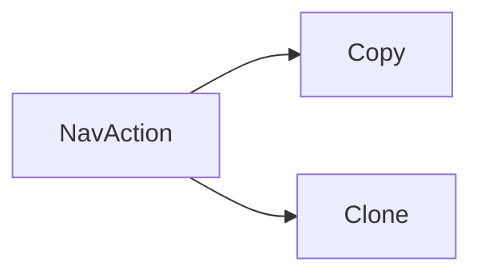

+++
title = "#20263 Derive Copy and Clone for `NavAction`"
date = "2025-07-23T00:00:00"
draft = false
template = "pull_request_page.html"
in_search_index = true

[taxonomies]
list_display = ["show"]

[extra]
current_language = "en"
available_languages = {"en" = { name = "English", url = "/pull_request/bevy/2025-07/pr-20263-en-20250723" }, "zh-cn" = { name = "中文", url = "/pull_request/bevy/2025-07/pr-20263-zh-cn-20250723" }}
labels = ["D-Trivial"]
+++

# Derive Copy and Clone for `NavAction`

## Basic Information
- **Title**: Derive Copy and Clone for `NavAction`
- **PR Link**: https://github.com/bevyengine/bevy/pull/20263
- **Author**: ickshonpe
- **Status**: MERGED
- **Labels**: D-Trivial, S-Ready-For-Final-Review
- **Created**: 2025-07-23T15:46:31Z
- **Merged**: 2025-07-23T19:30:16Z
- **Merged By**: alice-i-cecile

## Description Translation
# Objective

Wanted to copy it, couldn't.

## The Story of This Pull Request

The problem emerged when working with Bevy's UI navigation system. The `NavAction` enum, which defines possible navigation actions like moving to the next or previous focusable element, lacked the `Copy` and `Clone` traits. This prevented straightforward duplication of `NavAction` values, forcing developers to either use references or implement manual cloning patterns. Since `NavAction` is a simple enum without any complex internal state or heap allocations, this limitation was unnecessary and reduced ergonomics in UI navigation code.

The solution was straightforward: derive the `Copy` and `Clone` traits for the `NavAction` enum. This approach was chosen because it requires minimal code changes while providing maximum benefit. The enum consists only of unit variants with no associated data, making it trivially copyable. No alternatives were considered since the standard Rust approach for simple enums is to derive these traits when copy semantics are desired.

Implementation involved a single-line change adding the `#[derive(Clone, Copy)]` attribute to the `NavAction` enum definition. This modification enables value copying without explicit cloning logic throughout the codebase. The change fits cleanly into Bevy's existing ECS architecture since `NavAction` values are often passed between systems and components where copy semantics are expected.

From a technical perspective, this change leverages Rust's trait system to improve developer experience. The `Copy` trait indicates that bitwise duplication is safe, while `Clone` provides explicit cloning capability. Since `NavAction` is a small enum (likely 1 byte in size), copying has negligible performance impact. There are no architectural implications beyond improved usability.

The impact is immediate: developers can now directly copy `NavAction` values without workarounds. This simplifies UI navigation logic, reduces boilerplate, and aligns with Rust's ownership principles for simple data types. The change demonstrates good Rust practice - deriving standard traits where appropriate to maximize type usability without compromising safety.

## Visual Representation



## Key Files Changed

### `crates/bevy_input_focus/src/tab_navigation.rs`

Added `Copy` and `Clone` trait derivations to the `NavAction` enum to enable value copying.

Before:
```rust
/// A navigation action that users might take to navigate your user interface in a cyclic fashion.
///
/// These values are consumed by the [`TabNavigation`] system param.
pub enum NavAction {
    /// Navigate to the next focusable entity, wrapping around to the beginning if at the end.
    ///
```

After:
```rust
/// A navigation action that users might take to navigate your user interface in a cyclic fashion.
///
/// These values are consumed by the [`TabNavigation`] system param.
#[derive(Clone, Copy)]
pub enum NavAction {
    /// Navigate to the next focusable entity, wrapping around to the beginning if at the end.
    ///
```

## Further Reading
- Rust `Copy` trait documentation: https://doc.rust-lang.org/std/marker/trait.Copy.html
- Rust `Clone` trait documentation: https://doc.rust-lang.org/std/clone/trait.Clone.html
- Bevy UI Navigation crate: https://github.com/bevyengine/bevy/tree/main/crates/bevy_input_focus

## Full Code Diff
```diff
diff --git a/crates/bevy_input_focus/src/tab_navigation.rs b/crates/bevy_input_focus/src/tab_navigation.rs
index 6a8a24772da0a..98cf49163fc3d 100644
--- a/crates/bevy_input_focus/src/tab_navigation.rs
+++ b/crates/bevy_input_focus/src/tab_navigation.rs
@@ -102,6 +102,7 @@ impl TabGroup {
 /// A navigation action that users might take to navigate your user interface in a cyclic fashion.
 ///
 /// These values are consumed by the [`TabNavigation`] system param.
+#[derive(Clone, Copy)]
 pub enum NavAction {
     /// Navigate to the next focusable entity, wrapping around to the beginning if at the end.
     ///
```