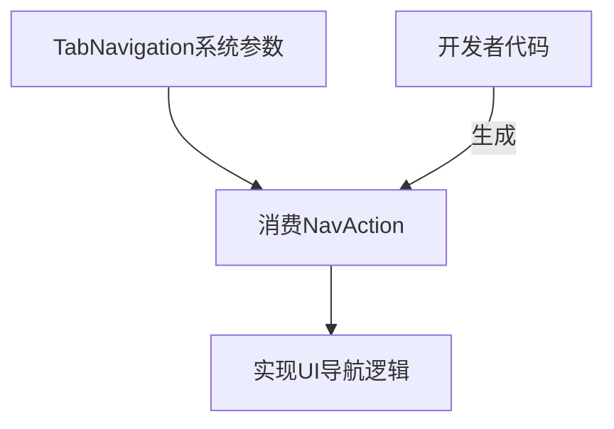

+++
title = "#20263 Derive Copy and Clone for `NavAction"
date = "2025-07-23T00:00:00"
draft = false
template = "pull_request_page.html"
in_search_index = false

[extra]
current_language = "zh-cn"
available_languages = {"en" = { name = "English", url = "/pull_request/bevy/2025-07/pr-20263-en-20250723" }, "zh-cn" = { name = "中文", url = "/pull_request/bevy/2025-07/pr-20263-zh-cn-20250723" }}
+++

# Derive Copy and Clone for `NavAction`

## Basic Information
- **标题**: Derive Copy and Clone for `NavAction`
- **PR链接**: https://github.com/bevyengine/bevy/pull/20263
- **作者**: ickshonpe
- **状态**: 已合并
- **标签**: D-Trivial, S-Ready-For-Final-Review
- **创建时间**: 2025-07-23T15:46:31Z
- **合并时间**: 2025-07-23T19:30:16Z
- **合并者**: alice-i-cecile

## 描述翻译
### Objective
Wanted to copy it, couldn't.

**目标**  
需要复制 `NavAction` 但无法实现

## 该PR的技术背景

该PR源于一个直接的工程需求：开发者在使用 `NavAction` 枚举时遇到了无法复制实例的限制。`NavAction` 是Bevy引擎输入焦点系统中用于处理标签导航的核心类型，定义在 `tab_navigation` 模块中。

问题出现在需要传递或存储 `NavAction` 值的场景中。由于该类型没有实现 `Copy` 或 `Clone` trait，开发者无法直接复制其实例，只能通过引用传递。这增加了不必要的复杂性，尤其是在需要临时存储或传递多个导航动作的场景中。

解决方案是直接的：为 `NavAction` 枚举添加 `#[derive(Clone, Copy)]` 属性。这个修改是安全的，因为：
1. `NavAction` 是简单枚举，不包含任何堆分配数据或复杂类型
2. 所有变体（`Next`/`Previous`）都是纯标记类型，不包含实际数据
3. 枚举大小固定且较小（预计为1字节）

从技术角度看，添加 `Copy` trait 允许通过位复制直接传递值，而 `Clone` 提供显式的克隆接口。由于该枚举不管理任何资源，派生这些trait不会引入额外开销或风险。

该修改被标记为"trivial"（D-Trivial），因为：
- 变更范围极小（单行修改）
- 不影响现有接口或行为
- 不涉及复杂逻辑或架构调整
- 通过简单派生解决明确限制

合并过程迅速（约4小时），表明审查者认可该修改的合理性和低风险性。这体现了Bevy社区对小规模质量改进的高效处理。

## 可视化关系



## 关键文件变更

### `crates/bevy_input_focus/src/tab_navigation.rs`
**变更说明**  
为 `NavAction` 枚举添加 `Clone` 和 `Copy` trait 派生，允许直接复制实例

**代码变更**  
```diff
--- a/crates/bevy_input_focus/src/tab_navigation.rs
+++ b/crates/bevy_input_focus/src/tab_navigation.rs
@@ -102,6 +102,7 @@ impl TabGroup {
 /// A navigation action that users might take to navigate your user interface in a cyclic fashion.
 ///
 /// These values are consumed by the [`TabNavigation`] system param.
+#[derive(Clone, Copy)]
 pub enum NavAction {
     /// Navigate to the next focusable entity, wrapping around to the beginning if at the end.
     ///
```

**变更影响**  
- 使 `NavAction` 实例可通过值语义传递
- 允许在栈上直接复制枚举值
- 消除需要引用传递的限制

## 延伸阅读
1. [Rust `Copy` trait 文档](https://doc.rust-lang.org/std/marker/trait.Copy.html) - 解释位复制语义
2. [Rust `Clone` trait 文档](https://doc.rust-lang.org/std/clone/trait.Clone.html) - 显式复制接口
3. [Bevy 输入处理系统](https://bevyengine.org/learn/book/getting-started/input/) - 上下文系统设计

## 完整代码变更
```diff
diff --git a/crates/bevy_input_focus/src/tab_navigation.rs b/crates/bevy_input_focus/src/tab_navigation.rs
index 6a8a24772da0a..98cf49163fc3d 100644
--- a/crates/bevy_input_focus/src/tab_navigation.rs
+++ b/crates/bevy_input_focus/src/tab_navigation.rs
@@ -102,6 +102,7 @@ impl TabGroup {
 /// A navigation action that users might take to navigate your user interface in a cyclic fashion.
 ///
 /// These values are consumed by the [`TabNavigation`] system param.
+#[derive(Clone, Copy)]
 pub enum NavAction {
     /// Navigate to the next focusable entity, wrapping around to the beginning if at the end.
     ///
```