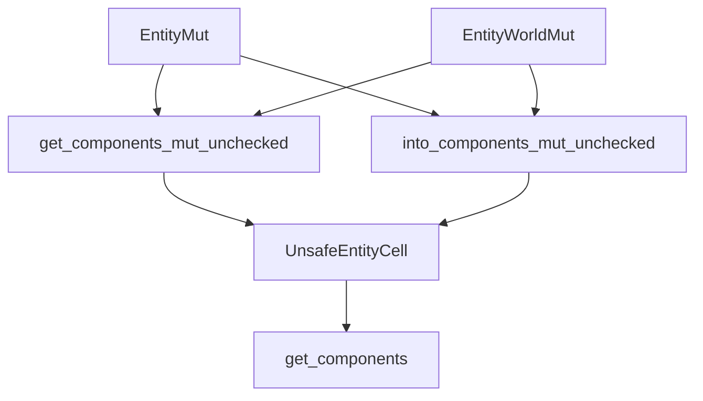

+++
title = "#20265 `EntityMut::get_components_mut_unchecked()`"
date = "2025-07-23T00:00:00"
draft = false
template = "pull_request_page.html"
in_search_index = true

[taxonomies]
list_display = ["show"]

[extra]
current_language = "en"
available_languages = {"en" = { name = "English", url = "/pull_request/bevy/2025-07/pr-20265-en-20250723" }, "zh-cn" = { name = "中文", url = "/pull_request/bevy/2025-07/pr-20265-zh-cn-20250723" }}
labels = ["C-Feature", "A-ECS", "D-Modest", "D-Unsafe"]
+++

# EntityMut::get_components_mut_unchecked()

## Basic Information
- **Title**: `EntityMut::get_components_mut_unchecked()`
- **PR Link**: https://github.com/bevyengine/bevy/pull/20265
- **Author**: chescock
- **Status**: MERGED
- **Labels**: C-Feature, A-ECS, S-Ready-For-Final-Review, X-Uncontroversial, D-Modest, D-Unsafe
- **Created**: 2025-07-23T18:14:08Z
- **Merged**: 2025-07-23T19:05:44Z
- **Merged By**: alice-i-cecile

## Description Translation
# Objective

Provide an unsafe way to get mutable access to multiple components from an EntityMut.

This is the API proposed in #13375, but marked `unsafe` as it does not check for conflicting access.

## Solution

Add `unsafe fn get_components_mut_unchecked(&mut self) -> Option<Q::Item>` and `unsafe fn into_components_mut_unchecked(self) -> Option<Q::Item>` to `EntityMut` and `EntityWorldMut`.

## The Story of This Pull Request

The PR addresses a specific need in Bevy's Entity Component System (ECS) for efficient multi-component mutable access. Previously, developers could use `EntityMut` to access individual components or use safe queries for multiple components, but there was no direct way to get multiple mutable references to different components of the same entity without runtime checks. This limitation became noticeable in performance-critical scenarios where developers could statically guarantee no aliasing would occur.

The solution introduces unsafe methods that bypass runtime aliasing checks while maintaining ECS integrity. The implementation adds two new methods to both `EntityMut` and `EntityWorldMut`:
1. `get_components_mut_unchecked()` for temporary mutable access
2. `into_components_mut_unchecked()` for consuming the entity reference

These methods delegate to an existing internal method in `UnsafeEntityCell`, but with modified safety constraints. The key engineering decision was to mark these methods `unsafe` and place the responsibility for avoiding mutable aliasing on the caller. This approach avoids runtime overhead while maintaining ECS safety invariants.

The implementation required relaxing trait bounds in `UnsafeEntityCell`'s internal method. Previously, it required `ReadOnlyQueryData`, which prevented mutable access. The PR changes this to accept any `ReleaseStateQueryData`:

```rust
// Before:
pub(crate) unsafe fn get_components<Q: ReadOnlyQueryData + ReleaseStateQueryData>

// After:
pub(crate) unsafe fn get_components<Q: ReleaseStateQueryData>
```

This change enables the new methods to work with mutable queries. The methods include comprehensive safety documentation and usage examples that demonstrate proper usage patterns and highlight potential pitfalls:

```rust
// Example usage
// SAFETY: X and Y are different components
let (mut x, mut y) = unsafe { entity.get_components_mut_unchecked::<(&mut X, &mut Y)>() }.unwrap();
```

The primary impact is performance optimization for advanced use cases where developers can guarantee component uniqueness. This change doesn't affect existing safe APIs but provides an escape hatch for performance-sensitive systems. The PR maintains Bevy's safety standards by clearly documenting the unsafe contracts and providing examples of both valid and invalid usage.

## Visual Representation



## Key Files Changed

### 1. `crates/bevy_ecs/src/world/entity_ref.rs`
Added unsafe methods for multi-component mutable access to `EntityMut` and `EntityWorldMut`.

**Key additions:**
```rust
pub unsafe fn get_components_mut_unchecked<Q: ReleaseStateQueryData>(
    &mut self,
) -> Option<Q::Item<'_, 'static>> {
    unsafe { self.reborrow().into_components_mut_unchecked::<Q>() }
}

pub unsafe fn into_components_mut_unchecked<Q: ReleaseStateQueryData>(
    self,
) -> Option<Q::Item<'w, 'static>> {
    unsafe { self.cell.get_components::<Q>() }
}
```

### 2. `crates/bevy_ecs/src/world/unsafe_world_cell.rs`
Modified internal method to support mutable queries.

**Key change:**
```rust
// Before:
pub(crate) unsafe fn get_components<Q: ReadOnlyQueryData + ReleaseStateQueryData>

// After:
pub(crate) unsafe fn get_components<Q: ReleaseStateQueryData>
```

## Further Reading
- [Rustonomicon: Unchecked Uniqueness](https://doc.rust-lang.org/nomicon/unchecked-uniqueness.html)
- [Bevy ECS Query Documentation](https://bevyengine.org/learn/book/ecs/query/)
- [Original Proposal: #13375](https://github.com/bevyengine/bevy/issues/13375)