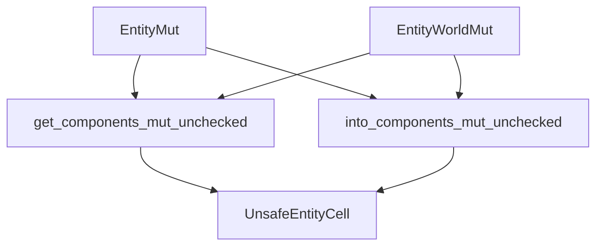

+++
title = "#20265 EntityMut::get_components_mut_unchecked()"
date = "2025-07-23T00:00:00"
draft = false
template = "pull_request_page.html"
in_search_index = false

[extra]
current_language = "zh-cn"
available_languages = {"en" = { name = "English", url = "/pull_request/bevy/2025-07/pr-20265-en-20250723" }, "zh-cn" = { name = "中文", url = "/pull_request/bevy/2025-07/pr-20265-zh-cn-20250723" }}
+++

# EntityMut::get_components_mut_unchecked() 技术分析报告

## 基本信息
- **标题**: `EntityMut::get_components_mut_unchecked()`
- **PR 链接**: https://github.com/bevyengine/bevy/pull/20265
- **作者**: chescock
- **状态**: MERGED
- **标签**: C-Feature, A-ECS, S-Ready-For-Final-Review, X-Uncontroversial, D-Modest, D-Unsafe
- **创建时间**: 2025-07-23T18:14:08Z
- **合并时间**: 2025-07-23T19:05:44Z
- **合并者**: alice-i-cecile

## 描述翻译
### 目标
提供一种不安全的方式，从 EntityMut 获取多个组件的可变访问权限。

这是 #13375 中提出的 API，但标记为 `unsafe`，因为它不检查访问冲突。

### 解决方案
在 `EntityMut` 和 `EntityWorldMut` 中添加：
1. `unsafe fn get_components_mut_unchecked(&mut self) -> Option<Q::Item>`
2. `unsafe fn into_components_mut_unchecked(self) -> Option<Q::Item>`

## PR 技术分析

### 问题与背景
在 Bevy ECS 中，开发者经常需要同时访问实体(entity)的多个组件(components)。现有安全 API（如 `get_component_mut`）一次只允许获取单个组件的可变引用，以避免违反 Rust 的别名规则。然而，当开发者需要同时修改多个不同组件时，这种限制会导致：
1. 多次调用增加开销
2. 无法原子性地获取多个组件的引用

原始问题 #13375 提出了这个需求，但实现需要绕过 Rust 的借用检查器，因此必须标记为 `unsafe`。

### 解决方案
PR 添加了两个新的 `unsafe` 方法：
1. `get_components_mut_unchecked()`：通过可变引用访问
2. `into_components_mut_unchecked()`：消费 EntityMut 获取所有权

这些方法允许查询(query)返回多个组件的可变引用元组（如 `(&mut ComponentA, &mut ComponentB)`），但要求调用者确保：
- 不请求同一组件的多个可变引用
- 遵守 Rust 的借用规则

### 实现细节
实现主要涉及两个文件：

**1. crates/bevy_ecs/src/world/entity_ref.rs**
在 `EntityMut` 和 `EntityWorldMut` 中添加新方法：

```rust
// EntityMut 新增方法
pub unsafe fn get_components_mut_unchecked<Q: ReleaseStateQueryData>(
    &mut self,
) -> Option<Q::Item<'_, 'static>> {
    unsafe { self.reborrow().into_components_mut_unchecked::<Q>() }
}

pub unsafe fn into_components_mut_unchecked<Q: ReleaseStateQueryData>(
    self,
) -> Option<Q::Item<'w, 'static>> {
    unsafe { self.cell.get_components::<Q>() }
}
```

关键点：
- `get_components_mut_unchecked` 通过 `reborrow()` 转换生命周期
- `into_components_mut_unchecked` 消费 self 直接访问底层 cell
- 两者都委托给 `UnsafeEntityCell::get_components`

同样为 `EntityWorldMut` 添加对称实现：

```rust
// EntityWorldMut 新增方法
pub unsafe fn get_components_mut_unchecked<Q: ReleaseStateQueryData>(
    &mut self,
) -> Option<Q::Item<'_, 'static>> {
    unsafe { self.as_mutable().into_components_mut_unchecked::<Q>() }
}

pub unsafe fn into_components_mut_unchecked<Q: ReleaseStateQueryData>(
    self,
) -> Option<Q::Item<'w, 'static>> {
    unsafe { self.into_mutable().into_components_mut_unchecked::<Q>() }
}
```

**2. crates/bevy_ecs/src/world/unsafe_world_cell.rs**
放宽了 `UnsafeEntityCell::get_components` 的类型约束：

```diff
- pub(crate) unsafe fn get_components<Q: ReadOnlyQueryData + ReleaseStateQueryData>(
+ pub(crate) unsafe fn get_components<Q: ReleaseStateQueryData>(
      &self,
  ) -> Option<Q::Item<'w, 'static>> {
      // ... 实现不变
  }
```

关键修改：
- 移除 `ReadOnlyQueryData` 约束
- 现在支持可变查询

### 安全考虑
每个方法都包含详细的安全注释：

```rust
// SAFETY:
// - We have mutable access to all components of this entity.
// - Caller asserts the `QueryData` does not provide aliasing mutable references
```

示例代码明确展示正确用法和危险用法：

```rust
// 安全用法（访问不同组件）
let (mut x, mut y) = unsafe { entity.get_components_mut_unchecked::<(&mut X, &mut Y)>() }.unwrap();

// 危险用法（导致未定义行为）
// entity.get_components_mut_unchecked::<(&mut X, &mut X)>();
```

### 影响与权衡
1. **优点**：
   - 减少多次访问开销
   - 支持原子性组件操作
   - 为高级用例提供底层原语

2. **风险**：
   - 误用会导致未定义行为
   - 要求调用者深入理解 Rust 所有权规则

3. **设计选择**：
   - 使用 `unsafe` 而非运行时检查，保持零成本抽象
   - 提供两种访问模式（引用/所有权）满足不同场景

## 关键文件变更

### crates/bevy_ecs/src/world/entity_ref.rs
```diff
@@ -561,6 +563,78 @@ impl<'w> EntityMut<'w> {
         self.as_readonly().get_components::<Q>()
     }
 
+    pub unsafe fn get_components_mut_unchecked<Q: ReleaseStateQueryData>(
+        &mut self,
+    ) -> Option<Q::Item<'_, 'static>> {
+        unsafe { self.reborrow().into_components_mut_unchecked::<Q>() }
+    }
+
+    pub unsafe fn into_components_mut_unchecked<Q: ReleaseStateQueryData>(
+        self,
+    ) -> Option<Q::Item<'w, 'static>> {
+        unsafe { self.cell.get_components::<Q>() }
+    }
+
@@ -1332,6 +1406,76 @@ impl<'w> EntityWorldMut<'w> {
         self.as_readonly().get_components::<Q>()
     }
 
+    pub unsafe fn get_components_mut_unchecked<Q: ReleaseStateQueryData>(
+        &mut self,
+    ) -> Option<Q::Item<'_, 'static>> {
+        unsafe { self.as_mutable().into_components_mut_unchecked::<Q>() }
+    }
+
+    pub unsafe fn into_components_mut_unchecked<Q: ReleaseStateQueryData>(
+        self,
+    ) -> Option<Q::Item<'w, 'static>> {
+        unsafe { self.into_mutable().into_components_mut_unchecked::<Q>() }
+    }
```

### crates/bevy_ecs/src/world/unsafe_world_cell.rs
```diff
-    pub(crate) unsafe fn get_components<Q: ReadOnlyQueryData + ReleaseStateQueryData>(
+    pub(crate) unsafe fn get_components<Q: ReleaseStateQueryData>(
         &self,
     ) -> Option<Q::Item<'w, 'static>> {
```

## 架构关系图


## 延伸阅读
1. [Rust 不安全代码指南](https://doc.rust-lang.org/nomicon/)
2. [Bevy ECS 查询文档](https://docs.rs/bevy_ecs/latest/bevy_ecs/query/index.html)
3. [原始 Issue #13375](https://github.com/bevyengine/bevy/issues/13375)