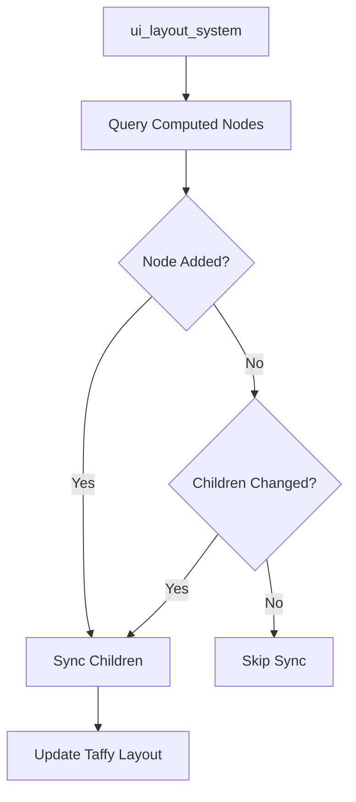

+++
title = "#20266 Sync UI Children on Node Addition: Fixing Layout Sync for Asynchronous Spawning"
date = "2025-07-23T00:00:00"
draft = false
template = "pull_request_page.html"
in_search_index = true

[taxonomies]
list_display = ["show"]

[extra]
current_language = "en"
available_languages = {"en" = { name = "English", url = "/pull_request/bevy/2025-07/pr-20266-en-20250723" }, "zh-cn" = { name = "中文", url = "/pull_request/bevy/2025-07/pr-20266-zh-cn-20250723" }}
labels = ["C-Bug", "A-UI"]
+++

### Title: Sync UI Children on Node Addition: Fixing Layout Sync for Asynchronous Spawning

## Basic Information
- **Title**: Sync UI children on `Node` addition
- **PR Link**: https://github.com/bevyengine/bevy/pull/20266
- **Author**: villor
- **Status**: MERGED
- **Labels**: C-Bug, A-UI, S-Ready-For-Final-Review
- **Created**: 2025-07-23T18:31:21Z
- **Merged**: 2025-07-23T19:10:06Z
- **Merged By**: alice-i-cecile

## Description Translation
# Objective
For context:
> Yeah it seems like it would be a `bevy_ui` issue, which just becomes easy to hit since `spawn_scene` is deferred. You end up with an invalid (has non-Node parent) Node until the scene is resolved and spawned. And it seems like the UI systems can't handle the parent adding Node, making the child valid
https://discord.com/channels/691052431525675048/1264881140007702558/1397443915900256338

- The UI layout systems do not take node addition into account when deciding to sync children
- Multiple people have encountered this when evaluating the BSN draft PR which involves spawning scenes asynchronously.

## Solution

- Added a check for `node.is_added()` alongside the `children.ui_children.is_changed()` check

## Testing

- Added a new test case: `node_addition_should_sync_children`
---

## The Story of This Pull Request

#### The Problem and Context
The UI layout system had a gap in handling newly added `Node` components. When spawning scenes asynchronously using `spawn_scene`, developers encountered situations where UI nodes would have non-Node parents during deferred spawning. The UI systems didn't account for cases where a parent entity gains a `Node` component after its children were already created. This left child nodes in an invalid state until some other change forced a layout recomputation. The issue was particularly noticeable in asynchronous workflows where scene resolution happens after initial entity creation.

#### The Solution Approach
The fix modifies the layout system to check for both node additions and child list changes when determining whether to sync UI children. By adding a `node.is_added()` check alongside the existing `ui_children.is_changed()` condition, the system now properly handles cases where a parent gains a `Node` component after its children were created. This ensures the internal Taffy layout engine receives immediate updates when nodes become valid parents.

#### The Implementation
The implementation updates two key sections in the UI layout system. First, it modifies the computed node query to include the `Node` component reference:

```rust
// Before:
computed_node_query: Query<(Entity, Option<Ref<ChildOf>>), With<ComputedNode>>,

// After:
computed_node_query: Query<(Entity, Ref<Node>, Option<Ref<ChildOf>>), With<ComputedNode>>,
```

This provides access to the `Node` component's change state. The system then adds the `is_added()` check to both child synchronization points:

```rust
// Before:
if ui_children.is_changed(entity) { ... }

// After:
if node.is_added() || ui_children.is_changed(entity) { ... }
```

The test `node_addition_should_sync_children` verifies the fix by:
1. Creating an invalid UI root (entity without `Node` but with child nodes)
2. Running the UI schedule
3. Adding the `Node` component to the root
4. Verifying child synchronization occurs

```rust
#[test]
fn node_addition_should_sync_children() {
    // ...setup...
    let root_node = world.spawn(()).with_child(Node::default()).id();
    ui_schedule.run(&mut world);
    
    world.entity_mut(root_node).insert(Node::default());
    ui_schedule.run(&mut world);
    
    // Verify child exists in layout
    assert_eq!(ui_surface.taffy.child_count(taffy_root.id), 1);
}
```

#### Technical Insights
The solution leverages Bevy's change detection system through `Ref<Node>`, which tracks component additions and modifications. The key insight is that adding a `Node` component to a parent should trigger the same child synchronization as modifying existing children. The change maintains the existing system structure while expanding its trigger conditions.

#### The Impact
This fix resolves layout inconsistencies when:
- Using asynchronous scene spawning
- Adding UI components after entity creation
- Building complex UI hierarchies dynamically
The changes ensure UI elements appear correctly immediately after their parent nodes become valid, without requiring additional property changes to trigger layout updates.

## Visual Representation



## Key Files Changed

### `crates/bevy_ui/src/layout/mod.rs`
1. **What changed**: Updated the computed node query to include `Node` component and added `is_added()` checks to child synchronization logic.
2. **Why changed**: To ensure child synchronization occurs when parents gain `Node` components after children exist.

**Key modifications**:
```rust
// Query modification
- computed_node_query: Query<(Entity, Option<Ref<ChildOf>>), With<ComputedNode>>,
+ computed_node_query: Query<(Entity, Ref<Node>, Option<Ref<ChildOf>>), With<ComputedNode>>,

// First synchronization point
- if ui_children.is_changed(entity) {
+ if node.is_added() || ui_children.is_changed(entity) {

// Second synchronization point
- if ui_children.is_changed(entity) {
+ if node.is_added() || ui_children.is_changed(entity) {
```

3. **Added test case**:
```rust
#[test]
fn node_addition_should_sync_children() {
    let (mut world, mut ui_schedule) = setup_ui_test_world();
    let root_node = world.spawn(()).with_child(Node::default()).id();
    ui_schedule.run(&mut world);
    
    world.entity_mut(root_node).insert(Node::default());
    ui_schedule.run(&mut world);
    
    let ui_surface = world.resource_mut::<UiSurface>();
    let taffy_root = ui_surface.entity_to_taffy[&root_node];
    assert_eq!(ui_surface.taffy.child_count(taffy_root.id), 1);
}
```

## Further Reading
1. [Bevy UI Layout System Documentation](https://github.com/bevyengine/bevy/blob/main/crates/bevy_ui/src/layout/mod.rs)
2. [Bevy Change Detection System](https://bevyengine.org/learn/book/migration-guides/0.12-0.13/#change-detection)
3. [Taffy Layout Engine](https://github.com/DioxusLabs/taffy)