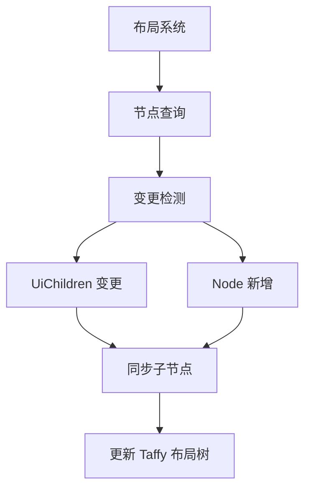

+++
title = "#20266 Sync UI children on `Node` addition"
date = "2025-07-23T00:00:00"
draft = false
template = "pull_request_page.html"
in_search_index = false

[extra]
current_language = "zh-cn"
available_languages = {"en" = { name = "English", url = "/pull_request/bevy/2025-07/pr-20266-en-20250723" }, "zh-cn" = { name = "中文", url = "/pull_request/bevy/2025-07/pr-20266-zh-cn-20250723" }}
+++

## 同步 UI 子节点：PR #20266 技术分析

### 基本信息
- **标题**: Sync UI children on `Node` addition
- **PR 链接**: https://github.com/bevyengine/bevy/pull/20266
- **作者**: villor
- **状态**: 已合并
- **标签**: C-Bug, A-UI, S-Ready-For-Final-Review
- **创建时间**: 2025-07-23T18:31:21Z
- **合并时间**: 2025-07-23T19:10:06Z
- **合并者**: alice-i-cecile

### 描述翻译
#### 目标
背景说明：
> 这似乎是 `bevy_ui` 的问题，由于 `spawn_scene` 是延迟执行的，所以更容易触发。在场景解析和生成前，会出现无效的节点（有非 Node 父节点）。UI 系统似乎无法处理父节点添加 Node 组件使子节点有效的情况
https://discord.com/channels/691052431525675048/1264881140007702558/1397443915900256338

- UI 布局系统在决定是否同步子节点时，未考虑节点新增的情况
- 多位开发者在评估 BSN 草案 PR（涉及异步生成场景）时遇到此问题

#### 解决方案
- 在 `children.ui_children.is_changed()` 检查基础上增加 `node.is_added()` 检查

#### 测试
- 新增测试用例：`node_addition_should_sync_children`

---

### PR 技术分析

#### 问题背景
在 Bevy UI 系统中，当父实体**新增** `Node` 组件时，其已有的子节点不会自动同步到布局系统。这个问题在异步场景加载（如 `spawn_scene`）时尤为明显，因为：
1. 子节点实体先于父节点的 `Node` 组件创建
2. 现有系统仅监听 `UiChildren` 组件的变化
3. 父节点添加 `Node` 时不会触发子节点同步

这导致 UI 层级关系断裂，布局计算错误。问题在 BSN（Bevy Scene Next）异步场景加载方案评估中被多次发现，影响场景初始化流程的可靠性。

#### 解决方案
核心思路：在子节点同步逻辑中增加对父节点新增状态的检测。具体实现：
1. 修改查询语句，获取 `Node` 组件的变更状态
2. 在子节点同步条件中加入 `node.is_added()` 检查
3. 新增测试用例验证修复效果

#### 代码实现
关键修改在布局系统的主逻辑中：

**1. 查询语句扩展**  
获取 `Node` 组件的 `Ref` 用于变更检测：
```diff
- computed_node_query: Query<(Entity, Option<Ref<ChildOf>>), With<ComputedNode>>,
+ computed_node_query: Query<(Entity, Ref<Node>, Option<Ref<ChildOf>>), With<ComputedNode>>,
```

**2. 子节点同步逻辑增强**  
在两次遍历中添加新增节点检测：
```diff
// 首次遍历（处理父子关系）
computed_node_query.iter().for_each(|(entity, node, maybe_child_of)| {
    ...
-   if ui_children.is_changed(entity) {
+   if node.is_added() || ui_children.is_changed(entity) {
        ui_surface.update_children(entity, ui_children.iter_ui_children(entity));
    }
});

// 二次遍历（处理节点移除）
computed_node_query.iter().for_each(|(entity, node, _)| {
-   if ui_children.is_changed(entity) {
+   if node.is_added() || ui_children.is_changed(entity) {
        ui_surface.update_children(entity, ui_children.iter_ui_children(entity));
    }
});
```

**3. 新增测试验证**  
模拟问题场景：先创建无 `Node` 组件的父实体，后补 `Node`：
```rust
#[test]
fn node_addition_should_sync_children() {
    let (mut world, mut ui_schedule) = setup_ui_test_world();
    
    // 创建无效的 UI 根节点（无 Node 组件）
    let root_node = world.spawn(()).with_child(Node::default()).id();
    
    ui_schedule.run(&mut world);
    
    // 修复：插入 Node 组件
    world.entity_mut(root_node).insert(Node::default());
    
    ui_schedule.run(&mut world);
    
    // 验证子节点同步
    let ui_surface = world.resource_mut::<UiSurface>();
    let taffy_root = ui_surface.entity_to_taffy[&root_node];
    assert_eq!(ui_surface.taffy.child_count(taffy_root.id), 1);
}
```

#### 技术洞察
1. **变更检测机制**：利用 `Ref<Node>` 的 `is_added()` 方法识别新增组件
2. **双重保障**：在父子关系处理和节点移除处理两处都添加检测
3. **测试设计**：精确模拟异步加载场景中父节点延迟添加的场景
4. **性能考虑**：`is_added()` 检查成本低，不影响主流程性能

#### 影响
1. 修复异步加载场景下的 UI 层级断裂问题
2. 确保 `Node` 组件后添加时子节点自动同步
3. 提高 UI 系统在复杂初始化场景下的可靠性
4. 为 BSN 异步场景加载方案扫除关键障碍

### 关键文件变更
#### `crates/bevy_ui/src/layout/mod.rs`
**变更描述**：  
修复父节点新增时子节点同步问题，添加验证测试

**核心修改**：
```diff
// 查询修改：增加 Node 组件的变更检测能力
- computed_node_query: Query<(Entity, Option<Ref<ChildOf>>), With<ComputedNode>>,
+ computed_node_query: Query<(Entity, Ref<Node>, Option<Ref<ChildOf>>), With<ComputedNode>>,

// 同步条件修改：增加新增节点检测
- if ui_children.is_changed(entity) {
+ if node.is_added() || ui_children.is_changed(entity) {
    ui_surface.update_children(entity, ui_children.iter_ui_children(entity));
}
```

**新增测试**：
```rust
#[test]
fn node_addition_should_sync_children() {
    // 测试初始化...
    // 模拟后添加 Node 组件的场景
    world.entity_mut(root_node).insert(Node::default());
    // 验证子节点数量
    assert_eq!(ui_surface.taffy.child_count(taffy_root.id), 1);
}
```

### 组件关系图


### 延伸阅读
1. [Bevy 变更检测文档](https://bevyengine.org/learn/book/change-detection/)
2. [Taffy 布局库](https://github.com/DioxusLabs/taffy)
3. [Bevy UI 系统设计](https://github.com/bevyengine/bevy/tree/main/crates/bevy_ui#readme)
4. [异步场景加载提案](https://github.com/bevyengine/bevy/discussions/20245)