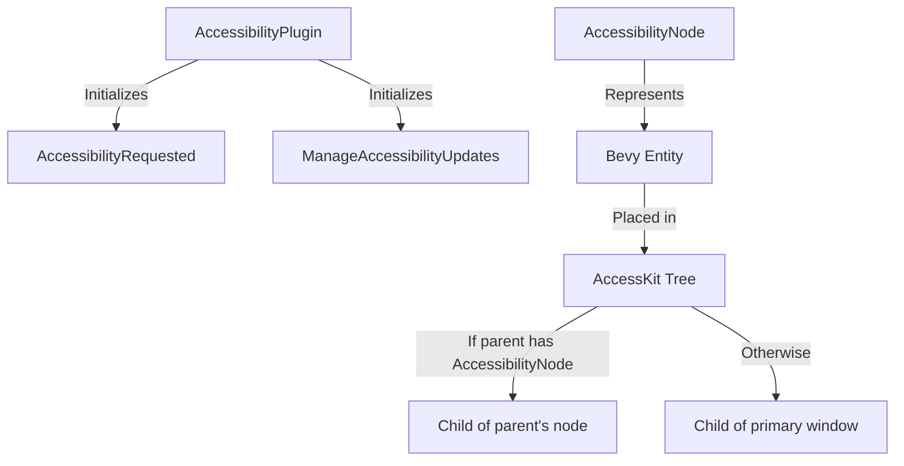

+++
title = "#20267 Improve `bevy_a11y` docs"
date = "2025-07-23T00:00:00"
draft = false
template = "pull_request_page.html"
in_search_index = true

[taxonomies]
list_display = ["show"]

[extra]
current_language = "en"
available_languages = {"en" = { name = "English", url = "/pull_request/bevy/2025-07/pr-20267-en-20250723" }, "zh-cn" = { name = "中文", url = "/pull_request/bevy/2025-07/pr-20267-zh-cn-20250723" }}
labels = ["C-Docs", "A-Accessibility"]
+++

## Improve `bevy_a11y` docs

### Basic Information
- **Title**: Improve `bevy_a11y` docs
- **PR Link**: https://github.com/bevyengine/bevy/pull/20267
- **Author**: onkoe
- **Status**: MERGED
- **Labels**: C-Docs, A-Accessibility, S-Ready-For-Final-Review
- **Created**: 2025-07-23T18:54:13Z
- **Merged**: 2025-07-23T19:44:06Z
- **Merged By**: alice-i-cecile

### Description
The documentation for this crate has always been a bit scarce.

I did my best at adding some additional context and explanations to the module. 

## Changes

Here's a lil summary of what I did:

- Change the module's headline/header to say: "Reusable accessibility primitives"
    - This could help newer users understand what the crate does, particularly when seeing it in the "modules" list in the top-level `bevy` crate.
    - In the `bevy` crate's modules list, it'll appear like:
    	- `a11y`: Reusable accessibility primitives
    - If you have a better idea for it, please feel free to suggest it here!
- Add more mod-level documentation
	- I wanted to make it more clear to users when/where they'd use this module.
	- Also, it's nice to know _why_ the `accesskit` re-export was removed, so I added that in as a footnote.
- Gave a visual, ultra-clear explainer on `AccessibilityNode`, stating that `AccessKit`'s tree is NOT Bevy's ECS
- Improve clarity on ty-level docs
	- Mostly helps to say why each type exists.
- Also snuck in some basic grammar improvements... when useful.

## For Reviewers

A quick fact-check of the new docs would be really helpful. If anything is unclear, questionable, or just plain incorrect, please let me know so I can fix it. :)

Thank you!

### The Story of This Pull Request
The `bevy_a11y` crate had sparse documentation that didn't clearly explain its purpose or usage. Users, especially newcomers, struggled to understand when to use the crate and how its components interacted with Bevy's architecture. The existing documentation also didn't clarify why `accesskit` was no longer re-exported, leading to confusion about dependency management.

The solution focused on comprehensive documentation improvements. The module header was changed to "Reusable accessibility primitives" to immediately communicate the crate's purpose. This gives users clear context when browsing Bevy's module list. The module-level documentation was expanded to explain:
- The crate's role in accessibility integration
- How the `AccessibilityPlugin` bridges `AccessKit` with Bevy's ECS
- When different users (binary authors vs library maintainers) should interact with the crate
- Why `accesskit` is no longer re-exported (to prevent confusion with Bevy UI nodes)

Type-level documentation received significant enhancements. For `ActionRequest`, the docs now clarify it's a newtype wrapper enabling `accesskit::ActionRequest` to function as a Bevy event. The `AccessibilityRequested` resource documentation explains it tracks whether assistive technologies are active and controls accessibility update flow. Similarly, `ManageAccessibilityUpdates` now explicitly states it determines whether Bevy's ECS should handle accessibility tree updates, preventing conflicts with external GUI libraries.

The most critical improvement was for `AccessibilityNode`. The new documentation provides a visual explanation of how these components map to `AccessKit`'s tree structure while emphasizing this tree is separate from Bevy's ECS hierarchy. Clear examples show:
- How parent-child relationships work when both entities have `AccessibilityNode`
- The fallback behavior when parent entities lack this component (nodes attach to primary window)
- Why this distinction matters for accessibility tree construction

The `AccessibilityPlugin` docs were updated to clarify its role in initializing resources without handling GUI aspects. Throughout the documentation, grammar and clarity improvements were made while preserving technical accuracy. No functional changes were made to the code - this PR solely improves documentation quality.

These changes help users understand:
1. When to use `bevy_a11y` versus other accessibility solutions
2. How to properly structure accessibility nodes in their ECS hierarchy
3. How to avoid dependency conflicts when using `accesskit` directly
4. How accessibility resources interact during runtime

### Visual Representation


### Key Files Changed
**crates/bevy_a11y/src/lib.rs**  
Modified header and added comprehensive module documentation:  
```rust
// Before:
//! Accessibility for Bevy
//!
//! As of Bevy version 0.15 `accesskit` is no longer re-exported from this crate.
//!
//! If you need to use `accesskit`, you will need to add it as a separate dependency in your `Cargo.toml`.
//!
//! Make sure to use the same version of `accesskit` as Bevy.

// After:
//! Reusable accessibility primitives
//!
//! This crate provides accessibility integration for the engine. It exposes the
//! [`AccessibilityPlugin`]. This plugin integrates `AccessKit`, a Rust crate
//! providing OS-agnostic accessibility primitives, with Bevy's ECS.
//!
//! ## Some notes on utility
//!
//! While this crate defines useful types for accessibility, it does not
//! actually power accessibility features in Bevy.
//!
//! Instead, it helps other interfaces coordinate their approach to
//! accessibility. Binary authors should add the [`AccessibilityPlugin`], while
//! library maintainers may use the [`AccessibilityRequested`] and
//! [`ManageAccessibilityUpdates`] resources.
```

Enhanced `AccessibilityNode` documentation with tree structure explanation:  
```rust
// Before:
/// Component to wrap a [`accesskit::Node`], representing this entity to the platform's
/// accessibility API.
///
/// If an entity has a parent, and that parent also has an `AccessibilityNode`,
/// the entity's node will be a child of the parent's node.
///
/// If the entity doesn't have a parent, or if the immediate parent doesn't have
/// an `AccessibilityNode`, its node will be an immediate child of the primary window.

// After:
/// Represents an entity to `AccessKit` through an [`accesskit::Node`].
///
/// Platform-specific accessibility APIs utilize `AccessKit` nodes in their
/// accessibility frameworks. So, this component acts as a translation between
/// "Bevy entity" and "platform-agnostic accessibility element".
///
/// ## Organization in the `AccessKit` Accessibility Tree
///
/// `AccessKit` allows users to form a "tree of nodes" providing accessibility
/// information. That tree is **not** Bevy's ECS!
///
/// To explain, let's say this component is added to an entity, `E`.
///
/// ### Parent and Child
///
/// If `E` has a parent, `P`, and `P` also has this `AccessibilityNode`
/// component, then `E`'s `AccessKit` node will be a child of `P`'s `AccessKit`
/// node.
///
/// Resulting `AccessKit` tree:
/// - P
///     - E
```

### Further Reading
- [AccessKit Documentation](https://docs.rs/accesskit): Learn about the underlying accessibility library
- [Bevy's Accessibility Guide](https://github.com/bevyengine/bevy/blob/main/examples/accessibility/accessibility.rs): Example usage in Bevy projects
- [Rust Documentation Guidelines](https://rust-lang.github.io/rfcs/1574-more-api-documentation-conventions.html): Best practices for Rust docs

### Full Code Diff
```diff
diff --git a/crates/bevy_a11y/src/lib.rs b/crates/bevy_a11y/src/lib.rs
index 291173fb2b7b6..90facc26237c6 100644
--- a/crates/bevy_a11y/src/lib.rs
+++ b/crates/bevy_a11y/src/lib.rs
@@ -6,13 +6,57 @@
 )]
 #![no_std]
 
-//! Accessibility for Bevy
+//! Reusable accessibility primitives
 //!
-//! As of Bevy version 0.15 `accesskit` is no longer re-exported from this crate.
+//! This crate provides accessibility integration for the engine. It exposes the
+//! [`AccessibilityPlugin`]. This plugin integrates `AccessKit`, a Rust crate
+//! providing OS-agnostic accessibility primitives, with Bevy's ECS.
 //!
-//! If you need to use `accesskit`, you will need to add it as a separate dependency in your `Cargo.toml`.
+//! ## Some notes on utility
 //!
-//! Make sure to use the same version of `accesskit` as Bevy.
+//! While this crate defines useful types for accessibility, it does not
+//! actually power accessibility features in Bevy.
+//!
+//! Instead, it helps other interfaces coordinate their approach to
+//! accessibility. Binary authors should add the [`AccessibilityPlugin`], while
+//! library maintainers may use the [`AccessibilityRequested`] and
+//! [`ManageAccessibilityUpdates`] resources.
+//!
+//! The [`AccessibilityNode`] component is useful in both cases. It helps
+//! describe an entity in terms of its accessibility factors through an
+//! `AccessKit` "node".
+//!
+//! Typical UI concepts, like buttons, checkboxes, and textboxes, are easily
+//! described by this component, though, technically, it can represent any kind
+//! of Bevy [`Entity`].
+//!
+//! ## This crate no longer re-exports `AccessKit`
+//!
+//! As of Bevy version 0.15, [the `accesskit` crate][accesskit_crate] is no
+//! longer re-exported from this crate.[^accesskit_node_confusion] If you need
+//! to use `AccessKit` yourself, you'll have to add it as a separate dependency
+//! in your project's `Cargo.toml`.
+//!
+//! Make sure to use the same version of the `accesskit` crate as Bevy.
+//! Otherwise, you may experience errors similar to: "Perhaps two different
+//! versions of crate `accesskit` are being used?"
+//!
+//! [accesskit_crate]: https://crates.io/crates/accesskit
+//! [`Entity`]: bevy_ecs::entity::Entity
+//!
+//! <!--
+//! note: multi-line footnotes need to be indented like this!
+//!
+//! please do not remove the indentation, or the second paragraph will display
+//! at the end of the module docs, **before** the footnotes...
+//! -->
+//!
+//! [^accesskit_node_confusion]: Some users were confused about `AccessKit`'s
+//!  `Node` type, sometimes thinking it was Bevy UI's primary way to define
+//!  nodes!
+//!
+//!     For this reason, its re-export was removed by default. Users who need
+//!     its types can instead manually depend on the `accesskit` crate.
 
 #[cfg(feature = "std")]
 extern crate std;
@@ -41,16 +85,27 @@ use serde::{Deserialize, Serialize};
 #[cfg(all(feature = "bevy_reflect", feature = "serialize"))]
 use bevy_reflect::{ReflectDeserialize, ReflectSerialize};
 
-/// Wrapper struct for [`accesskit::ActionRequest`]. Required to allow it to be used as an `Event`.
+/// Wrapper struct for [`accesskit::ActionRequest`].
+///
+/// This newtype is required to use `ActionRequest` as a Bevy `Event`.
 #[derive(BufferedEvent, Deref, DerefMut)]
 #[cfg_attr(feature = "serialize", derive(Serialize, Deserialize))]
 pub struct ActionRequest(pub accesskit::ActionRequest);
 
-/// Resource that tracks whether an assistive technology has requested
-/// accessibility information.
+/// Tracks whether an assistive technology has requested accessibility
+/// information.
+///
+/// This type is a [`Resource`] initialized by the
+/// [`AccessibilityPlugin`]. It may be useful if a third-party plugin needs to
+/// conditionally integrate with `AccessKit`.
 ///
-/// Useful if a third-party plugin needs to conditionally integrate with
-/// `AccessKit`
+/// In other words, this resource represents whether accessibility providers
+/// are "turned on" or "turned off" across an entire Bevy `App`.
+///
+/// By default, it is set to `false`, indicating that nothing has requested
+/// accessibility information yet.
+///
+/// [`Resource`]: bevy_ecs::resource::Resource
 #[derive(Resource, Default, Clone, Debug, Deref, DerefMut)]
 #[cfg_attr(
     feature = "bevy_reflect",
@@ -60,24 +115,42 @@ pub struct ActionRequest(pub accesskit::ActionRequest);
 pub struct AccessibilityRequested(Arc<AtomicBool>);
 
 impl AccessibilityRequested {
-    /// Returns `true` if an access technology is active and accessibility tree
+    /// Checks if any assistive technology has requested accessibility
+    /// information.
+    ///
+    /// If so, this method returns `true`, indicating that accessibility tree
     /// updates should be sent.
     pub fn get(&self) -> bool {
         self.load(Ordering::SeqCst)
     }
 
-    /// Sets whether accessibility updates were requested by an access technology.
+    /// Sets the app's preference for sending accessibility updates.
+    ///
+    /// If the `value` argument is `true`, this method requests that the app,
+    /// including both Bevy and third-party interfaces, provides updates to
+    /// accessibility information.
+    ///
+    /// Setting with `false` requests that the entire app stops providing these
+    /// updates.
     pub fn set(&self, value: bool) {
         self.store(value, Ordering::SeqCst);
     }
 }
 
-/// Resource whose value determines whether the accessibility tree is updated
-/// via the ECS.
+/// Determines whether Bevy's ECS updates the accessibility tree.
+///
+/// This [`Resource`] tells Bevy internals whether it should be handling
+/// `AccessKit` updates (`true`), or if something else is doing that (`false`).
+///
+/// It defaults to `true`. So, by default, Bevy is configured to maintain the
+/// `AccessKit` tree.
 ///
 /// Set to `false` in cases where an external GUI library is sending
-/// accessibility updates instead. Without this, the external library and ECS
-/// will generate conflicting updates.
+/// accessibility updates instead. When this option is set inconsistently with
+/// that requirement, the external library and ECS will generate conflicting
+/// updates.
+///
+/// [`Resource`]: bevy_ecs::resource::Resource
 #[derive(Resource, Clone, Debug, Deref, DerefMut)]
 #[cfg_attr(feature = "serialize", derive(Serialize, Deserialize))]
 #[cfg_attr(
@@ -98,36 +171,83 @@ impl Default for ManageAccessibilityUpdates {
 }
 
 impl ManageAccessibilityUpdates {
-    /// Returns `true` if the ECS should update the accessibility tree.
+    /// Returns `true` if Bevy's ECS should update the accessibility tree.
     pub fn get(&self) -> bool {
         self.0
     }
 
-    /// Sets whether the ECS should update the accessibility tree.
+    /// Sets whether Bevy's ECS should update the accessibility tree.
     pub fn set(&mut self, value: bool) {
         self.0 = value;
     }
 }
 
-/// Component to wrap a [`accesskit::Node`], representing this entity to the platform's
-/// accessibility API.
+/// Represents an entity to `AccessKit` through an [`accesskit::Node`].
+///
+/// Platform-specific accessibility APIs utilize `AccessKit` nodes in their
+/// accessibility frameworks. So, this component acts as a translation between
+/// "Bevy entity" and "platform-agnostic accessibility element".
+///
+/// ## Organization in the `AccessKit` Accessibility Tree
+///
+/// `AccessKit` allows users to form a "tree of nodes" providing accessibility
+/// information. That tree is **not** Bevy's ECS!
+///
+/// To explain, let's say this component is added to an entity, `E`.
+///
+/// ### Parent and Child
+///
+/// If `E` has a parent, `P`, and `P` also has this `AccessibilityNode`
+/// component, then `E`'s `AccessKit` node will be a child of `P`'s `AccessKit`
+/// node.
+///
+/// Resulting `AccessKit` tree:
+/// - P
+///     - E
+///
+/// In other words, parent-child relationships are maintained, but only if both
+/// have this component.
 ///
-/// If an entity has a parent, and that parent also has an `AccessibilityNode`,
-/// the entity's node will be a child of the parent's node.
+/// ### On the Window
 ///
-/// If the entity doesn't have a parent, or if the immediate parent doesn't have
-/// an `AccessibilityNode`, its node will be an immediate child of the primary window.
+/// If `E` doesn't have a parent, or if the immediate parent doesn't have an
+/// `AccessibilityNode`, its `AccessKit` node will be an immediate child of the
+/// primary window.
+///
+/// Resulting `AccessKit` tree:
+/// - Primary window
+///     - E
+///
+/// When there's no `AccessKit`-compatible parent, the child lacks hierarchical
+/// information in `AccessKit`. As such, it is placed directly under the
+/// primary window on the `AccessKit` tree.
+///
+/// This behavior may or may not be intended, so please utilize
+/// `AccessibilityNode`s with care.
 #[derive(Component, Clone, Deref, DerefMut)]
 #[cfg_attr(feature = "serialize", derive(Serialize, Deserialize))]
-pub struct AccessibilityNode(pub Node);
+pub struct AccessibilityNode(
+    /// A representation of this component's entity to `AccessKit`.
+    ///
+    /// Note that, with its parent struct acting as just a newtype, users are
+    /// intended to directly update this field.
+    pub Node,
+);
 
 impl From<Node> for AccessibilityNode {
+    /// Converts an [`accesskit::Node`] into the Bevy Engine
+    /// [`AccessibilityNode`] newtype.
+    ///
+    /// Doing so allows it to be inserted onto Bevy entities, representing Bevy
+    /// entities in the `AccessKit` tree.
     fn from(node: Node) -> Self {
         Self(node)
     }
 }
 
-/// Set enum for the systems relating to accessibility
+/// A system set relating to accessibility.
+///
+/// Helps run accessibility updates all at once.
 #[derive(Debug, Hash, PartialEq, Eq, Clone, SystemSet)]
 #[cfg_attr(feature = "serialize", derive(Serialize, Deserialize))]
 #[cfg_attr(feature = "bevy_reflect", derive(Reflect))]
@@ -136,7 +256,7 @@ impl From<Node> for AccessibilityNode {
     reflect(Serialize, Deserialize, Clone)
 )]
 pub enum AccessibilitySystems {
-    /// Update the accessibility tree
+    /// Update the accessibility tree.
     Update,
 }
 
@@ -144,7 +264,19 @@ pub enum AccessibilitySystems {
 #[deprecated(since = "0.17.0", note = "Renamed to `AccessibilitySystems`.")]
 pub type AccessibilitySystem = AccessibilitySystems;
 
-/// Plugin managing non-GUI aspects of integrating with accessibility APIs.
+/// Plugin managing integration with accessibility APIs.
+///
+/// Note that it doesn't handle GUI aspects of this integration, instead
+/// providing helpful resources for other interfaces to utilize.
+///
+/// ## Behavior
+///
+/// This plugin's main role is to initialize the [`AccessibilityRequested`] and
+/// [`ManageAccessibilityUpdates`] resources to their default values, meaning:
+///
+/// - no assistive technologies have requested accessibility information yet,
+///   and
+/// - Bevy's ECS will manage updates to the accessibility tree.
 #[derive(Default)]
 pub struct AccessibilityPlugin;
```