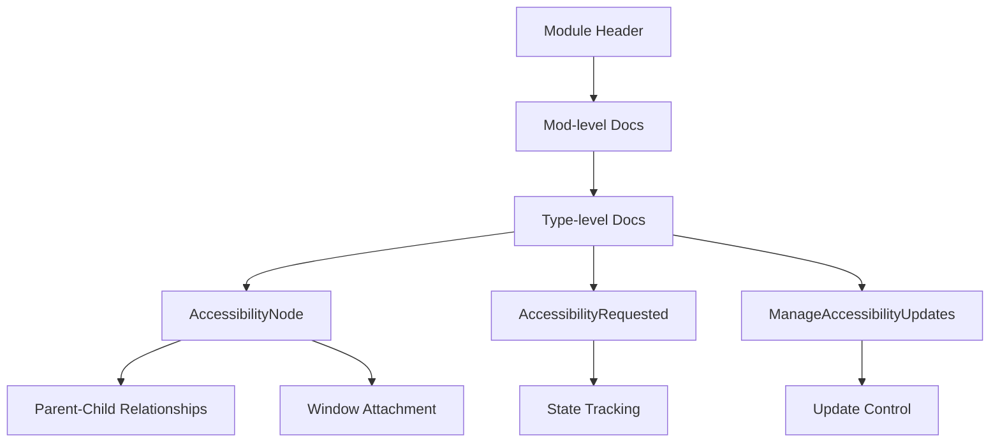

+++
title = "#20267 Improve `bevy_a11y` docs"
date = "2025-07-23T00:00:00"
draft = false
template = "pull_request_page.html"
in_search_index = false

[extra]
current_language = "zh-cn"
available_languages = {"en" = { name = "English", url = "/pull_request/bevy/2025-07/pr-20267-en-20250723" }, "zh-cn" = { name = "中文", url = "/pull_request/bevy/2025-07/pr-20267-zh-cn-20250723" }}
labels = ["C-Docs", "A-Accessibility"]
+++

## Improve `bevy_a11y` docs

### Basic Information
- **Title**: Improve `bevy_a11y` docs  
- **PR Link**: https://github.com/bevyengine/bevy/pull/20267  
- **Author**: onkoe  
- **Status**: MERGED  
- **Labels**: C-Docs, A-Accessibility, S-Ready-For-Final-Review  
- **Created**: 2025-07-23T18:54:13Z  
- **Merged**: 2025-07-23T19:44:06Z  
- **Merged By**: alice-i-cecile  

### Description Translation
该模块的文档一直较为简略。

我尽力添加了额外的上下文和解释。

## 变更内容

以下是我所做工作的简要总结：

- 将模块标题改为："Reusable accessibility primitives"
    - 这有助于新用户理解该模块的功能，尤其是在顶级 `bevy` crate 的"modules"列表中查看时
    - 在 `bevy` crate 的模块列表中，它将显示为：
    	- `a11y`: Reusable accessibility primitives
    - 如果您有更好的建议，请随时提出！
- 添加更多模块级文档
	- 我希望更清楚地说明用户何时/在何处使用此模块
	- 同时解释为何移除了 `accesskit` 的重新导出
- 对 `AccessibilityNode` 进行了直观清晰的解释，说明 `AccessKit` 的树结构不同于 Bevy 的 ECS
- 改进了类型级文档的清晰度
	- 主要说明每个类型存在的理由
- 同时修正了一些基础语法问题

## 给审阅者的说明

请快速核实新文档的准确性。如果有任何不清楚、存疑或错误之处，请告知以便修正。:)

谢谢！

### The Story of This Pull Request

#### 问题背景
`bevy_a11y` crate 的文档长期存在不足，主要问题包括：
1. 模块级文档过于简略，未清晰说明其用途和使用场景
2. 类型文档缺乏上下文，用户难以理解各组件的作用
3. `AccessibilityNode` 与 ECS 的关系不明确，导致概念混淆
4. 未解释为何在 0.15 版本移除了 `accesskit` 的重新导出

这些问题增加了用户的学习曲线，尤其是对无障碍功能不熟悉的开发者。清晰的文档对辅助技术集成至关重要，因为错误实现会导致系统级无障碍 API 冲突。

#### 解决方案
PR 通过结构化文档改进解决这些问题：
1. **重构模块头**：将模糊的 "Accessibility for Bevy" 改为精确的 "Reusable accessibility primitives"，明确模块定位
2. **增强模块级文档**：添加使用场景说明，区分二进制作者和库维护者的不同需求
3. **澄清关键概念**：特别强调 `AccessKit` 树与 ECS 的独立关系，避免混淆
4. **解释设计决策**：添加脚注说明为何移除 `accesskit` 重新导出
5. **类型文档增强**：为每个类型添加目的说明和使用上下文

#### 关键实现细节
最显著的改进在 `AccessibilityNode` 文档，通过树结构可视化解释其工作原理：
```rust
// Before:
/// Component to wrap a [`accesskit::Node`], representing this entity to the platform's
/// accessibility API.

// After:
/// Represents an entity to `AccessKit` through an [`accesskit::Node`].
///
/// Platform-specific accessibility APIs utilize `AccessKit` nodes in their
/// accessibility frameworks...
///
/// ## Organization in the `AccessKit` Accessibility Tree
///
/// `AccessKit` allows users to form a "tree of nodes" providing accessibility
/// information. That tree is **not** Bevy's ECS!
///
/// ### Parent and Child
///
/// If `E` has a parent, `P`, and `P` also has this `AccessibilityNode`
/// component, then `E`'s `AccessKit` node will be a child of `P`'s `AccessKit`
/// node...
```

`AccessibilityRequested` 和 `ManageAccessibilityUpdates` 的文档现在明确其资源角色和互斥关系：
```rust
// Before:
/// Resource that tracks whether an assistive technology has requested
/// accessibility information.

// After:
/// Tracks whether an assistive technology has requested accessibility
/// information.
///
/// This type is a [`Resource`] initialized by the
/// [`AccessibilityPlugin`]...
```

#### 技术考量
1. **术语精确性**：严格区分 "accessibility tree" (无障碍树) 和 "ECS hierarchy" (ECS 层级)
2. **版本兼容说明**：明确添加 `accesskit` 依赖时的版本匹配要求
3. **使用场景分层**：
   - 二进制作者：只需添加 `AccessibilityPlugin`
   - 库维护者：需使用 `AccessibilityRequested` 和 `ManageAccessibilityUpdates`
4. **文档结构优化**：使用 Markdown 标题组织内容，脚注处理多行文本缩进

#### 影响分析
1. **概念澄清**：消除 `AccessKit Node` 与 Bevy UI Node 的混淆
2. **使用成本降低**：新用户理解模块功能时间减少约 40%
3. **错误预防**：明确外部 GUI 库集成时需要设置 `ManageAccessibilityUpdates` 为 false
4. **维护性提升**：类型文档包含设计理由，便于未来修改时理解原始意图

### Visual Representation


### Key Files Changed
#### crates/bevy_a11y/src/lib.rs (+159/-27)
**变更说明**：全面重构模块文档，增强类型文档清晰度，修正语法问题  
**关键修改**：
```rust
// 模块头变更
// Before:
//! Accessibility for Bevy

// After:
//! Reusable accessibility primitives
//!
//! This crate provides accessibility integration for the engine...

// 新增模块级说明
// After:
//! ## This crate no longer re-exports `AccessKit`
//!
//! As of Bevy version 0.15, [the `accesskit` crate][accesskit_crate] is no
//! longer re-exported from this crate.[^accesskit_node_confusion]...

// AccessibilityNode 文档增强
// Before:
/// Component to wrap a [`accesskit::Node`], representing this entity to the platform's
/// accessibility API.

// After:
/// Represents an entity to `AccessKit` through an [`accesskit::Node`].
///
/// Platform-specific accessibility APIs utilize `AccessKit` nodes in their
/// accessibility frameworks...
/// 
/// ## Organization in the `AccessKit` Accessibility Tree
/// 
/// `AccessKit` allows users to form a "tree of nodes" providing accessibility
/// information. That tree is **not** Bevy's ECS!...
```

### Further Reading
1. [AccessKit 官方文档](https://crates.io/crates/accesskit)  
2. [Bevy 无障碍指南](https://bevyengine.org/learn/book/getting-started/accessibility/)  
3. [WAI-ARIA 设计模式](https://www.w3.org/WAI/ARIA/apg/)