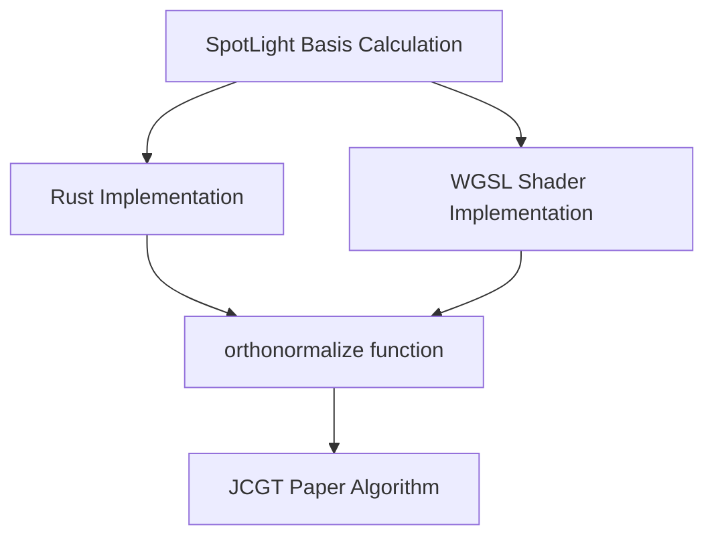

+++
title = "#20272 Fix spotlight basis"
date = "2025-07-27T00:00:00"
draft = false
template = "pull_request_page.html"
in_search_index = true

[taxonomies]
list_display = ["show"]

[extra]
current_language = "en"
available_languages = {"en" = { name = "English", url = "/pull_request/bevy/2025-07/pr-20272-en-20250727" }, "zh-cn" = { name = "中文", url = "/pull_request/bevy/2025-07/pr-20272-zh-cn-20250727" }}
labels = ["C-Bug", "A-Rendering", "C-Code-Quality", "P-Regression", "D-Shaders", "M-Deliberate-Rendering-Change"]
+++

# Analysis: PR #20272 - Fix Spotlight Basis

## Basic Information
- **Title**: Fix spotlight basis
- **PR Link**: https://github.com/bevyengine/bevy/pull/20272
- **Author**: atlv24
- **Status**: MERGED
- **Labels**: C-Bug, A-Rendering, C-Code-Quality, S-Ready-For-Final-Review, P-Regression, D-Shaders, M-Deliberate-Rendering-Change
- **Created**: 2025-07-24T14:42:33Z
- **Merged**: 2025-07-25T12:05:19Z
- **Merged By**: superdump

## Description
# Objective

- Fix a visual regression introduced by #20191 where there's a slight green line in lighting example between cube and plane

bestRanar:
> I know some minor shadow differences were expected after
> https://github.com/bevyengine/bevy/pull/20191
> But the new green line below the front face of the cube in lighting seems interesting. Is that expected?
> https://pixel-eagle.com/project/b25a040a-a980-4602-b90c-d480ab84076d/run/11500/compare/11494?screenshot=3D+Rendering/lighting.png

## Solution

It turns out, I accidentally unflipped the x and y axis in the basis construction of spotlights to actually match the JCGT paper. This wasn't something I realized at the time, but its just a handedness flip. This means that the handedness flip Aceeri was asking about in #20191 which I just extracted from the orthonormalize implementation was just there to correct for a mistranslation in the original implementation, probably.

So this means we can just yeet it, because two handedness flips means none at all. And indeed, removing the extra flip fixes the regression. So now the code is more straightforward and understandable and it works :D

Most of the diff is updating the comments to reflect this new knowledge.

## Testing

- lighting example

## The Story of This Pull Request

### The Problem and Context
After merging PR #20191, users noticed a visual regression in Bevy's lighting example - a subtle green line appeared between the cube and plane surfaces. This was unexpected since #20191 primarily focused on shadow improvements. The regression was confirmed through visual comparison tools showing the artifact in lighting rendering.

The root cause was traced to how spotlight basis matrices were constructed. PR #20191 had modified the orthonormalization process to better match the JCGT paper's method, but inadvertently introduced a handedness inconsistency. The original implementation contained a handedness flip to compensate for an earlier mistranslation. By "fixing" the implementation to match the paper, we ended up with two opposing handedness flips that canceled each other out. Removing one flip (as done in #20191) left the system with an incorrect single flip.

### The Solution Approach
The solution was straightforward once the double-flip situation was understood. Since two opposing handedness flips effectively cancel each other, removing the remaining explicit flip would maintain correct rendering while simplifying the code. This approach:

1. Eliminates unnecessary matrix operations
2. Aligns both CPU and GPU implementations
3. Reduces code complexity
4. Maintains visual correctness

The key insight was recognizing that the original flip wasn't needed - it only existed to compensate for an earlier implementation error. By removing it entirely, we achieve a cleaner implementation that matches the paper's intended behavior.

### The Implementation
The changes focused on three main areas:

1. **Rust spotlight matrix generation**: Removed the explicit handedness flip in `spot_light_world_from_view`
2. **WGSL shader logic**: Removed the equivalent flip in shadow calculation
3. **Documentation**: Updated comments to reflect the corrected basis construction

The Rust and shader implementations needed to stay perfectly synchronized since they both construct orthonormal bases using the same mathematical approach. The changes ensure both sides use identical right-handed basis construction without additional flips.

### Technical Insights
The orthonormalization process follows the method from ["Building an Orthonormal Basis, Revisited" (JCGT paper)](https://jcgt.org/published/0006/01/01/paper.pdf). The core algorithm efficiently constructs an orthonormal basis from a single vector (typically the forward direction) using branchless operations suitable for GPU execution.

The key realization was that the original Bevy implementation contained two compensating transformations:
1. An unintentional basis flip from early implementation choices
2. An explicit flip added later to correct it

This PR removes both, leaving only the correct basis construction. The solution demonstrates how understanding historical context can reveal opportunities to simplify complex code.

### The Impact
These changes:
1. Fixed the visual regression in the lighting example
2. Simplified spotlight basis calculation by removing unnecessary operations
3. Improved code maintainability by removing special-case handling
4. Enhanced consistency between CPU and GPU implementations
5. Provided clearer documentation of the basis construction process

The fix was verified by testing the lighting example and confirming the green artifact disappeared. The changes also make future modifications to lighting calculations less error-prone by reducing implementation complexity.

## Visual Representation



## Key Files Changed

### 1. `crates/bevy_light/src/spot_light.rs` (+2/-6)
**Purpose:** Remove handedness flip from spotlight matrix generation  
**Key Changes:**
```rust
// Before:
/// Constructs a left-handed orthonormal basis with translation...
/// This is a handedness-inverted version of [`orthonormalize`]...
pub fn spot_light_world_from_view(transform: &GlobalTransform) -> Mat4 {
    let basis = orthonormalize(fwd_dir);
    let mut mat = Mat4::from_mat3(basis);
    // handedness flip
    mat.x_axis = -mat.x_axis;
    mat.w_axis = transform.translation().extend(1.0);
    mat
}

// After:
/// Constructs a right-handed orthonormal basis with translation...
/// This is a version of [`orthonormalize`] which also includes translation.
pub fn spot_light_world_from_view(transform: &GlobalTransform) -> Mat4 {
    let basis = orthonormalize(fwd_dir);
    let mut mat = Mat4::from_mat3(basis);
    mat.w_axis = transform.translation().extend(1.0);
    mat
}
```
The explicit handedness flip (`mat.x_axis = -mat.x_axis`) was removed, and comments updated to reflect the right-handed basis.

### 2. `crates/bevy_pbr/src/render/shadows.wgsl` (+1/-16)
**Purpose:** Remove equivalent handedness flip from shader code  
**Key Changes:**
```wgsl
// Before:
fn spot_light_world_from_view(z_basis: vec3<f32>) -> mat3x3<f32> {
    var basis = orthonormalize(z_basis);
    basis[0] = -basis[0];
    return basis;
}

// After: (Function completely removed)

// Usage in fetch_spot_shadow:
// Before:
let light_inv_rot = spot_light_world_from_view(fwd);

// After:
let light_inv_rot = orthonormalize(fwd);
```
The custom basis function with flip was removed entirely, replaced by direct use of the standard orthonormalize function.

### 3. `crates/bevy_render/src/maths.wgsl` (+2/-0)
**Purpose:** Add comment emphasizing implementation consistency  
**Key Changes:**
```wgsl
// Added comment:
// the construction of the orthonormal basis up and right vectors here needs to precisely match the rust
// implementation in bevy_light/spot_light.rs:spot_light_world_from_view
fn orthonormalize(z_basis: vec3<f32>) -> mat3x3<f32> {
    // ... existing implementation ...
}
```
This comment reinforces the critical need for identical implementations between Rust and WGSL code.

## Further Reading
1. [Building an Orthonormal Basis, Revisited (JCGT Paper)](https://jcgt.org/published/0006/01/01/paper.pdf) - The basis construction algorithm
2. [Original Regression PR #20191](https://github.com/bevyengine/bevy/pull/20191) - Changes that introduced the visual artifact
3. [Visual Comparison of Regression](https://pixel-eagle.com/project/b25a040a-a980-4602-b90c-d480ab84076d/run/11500/compare/11494?screenshot=3D+Rendering/lighting.png) - Shows the green line artifact
4. [Coordinate System Handedness in Computer Graphics](https://en.wikipedia.org/wiki/Right-hand_rule#Coordinates) - Fundamentals of coordinate systems