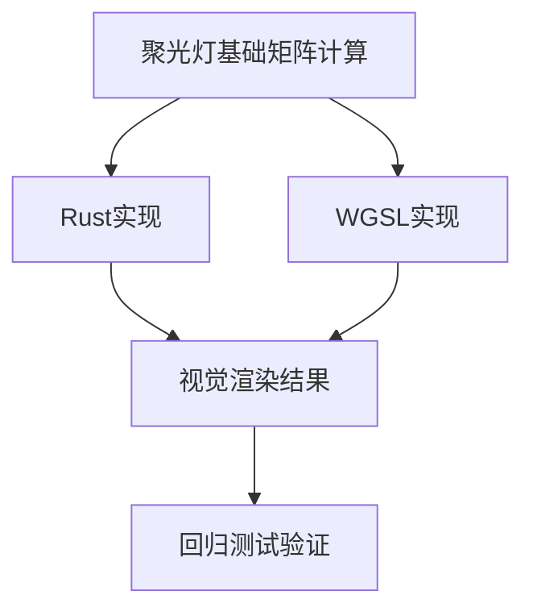

+++
title = "#20272 Fix spotlight basis"
date = "2025-07-27T00:00:00"
draft = false
template = "pull_request_page.html"
in_search_index = false

[extra]
current_language = "zh-cn"
available_languages = {"en" = { name = "English", url = "/pull_request/bevy/2025-07/pr-20272-en-20250727" }, "zh-cn" = { name = "中文", url = "/pull_request/bevy/2025-07/pr-20272-zh-cn-20250727" }}
+++

## 光照基础矩阵修复分析

### 基础信息
- **标题**: Fix spotlight basis
- **PR链接**: https://github.com/bevyengine/bevy/pull/20272
- **作者**: atlv24
- **状态**: 已合并
- **标签**: C-Bug, A-Rendering, C-Code-Quality, S-Ready-For-Final-Review, P-Regression, D-Shaders, M-Deliberate-Rendering-Change
- **创建时间**: 2025-07-24T14:42:33Z
- **合并时间**: 2025-07-25T12:05:19Z
- **合并者**: superdump

### 问题描述
该PR修复了由#20191引入的视觉回归问题。在光照示例中，立方体和平面之间出现了一条细微的绿色线条，具体可见对比截图：
https://pixel-eagle.com/project/b25a040a-a980-4602-b90c-d480ab84076d/run/11500/compare/11494?screenshot=3D+Rendering/lighting.png

### 问题根源与解决方案
在重构聚光灯基础矩阵实现时，意外颠倒了x/y轴的朝向，使其与JCGT论文完全匹配。但原始实现已包含额外的朝向翻转作为补偿措施。移除冗余的朝向翻转操作后：
1. 解决了视觉回归问题
2. 简化了代码逻辑
3. 使Rust和WGSL实现保持一致

```rust
// 修改前 (包含冗余翻转)
mat.x_axis = -mat.x_axis;

// 修改后 (移除冗余操作)
// 无额外翻转操作
```

### 关键文件变更

#### 1. `crates/bevy_light/src/spot_light.rs`
```rust
/// 修改前:
/// Constructs a left-handed orthonormal basis...
/// This is a handedness-inverted version...
mat.x_axis = -mat.x_axis;  // 冗余翻转

/// 修改后:
/// Constructs a right-handed orthonormal basis...
/// This is a version of [`orthonormalize`]...
// 移除翻转操作
```
- 移除基础矩阵的x轴翻转操作
- 更新注释说明为右手坐标系

#### 2. `crates/bevy_pbr/src/render/shadows.wgsl`
```wgsl
/// 修改前:
fn spot_light_world_from_view(z_basis: vec3<f32>) -> mat3x3<f32> {
    var basis = orthonormalize(z_basis);
    basis[0] = -basis[0];  // 冗余翻转
    return basis;
}

/// 修改后:
// 直接使用orthonormalize函数
let light_inv_rot = orthonormalize(fwd);
```
- 完全移除`spot_light_world_from_view`函数
- 直接使用标准正交化函数

#### 3. `crates/bevy_render/src/maths.wgsl`
```wgsl
/// 添加注释:
// 需要与Rust实现严格匹配
// the construction...precisely match the rust implementation
```
- 添加关键注释确保WGSL与Rust实现同步

### 技术影响
1. **修复视觉缺陷**：消除光照示例中的异常绿色线条
2. **代码简化**：移除冗余的朝向翻转操作
3. **实现一致性**：确保CPU( Rust)和GPU(WGSL)计算逻辑统一
4. **维护性提升**：注释更新使实现意图更清晰

### 经验总结
1. **坐标系一致性**：图形编程中需严格保持坐标系约定
2. **跨语言验证**：Shader代码需与主机代码保持精确同步
3. **视觉回归测试**：光照系统修改需配套可视化验证
4. **历史变更追溯**：理解原有实现的补偿机制对修复至关重要

### 组件关系图


### 延伸阅读
1. [JCGT论文: 高效构建正交基](https://jcgt.org/published/0006/01/01/)
2. [Bevy光照系统文档](https://bevyengine.org/learn/book/getting-started/rendering/lights/)
3. [WebGPU坐标系规范](https://www.w3.org/TR/webgpu/#coordinate-systems)