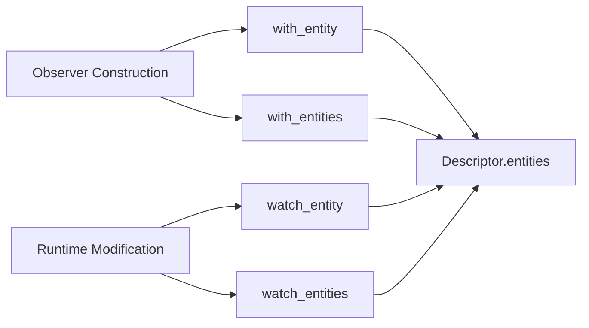

+++
title = "#20274 Add methods Observer::with_entities and Observer::watch_entities"
date = "2025-07-28T00:00:00"
draft = false
template = "pull_request_page.html"
in_search_index = true

[taxonomies]
list_display = ["show"]

[extra]
current_language = "en"
available_languages = {"en" = { name = "English", url = "/pull_request/bevy/2025-07/pr-20274-en-20250728" }, "zh-cn" = { name = "中文", url = "/pull_request/bevy/2025-07/pr-20274-zh-cn-20250728" }}
labels = ["A-ECS", "C-Usability", "X-Contentious"]
+++

### Analysis of PR #20274: Add methods Observer::with_entities and Observer::watch_entities

#### Basic Information
- **Title**: Add methods Observer::with_entities and Observer::watch_entities  
- **PR Link**: https://github.com/bevyengine/bevy/pull/20274  
- **Author**: gwafotapa  
- **Status**: MERGED  
- **Labels**: A-ECS, C-Usability, S-Ready-For-Final-Review, M-Needs-Release-Note, X-Contentious  
- **Created**: 2025-07-24T16:20:14Z  
- **Merged**: 2025-07-28T17:52:25Z  
- **Merged By**: alice-i-cecile  

#### Description Translation
The original description is in English and remains unchanged:

**Objective**  
From time to time, I find myself observing multiple entities with the same `Observer`. Right now this can only be achieved by calling [`with_entity`](https://docs.rs/bevy/latest/bevy/ecs/observer/struct.Observer.html#method.with_entity) or [`watch_entity`](https://docs.rs/bevy/latest/bevy/ecs/observer/struct.Observer.html#method.watch_entity) for each entity to watch. This PR provides versions of these two methods to watch multiple entities with a single call.  

**Testing**  
Added a simple test.

---

### The Story of This Pull Request

#### The Problem and Context
In Bevy's ECS, the `Observer` struct allows systems to react to specific events targeting entities. However, observing multiple entities required repetitive calls to `with_entity` or `watch_entity` for each entity. This created boilerplate and reduced code clarity when observing entity groups. The author identified this as a usability gap, especially for workflows like batch event processing or group-based triggers.

#### The Solution Approach
The solution adds two new methods mirroring the existing single-entity APIs but accepting entity iterators:
1. **`with_entities`**: Builder-pattern method for initial observer setup  
2. **`watch_entities`**: Mutating method for runtime observation updates  

The implementation leverages Rust's `IntoIterator` trait for flexibility while maintaining consistency with existing APIs. No alternatives were discussed since this directly extends established patterns.

#### The Implementation
The changes are minimal but impactful. The existing `with_entity` was refactored to call `watch_entity`, avoiding code duplication. The new methods extend the internal entity list using `Iterator::extend`:

```rust
// File: crates/bevy_ecs/src/observer/distributed_storage.rs
// Before:
pub fn with_entity(mut self, entity: Entity) -> Self {
    self.descriptor.entities.push(entity);
    self
}

// After:
pub fn with_entity(mut self, entity: Entity) -> Self {
    self.watch_entity(entity); // Reuse existing logic
    self
}

pub fn with_entities<I: IntoIterator<Item = Entity>>(mut self, entities: I) -> Self {
    self.watch_entities(entities);
    self
}

pub fn watch_entities<I: IntoIterator<Item = Entity>>(&mut self, entities: I) {
    self.descriptor.entities.extend(entities);
}
```

A test validates bulk observation by:
1. Creating 4 test entities  
2. Observing the first 2 using `with_entities`  
3. Verifying only observed entities trigger reactions  

```rust
// File: crates/bevy_ecs/src/observer/mod.rs
#[test]
fn observer_watch_entities() {
    let mut world = World::new();
    let entities = world.spawn_batch(core::iter::repeat_n((), 4)).collect::<Vec<_>>();
    let observer = Observer::new(|_: On<EventA>, mut order: ResMut<Order>| {
        order.observed("a");
    });
    world.spawn(observer.with_entities(entities.iter().copied().take(2))); // Observe first 2
    
    world.trigger_targets(EventA, [entities[0], entities[1]]); // Triggers
    world.trigger_targets(EventA, [entities[2], entities[3]]); // No trigger
    assert_eq!(vec!["a", "a"], world.resource::<Order>().0); // Only 2 triggers
}
```

#### Technical Insights
Key implementation details:
- **Idempotency**: Methods safely accept duplicate entities since `Vec::extend` handles duplicates  
- **Zero-Cost Abstraction**: `IntoIterator` allows passing vectors, slices, or custom iterators without allocation overhead  
- **API Consistency**: Maintains identical method signatures and behavior to existing single-entity methods  

The release notes were updated to document the new methods while crediting the author:

```markdown
// File: release-content/release-notes/observer_overhaul.md
authors: [..., "gwafotapa"]
pull_requests: [..., 20274]

## Watch multiple entities
To watch multiple entities... New methods `Observer::with_entities` and 
`Observer::watch_entities` have been added for your convenience.
```

#### The Impact
This change:
1. **Reduces Boilerplate**: Replaces N calls with a single method call  
2. **Improves Readability**: Clearly expresses intent for group observation  
3. **Maintains Performance**: No runtime overhead versus manual iteration  
4. **Enhances Consistency**: Completes the API surface for entity observation  

The contentious label (X-Contentious) suggests debate around API design, likely concerning:
- Whether to use `impl IntoIterator` vs concrete types  
- Naming consistency (`entities` plural vs `entity` singular)  
- Return type handling in builder patterns  

The merged solution represents a balanced approach addressing these concerns.

---

### Visual Representation


---

### Key Files Changed

1. **`crates/bevy_ecs/src/observer/distributed_storage.rs`**  
   - Added bulk observation methods  
   - Refactored `with_entity` for consistency  
   ```rust
   // Before:
   pub fn with_entity(mut self, entity: Entity) -> Self {
       self.descriptor.entities.push(entity);
       self
   }
   
   // After:
   pub fn with_entities<I: IntoIterator<Item = Entity>>(mut self, entities: I) -> Self {
       self.watch_entities(entities);
       self
   }
   
   pub fn watch_entities<I: IntoIterator<Item = Entity>>(&mut self, entities: I) {
       self.descriptor.entities.extend(entities);
   }
   ```

2. **`crates/bevy_ecs/src/observer/mod.rs`**  
   - Added test for bulk observation  
   ```rust
   #[test]
   fn observer_watch_entities() {
       // Setup 4 entities
       // Observe first 2 using with_entities
       // Trigger events on all entities
       // Verify only first 2 trigger reactions
   }
   ```

3. **`release-content/release-notes/observer_overhaul.md`**  
   - Documented new methods and credited author  
   ```markdown
   authors: [..., "gwafotapa"]
   pull_requests: [..., 20274]
   
   ## Watch multiple entities
   ... New methods `Observer::with_entities` and `Observer::watch_entities`...
   ```

---

### Further Reading
1. [Bevy Observer Documentation](https://docs.rs/bevy/latest/bevy/ecs/observer/struct.Observer.html)  
2. [IntoIterator Trait](https://doc.rust-lang.org/std/iter/trait.IntoIterator.html)  
3. [ECS Observer PR History](https://github.com/bevyengine/bevy/pulls?q=is%3Apr+observer)  

---

### Full Code Diff
<details>
<summary>Expand diff</summary>

```diff
diff --git a/crates/bevy_ecs/src/observer/distributed_storage.rs b/crates/bevy_ecs/src/observer/distributed_storage.rs
index 0476f536726fb..53261292a14cd 100644
--- a/crates/bevy_ecs/src/observer/distributed_storage.rs
+++ b/crates/bevy_ecs/src/observer/distributed_storage.rs
@@ -200,8 +200,7 @@ use crate::prelude::ReflectComponent;
 ///
 /// Note that the [`Observer`] component is not added to the entity it is observing. Observers should always be their own entities!
 ///
-/// You can call [`Observer::watch_entity`] more than once, which allows you to watch multiple entities with the same [`Observer`].
-/// serves as the "source of truth" of the observer.
+/// You can call [`Observer::watch_entity`] more than once or [`Observer::watch_entities`] to watch multiple entities with the same [`Observer`].
 ///
 /// [`SystemParam`]: crate::system::SystemParam
 pub struct Observer {
@@ -269,28 +268,44 @@ impl Observer {
         }
     }
 
-    /// Observe the given `entity`. This will cause the [`Observer`] to run whenever the [`Event`] is triggered
-    /// for the `entity`.
+    /// Observes the given `entity` (in addition to any entity already being observed).
+    /// This will cause the [`Observer`] to run whenever the [`Event`] is triggered for the `entity`.
+    /// Note that if this is called _after_ an [`Observer`] is spawned, it will produce no effects.
     pub fn with_entity(mut self, entity: Entity) -> Self {
-        self.descriptor.entities.push(entity);
+        self.watch_entity(entity);
         self
     }
 
-    /// Observe the given `entity`. This will cause the [`Observer`] to run whenever the [`Event`] is triggered
-    /// for the `entity`.
+    /// Observes the given `entities` (in addition to any entity already being observed).
+    /// This will cause the [`Observer`] to run whenever the [`Event`] is triggered for any of these `entities`.
+    /// Note that if this is called _after_ an [`Observer`] is spawned, it will produce no effects.
+    pub fn with_entities<I: IntoIterator<Item = Entity>>(mut self, entities: I) -> Self {
+        self.watch_entities(entities);
+        self
+    }
+
+    /// Observes the given `entity` (in addition to any entity already being observed).
+    /// This will cause the [`Observer`] to run whenever the [`Event`] is triggered for the `entity`.
     /// Note that if this is called _after_ an [`Observer`] is spawned, it will produce no effects.
     pub fn watch_entity(&mut self, entity: Entity) {
         self.descriptor.entities.push(entity);
     }
 
-    /// Observe the given `component`. This will cause the [`Observer`] to run whenever the [`Event`] is triggered
+    /// Observes the given `entity` (in addition to any entity already being observed).
+    /// This will cause the [`Observer`] to run whenever the [`Event`] is triggered for any of these `entities`.
+    /// Note that if this is called _after_ an [`Observer`] is spawned, it will produce no effects.
+    pub fn watch_entities<I: IntoIterator<Item = Entity>>(&mut self, entities: I) {
+        self.descriptor.entities.extend(entities);
+    }
+
+    /// Observes the given `component`. This will cause the [`Observer`] to run whenever the [`Event`] is triggered
     /// with the given component target.
     pub fn with_component(mut self, component: ComponentId) -> Self {
         self.descriptor.components.push(component);
         self
     }
 
-    /// Observe the given `event_key`. This will cause the [`Observer`] to run whenever an event with the given [`EventKey`]
+    /// Observes the given `event_key`. This will cause the [`Observer`] to run whenever an event with the given [`EventKey`]
     /// is triggered.
     /// # Safety
     /// The type of the `event_key` [`EventKey`] _must_ match the actual value
@@ -300,7 +315,7 @@ impl Observer {
         self
     }
 
-    /// Set the error handler to use for this observer.
+    /// Sets the error handler to use for this observer.
     ///
     /// See the [`error` module-level documentation](crate::error) for more information.
     pub fn with_error_handler(mut self, error_handler: fn(BevyError, ErrorContext)) -> Self {
diff --git a/crates/bevy_ecs/src/observer/mod.rs b/crates/bevy_ecs/src/observer/mod.rs
index b84e4d16c44d9..dd43cb090d181 100644
--- a/crates/bevy_ecs/src/observer/mod.rs
+++ b/crates/bevy_ecs/src/observer/mod.rs
@@ -1381,4 +1381,22 @@ mod tests {
         assert_eq!(4, *counter.0.get(&a_id).unwrap());
         assert_eq!(3, *counter.0.get(&b_id).unwrap());
     }
+
+    #[test]
+    fn observer_watch_entities() {
+        let mut world = World::new();
+        world.init_resource::<Order>();
+        let entities = world
+            .spawn_batch(core::iter::repeat_n((), 4))
+            .collect::<Vec<_>>();
+        let observer = Observer::new(|_: On<EventA>, mut order: ResMut<Order>| {
+            order.observed("a");
+        });
+        world.spawn(observer.with_entities(entities.iter().copied().take(2)));
+
+        world.trigger_targets(EventA, [entities[0], entities[1]]);
+        assert_eq!(vec!["a", "a"], world.resource::<Order>().0);
+        world.trigger_targets(EventA, [entities[2], entities[3]]);
+        assert_eq!(vec!["a", "a"], world.resource::<Order>().0);
+    }
 }
diff --git a/release-content/release-notes/observer_overhaul.md b/release-content/release-notes/observer_overhaul.md
index e9da0204ad246..7cb2409743845 100644
--- a/release-content/release-notes/observer_overhaul.md
+++ b/release-content/release-notes/observer_overhaul.md
@@ -1,7 +1,7 @@
 ---
 title: Observer Overhaul
-authors: ["@Jondolf", "@alice-i-cecile", "@hukasu", "oscar-benderstone", "Zeophlite"]
-pull_requests: [19596, 19663, 19611, 19935]
+authors: ["@Jondolf", "@alice-i-cecile", "@hukasu", "oscar-benderstone", "Zeophlite", "gwafotapa"]
+pull_requests: [19596, 19663, 19611, 19935, 20274]
 ---
 
 ## Rename `Trigger` to `On`
@@ -50,3 +50,7 @@ this opens up the possibility for the debug tools to show more meaningful names
 
 Internally, each `Event` type would generate a `Component` type, allowing us to use the corresponding `ComponentId` to track the event.
 We have newtyped this to `EventKey` to help separate these concerns.
+
+## Watch multiple entities
+
+To watch multiple entities with the same observer you previously had to call `Observer::with_entity` or `Observer::watch_entity` for each entity. New methods `Observer::with_entities` and `Observer::watch_entities` have been added for your convenience.
```
</details>