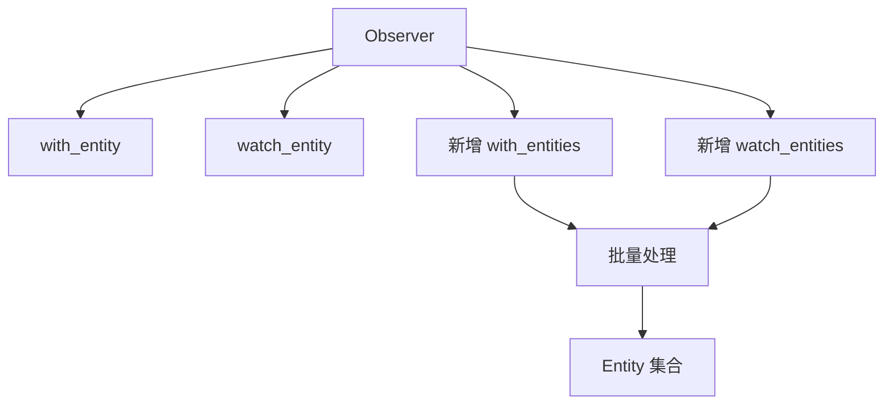

+++
title = "#20274 Add methods Observer::with_entities and Observer::watch_entities"
date = "2025-07-28T00:00:00"
draft = false
template = "pull_request_page.html"
in_search_index = false

[extra]
current_language = "zh-cn"
available_languages = {"en" = { name = "English", url = "/pull_request/bevy/2025-07/pr-20274-en-20250728" }, "zh-cn" = { name = "中文", url = "/pull_request/bevy/2025-07/pr-20274-zh-cn-20250728" }}
+++

### 报告：为 Observer 添加多实体观察方法

## 基础信息
- **标题**: Add methods Observer::with_entities and Observer::watch_entities
- **PR链接**: https://github.com/bevyengine/bevy/pull/20274
- **作者**: gwafotapa
- **状态**: 已合并
- **标签**: A-ECS, C-Usability, S-Ready-For-Final-Review, M-Needs-Release-Note, X-Contentious
- **创建时间**: 2025-07-24T16:20:14Z
- **合并时间**: 2025-07-28T17:52:25Z
- **合并人**: alice-i-cecile

## 描述翻译
### 目标
有时我需要用同一个 `Observer` 观察多个实体。目前只能通过多次调用 [`with_entity`](https://docs.rs/bevy/latest/bevy/ecs/observer/struct.Observer.html#method.with_entity) 或 [`watch_entity`](https://docs.rs/bevy/latest/bevy/ecs/observer/struct.Observer.html#method.watch_entity) 实现。本 PR 提供单次调用即可观察多个实体的方法版本。

### 测试
添加了简单测试。

## PR 技术分析

### 问题背景
在 Bevy ECS 的 Observer 系统中，开发者需要观察多个实体时，必须为每个实体单独调用 `with_entity` 或 `watch_entity` 方法。例如观察 10 个实体需要 10 次方法调用：
```rust
observer
    .with_entity(entity1)
    .with_entity(entity2)
    // ...重复 8 次
    .with_entity(entity10);
```
这种模式在观察实体数量较多时会导致：
1. 代码冗余且难以维护
2. 潜在的性能开销（多次方法调用和迭代）
3. API 使用不够符合人体工学

### 解决方案
通过添加两个新方法优化批量操作：
1. `with_entities(Iterable<Entity>)`：构造时批量添加实体
2. `watch_entities(Iterable<Entity>)`：运行时动态添加实体

关键设计决策：
- 保持与现有单实体方法相同的函数签名模式
- 复用 `IntoIterator` 接口保证灵活性
- 维持原有错误处理机制不变

### 实现细节
核心改动在 `Observer` 结构体的方法扩展。新增方法直接复用现有存储结构 `descriptor.entities`，通过迭代器批量添加实体：

```rust
// 构造时批量添加
pub fn with_entities<I: IntoIterator<Item = Entity>>(mut self, entities: I) -> Self {
    self.watch_entities(entities);
    self
}

// 运行时批量添加
pub fn watch_entities<I: IntoIterator<Item = Entity>>(&mut self, entities: I) {
    self.descriptor.entities.extend(entities);
}
```
方法行为说明：
1. 与单实体版本完全正交
2. 支持任意实现 `IntoIterator<Item=Entity>` 的类型
3. 维持原有"生成后修改无效"的约束

### 测试验证
添加的单元测试验证了基础功能：
```rust
#[test]
fn observer_watch_entities() {
    let mut world = World::new();
    let entities = world.spawn_batch(core::iter::repeat_n((), 4)).collect::<Vec<_>>();
    let observer = Observer::new(|_: On<EventA>, mut order: ResMut<Order>| {
        order.observed("a");
    });
    
    // 关键测试点：批量添加前两个实体
    world.spawn(observer.with_entities(entities.iter().copied().take(2)));

    world.trigger_targets(EventA, [entities[0], entities[1]]);
    assert_eq!(vec!["a", "a"], world.resource::<Order>().0);
    
    // 验证未观察的实体不会触发
    world.trigger_targets(EventA, [entities[2], entities[3]]);
    assert_eq!(vec!["a", "a"], world.resource::<Order>().0);
}
```
测试覆盖了：
- 批量注册实体
- 触发正确性验证
- 边界检查（未注册实体不触发）

### 影响分析
1. **API 改进**：减少观察 N 个实体的代码量从 O(N) 到 O(1)
2. **性能优化**：减少方法调用开销，利用 `extend` 的批量操作优势
3. **兼容性**：完全向后兼容，不影响现有单实体方法
4. **文档更新**：同步修改注释和 release notes

潜在注意事项：
- 方法调用时机约束（生成 Observer 实体前有效）保持不变
- 迭代器参数可能带来隐式性能开销（需注意大集合的迭代效率）

## 组件关系图



## 关键文件变更

### 1. `crates/bevy_ecs/src/observer/distributed_storage.rs`
**变更原因**：实现批量观察方法的核心逻辑

```rust
// 修改前：
pub fn with_entity(mut self, entity: Entity) -> Self {
    self.descriptor.entities.push(entity);
    self
}

// 修改后：
pub fn with_entities<I: IntoIterator<Item = Entity>>(mut self, entities: I) -> Self {
    self.watch_entities(entities);
    self
}

pub fn watch_entities<I: IntoIterator<Item = Entity>>(&mut self, entities: I) {
    self.descriptor.entities.extend(entities);
}
```
同时更新文档注释：
```diff
- /// You can call [`Observer::watch_entity`] more than once...
+ /// You can call [`Observer::watch_entity`] more than once or [`Observer::watch_entities`]...
```

### 2. `crates/bevy_ecs/src/observer/mod.rs`
**变更原因**：添加单元测试验证功能

```rust
#[test]
fn observer_watch_entities() {
    // 创建测试环境
    let mut world = World::new();
    world.init_resource::<Order>();
    
    // 生成4个测试实体
    let entities = world.spawn_batch(core::iter::repeat_n((), 4)).collect::<Vec<_>>();
    
    // 创建观察者并批量观察前两个实体
    let observer = Observer::new(|_: On<EventA>, mut order: ResMut<Order>| {
        order.observed("a");
    });
    world.spawn(observer.with_entities(entities.iter().copied().take(2)));
    
    // 验证触发逻辑
    world.trigger_targets(EventA, [entities[0], entities[1]]);
    assert_eq!(vec!["a", "a"], world.resource::<Order>().0);
    
    // 验证未观察实体不触发
    world.trigger_targets(EventA, [entities[2], entities[3]]);
    assert_eq!(vec!["a", "a"], world.resource::<Order>().0);
}
```

### 3. `release-content/release-notes/observer_overhaul.md`
**变更原因**：在发布说明中记录API变更

```diff
 authors: [
-   "@Jondolf", "@alice-i-cecile", "@hukasu", "oscar-benderstone", "Zeophlite"
+   "@Jondolf", "@alice-i-cecile", "@hukasu", "oscar-benderstone", "Zeophlite", "gwafotapa"
 ],
 pull_requests: [
-   19596, 19663, 19611, 19935
+   19596, 19663, 19611, 19935, 20274
 ]

@@ -50,3 +50,7 @@ We have newtyped this to `EventKey` to help separate these concerns.
 Internally, each `Event` type would generate a `Component` type...
 We have newtyped this to `EventKey` to help separate these concerns.
+
+## Watch multiple entities
+
+To watch multiple entities... New methods `Observer::with_entities` and `Observer::watch_entities` have been added...
```

## 延伸阅读
1. [Bevy Observer 官方文档](https://docs.rs/bevy/latest/bevy/ecs/observer/struct.Observer.html)
2. [Rust 迭代器最佳实践](https://doc.rust-lang.org/std/iter/trait.IntoIterator.html)
3. [ECS 观察者模式设计](https://github.com/SanderMertens/ecs-faq#observer-pattern)