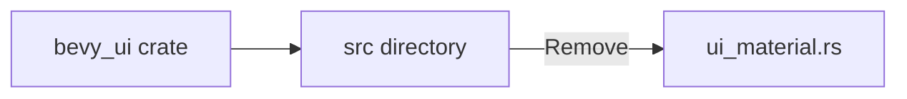

+++
title = "#20278 Delete `ui_material.rs`"
date = "2025-07-27T00:00:00"
draft = false
template = "pull_request_page.html"
in_search_index = true

[taxonomies]
list_display = ["show"]

[extra]
current_language = "en"
available_languages = {"en" = { name = "English", url = "/pull_request/bevy/2025-07/pr-20278-en-20250727" }, "zh-cn" = { name = "中文", url = "/pull_request/bevy/2025-07/pr-20278-zh-cn-20250727" }}
labels = ["D-Trivial", "A-UI"]
+++

# Delete `ui_material.rs`

## Basic Information
- **Title**: Delete `ui_material.rs`
- **PR Link**: https://github.com/bevyengine/bevy/pull/20278
- **Author**: ickshonpe
- **Status**: MERGED
- **Labels**: D-Trivial, A-UI, S-Ready-For-Final-Review
- **Created**: 2025-07-24T23:44:15Z
- **Merged**: 2025-07-27T20:11:47Z
- **Merged By**: alice-i-cecile

## Description Translation
# Objective

Remove `ui_material.rs` from the `bevy_ui` crate. The `mod` declaration was removed and the module was moved to the `bevy_ui_render` crate, but the original file wasn't deleted.

## The Story of This Pull Request

This PR addresses a straightforward cleanup task in the Bevy UI system. The core issue was that during a previous code reorganization, the `ui_material` module had been moved from `bevy_ui` to `bevy_ui_render`, but the original source file (`ui_material.rs`) wasn't deleted from its original location. This left dead code in the codebase that could cause confusion for developers and unnecessary bloat.

The solution was simple: delete the obsolete file. Since the module had already been relocated to `bevy_ui_render` and all references to it updated in previous PRs, this file served no purpose. Removing it cleans up the codebase and prevents potential confusion from having duplicate module declarations.

From an implementation perspective, this change required no complex modifications. The file deletion was the only operation needed. The cleanup aligns with standard code maintenance practices where obsolete files should be removed to keep the project structure clean and maintainable.

The impact is minimal but positive: the codebase now accurately reflects the actual module structure, reducing cognitive load for developers working in this area. There are no functional changes or performance implications, as this was purely a file system cleanup operation.

## Visual Representation



## Key Files Changed

### `crates/bevy_ui/src/ui_material.rs` (+0/-182)
This file was entirely removed since its contents had been migrated to the `bevy_ui_render` crate in a previous reorganization. The file contained the `UiMaterial` trait implementation and related components for custom UI materials, which are no longer part of the `bevy_ui` crate's responsibilities.

**File contents before deletion:**
```rust
use crate::Node;
use bevy_asset::{Asset, AssetId, Handle};
use bevy_derive::{Deref, DerefMut};
use bevy_ecs::{component::Component, reflect::ReflectComponent};
use bevy_reflect::{prelude::ReflectDefault, Reflect};
use bevy_render::{
    extract_component::ExtractComponent,
    render_resource::{AsBindGroup, RenderPipelineDescriptor, ShaderRef},
};
use core::hash::Hash;
use derive_more::derive::From;

/// Materials are used alongside [`UiMaterialPlugin`](crate::UiMaterialPlugin) and [`MaterialNode`]
/// to spawn entities that are rendered with a specific [`UiMaterial`] type. They serve as an easy to use high level
/// way to render `Node` entities with custom shader logic.
///
/// `UiMaterials` must implement [`AsBindGroup`] to define how data will be transferred to the GPU and bound in shaders.
/// [`AsBindGroup`] can be derived, which makes generating bindings straightforward. See the [`AsBindGroup`] docs for details.
///
/// Materials must also implement [`Asset`] so they can be treated as such.
///
/// If you are only using the fragment shader, make sure your shader imports the `UiVertexOutput`
/// from `bevy_ui::ui_vertex_output` and uses it as the input of your fragment shader like the
/// example below does.
///
/// # Example
///
/// Here is a simple [`UiMaterial`] implementation. The [`AsBindGroup`] derive has many features. To see what else is available,
/// check out the [`AsBindGroup`] documentation.
/// ```
/// # use bevy_ui::prelude::*;
/// # use bevy_ecs::prelude::*;
/// # use bevy_image::Image;
/// # use bevy_reflect::TypePath;
/// # use bevy_render::render_resource::{AsBindGroup, ShaderRef};
/// # use bevy_color::LinearRgba;
/// # use bevy_asset::{Handle, AssetServer, Assets, Asset};
///
/// #[derive(AsBindGroup, Asset, TypePath, Debug, Clone)]
/// pub struct CustomMaterial {
///     // Uniform bindings must implement `ShaderType`, which will be used to convert the value to
///     // its shader-compatible equivalent. Most core math types already implement `ShaderType`.
///     #[uniform(0)]
///     color: LinearRgba,
///     // Images can be bound as textures in shaders. If the Image's sampler is also needed, just
///     // add the sampler attribute with a different binding index.
///     #[texture(1)]
///     #[sampler(2)]
///     color_texture: Handle<Image>,
/// }
///
/// // All functions on `UiMaterial` have default impls. You only need to implement the
/// // functions that are relevant for your material.
/// impl UiMaterial for CustomMaterial {
///     fn fragment_shader() -> ShaderRef {
///         "shaders/custom_material.wgsl".into()
///     }
/// }
///
/// // Spawn an entity using `CustomMaterial`.
/// fn setup(mut commands: Commands, mut materials: ResMut<Assets<CustomMaterial>>, asset_server: Res<AssetServer>) {
///     commands.spawn((
///         MaterialNode(materials.add(CustomMaterial {
///             color: LinearRgba::RED,
///             color_texture: asset_server.load("some_image.png"),
///         })),
///         Node {
///             width: Val::Percent(100.0),
///             ..Default::default()
///         },
///     ));
/// }
/// ```
/// In WGSL shaders, the material's binding would look like this:
///
/// If you only use the fragment shader make sure to import `UiVertexOutput` from
/// `bevy_ui::ui_vertex_output` in your wgsl shader.
/// Also note that bind group 0 is always bound to the [`View Uniform`](bevy_render::view::ViewUniform)
/// and the [`Globals Uniform`](bevy_render::globals::GlobalsUniform).
///
/// ```wgsl
/// #import bevy_ui::ui_vertex_output UiVertexOutput
///
/// struct CustomMaterial {
///     color: vec4<f32>,
/// }
///
/// @group(1) @binding(0)
/// var<uniform> material: CustomMaterial;
/// @group(1) @binding(1)
/// var color_texture: texture_2d<f32>;
/// @group(1) @binding(2)
/// var color_sampler: sampler;
///
/// @fragment
/// fn fragment(in: UiVertexOutput) -> @location(0) vec4<f32> {
///
/// }
/// ```
pub trait UiMaterial: AsBindGroup + Asset + Clone + Sized {
    /// Returns this materials vertex shader. If [`ShaderRef::Default`] is returned, the default UI
    /// vertex shader will be used.
    fn vertex_shader() -> ShaderRef {
        ShaderRef::Default
    }

    /// Returns this materials fragment shader. If [`ShaderRef::Default`] is returned, the default
    /// UI fragment shader will be used.
    fn fragment_shader() -> ShaderRef {
        ShaderRef::Default
    }

    #[expect(
        unused_variables,
        reason = "The parameters here are intentionally unused by the default implementation; however, putting underscores here will result in the underscores being copied by rust-analyzer's tab completion."
    )]
    #[inline]
    fn specialize(descriptor: &mut RenderPipelineDescriptor, key: UiMaterialKey<Self>) {}
}

pub struct UiMaterialKey<M: UiMaterial> {
    pub hdr: bool,
    pub bind_group_data: M::Data,
}

impl<M: UiMaterial> Eq for UiMaterialKey<M> where M::Data: PartialEq {}

impl<M: UiMaterial> PartialEq for UiMaterialKey<M>
where
    M::Data: PartialEq,
{
    fn eq(&self, other: &Self) -> bool {
        self.hdr == other.hdr && self.bind_group_data == other.bind_group_data
    }
}

impl<M: UiMaterial> Clone for UiMaterialKey<M>
where
    M::Data: Clone,
{
    fn clone(&self) -> Self {
        Self {
            hdr: self.hdr,
            bind_group_data: self.bind_group_data,
        }
    }
}

impl<M: UiMaterial> core::hash::Hash for UiMaterialKey<M>
where
    M::Data: Hash,
{
    fn hash<H: core::hash::Hasher>(&self, state: &mut H) {
        self.hdr.hash(state);
        self.bind_group_data.hash(state);
    }
}

#[derive(
    Component, Clone, Debug, Deref, DerefMut, Reflect, PartialEq, Eq, ExtractComponent, From,
)]
#[reflect(Component, Default)]
#[require(Node)]
pub struct MaterialNode<M: UiMaterial>(pub Handle<M>);

impl<M: UiMaterial> Default for MaterialNode<M> {
    fn default() -> Self {
        Self(Handle::default())
    }
}

impl<M: UiMaterial> From<MaterialNode<M>> for AssetId<M> {
    fn from(material: MaterialNode<M>) -> Self {
        material.id()
    }
}

impl<M: UiMaterial> From<&MaterialNode<M>> for AssetId<M> {
    fn from(material: &MaterialNode<M>) -> Self {
        material.id()
    }
}
```

**After deletion:**  
The file no longer exists in the `bevy_ui/src` directory.

## Further Reading
1. [Bevy Engine GitHub Repository](https://github.com/bevyengine/bevy)
2. [Bevy UI Documentation](https://docs.rs/bevy_ui/latest/bevy_ui/)
3. [Rust Modules Reference](https://doc.rust-lang.org/book/ch07-02-defining-modules-to-control-scope-and-privacy.html)

## Full Code Diff
```diff
diff --git a/crates/bevy_ui/src/ui_material.rs b/crates/bevy_ui/src/ui_material.rs
deleted file mode 100644
index b4a7e9a6b6416..0000000000000
--- a/crates/bevy_ui/src/ui_material.rs
+++ /dev/null
@@ -1,182 +0,0 @@
-use crate::Node;
-use bevy_asset::{Asset, AssetId, Handle};
-use bevy_derive::{Deref, DerefMut};
-use bevy_ecs::{component::Component, reflect::ReflectComponent};
-use bevy_reflect::{prelude::ReflectDefault, Reflect};
-use bevy_render::{
-    extract_component::ExtractComponent,
-    render_resource::{AsBindGroup, RenderPipelineDescriptor, ShaderRef},
-};
-use core::hash::Hash;
-use derive_more::derive::From;
-
-/// Materials are used alongside [`UiMaterialPlugin`](crate::UiMaterialPlugin) and [`MaterialNode`]
-/// to spawn entities that are rendered with a specific [`UiMaterial`] type. They serve as an easy to use high level
-/// way to render `Node` entities with custom shader logic.
-///
-/// `UiMaterials` must implement [`AsBindGroup`] to define how data will be transferred to the GPU and bound in shaders.
-/// [`AsBindGroup`] can be derived, which makes generating bindings straightforward. See the [`AsBindGroup`] docs for details.
-///
-/// Materials must also implement [`Asset`] so they can be treated as such.
-///
-/// If you are only using the fragment shader, make sure your shader imports the `UiVertexOutput`
-/// from `bevy_ui::ui_vertex_output` and uses it as the input of your fragment shader like the
-/// example below does.
-///
-/// # Example
-///
-/// Here is a simple [`UiMaterial`] implementation. The [`AsBindGroup`] derive has many features. To see what else is available,
-/// check out the [`AsBindGroup`] documentation.
-/// ```
-/// # use bevy_ui::prelude::*;
-/// # use bevy_ecs::prelude::*;
-/// # use bevy_image::Image;
-/// # use bevy_reflect::TypePath;
-/// # use bevy_render::render_resource::{AsBindGroup, ShaderRef};
-/// # use bevy_color::LinearRgba;
-/// # use bevy_asset::{Handle, AssetServer, Assets, Asset};
-///
-/// #[derive(AsBindGroup, Asset, TypePath, Debug, Clone)]
-/// pub struct CustomMaterial {
-///     // Uniform bindings must implement `ShaderType`, which will be used to convert the value to
-///     // its shader-compatible equivalent. Most core math types already implement `ShaderType`.
-///     #[uniform(0)]
-///     color: LinearRgba,
-///     // Images can be bound as textures in shaders. If the Image's sampler is also needed, just
-///     // add the sampler attribute with a different binding index.
-///     #[texture(1)]
-///     #[sampler(2)]
-///     color_texture: Handle<Image>,
-/// }
-///
-/// // All functions on `UiMaterial` have default impls. You only need to implement the
-/// // functions that are relevant for your material.
-/// impl UiMaterial for CustomMaterial {
-///     fn fragment_shader() -> ShaderRef {
-///         "shaders/custom_material.wgsl".into()
-///     }
-/// }
-///
-/// // Spawn an entity using `CustomMaterial`.
-/// fn setup(mut commands: Commands, mut materials: ResMut<Assets<CustomMaterial>>, asset_server: Res<AssetServer>) {
-///     commands.spawn((
-///         MaterialNode(materials.add(CustomMaterial {
-///             color: LinearRgba::RED,
-///             color_texture: asset_server.load("some_image.png"),
-///         })),
-///         Node {
-///             width: Val::Percent(100.0),
-///             ..Default::default()
-///         },
-///     ));
-/// }
-/// ```
-/// In WGSL shaders, the material's binding would look like this:
-///
-/// If you only use the fragment shader make sure to import `UiVertexOutput` from
-/// `bevy_ui::ui_vertex_output` in your wgsl shader.
-/// Also note that bind group 0 is always bound to the [`View Uniform`](bevy_render::view::ViewUniform)
-/// and the [`Globals Uniform`](bevy_render::globals::GlobalsUniform).
-///
-/// ```wgsl
-/// #import bevy_ui::ui_vertex_output UiVertexOutput
-///
-/// struct CustomMaterial {
-///     color: vec4<f32>,
-/// }
-///
-/// @group(1) @binding(0)
-/// var<uniform> material: CustomMaterial;
-/// @group(1) @binding(1)
-/// var color_texture: texture_2d<f32>;
-/// @group(1) @binding(2)
-/// var color_sampler: sampler;
-///
-/// @fragment
-/// fn fragment(in: UiVertexOutput) -> @location(0) vec4<f32> {
-///
-/// }
-/// ```
-pub trait UiMaterial: AsBindGroup + Asset + Clone + Sized {
-    /// Returns this materials vertex shader. If [`ShaderRef::Default`] is returned, the default UI
-    /// vertex shader will be used.
-    fn vertex_shader() -> ShaderRef {
-        ShaderRef::Default
-    }
-
-    /// Returns this materials fragment shader. If [`ShaderRef::Default`] is returned, the default
-    /// UI fragment shader will be used.
-    fn fragment_shader() -> ShaderRef {
-        ShaderRef::Default
-    }
-
-    #[expect(
-        unused_variables,
-        reason = "The parameters here are intentionally unused by the default implementation; however, putting underscores here will result in the underscores being copied by rust-analyzer's tab completion."
-    )]
-    #[inline]
-    fn specialize(descriptor: &mut RenderPipelineDescriptor, key: UiMaterialKey<Self>) {}
-}
-
-pub struct UiMaterialKey<M: UiMaterial> {
-    pub hdr: bool,
-    pub bind_group_data: M::Data,
-}
-
-impl<M: UiMaterial> Eq for UiMaterialKey<M> where M::Data: PartialEq {}
-
-impl<M: UiMaterial> PartialEq for UiMaterialKey<M>
-where
-    M::Data: PartialEq,
-{
-    fn eq(&self, other: &Self) -> bool {
-        self.hdr == other.hdr && self.bind_group_data == other.bind_group_data
-    }
-}
-
-impl<M: UiMaterial> Clone for UiMaterialKey<M>
-where
-    M::Data: Clone,
-{
-    fn clone(&self) -> Self {
-        Self {
-            hdr: self.hdr,
-            bind_group_data: self.bind_group_data,
-        }
-    }
-}
-
-impl<M: UiMaterial> core::hash::Hash for UiMaterialKey<M>
-where
-    M::Data: Hash,
-{
-    fn hash<H: core::hash::Hasher>(&self, state: &mut H) {
-        self.hdr.hash(state);
-        self.bind_group_data.hash(state);
-    }
-}
-
-#[derive(
-    Component, Clone, Debug, Deref, DerefMut, Reflect, PartialEq, Eq, ExtractComponent, From,
-)]
-#[reflect(Component, Default)]
-#[require(Node)]
-pub struct MaterialNode<M: UiMaterial>(pub Handle<M>);
-
-impl<M: UiMaterial> Default for MaterialNode<M> {
-    fn default() -> Self {
-        Self(Handle::default())
-    }
-}
-
-impl<M: UiMaterial> From<MaterialNode<M>> for AssetId<M> {
-    fn from(material: MaterialNode<M>) -> Self {
-        material.id()
-    }
-}
-
-impl<M: UiMaterial> From<&MaterialNode<M>> for AssetId<M> {
-    fn from(material: &MaterialNode<M>) -> Self {
-        material.id()
-    }
-}
```