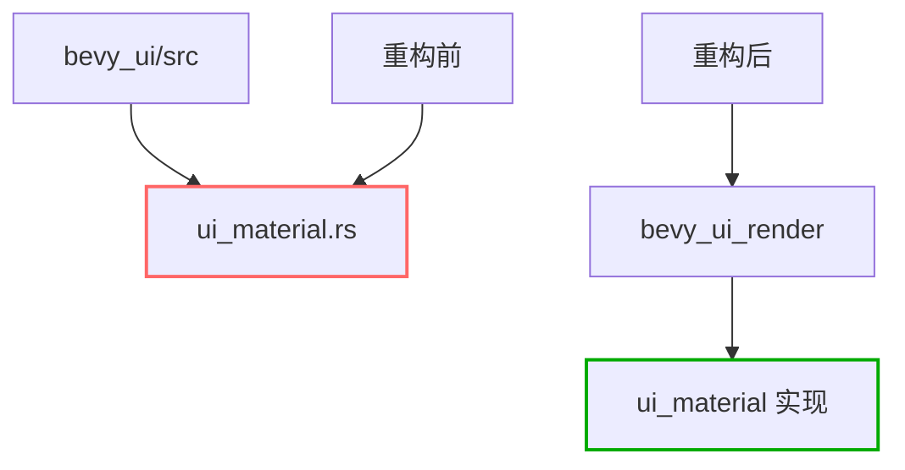

+++
title = "#20278 Delete `ui_material.rs`"
date = "2025-07-27T00:00:00"
draft = false
template = "pull_request_page.html"
in_search_index = false

[extra]
current_language = "zh-cn"
available_languages = {"en" = { name = "English", url = "/pull_request/bevy/2025-07/pr-20278-en-20250727" }, "zh-cn" = { name = "中文", url = "/pull_request/bevy/2025-07/pr-20278-zh-cn-20250727" }}
labels = ["D-Trivial", "A-UI"]
+++

# 删除 `ui_material.rs` 文件

## Basic Information
- **Title**: Delete `ui_material.rs`
- **PR Link**: https://github.com/bevyengine/bevy/pull/20278
- **Author**: ickshonpe
- **Status**: MERGED
- **Labels**: D-Trivial, A-UI, S-Ready-For-Final-Review
- **Created**: 2025-07-24T23:44:15Z
- **Merged**: 2025-07-27T20:11:47Z
- **Merged By**: alice-i-cecile

## Description Translation
# Objective

从 `bevy_ui` crate 中移除 `ui_material.rs`。之前已经移除了模块声明并将模块移至 `bevy_ui_render` crate，但原始文件未被删除。

## The Story of This Pull Request

### 问题背景
在 Bevy 引擎的代码重构过程中，`bevy_ui` crate 的 `ui_material` 模块已被迁移到更合适的 `bevy_ui_render` crate。这个迁移是合理的，因为材质处理逻辑与渲染管线的关联更紧密。然而，迁移完成后，原始文件 `ui_material.rs` 仍保留在 `bevy_ui/src/` 目录下未被删除。这造成了代码冗余，可能导致开发者困惑，因为文件实际已不再属于 `bevy_ui` crate 的功能范畴。

### 解决方案
这个 PR 采取了最直接有效的解决方案：物理删除遗留文件。由于相关代码已完整迁移到新位置，且所有引用都已更新，删除文件不会影响现有功能。这种清理操作符合代码库维护的最佳实践，能保持项目结构清晰。

### 技术影响
删除冗余文件带来以下具体改进：
1. **消除混淆**：开发者不会误以为该文件仍是 `bevy_ui` 的组成部分
2. **减少编译负担**：移除未使用的代码缩短编译时间
3. **保持代码整洁**：符合"死代码不应保留"的原则
4. **简化目录结构**：使 `bevy_ui/src/` 目录更准确地反映实际功能

整个变更完全向后兼容，因为实际功能代码已在新位置正常工作。这种清理操作是开源项目中常见的维护任务，特别在大型重构后。

## Visual Representation



## Key Files Changed

### `crates/bevy_ui/src/ui_material.rs` (+0/-182)
此文件被完全删除。它原本包含 UI 材质系统的核心实现：

```rust
// 文件完整内容已被删除
use crate::Node;
use bevy_asset::{Asset, AssetId, Handle};
use bevy_derive::{Deref, DerefMut};
...

pub trait UiMaterial: AsBindGroup + Asset + Clone + Sized {
    fn vertex_shader() -> ShaderRef {
        ShaderRef::Default
    }

    fn fragment_shader() -> ShaderRef {
        ShaderRef::Default
    }
    
    ...
}

#[derive(
    Component, Clone, Debug, Deref, DerefMut, Reflect, PartialEq, Eq, ExtractComponent, From,
)]
#[reflect(Component, Default)]
#[require(Node)]
pub struct MaterialNode<M: UiMaterial>(pub Handle<M>);
...
```

关键组件包括：
1. `UiMaterial` trait：定义材质行为
2. `MaterialNode` 组件：将材质应用到 UI 节点
3. `UiMaterialKey`：材质特殊化处理

这些实现现已迁移到 `bevy_ui_render` crate，因此原文件可安全删除。

## Further Reading
1. [Bevy 引擎架构文档](https://bevyengine.org/learn/book/introduction/)
2. [Rust 模块系统最佳实践](https://doc.rust-lang.org/book/ch07-02-defining-modules-to-control-scope-and-privacy.html)
3. [代码重构模式](https://refactoring.com/)