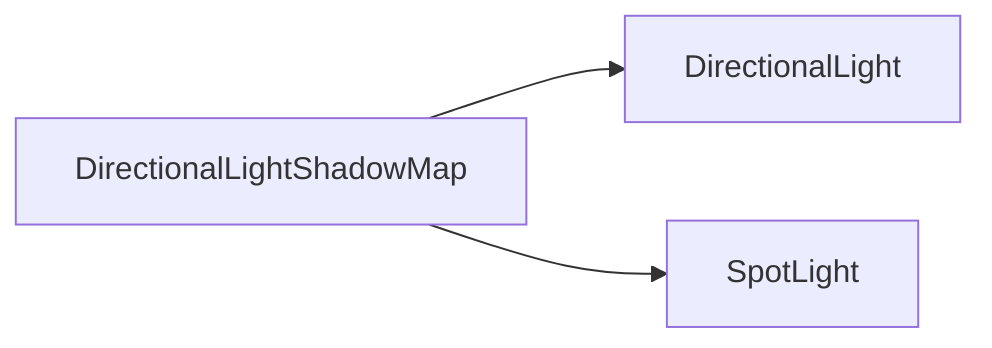

+++
title = "#20282 document Spotlight shadow map sizing"
date = "2025-07-27T00:00:00"
draft = false
template = "pull_request_page.html"
in_search_index = true

[taxonomies]
list_display = ["show"]

[extra]
current_language = "en"
available_languages = {"en" = { name = "English", url = "/pull_request/bevy/2025-07/pr-20282-en-20250727" }, "zh-cn" = { name = "中文", url = "/pull_request/bevy/2025-07/pr-20282-zh-cn-20250727" }}
labels = ["C-Docs", "D-Trivial", "A-Rendering"]
+++

## Technical Report: PR #20282 - document Spotlight shadow map sizing

### Basic Information
- **Title**: document Spotlight shadow map sizing
- **PR Link**: https://github.com/bevyengine/bevy/pull/20282
- **Author**: atlv24
- **Status**: MERGED
- **Labels**: C-Docs, D-Trivial, A-Rendering, S-Ready-For-Final-Review
- **Created**: 2025-07-25T02:16:25Z
- **Merged**: 2025-07-25T12:14:36Z
- **Merged By**: superdump

### Description Translation
This resource controls both, but its not documented. Document it

### The Story of This Pull Request

#### Problem Identification
The Bevy engine's lighting system contained an undocumented behavior where the `DirectionalLightShadowMap` resource controlled shadow map resolution for both directional lights and spotlights. This created a discoverability issue - developers working with spotlights had no clear way to determine how to configure shadow map resolution since the relevant control mechanism was only documented for directional lights. The lack of documentation risked confusion and incorrect usage patterns among users implementing lighting in their Bevy projects.

#### Solution Approach
The solution focused on documentation improvements rather than code changes. The approach included:
1. Updating the `DirectionalLightShadowMap` documentation to explicitly mention its dual-purpose nature
2. Adding documentation to the `SpotLight` component directing users to the correct resource
3. Maintaining existing functionality while improving discoverability
4. Using intra-doc links (`[crate::SpotLight]`) for API documentation consistency

No alternatives were considered since the functionality was correct but undocumented. The implementation strategy prioritized minimal changes with maximum documentation impact.

#### Implementation Details
The changes were implemented through two targeted documentation updates. First, the `DirectionalLightShadowMap` struct's documentation was modified to explicitly state it controls both directional and spotlight shadow resolutions. The key change adds a reference to `SpotLight` with proper intra-doc linking:

```rust
// Before:
/// Controls the resolution of [`DirectionalLight`] shadow maps.

// After:
/// Controls the resolution of [`DirectionalLight`] and [`SpotLight`](crate::SpotLight) shadow maps.
```

Second, the `SpotLight` component received new documentation explaining how to configure its shadow maps:

```rust
// Addition to SpotLight docs:
///
/// To control the resolution of the shadow maps, use the [`crate::DirectionalLightShadowMap`] resource.
```

These changes create bidirectional documentation links between the resource and the components it affects, improving API discoverability without altering any runtime behavior.

#### Technical Insights
The implementation demonstrates two important documentation practices:
1. **Cross-linking related components**: By linking between `DirectionalLightShadowMap` and `SpotLight`, the documentation creates discoverability paths between related systems
2. **Resource reuse documentation**: Clarifying that a resource designed for one component (directional light) also affects another (spotlight) prevents redundant resource creation
3. **Intra-doc linking**: Using `[crate::SpotLight]` ensures documentation links remain valid even if module structure changes

The changes maintain Bevy's existing shadow mapping architecture where:
- Shadow map resolution is globally controlled
- A single resource manages resolution for multiple light types
- The engine handles resolution scaling internally

#### Impact Analysis
These documentation updates provide immediate benefits:
1. Eliminate confusion about spotlight shadow configuration
2. Reduce support requests about shadow quality tuning
3. Prevent potential duplicate resource creation attempts
4. Improve API discoverability through cross-references
5. Maintain backward compatibility with existing projects

The changes affect all Bevy users working with shadow maps, particularly those using spotlights. The minimal documentation updates carry zero performance impact while significantly improving developer experience.

### Visual Representation



### Key Files Changed

#### `crates/bevy_light/src/directional_light.rs`
- **Change**: Updated documentation for DirectionalLightShadowMap
- **Purpose**: Clarify dual-purpose nature of resource
- **Code Snippet**:
```rust
// Before:
/// Controls the resolution of [`DirectionalLight`] shadow maps.

// After:
/// Controls the resolution of [`DirectionalLight`] and [`SpotLight`](crate::SpotLight) shadow maps.
```

#### `crates/bevy_light/src/spot_light.rs`
- **Change**: Added documentation to SpotLight component
- **Purpose**: Direct users to correct shadow configuration resource
- **Code Snippet**:
```rust
// Addition:
///
/// To control the resolution of the shadow maps, use the [`crate::DirectionalLightShadowMap`] resource.
```

### Further Reading
1. [Bevy Lighting Documentation](https://bevyengine.org/learn/book/features/lighting/)
2. [Rust Documentation Guidelines](https://rust-lang.github.io/rfcs/1574-more-api-documentation-conventions.html)
3. [Bevy Shadow Mapping Example](https://github.com/bevyengine/bevy/blob/main/examples/3d/shadow_biases.rs)
4. [Intra-doc Linking Reference](https://doc.rust-lang.org/rustdoc/linking-to-items-by-name.html)