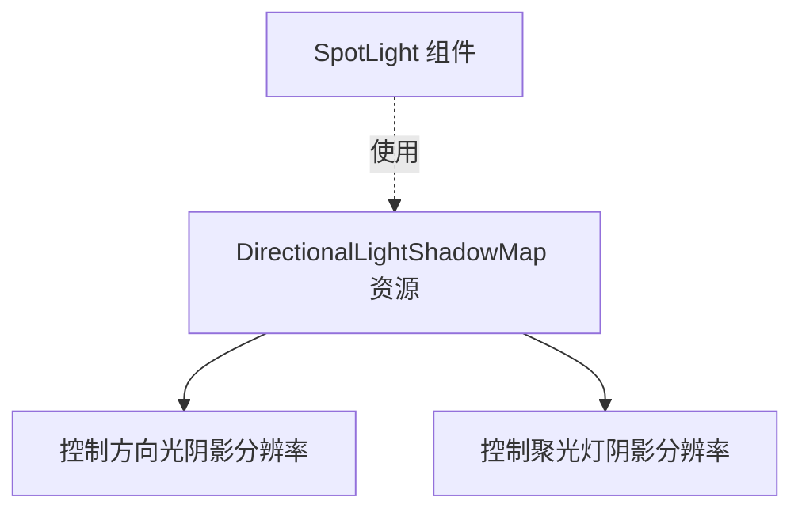

+++
title = "#20282 document Spotlight shadow map sizing"
date = "2025-07-27T00:00:00"
draft = false
template = "pull_request_page.html"
in_search_index = false

[extra]
current_language = "zh-cn"
available_languages = {"en" = { name = "English", url = "/pull_request/bevy/2025-07/pr-20282-en-20250727" }, "zh-cn" = { name = "中文", url = "/pull_request/bevy/2025-07/pr-20282-zh-cn-20250727" }}
labels = ["C-Docs", "D-Trivial", "A-Rendering"]
+++

# 分析报告：PR #20282 - document Spotlight shadow map sizing

## Basic Information
- **Title**: document Spotlight shadow map sizing
- **PR Link**: https://github.com/bevyengine/bevy/pull/20282
- **Author**: atlv24
- **Status**: MERGED
- **Labels**: C-Docs, D-Trivial, A-Rendering, S-Ready-For-Final-Review
- **Created**: 2025-07-25T02:16:25Z
- **Merged**: 2025-07-25T12:14:36Z
- **Merged By**: superdump

## Description Translation
这个资源同时控制两者，但没有文档记录。现在添加文档说明

## The Story of This Pull Request

### 问题背景
在Bevy渲染系统中，`DirectionalLightShadowMap`资源用于控制阴影贴图的分辨率。然而，文档存在一个盲点：该资源不仅影响方向光(DirectionalLight)的阴影贴图，也影响聚光灯(SpotLight)的阴影贴图，但这一点没有在文档中明确说明。这会导致开发者困惑，特别是当他们在调试聚光灯阴影质量或性能时，无法快速找到调整分辨率的方法。

### 解决方案
PR通过两处文档更新解决这个问题：
1. 在`DirectionalLightShadowMap`的文档中明确添加对聚光灯的支持说明
2. 在`SpotLight`组件的文档中添加使用`DirectionalLightShadowMap`控制阴影分辨率的指引

这种修改保持了API一致性，因为资源本身已经支持两种光源类型，只是文档缺失。不需要修改任何功能代码，只需完善文档即可解决问题。

### 具体实现
实现直接明了：在相关类型文档注释中添加明确的文字说明。关键点是确保开发者从两个入口点都能找到控制阴影分辨率的方法：
- 当查看`DirectionalLightShadowMap`时，能知道它也适用于聚光灯
- 当查看`SpotLight`组件时，能知道如何控制其阴影分辨率

这种文档更新遵循了Rust的最佳实践，使用Markdown格式和准确的类型链接，确保文档在rustdoc生成的API文档中保持可读性和一致性。

### 技术影响
这个修改虽然微小但重要：
1. **消除歧义**：明确`DirectionalLightShadowMap`的双重用途
2. **提升开发者体验**：减少在调试聚光灯阴影时的试错时间
3. **保持一致性**：延续Bevy的文档标准，所有核心功能都应有明确文档

对于渲染系统，阴影分辨率直接影响视觉质量和性能。明确控制方式帮助开发者更精确地进行性能/质量权衡。

## Visual Representation



## Key Files Changed

### 1. `crates/bevy_light/src/directional_light.rs`
**修改目的**：明确资源同时控制方向光和聚光灯的阴影贴图分辨率

```rust
// Before:
/// Controls the resolution of [`DirectionalLight`] shadow maps.

// After:
/// Controls the resolution of [`DirectionalLight`] and [`SpotLight`](crate::SpotLight) shadow maps.
```

### 2. `crates/bevy_light/src/spot_light.rs`
**修改目的**：在聚光灯文档中添加阴影分辨率控制指引

```rust
// 修改前文档中无相关说明
// 修改后添加：
///
/// To control the resolution of the shadow maps, use the [`crate::DirectionalLightShadowMap`] resource.
```

## Further Reading
1. [Bevy光照文档](https://bevyengine.org/learn/book/features/lighting/)
2. [Rust文档注释指南](https://doc.rust-lang.org/rustdoc/how-to-write-documentation.html)
3. [阴影映射技术原理](https://learnopengl.com/Advanced-Lighting/Shadows/Shadow-Mapping)