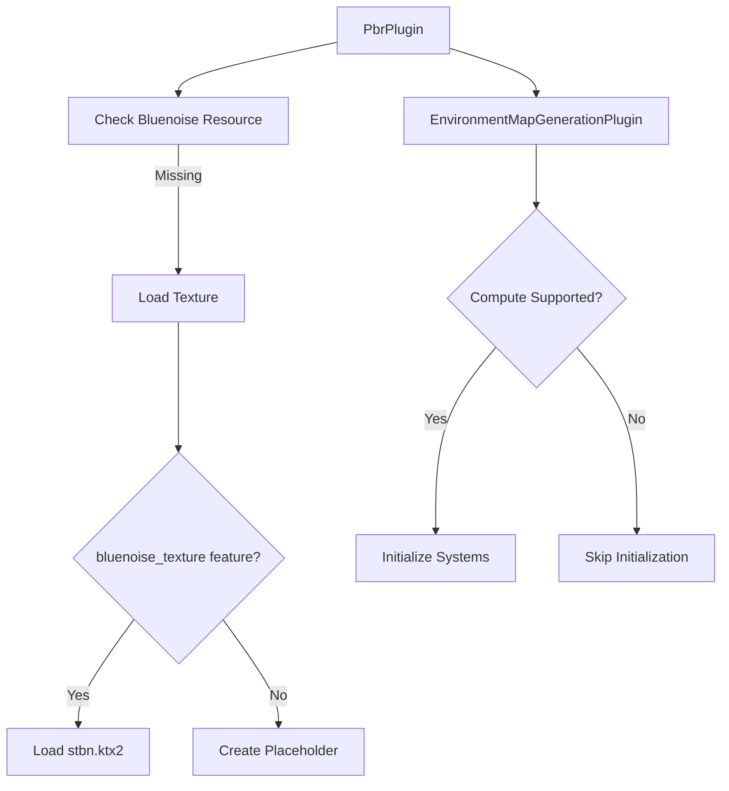

+++
title = "#20286 Fix webgl2"
date = "2025-07-27T00:00:00"
draft = false
template = "pull_request_page.html"
in_search_index = true

[taxonomies]
list_display = ["show"]

[extra]
current_language = "en"
available_languages = {"en" = { name = "English", url = "/pull_request/bevy/2025-07/pr-20286-en-20250727" }, "zh-cn" = { name = "中文", url = "/pull_request/bevy/2025-07/pr-20286-zh-cn-20250727" }}
labels = ["C-Bug", "A-Rendering", "P-Crash", "P-Regression", "O-WebGL2"]
+++

# Fix webgl2

## Basic Information
- **Title**: Fix webgl2
- **PR Link**: https://github.com/bevyengine/bevy/pull/20286
- **Author**: atlv24
- **Status**: MERGED
- **Labels**: C-Bug, A-Rendering, P-Crash, S-Ready-For-Final-Review, P-Regression, O-WebGL2
- **Created**: 2025-07-25T14:55:37Z
- **Merged**: 2025-07-27T20:01:21Z
- **Merged By**: alice-i-cecile

## Description Translation
# Objective

- https://github.com/bevyengine/bevy/pull/19076#issuecomment-3116832714 broke webgl2 and bloated binary size by a megabyte
- Fixes #20276

## Solution

- Don't embed stbn.ktx2, just load it for now
- Gate gen env maps by limit checks
- Extract a plugin to do this cleanly
- Only load stbn.ktx2 when its needed

## Testing

- reflection_probes example
- someone please test webgl2

## The Story of This Pull Request

This PR addresses a regression introduced by #19076 that broke WebGL2 support and increased binary size by approximately 1MB. The root cause was the unconditional embedding of the stbn.ktx2 blue noise texture used for environment map generation. Since WebGL2 doesn't support compute shaders or storage textures required for environment map generation, this caused crashes. Additionally, embedding the 1MB texture bloated binary sizes for all users regardless of whether they used environment maps.

The solution involves three main technical changes. First, we replace unconditional embedding with conditional loading of the blue noise texture. The texture is now only loaded when the `bluenoise_texture` feature is enabled, which is controlled through Cargo.toml:

```diff
# Cargo.toml
[features]
+bluenoise_texture = [
+  "bevy_internal/bluenoise_texture",
+  "ktx2",
+  "bevy_image/zstd",
+]
```

In the PBR plugin initialization, we now check for hardware capabilities before initializing environment map generation systems. We first verify if the render world already has the Bluenoise resource to avoid duplicate loading:

```rust
// In PbrPlugin build()
let has_bluenoise = app.get_sub_app(RenderApp).is_some_and(|render_app| 
    render_app.world().is_resource_added::<Bluenoise>()
);
```

If the resource doesn't exist, we conditionally load the texture based on the feature flag. When the feature is enabled, we decode the embedded KTX2 texture. Otherwise, we generate a 1x1 magenta placeholder texture:

```rust
if !has_bluenoise {
    let mut images = app.world_mut().resource_mut::<Assets<Image>>();
    #[cfg(feature = "bluenoise_texture")]
    let handle = {
        let image = Image::from_buffer(
            include_bytes!("bluenoise/stbn.ktx2"),
            ImageType::Extension("ktx2"),
            CompressedImageFormats::NONE,
            false,
            ImageSampler::Default,
            RenderAssetUsages::RENDER_WORLD,
        );
        images.add(image)
    };
    #[cfg(not(feature = "bluenoise_texture"))]
    let handle = images.add(stbn_placeholder());
}
```

The second key change extracts environment map generation into a dedicated plugin (`EnvironmentMapGenerationPlugin`). This plugin performs hardware capability checks during initialization to ensure compute shader support exists before setting up systems:

```rust
impl Plugin for EnvironmentMapGenerationPlugin {
    fn finish(&self, app: &mut App) {
        let render_app = match app.get_sub_app_mut(RenderApp) {
            Some(app) => app,
            None => return,
        };
        
        let adapter = render_app.world().resource::<RenderAdapter>();
        let device = render_app.world().resource::<RenderDevice>();
        
        // Check storage texture support (required for cubemap SPD)
        let limit_support = device.limits().max_storage_textures_per_shader_stage >= 6
            && device.limits().max_compute_workgroup_storage_size != 0;
            
        // Check compute shader support
        let downlevel_support = adapter.get_downlevel_capabilities()
            .flags
            .contains(DownlevelFlags::COMPUTE_SHADERS);
            
        if !limit_support || !downlevel_support {
            info!("Disabling EnvironmentMapGenerationPlugin...");
            return;
        }
        
        // Proceed with system setup if supported
        // ...
    }
}
```

Third, we modify the environment filtering shader to provide a fallback when the blue noise texture isn't available. This uses a simple pseudo-random number generator instead of sampling from the texture:

```wgsl
// environment_filter.wgsl
#ifdef HAS_BLUE_NOISE
// Original blue noise sampling
#else
// Fallback PRNG
fn sample_noise(pixel_coords: vec2u) -> vec4f {
    var rng_state: u32 = (pixel_coords.x * 3966231743u) ^ 
                         (pixel_coords.y * 3928936651u);
    let rnd = rand_vec2f(&rng_state);
    return vec4f(rnd, 0.0, 0.0);
}
#endif
```

The `HAS_BLUE_NOISE` define is set during pipeline creation when the feature is enabled:

```rust
// In pipeline setup
#[cfg(feature = "bluenoise_texture")]
shader_defs.push(ShaderDefVal::Int("HAS_BLUE_NOISE".into(), 1));
```

These changes collectively fix the WebGL2 crash by skipping environment map initialization on unsupported platforms, reduce binary size by ~1MB when not using the feature, and maintain functionality for users who need environment maps. The solution demonstrates good practice in conditional resource loading, hardware capability checks, and graceful fallbacks for unsupported platforms.

## Visual Representation



## Key Files Changed

### `crates/bevy_pbr/src/lib.rs` (+60/-9)
Modified texture loading logic to conditionally include stbn.ktx2 based on feature flag. Added placeholder texture generation for fallback.

```rust
// Before: Unconditional embedding
embedded_asset!(app, "stbn.ktx2");
let bluenoise_texture = load_embedded_asset!(app, "stbn.ktx2");

// After: Conditional loading
#[cfg(feature = "bluenoise_texture")]
let handle = { /* load KTX2 */ };
#[cfg(not(feature = "bluenoise_texture"))]
let handle = images.add(stbn_placeholder());
```

### `crates/bevy_pbr/src/light_probe/generate.rs` (+97/-8)
Extracted environment map generation into a plugin with hardware capability checks.

```rust
// New plugin structure
pub struct EnvironmentMapGenerationPlugin;

impl Plugin for EnvironmentMapGenerationPlugin {
    fn finish(&self, app: &mut App) {
        // Hardware capability checks
        if !device_supports_compute(render_app) {
            return; // Skip initialization
        }
        // Setup systems and render graph...
    }
}
```

### `crates/bevy_pbr/src/light_probe/mod.rs` (+11/-54)
Integrated the new environment map generation plugin and removed redundant setup code.

```diff
 impl Plugin for LightProbePlugin {
     fn build(&self, app: &mut App) {
-        // Old environment map setup code
+        app.add_plugins(EnvironmentMapGenerationPlugin);
     }
 }
```

### `crates/bevy_pbr/src/light_probe/environment_filter.wgsl` (+10/-1)
Added conditional compilation for blue noise sampling with fallback PRNG.

```wgsl
// Before: Single implementation
fn sample_noise(pixel_coords: vec2u) -> vec4f { /* ... */ }

// After: Conditional implementation
#ifdef HAS_BLUE_NOISE
// Blue noise sampling
#else
// PRNG fallback
#endif
```

### `Cargo.toml` (+7/-0)
Added feature flag for conditional inclusion of blue noise texture.

```toml
[features]
bluenoise_texture = [
  "bevy_internal/bluenoise_texture",
  "ktx2",
  "bevy_image/zstd",
]
```

## Further Reading
1. [WebGL 2.0 Specification](https://www.khronos.org/registry/webgl/specs/latest/2.0/) - Reference for WebGL2 capabilities
2. [WGSL Shader Language](https://gpuweb.github.io/gpuweb/wgsl/) - WebGPU Shading Language documentation
3. [Conditional Compilation in Rust](https://doc.rust-lang.org/reference/conditional-compilation.html) - Official Rust documentation on `#[cfg]` attributes
4. [Bevy Render Pipeline Architecture](https://bevyengine.org/learn/book/getting-started/rendering/) - Overview of Bevy's rendering system