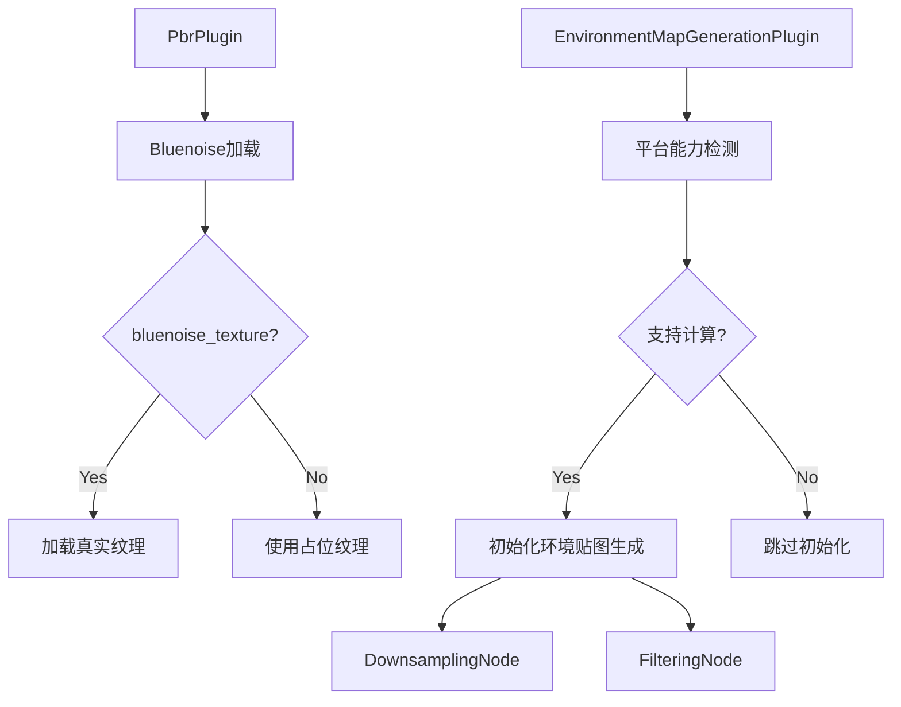

+++
title = "#20286 Fix webgl2"
date = "2025-07-27T00:00:00"
draft = false
template = "pull_request_page.html"
in_search_index = false

[extra]
current_language = "zh-cn"
available_languages = {"en" = { name = "English", url = "/pull_request/bevy/2025-07/pr-20286-en-20250727" }, "zh-cn" = { name = "中文", url = "/pull_request/bevy/2025-07/pr-20286-zh-cn-20250727" }}
+++

# 分析报告：PR #20286 Fix webgl2

## 基本信息
- **标题**: Fix webgl2
- **PR链接**: https://github.com/bevyengine/bevy/pull/20286
- **作者**: atlv24
- **状态**: MERGED
- **标签**: C-Bug, A-Rendering, P-Crash, S-Ready-For-Final-Review, P-Regression, O-WebGL2
- **创建时间**: 2025-07-25T14:55:37Z
- **合并时间**: 2025-07-27T20:01:21Z
- **合并者**: alice-i-cecile

## 描述翻译
### 目标
- PR #19076 破坏了 webgl2 支持，并使二进制文件大小增加了 1MB
- 修复 #20276

### 解决方案
- 不再嵌入 stbn.ktx2 文件，改为按需加载
- 通过限制检查门控环境贴图生成
- 提取插件以更清晰地处理此功能
- 仅在需要时加载 stbn.ktx2

### 测试
- 使用 reflection_probes 示例测试
- 需要测试 webgl2 支持

## PR 分析叙事

### 问题背景
PR #19076 引入了环境贴图生成功能，但意外导致了两个严重问题：
1. **WebGL2 崩溃**：由于在 WebGL2 环境中嵌入了 stbn.ktx2 蓝噪声纹理，导致不兼容
2. **二进制体积膨胀**：嵌入的纹理使二进制文件大小增加了约 1MB，这对 web 目标特别不利

问题 #20276 具体追踪了 WebGL2 崩溃问题。根本原因在于之前的实现无条件嵌入了蓝噪声纹理，而 WebGL2 不支持某些必需的计算着色器功能。

### 解决方案设计
PR 采用分层方法解决这些问题：
1. **条件纹理加载**：不再无条件嵌入 stbn.ktx2，改为按需加载
2. **特性门控**：新增 `bluenoise_texture` 特性控制纹理包含
3. **计算能力检测**：环境贴图生成插件运行时检测平台能力
4. **着色器降级**：当蓝噪声不可用时使用伪随机数生成
5. **架构重构**：将环境贴图生成提取为独立插件

### 关键实现细节

#### 1. 条件纹理加载 (crates/bevy_pbr/src/lib.rs)
```rust
// 检查是否已存在蓝噪声资源
let has_bluenoise = app.get_sub_app(RenderApp)
    .is_some_and(|render_app| render_app.world().is_resource_added::<Bluenoise>());

if !has_bluenoise {
    let mut images = app.world_mut().resource_mut::<Assets<Image>>();
    
    #[cfg(feature = "bluenoise_texture")]
    let handle = {
        // 从嵌入字节加载KTX2纹理
        let image = Image::from_buffer(
            include_bytes!("bluenoise/stbn.ktx2"),
            ImageType::Extension("ktx2"),
            CompressedImageFormats::NONE,
            false,
            ImageSampler::Default,
            RenderAssetUsages::RENDER_WORLD,
        );
        images.add(image)
    };

    #[cfg(not(feature = "bluenoise_texture"))]
    let handle = { images.add(stbn_placeholder()) }; // 使用占位纹理

    // 插入渲染应用资源
    if let Some(render_app) = app.get_sub_app_mut(RenderApp) {
        render_app.world_mut().insert_resource(Bluenoise { texture: handle });
    }
}
```
此修改确保：
- 启用 `bluenoise_texture` 特性时从字节加载真实纹理
- 未启用特性时使用 1x1 紫色占位纹理
- 避免重复初始化资源

#### 2. 平台能力检测 (crates/bevy_pbr/src/light_probe/generate.rs)
```rust
fn finish(&self, app: &mut App) {
    if let Some(render_app) = app.get_sub_app_mut(RenderApp) {
        let adapter = render_app.world().resource::<RenderAdapter>();
        let device = render_app.world().resource::<RenderDevice>();
        
        // 检查存储纹理支持
        let limit_support = device.limits().max_storage_textures_per_shader_stage >= 6
            && device.limits().max_compute_workgroup_storage_size != 0;
        
        // 检查计算着色器支持
        let downlevel_support = adapter
            .get_downlevel_capabilities()
            .flags
            .contains(DownlevelFlags::COMPUTE_SHADERS);
        
        // 不满足条件时跳过插件初始化
        if !limit_support || !downlevel_support {
            info!("Disabling EnvironmentMapGenerationPlugin...");
            return;
        }
    }
    // ...后续初始化代码
}
```
此检测确保环境贴图生成仅在支持必需功能的平台上启用，防止 WebGL2 崩溃。

#### 3. 着色器降级 (crates/bevy_pbr/src/light_probe/environment_filter.wgsl)
```wgsl
#ifdef HAS_BLUE_NOISE
// 使用蓝噪声纹理采样
fn sample_noise(pixel_coords: vec2u) -> vec4f {
    // ...原始实现
}
#else
// 降级方案：使用伪随机数生成
fn sample_noise(pixel_coords: vec2u) -> vec4f {
    var rng_state: u32 = (pixel_coords.x * 3966231743u) ^ (pixel_coords.y * 3928936651u);
    let rnd = rand_vec2f(&rng_state);
    return vec4f(rnd, 0.0, 0.0);
}
#endif
```
当蓝噪声不可用时，此降级方案确保环境贴图过滤仍能工作，虽然质量略有下降。

#### 4. 架构重构
将环境贴图生成功能提取到独立的 `EnvironmentMapGenerationPlugin`：
```rust
pub struct EnvironmentMapGenerationPlugin;

impl Plugin for EnvironmentMapGenerationPlugin {
    fn finish(&self, app: &mut App) {
        // ...能力检测和初始化
        app.add_plugins(SyncComponentPlugin::<GeneratedEnvironmentMapLight>::default())
            .add_systems(Update, generate_environment_map_light);
        
        render_app
            .add_render_graph_node::<DownsamplingNode>(Core3d, GeneratorNode::Downsampling)
            .add_render_graph_node::<FilteringNode>(Core3d, GeneratorNode::Filtering)
            // ...其他渲染图配置
    }
}
```
然后在主插件中简洁地集成：
```rust
// crates/bevy_pbr/src/light_probe/mod.rs
app.add_plugins((
    EnvironmentMapGenerationPlugin,
    ExtractInstancesPlugin::<EnvironmentMapIds>::new(),
));
```

### 技术影响
1. **修复 WebGL2 崩溃**：通过平台能力检测避免在不支持的环境执行计算着色器
2. **减小二进制体积**：使用特性门控和条件加载，未启用特性时节省约 1MB
3. **更健壮的错误处理**：提供清晰的降级路径（占位纹理 + 伪随机数）
4. **更好的架构**：模块化设计使环境贴图生成功能更易于维护和扩展

### 潜在改进方向
1. 进一步优化纹理加载策略
2. 为移动平台添加更多降级选项
3. 改进伪随机数生成质量

## 组件关系图



## 关键文件变更

### 1. `crates/bevy_pbr/src/lib.rs`
**变更原因**：重构蓝噪声加载逻辑，支持条件加载和占位纹理  
**关键修改**：
```rust
// 条件加载蓝噪声
let has_bluenoise = ...;
if !has_bluenoise {
    #[cfg(feature = "bluenoise_texture")]
    let handle = { /* 加载真实纹理 */ };
    
    #[cfg(not(feature = "bluenoise_texture"))]
    let handle = { images.add(stbn_placeholder()) };
}

// 占位纹理实现
pub fn stbn_placeholder() -> Image {
    let data = vec![255, 0, 255, 255]; // 紫色像素
    // ...创建1x1纹理
}
```

### 2. `crates/bevy_pbr/src/light_probe/generate.rs`
**变更原因**：提取环境贴图生成为独立插件，添加平台检测  
**关键修改**：
```rust
// 新插件定义
pub struct EnvironmentMapGenerationPlugin;

impl Plugin for EnvironmentMapGenerationPlugin {
    fn finish(&self, app: &mut App) {
        // 平台能力检测
        if !limit_support || !downlevel_support {
            info!("Disabling...");
            return;
        }
        // ...插件初始化
    }
}

// 添加蓝噪声特性检测
#[cfg(feature = "bluenoise_texture")]
{
    shader_defs.push(ShaderDefVal::Int("HAS_BLUE_NOISE".into(), 1));
}
```

### 3. `crates/bevy_pbr/src/light_probe/mod.rs`
**变更原因**：简化主插件，使用新提取的环境贴图插件  
**关键修改**：
```rust
impl Plugin for LightProbePlugin {
    fn build(&self, app: &mut App) {
        app.add_plugins((
            EnvironmentMapGenerationPlugin, // 使用新插件
            ExtractInstancesPlugin::<EnvironmentMapIds>::new(),
        ));
        // 移除旧的环境贴图初始化代码
    }
}
```

### 4. `crates/bevy_pbr/src/light_probe/environment_filter.wgsl`
**变更原因**：添加蓝噪声不可用时的降级方案  
**关键修改**：
```wgsl
#ifdef HAS_BLUE_NOISE
/* 原始蓝噪声实现 */
#else
/* 降级伪随机数实现 */
#endif
```

### 5. `Cargo.toml`
**变更原因**：添加新的特性门控  
**关键修改**：
```toml
[features]
bluenoise_texture = [
    "bevy_internal/bluenoise_texture",
    "ktx2",
    "bevy_image/zstd",
]
```

## 进一步阅读
1. [WebGL 计算着色器支持](https://developer.mozilla.org/en-US/docs/Web/API/WebGL2RenderingContext)
2. [WGSL 着色器特性检测](https://gpuweb.github.io/gpuweb/wgsl/)
3. [Bevy 插件系统文档](https://bevyengine.org/learn/book/getting-started/plugins/)
4. [KTX2 纹理格式规范](https://github.khronos.org/KTX-Specification/)