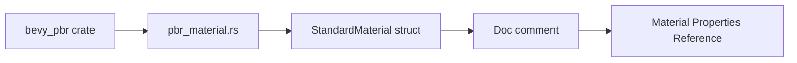

+++
title = "#20293 Updated Material Reference link as the old link was returning a 404"
date = "2025-07-27T00:00:00"
draft = false
template = "pull_request_page.html"
in_search_index = true

[taxonomies]
list_display = ["show"]

[extra]
current_language = "en"
available_languages = {"en" = { name = "English", url = "/pull_request/bevy/2025-07/pr-20293-en-20250727" }, "zh-cn" = { name = "中文", url = "/pull_request/bevy/2025-07/pr-20293-zh-cn-20250727" }}
labels = ["C-Docs", "D-Trivial", "A-Rendering"]
+++

## Updated Material Reference link as the old link was returning a 404

### Basic Information
- **Title**: Updated Material Reference link as the old link was returning a 404
- **PR Link**: https://github.com/bevyengine/bevy/pull/20293
- **Author**: ReallyMadHermit
- **Status**: MERGED
- **Labels**: C-Docs, D-Trivial, A-Rendering
- **Created**: 2025-07-26T04:57:42Z
- **Merged**: 2025-07-26T07:15:00Z
- **Merged By**: mockersf

### Description Translation
The old link was a PDF that now returns a 404, this is an HTML page with the same information. It's arguably better since interested users can navigate around and gain a better understanding of PBR, but mostly I just wanted a working reference link as I frequent this page.

**old:** https://google.github.io/filament/Material%20Properties.pdf  
**new:** https://google.github.io/filament/notes/material_properties.html

I hope I've done everything right, I'm woefully inexperienced when it comes to opensource contribution, but Bevy is the only dependency I use, so I figured I'd try my hand at solving a little problem I noticed.

**Cheers!**

### The Story of This Pull Request
The pull request addresses a documentation issue where a reference link for PBR material properties in Bevy's source code was broken. The original link pointed to a Google Filament PDF that started returning HTTP 404 errors. This documentation reference is important for developers working with Bevy's physically-based rendering (PBR) system, as it provides authoritative information about standard material properties used in lighting calculations.

A user identified the broken link during normal development work with Bevy's rendering system. After verifying that the PDF link was indeed broken, they located the equivalent content in Google's Filament documentation website. The new link points to an HTML version of the same material properties reference, which offers additional benefits: users can navigate related documentation through hyperlinks and access the content without PDF reader software.

The solution involved a straightforward one-line change in Bevy's source code. The author replaced the outdated PDF URL with the working HTML equivalent in the doc comment for the `StandardMaterial` struct. This struct is central to Bevy's PBR implementation, defining core material properties like base color, metallic/roughness values, and other surface characteristics. The doc comment serves as crucial reference documentation for developers implementing or modifying materials in their Bevy applications.

No alternatives were considered because the solution directly addresses the root cause - replacing a dead link with a working equivalent that provides identical content in a more accessible format. The change maintains the original purpose of the documentation while improving its usability.

The implementation required minimal technical work but provides significant value. The broken link could frustrate developers trying to understand PBR material properties, potentially slowing development or leading to incorrect material configurations. With this fix, developers can once again easily access the reference material needed to configure physically accurate materials.

This change demonstrates how small documentation fixes contribute to overall project health. While trivial in implementation, maintaining accurate references ensures developers can effectively use Bevy's rendering capabilities. The quick merge (under 2.5 hours) shows the project maintains responsive processes for addressing documentation issues.

### Visual Representation


### Key Files Changed
- **File**: `crates/bevy_pbr/src/pbr_material.rs`  
  **Change**: Updated broken documentation link  
  **Before**:
  ```rust
  /// Standard property values with pictures here:
  /// <https://google.github.io/filament/Material%20Properties.pdf>.
  ```
  
  **After**:
  ```rust
  /// Standard property values with pictures here:
  /// <https://google.github.io/filament/notes/material_properties.html>.
  ```
  
  **Impact**: Ensures developers have working access to PBR material reference documentation

### Further Reading
- [Google Filament Material Properties Documentation](https://google.github.io/filament/notes/material_properties.html)  
- [Bevy PBR Material Documentation](https://docs.rs/bevy/latest/bevy/pbr/struct.StandardMaterial.html)  
- [Physically Based Rendering Theory](https://en.wikipedia.org/wiki/Physically_based_rendering)  
- [Bevy Contribution Guide](https://github.com/bevyengine/bevy/blob/main/CONTRIBUTING.md)

### Full Code Diff
```diff
diff --git a/crates/bevy_pbr/src/pbr_material.rs b/crates/bevy_pbr/src/pbr_material.rs
index d7baef3a9a8d4..c641d28b09b27 100644
--- a/crates/bevy_pbr/src/pbr_material.rs
+++ b/crates/bevy_pbr/src/pbr_material.rs
@@ -26,7 +26,7 @@ pub enum UvChannel {
 
 /// A material with "standard" properties used in PBR lighting.
 /// Standard property values with pictures here:
-/// <https://google.github.io/filament/Material%20Properties.pdf>.
+/// <https://google.github.io/filament/notes/material_properties.html>.
 ///
 /// May be created directly from a [`Color`] or an [`Image`].
 #[derive(Asset, AsBindGroup, Reflect, Debug, Clone)]
```