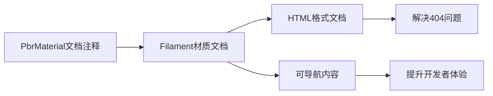

+++
title = "#20293 Updated Material Reference link as the old link was returning a 404"
date = "2025-07-27T00:00:00"
draft = false
template = "pull_request_page.html"
in_search_index = false

[extra]
current_language = "zh-cn"
available_languages = {"en" = { name = "English", url = "/pull_request/bevy/2025-07/pr-20293-en-20250727" }, "zh-cn" = { name = "中文", url = "/pull_request/bevy/2025-07/pr-20293-zh-cn-20250727" }}
+++

# 分析报告：更新材质参考链接（PR #20293）

## 基本信息
- **标题**: Updated Material Reference link as the old link was returning a 404
- **PR链接**: https://github.com/bevyengine/bevy/pull/20293
- **作者**: ReallyMadHermit
- **状态**: 已合并
- **标签**: C-Docs, D-Trivial, A-Rendering
- **创建时间**: 2025-07-26T04:57:42Z
- **合并时间**: 2025-07-26T07:15:00Z
- **合并人**: mockersf

## 问题描述翻译
旧链接是一个PDF文件，现在返回404错误。新链接是一个包含相同信息的HTML页面。新链接更优，因为感兴趣的用户可以浏览页面以更好地理解PBR（Physically Based Rendering），但主要目的是提供一个可用的参考链接。

**旧链接:** https://google.github.io/filament/Material%20Properties.pdf  
**新链接:** https://google.github.io/filament/notes/material_properties.html  

作者说明自己是开源贡献新手，但作为Bevy的用户，决定尝试解决这个发现的小问题。

## 本次PR的技术分析

### 问题背景
在Bevy的PBR材质文档中，存在一个指向外部参考文档的链接：
```rust
/// <https://google.github.io/filament/Material%20Properties.pdf>
```
这个PDF链接已失效，返回HTTP 404错误。这对开发者有以下影响：
1. 无法访问关键的PBR材质属性参考文档
2. 降低了文档的可用性和可信度
3. 中断了学习PBR渲染概念的工作流程

### 解决方案
作者发现Filament项目已将文档迁移到HTML格式，新路径为：
```rust
https://google.github.io/filament/notes/material_properties.html
```
解决方案简单直接：替换文档注释中的URL。HTML格式相比PDF有以下优势：
1. 更好的可导航性
2. 支持内部链接跳转
3. 响应式布局适配不同设备

### 具体实现
修改仅涉及单行代码变更，位于`pbr_material.rs`文件的文档注释中：

```diff
// crates/bevy_pbr/src/pbr_material.rs
// 变更前：
/// Standard property values with pictures here:
-/// <https://google.github.io/filament/Material%20Properties.pdf>.
// 
// 变更后：
/// Standard property values with pictures here:
+/// <https://google.github.io/filament/notes/material_properties.html>.
```

技术考量：
1. 保持原有文档结构不变
2. 仅更新URL字符串
3. 保留相同的注释位置和格式
4. 不引入任何功能变更或副作用

### 影响分析
此变更：
1. 立即恢复文档参考链接的功能性
2. 提升开发者查阅材质属性的体验
3. 保持Bevy文档与Filament文档的同步
4. 解决404问题避免用户困惑

维护角度：
- 属于D-Trivial（琐碎变更）分类
- 无兼容性风险
- 无需额外测试验证

## 关键文件变更

### crates/bevy_pbr/src/pbr_material.rs
**变更描述**：更新PbrMaterial结构体的文档注释中的参考链接  
**变更原因**：原始PDF链接失效，替换为等效的HTML文档链接

```diff
diff --git a/crates/bevy_pbr/src/pbr_material.rs b/crates/bevy_pbr/src/pbr_material.rs
index d7baef3a9a8d4..c641d28b09b27 100644
--- a/crates/bevy_pbr/src/pbr_material.rs
+++ b/crates/bevy_pbr/src/pbr_material.rs
@@ -26,7 +26,7 @@ pub enum UvChannel {
 
 /// A material with "standard" properties used in PBR lighting.
 /// Standard property values with pictures here:
-/// <https://google.github.io/filament/Material%20Properties.pdf>.
+/// <https://google.github.io/filament/notes/material_properties.html>.
 ///
 /// May be created directly from a [`Color`] or an [`Image`].
 #[derive(Asset, AsBindGroup, Reflect, Debug, Clone)]
```

## 技术图示



## 延伸阅读
1. [Filament材质属性文档](https://google.github.io/filament/notes/material_properties.html) - 本次PR更新的参考链接
2. [Filament PBR指南](https://google.github.io/filament/Filament.html) - 完整的PBR理论参考
3. [Bevy PBR渲染文档](https://bevyengine.org/learn/book/features/pbr/) - Bevy官方PBR实现说明
4. [Rust文档注释规范](https://doc.rust-lang.org/rustdoc/how-to-write-documentation.html) - Rust文档最佳实践

## 总结
此PR解决了Bevy渲染模块文档中的链接失效问题，通过将指向PDF的404链接替换为等效的HTML文档链接。变更精确且无风险，属于文档维护类修改。新链接不仅解决访问问题，还提供更好的内容导航体验，这对学习PBR渲染概念的开发者尤为重要。PR展示了开源社区如何通过微小但重要的贡献维护项目健康度。