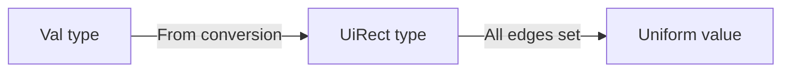

+++
title = "#20312 Implement `From<Val>` for `UiRect`"
date = "2025-07-28T00:00:00"
draft = false
template = "pull_request_page.html"
in_search_index = true

[taxonomies]
list_display = ["show"]

[extra]
current_language = "en"
available_languages = {"en" = { name = "English", url = "/pull_request/bevy/2025-07/pr-20312-en-20250728" }, "zh-cn" = { name = "中文", url = "/pull_request/bevy/2025-07/pr-20312-zh-cn-20250728" }}
labels = ["D-Trivial", "A-UI", "C-Usability"]
+++

## Implement `From<Val>` for `UiRect`

### Basic Information
- **Title**: Implement `From<Val>` for `UiRect`
- **PR Link**: https://github.com/bevyengine/bevy/pull/20312
- **Author**: ickshonpe
- **Status**: MERGED
- **Labels**: D-Trivial, A-UI, C-Usability, S-Ready-For-Final-Review
- **Created**: 2025-07-28T11:13:50Z
- **Merged**: 2025-07-28T17:56:49Z
- **Merged By**: alice-i-cecile

### Description Translation
# Objective

Instead of:
```rust
Node {
    margin: UiRect::all(Val::Px(20.)),
    border: UiRect::all(Val::Px(5.)),
    padding: UiRect::all(Val::Px(10.)),
    ..default()
}
```
allow:
```rust
Node {
    margin: Val::Px(20.).into(),
    border: Val::Px(5.).into(),
    padding: Val::Px(10.).into(),
    ..default()
}
```

Which matches how single edge values are interpreted in CSS.

## Solution

Implement `From<Val>` for `UiRect`.

### The Story of This Pull Request

This PR addresses a minor but impactful ergonomic improvement in Bevy's UI system. The core issue was verbosity when defining uniform values for UI elements' margins, borders, and padding. Previously, developers needed to explicitly call `UiRect::all()` when setting uniform values for all four edges of a UI rectangle. 

The solution implements Rust's `From` trait conversion for the `UiRect` type. By adding this trait implementation, a single `Val` can now be directly converted into a `UiRect` where all edges share that value. This aligns with CSS behavior where a single value is applied to all four sides of a box model property.

The implementation is concise but effective:
```rust
impl From<Val> for UiRect {
    fn from(value: Val) -> Self {
        UiRect::all(value)
    }
}
```
This leverages the existing `UiRect::all` constructor while providing a more idiomatic conversion path. The change maintains full backward compatibility while offering a cleaner syntax alternative.

The impact is primarily improved developer experience. UI code becomes more concise and readable, especially when multiple properties need uniform values. This change reduces boilerplate without introducing new dependencies or complexity. The zero-cost abstraction of Rust's trait system ensures no runtime performance impact.

### Visual Representation



### Key Files Changed

**crates/bevy_ui/src/geometry.rs** (+6/-0)  
Added trait implementation enabling direct conversion from `Val` to `UiRect`:

```rust
// Before: No direct conversion existed
// Users had to explicitly call UiRect::all()

// After: Added From<Val> implementation
impl From<Val> for UiRect {
    fn from(value: Val) -> Self {
        UiRect::all(value)
    }
}
```

### Further Reading
- [Rust `From` trait documentation](https://doc.rust-lang.org/std/convert/trait.From.html)
- [Bevy UI Rectangles documentation](https://docs.rs/bevy_ui/latest/bevy_ui/geometry/struct.UiRect.html)
- [CSS Box Model Specification](https://www.w3.org/TR/CSS2/box.html)