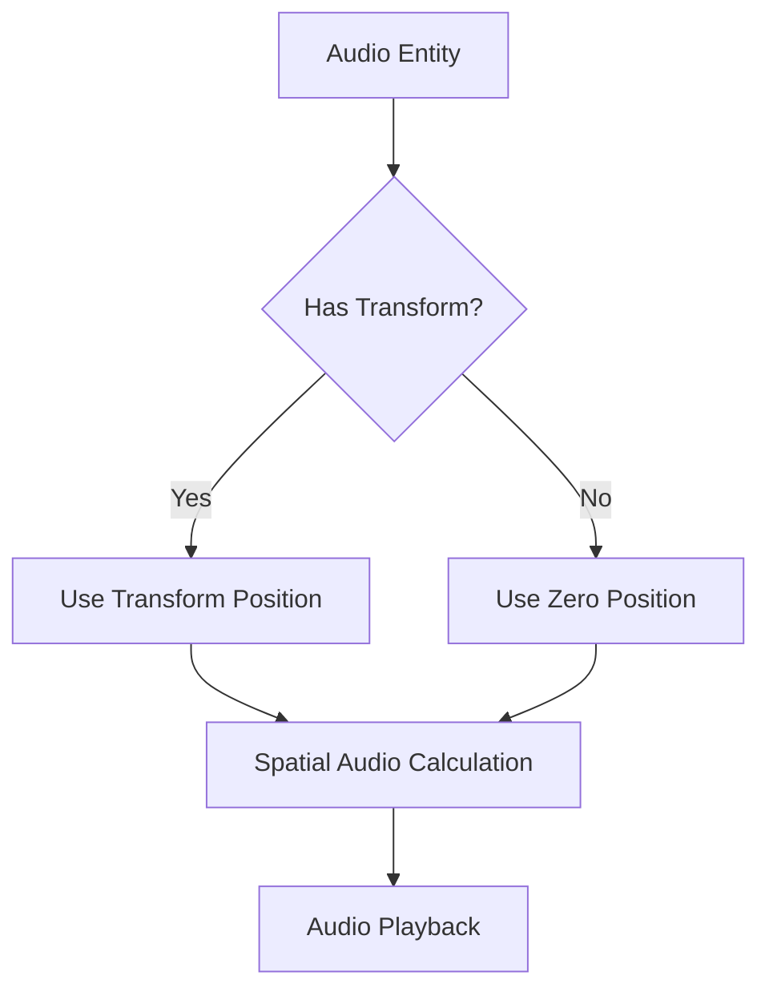

+++
title = "#20317 Fix audio playback for audio entities without transforms"
date = "2025-07-29T00:00:00"
draft = false
template = "pull_request_page.html"
in_search_index = true

[taxonomies]
list_display = ["show"]

[extra]
current_language = "en"
available_languages = {"en" = { name = "English", url = "/pull_request/bevy/2025-07/pr-20317-en-20250729" }, "zh-cn" = { name = "中文", url = "/pull_request/bevy/2025-07/pr-20317-zh-cn-20250729" }}
labels = ["C-Bug", "A-Audio", "P-Regression"]
+++

## Fix audio playback for audio entities without transforms

### Basic Information
- **Title**: Fix audio playback for audio entities without transforms
- **PR Link**: https://github.com/bevyengine/bevy/pull/20317
- **Author**: rparrett
- **Status**: MERGED
- **Labels**: C-Bug, A-Audio, S-Ready-For-Final-Review, P-Regression
- **Created**: 2025-07-28T23:22:01Z
- **Merged**: 2025-07-29T00:29:32Z
- **Merged By**: mockersf

### Description Translation
No translation needed - original English description preserved:

**Objective**  
Audio has been broken for audio entities without `GlobalTransform` since https://github.com/bevyengine/bevy/pull/19357  
Thanks to JC Denton for reporting.

**Solution**  
Revert the changes to `play_queued_audio_system` in that PR while keeping the rest of it in-tact.

**Testing**  
`cargo run --example audio_control`  
`cargo run --example spatial_audio_2d`

---

## The Story of This Pull Request

### The Problem and Context
A regression was introduced in PR #19357 that broke audio playback for entities without `GlobalTransform` components. The root cause was a change to the audio system query that required `GlobalTransform` for all audio entities. This broke non-spatial audio entities that don't require transforms, as they wouldn't match the query. The issue was reported by JC Denton, highlighting that audio playback completely failed for these entities.

### The Solution Approach
The solution involved making the `GlobalTransform` component optional in the audio system query. This maintains the spatial audio functionality introduced in #19357 while restoring compatibility for non-spatial audio. The approach:
1. Changed the query to accept entities with or without `GlobalTransform`
2. Added fallback logic for spatial audio when transform is missing
3. Maintained the existing spatial audio calculations for entities with transforms
4. Added a warning when spatial audio is used without transform

This preserved the benefits of #19357 while fixing the regression.

### The Implementation
The key change was modifying the `play_queued_audio_system` function to handle transform components as optional:

```rust
// File: crates/bevy_audio/src/audio_output.rs

// BEFORE: Required GlobalTransform
for (entity, source_handle, settings, emitter_transform) in &query_nonplaying

// AFTER: Optional GlobalTransform
for (entity, source_handle, settings, maybe_emitter_transform) in &query_nonplaying
```

The spatial audio handling was updated with conditional logic:

```rust
// BEFORE: Direct transform access
let emitter_translation = (emitter_transform.translation() * scale).into();

// AFTER: Conditional handling
let emitter_translation = if let Some(emitter_transform) = maybe_emitter_transform {
    (emitter_transform.translation() * scale).into()
} else {
    warn!("Spatial AudioPlayer with no GlobalTransform component. Using zero.");
    Vec3::ZERO.into()
};
```

### Technical Insights
The solution demonstrates proper handling of optional components in ECS queries:
1. Using `Option<&Component>` in queries allows matching entities with or without the component
2. The fallback to `Vec3::ZERO` ensures spatial calculations don't fail catastrophically
3. The warning helps developers identify misplaced spatial audio entities
4. The fix maintains backward compatibility while preserving new features

### The Impact
This PR:
1. Restores audio playback for non-spatial entities
2. Maintains spatial audio functionality
3. Adds resilience to missing components with clear warnings
4. Resolves a regression with minimal code changes

The changes were verified using the audio examples:
- `audio_control` (non-spatial audio)
- `spatial_audio_2d` (spatial audio)

---

## Visual Representation



---

## Key Files Changed

### crates/bevy_audio/src/audio_output.rs (+10/-3)
**Purpose:** Fix audio playback for entities without transforms  
**Key Changes:**  
1. Made GlobalTransform optional in query  
2. Added fallback for missing transforms  

```rust
// Query modification
Before:
    (Entity, &AudioPlayer<Source>, &PlaybackSettings, &GlobalTransform)

After:
    (Entity, &AudioPlayer<Source>, &PlaybackSettings, Option<&GlobalTransform>)

// Spatial audio handling
Before:
    let emitter_translation = (emitter_transform.translation() * scale).into();

After:
    let emitter_translation = if let Some(emitter_transform) = maybe_emitter_transform {
        (emitter_transform.translation() * scale).into()
    } else {
        warn!("Spatial AudioPlayer with no GlobalTransform component. Using zero.");
        Vec3::ZERO.into()
    };
```

---

## Further Reading
1. [Bevy ECS Queries Documentation](https://bevyengine.org/learn/book/getting-started/ecs/#queries)
2. [Handling Optional Components in Bevy](https://bevy-cheatbook.github.io/programming/optional.html)
3. [Original PR that introduced regression (#19357)](https://github.com/bevyengine/bevy/pull/19357)
4. [Spatial Audio Concepts](https://en.wikipedia.org/wiki/3D_audio_effect)