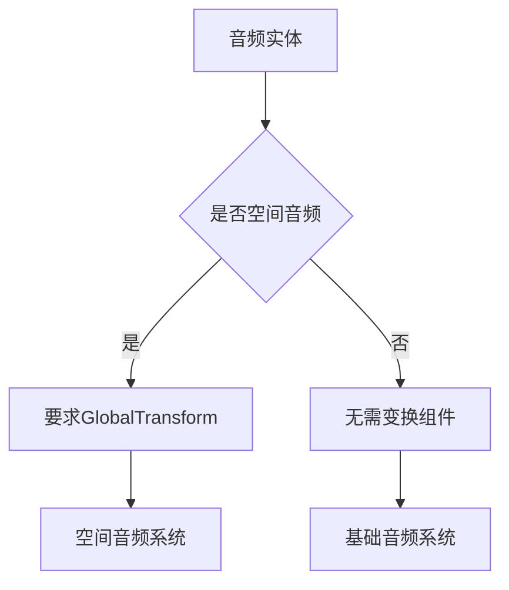

+++
title = "#20317 Fix audio playback for audio entities without transforms"
date = "2025-07-29T00:00:00"
draft = false
template = "pull_request_page.html"
in_search_index = false

[extra]
current_language = "zh-cn"
available_languages = {"en" = { name = "English", url = "/pull_request/bevy/2025-07/pr-20317-en-20250729" }, "zh-cn" = { name = "中文", url = "/pull_request/bevy/2025-07/pr-20317-zh-cn-20250729" }}
+++

## 报告：PR #20317 修复无变换组件的音频实体播放问题

### 基本信息
- **标题**: Fix audio playback for audio entities without transforms
- **PR链接**: https://github.com/bevyengine/bevy/pull/20317
- **作者**: rparrett
- **状态**: 已合并
- **标签**: C-Bug, A-Audio, S-Ready-For-Final-Review, P-Regression
- **创建时间**: 2025-07-28T23:22:01Z
- **合并时间**: 2025-07-29T00:29:32Z
- **合并人**: mockersf

### 问题描述
该PR解决了一个音频系统的回归问题。在之前的PR #19357修改后，所有音频实体都被强制要求包含`GlobalTransform`组件才能播放音频。这导致**非空间音频**（non-spatial audio）实体无法正常工作，因为这些实体原本不需要变换组件。问题表现为当音频实体缺少`GlobalTransform`时，音频完全无法播放。

技术根源在于`play_queued_audio_system`系统中的查询逻辑：
```rust
// 问题代码：
&Query<(
    Entity,
    &AudioPlayer<Source>,
    &PlaybackSettings,
    &GlobalTransform, // 强制要求变换组件
)>
```
这种设计违反了音频系统的固有假设：非空间音频不需要位置信息。该回归影响了所有不使用`GlobalTransform`的基础音频实体。

### 解决方案
核心解决思路是将`GlobalTransform`从强制要求改为可选组件，并优雅处理缺失情况：
1. 修改查询签名，将`&GlobalTransform`改为`Option<&GlobalTransform>`
2. 添加条件分支处理变换组件缺失的情况
3. 当变换缺失时使用零向量位置并输出警告

```rust
// 修复后：
for (entity, source_handle, settings, maybe_emitter_transform) in &query_nonplaying {
    // ...其他逻辑...
    let emitter_translation = if let Some(emitter_transform) = maybe_emitter_transform {
        (emitter_transform.translation() * scale).into()
    } else {
        warn!("Spatial AudioPlayer with no GlobalTransform component. Using zero.");
        Vec3::ZERO.into()
    };
}
```
这种修改保留了PR #19357对空间音频的改进，同时恢复了非空间音频的功能兼容性。关键决策点是：
- 保持原有API不变，避免破坏性变更
- 使用运行时警告而非编译错误，保持灵活性
- 零向量作为安全回退值，确保系统不崩溃

### 技术影响
1. **功能恢复**：非空间音频实体无需额外添加`GlobalTransform`即可正常工作
2. **错误处理**：空间音频实体缺失变换时提供明确警告而非静默失败
3. **性能考量**：Option查询增加一个分支判断，但音频系统非性能关键路径
4. **维护性**：明确区分空间/非空间音频的处理逻辑

验证方式：
```bash
cargo run --example audio_control  # 验证基础音频
cargo run --example spatial_audio_2d  # 验证空间音频
```

### 组件关系


### 关键文件变更
**crates/bevy_audio/src/audio_output.rs**
```diff
@@ -103,7 +103,7 @@ pub(crate) fn play_queued_audio_system<Source: Asset + Decodable>(
             Entity,
             &AudioPlayer<Source>,
             &PlaybackSettings,
-            &GlobalTransform,
+            Option<&GlobalTransform>,
         ),
         (Without<AudioSink>, Without<SpatialAudioSink>),
     >,
@@ -118,7 +118,7 @@ pub(crate) fn play_queued_audio_system<Source: Asset + Decodable>(
         return;
     };
 
-    for (entity, source_handle, settings, emitter_transform) in &query_nonplaying {
+    for (entity, source_handle, settings, maybe_emitter_transform) in &query_nonplaying {
         let Some(audio_source) = audio_sources.get(&source_handle.0) else {
             continue;
         };
@@ -136,7 +136,14 @@ pub(crate) fn play_queued_audio_system<Source: Asset + Decodable>(
             }
 
             let scale = settings.spatial_scale.unwrap_or(default_spatial_scale.0).0;
-            let emitter_translation = (emitter_transform.translation() * scale).into();
+
+            let emitter_translation = if let Some(emitter_transform) = maybe_emitter_transform {
+                (emitter_transform.translation() * scale).into()
+            } else {
+                warn!("Spatial AudioPlayer with no GlobalTransform component. Using zero.");
+                Vec3::ZERO.into()
+            };
+
             let sink = match SpatialSink::try_new(
                 stream_handle,
                 emitter_translation,
```
变更要点：
1. 查询条件从强制要求变换改为可选
2. 新增条件分支处理变换缺失情况
3. 使用`warn!`记录非常规使用场景
4. 保持空间音频计算逻辑不变

### 经验总结
该PR展示了重要的工程实践：
1. **组件可选性原则**：当数据非核心依赖时，使用`Option`查询更健壮
2. **回归测试价值**：修改后验证基础功能和衍生功能同样重要
3. **警告设计**：通过日志明确标识非常规用法而非静默处理

### 延伸阅读
1. [Bevy音频系统文档](https://docs.rs/bevy_audio/latest/bevy_audio/)
2. [ECS查询模式](https://bevy-cheatbook.github.io/programming/queries.html)
3. [PR #19357 原始修改](https://github.com/bevyengine/bevy/pull/19357)