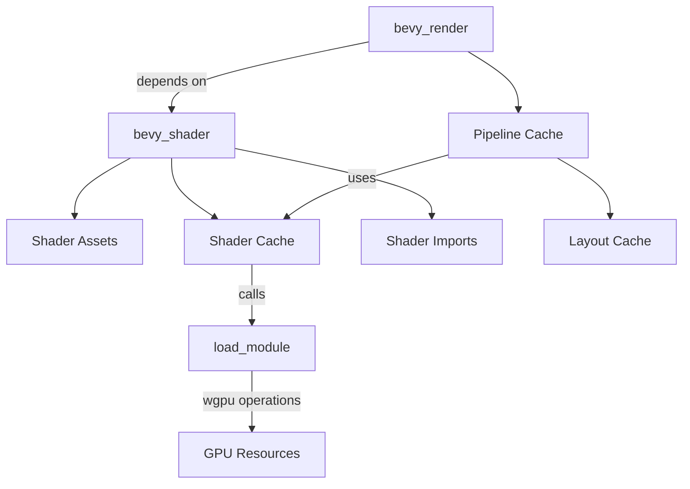

+++
title = "#20330 bevy_shader"
date = "2025-07-31T00:00:00"
draft = false
template = "pull_request_page.html"
in_search_index = true

[taxonomies]
list_display = ["show"]

[extra]
current_language = "en"
available_languages = {"en" = { name = "English", url = "/pull_request/bevy/2025-07/pr-20330-en-20250731" }, "zh-cn" = { name = "中文", url = "/pull_request/bevy/2025-07/pr-20330-zh-cn-20250731" }}
labels = ["C-Bug", "A-Rendering", "C-Code-Quality", "D-Shaders"]
+++

### Technical Analysis of PR #20330: bevy_shader

#### Basic Information
- **Title**: bevy_shader
- **PR Link**: https://github.com/bevyengine/bevy/pull/20330
- **Author**: atlv24
- **Status**: MERGED
- **Labels**: C-Bug, A-Rendering, C-Code-Quality, S-Ready-For-Final-Review, P-Compile-Failure, D-Shaders
- **Created**: 2025-07-30T02:47:58Z
- **Merged**: 2025-07-30T23:46:35Z
- **Merged By**: alice-i-cecile

#### Description Translation
# Objective

- split off bevy_shader from bevy_render to allow for defining shader libraries and materials for scenes without depending on a renderer

## Solution

- a bunch of small refactor commits, then bevy_shader! (review commit by commit)

## Testing

- please help with this, especially with spirv passthrough and decoupled_naga testing: i only ran 3d_scene at every step to make sure i didnt break anything.

EDIT: this has been tested now, decoupled_naga works, and I also fixed a bug that was on main when wesl and decoupled_naga were both present it didnt compile, now it does


# Future Work

- Split ShaderCacheError out of PipelineCacheError (or just rename) (punted because breaking change)
- Consider renaming PipelineCacheId to ShaderCacheId ? (punted because breaking change)
- bevy_material
- bevy_bsdf (bindingless pbr shader library)
- move view.wgsl into bevy_camera after #20313 lands ?

---

### The Story of This Pull Request

#### The Problem and Context
Shader management in Bevy was tightly coupled with the rendering system. This prevented using shader assets in non-rendering contexts (like scene definitions) without pulling in the entire renderer. The existing implementation also suffered from:
1. Monolithic architecture where shader processing logic lived in `bevy_render`
2. Difficulty maintaining complex shader dependency graphs
3. Limited flexibility for future shader-related features like material libraries

The primary goal was to extract shader processing logic into a separate crate (`bevy_shader`) while maintaining existing functionality and fixing edge cases like the `wesl` + `decoupled_naga` compilation bug.

#### The Solution Approach
The solution involved:
1. Creating a new `bevy_shader` crate to house shader assets, import resolution, and caching
2. Refactoring `bevy_render` to depend on `bevy_shader` for shader management
3. Implementing a generic `ShaderCache` that abstracts over shader module creation
4. Preserving existing functionality through careful interface design

Key engineering decisions:
- Made `ShaderCache` generic over shader module type and render device to avoid renderer coupling
- Extracted shader module loading into a closure passed to `ShaderCache`
- Maintained identical public interfaces in `bevy_render` through re-exports
- Consolidated shader format features under `bevy_shader`

#### The Implementation
The implementation proceeded through several coordinated changes:

**1. Crate restructuring**
- Created `bevy_shader` with its own `Cargo.toml`, licenses, and module structure
- Moved shader asset definition (`shader.rs`) and cache logic (`shader_cache.rs`) to the new crate

**2. Decoupling shader processing**
The core innovation was abstracting shader compilation behind a closure:

```rust
// In bevy_render/src/render_resource/pipeline_cache.rs
fn load_module(
    render_device: &RenderDevice,
    shader_source: ShaderCacheSource,
    validate_shader: &ValidateShader,
) -> Result<WgpuWrapper<ShaderModule>, PipelineCacheError> {
    // ... wgpu shader module creation logic ...
}
```

This allows `bevy_shader` to manage shader dependencies without direct knowledge of `wgpu`:

```rust
// In bevy_shader/src/shader_cache.rs
pub struct ShaderCache<ShaderModule, RenderDevice> {
    load_module: fn(
        &RenderDevice, 
        ShaderCacheSource,
        &ValidateShader
    ) -> Result<ShaderModule, PipelineCacheError>,
    // ...
}
```

**3. Feature flag migration**
Shader format features were moved to `bevy_shader`:

```toml
# crates/bevy_shader/Cargo.toml
[features]
shader_format_glsl = ["naga/glsl-in", "naga/wgsl-out", "naga_oil/glsl"]
shader_format_spirv = ["naga/spv-in", "naga/spv-out"]
shader_format_wesl = ["wesl"]
```

**4. Dependency resolution**
The shader import system was preserved but now lives in `bevy_shader`:

```rust
// In bevy_shader/src/shader_cache.rs
fn add_import_to_composer(
    composer: &mut naga_oil::compose::Composer,
    import_path_shaders: &HashMap<ShaderImport, AssetId<Shader>>,
    shaders: &HashMap<AssetId<Shader>, Shader>,
    import: &ShaderImport,
) -> Result<(), PipelineCacheError> {
    // Recursive import resolution logic
}
```

#### Technical Insights
1. **Abstraction Boundaries**:
   - `bevy_shader` handles pure shader concerns: asset definition, imports, preprocessing
   - `bevy_render` handles GPU-specific concerns: pipeline creation, module validation
   - The `load_module` closure bridges these worlds without tight coupling

2. **Performance Considerations**:
   - Shader processing remains incremental (only recompiles when dependencies change)
   - The generic cache design avoids runtime overhead through monomorphization
   - Global shader defines (like `AVAILABLE_STORAGE_BUFFER_BINDINGS`) are now computed once during cache creation

3. **Error Handling**:
   - `PipelineCacheError` remains in `bevy_shader` for now (future work will split this)
   - Detailed validation errors preserved through wgpu error scopes

#### The Impact
1. **Architectural Cleanliness**:
   - Reduces `bevy_render` size by ~500 LOC
   - Separates concerns for better long-term maintenance

2. **New Capabilities**:
   - Enables using shader assets without renderer dependencies
   - Provides foundation for future material and BSDF systems

3. **Bug Fixes**:
   - Resolved `wesl` + `decoupled_naga` compilation conflict
   - Preserved platform-specific shader defines (WebGL, SIMD)

---

### Visual Representation



---

### Key Files Changed

1. `crates/bevy_render/src/render_resource/pipeline_cache.rs` (+89/-560)  
   - **Purpose**: Adapt to use `bevy_shader`'s cache
   - **Key Changes**:
     - Removed inline shader cache implementation
     - Added `load_module` bridge function
     - Integrated global shader defines

```rust
// Before: Monolithic cache
struct ShaderData {
    pipelines: HashSet<CachedPipelineId>,
    processed_shaders: HashMap<Box<[ShaderDefVal]>, Arc<WgpuWrapper<ShaderModule>>>,
    // ... 100+ lines of shader processing ...
}

// After: Delegated to bevy_shader
struct PipelineCache {
    shader_cache: Arc<Mutex<ShaderCache<WgpuWrapper<ShaderModule>, RenderDevice>>>,
    // ...
}
```

2. `crates/bevy_shader/src/shader_cache.rs` (+547/-0)  
   - **Purpose**: New shader management core
   - **Key Changes**:
     - Generic cache implementation
     - Import resolution logic
     - Error types

```rust
pub struct ShaderCache<ShaderModule, RenderDevice> {
    load_module: fn(&RenderDevice, ShaderCacheSource, &ValidateShader) -> Result<ShaderModule, PipelineCacheError>,
    composer: naga_oil::compose::Composer,
    // ...
}

impl<ShaderModule, RenderDevice> ShaderCache<ShaderModule, RenderDevice> {
    pub fn get(&mut self, /* ... */) -> Result<Arc<ShaderModule>, PipelineCacheError> {
        // Processes shader with naga_oil
        let naga = self.composer.make_naga_module(/* ... */)?;
        // Uses load_module closure for GPU compilation
        let shader_module = (self.load_module)(/* ... */)?;
    }
}
```

3. `crates/bevy_shader/src/shader.rs` (+29/-5)  
   - **Purpose**: Shader asset definition
   - **Key Changes**:
     - Replaced atomic ID with `NonZero<u32>`
     - Preserved all serialization/deserialization logic

```rust
// Before: Macro-generated ID
define_atomic_id!(ShaderId);

// After: Explicit handle
pub struct ShaderId(NonZero<u32>);

impl ShaderId {
    pub fn new() -> Self {
        static COUNTER: AtomicU32 = AtomicU32::new(1);
        // ... atomic increment ...
    }
}
```

4. `crates/bevy_shader/Cargo.toml` (+58/-0)  
   - **Purpose**: New crate definition
   - **Key Changes**:
     - Consolidated shader format features
     - Added `decoupled_naga` feature flag

```toml
[features]
shader_format_glsl = ["naga/glsl-in", "naga/wgsl-out", "naga_oil/glsl"]
shader_format_spirv = ["naga/spv-in", "naga/spv-out"]
shader_format_wesl = ["wesl"]
decoupled_naga = []
```

5. `crates/bevy_render/Cargo.toml` (Dependency updates)  
   - **Purpose**: Integrate new shader crate
   - **Key Changes**:
     - Added `bevy_shader` dependency
     - Migrated feature flags

```toml
[dependencies]
bevy_shader = { path = "../bevy_shader", version = "0.17.0-dev" }

[features]
shader_format_glsl = ["bevy_shader/shader_format_glsl"]
shader_format_spirv = ["bevy_shader/shader_format_spirv", "wgpu/spirv"]
shader_format_wesl = ["bevy_shader/shader_format_wesl"]
decoupled_naga = ["bevy_shader/decoupled_naga"]
```

---

### Further Reading
1. [naga_oil Documentation](https://github.com/bevyengine/naga_oil) - Shader composition library
2. [WGSL Spec](https://gpuweb.github.io/gpuweb/wgsl/) - WebGPU Shading Language
3. [SPIR-V Cross](https://github.com/KhronosGroup/SPIRV-Cross) - Shader translation toolkit
4. [Bevy Shader System RFC](https://github.com/bevyengine/rfcs/pull/27) - Design discussion

This refactor establishes critical foundations for Bevy's material system and renderer-agnostic shader processing while maintaining backward compatibility. The clean separation of concerns will accelerate future graphics development.