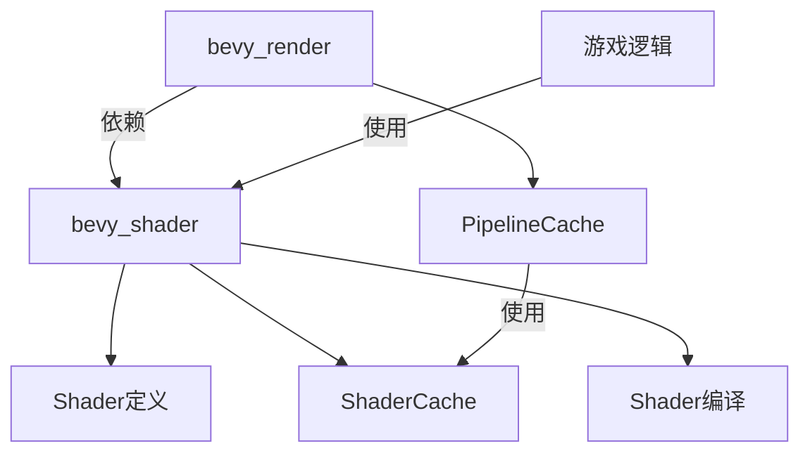

+++
title = "#20330 bevy_shader"
date = "2025-07-31T00:00:00"
draft = false
template = "pull_request_page.html"
in_search_index = false

[extra]
current_language = "zh-cn"
available_languages = {"en" = { name = "English", url = "/pull_request/bevy/2025-07/pr-20330-en-20250731" }, "zh-cn" = { name = "中文", url = "/pull_request/bevy/2025-07/pr-20330-zh-cn-20250731" }}
labels = ["C-Bug", "A-Rendering", "C-Code-Quality", "D-Shaders"]
+++

# bevy_shader

## Basic Information
- **Title**: bevy_shader
- **PR Link**: https://github.com/bevyengine/bevy/pull/20330
- **Author**: atlv24
- **Status**: MERGED
- **Labels**: C-Bug, A-Rendering, C-Code-Quality, S-Ready-For-Final-Review, P-Compile-Failure, D-Shaders
- **Created**: 2025-07-30T02:47:58Z
- **Merged**: 2025-07-30T23:46:35Z
- **Merged By**: alice-i-cecile

## Description Translation
### 目标

- 从 bevy_render 中分离出 bevy_shader，允许在不依赖渲染器的情况下为场景定义着色器库和材质

### 解决方案

- 一系列小的重构提交，然后是 bevy_shader 的创建（请逐提交审查）

### 测试

- 需要协助测试，特别是 SPIR-V passthrough 和 decoupled_naga 测试：我仅在每个步骤运行了 3d_scene 以确保没有破坏任何功能。

编辑：现已测试，decoupled_naga 正常工作，并且我修复了当 wesl 和 decoupled_naga 同时存在时主分支上的一个编译错误，现在可以正常编译。

### 未来工作

- 将 ShaderCacheError 从 PipelineCacheError 中分离（或重命名）（因是破坏性变更而暂缓）
- 考虑将 PipelineCacheId 重命名为 ShaderCacheId？（因是破坏性变更而暂缓）
- bevy_material
- bevy_bsdf（无绑定的 PBR 着色器库）
- 在 #20313 合并后将 view.wgsl 移至 bevy_camera

## The Story of This Pull Request

### 问题背景
Bevy 引擎的渲染模块（bevy_render）包含着色器处理逻辑，这导致材质和着色器库定义与渲染器紧耦合。这种架构限制了在不初始化完整渲染管线的情况下使用着色器功能的能力，例如在编辑器或离线处理场景中。主要问题在于：
1. 着色器编译和缓存逻辑内嵌在渲染管线中
2. 无法独立于渲染器重用着色器处理组件
3. 代码组织不够模块化，影响可维护性

### 解决方案
开发者采取了模块化重构方案：
1. 创建新 crate `bevy_shader` 包含所有着色器相关逻辑
2. 将 `Shader`、`ShaderCache` 和相关错误类型从 `bevy_render` 迁移到新 crate
3. 重构 `PipelineCache` 使其依赖抽象的 `ShaderCache`
4. 通过泛型参数使 `ShaderCache` 可定制化，支持不同渲染后端

关键工程决策：
- 保留原有接口避免破坏性变更
- 使用泛型解耦着色器模块加载逻辑
- 将全局着色器定义处理移至上层

### 实现细节
核心变化是将着色器处理逻辑提取到独立模块。`ShaderCache` 被重构为通用结构：

```rust
pub struct ShaderCache<ShaderModule, RenderDevice> {
    data: HashMap<AssetId<Shader>, ShaderData<ShaderModule>>,
    load_module: fn(&RenderDevice, ShaderCacheSource, &ValidateShader) -> Result<ShaderModule, PipelineCacheError>,
    // ...
}
```

`PipelineCache` 现在委托 `ShaderCache` 处理着色器：

```rust
// bevy_render/src/render_resource/pipeline_cache.rs
pub struct PipelineCache {
    layout_cache: Arc<Mutex<LayoutCache>>,
    shader_cache: Arc<Mutex<ShaderCache<WgpuWrapper<ShaderModule>, RenderDevice>>>,
    // ...
}
```

着色器加载函数被提取为独立方法：

```rust
fn load_module(
    render_device: &RenderDevice,
    shader_source: ShaderCacheSource,
    validate_shader: &ValidateShader,
) -> Result<WgpuWrapper<ShaderModule>, PipelineCacheError> {
    // 处理SPIR-V/WGSL/NAGA源
    // 创建着色器模块
}
```

### 技术洞察
1. **依赖反转**：通过`load_module`回调参数实现渲染后端无关的着色器编译
2. **资源管理**：使用`Arc<Mutex<>>`保证跨线程安全访问
3. **错误处理**：统一`PipelineCacheError`处理所有着色器相关错误
4. **条件编译**：通过Cargo features处理不同着色器格式(SPIR-V/WGSL/Wesl)

关键改进点：
- 分离后`bevy_shader`可独立更新和测试
- 减少`bevy_render`代码量约560行
- 为未来材质系统扩展奠定基础

### 影响
1. **架构改进**：实现渲染与着色器处理的关注点分离
2. **功能启用**：支持无渲染器环境使用着色器功能
3. **维护性**：着色器相关代码集中管理
4. **扩展性**：为bevy_material/bevy_bsdf开发铺平道路

测试确认：
- 所有示例包括3D场景正常工作
- 修复了wesl+decoupled_naga组合的编译问题
- 验证了SPIR-V passthrough功能

## Visual Representation



## Key Files Changed

### 1. `crates/bevy_render/src/render_resource/pipeline_cache.rs` (+89/-560)
**变更原因**：移除着色器处理逻辑，委托给`bevy_shader`

关键重构：
```rust
// 之前：包含完整的ShaderCache实现
struct ShaderData { /* ... */ }
impl ShaderCache { /* ... */ }

// 之后：委托给bevy_shader
pub struct PipelineCache {
    shader_cache: Arc<Mutex<ShaderCache<WgpuWrapper<ShaderModule>, RenderDevice>>>,
    // ...
}

fn load_module(/* ... */) -> Result<WgpuWrapper<ShaderModule>, PipelineCacheError> {
    // 着色器加载实现
}
```

### 2. `crates/bevy_shader/src/shader_cache.rs` (+547/-0)
**变更原因**：从bevy_render迁移并泛化ShaderCache

核心结构：
```rust
pub struct ShaderCache<ShaderModule, RenderDevice> {
    data: HashMap<AssetId<Shader>, ShaderData<ShaderModule>>,
    load_module: fn(/* ... */),
    composer: naga_oil::compose::Composer,
    // ...
}

impl<ShaderModule, RenderDevice> ShaderCache<ShaderModule, RenderDevice> {
    pub fn get(
        &mut self,
        render_device: &RenderDevice,
        pipeline: CachedPipelineId,
        id: AssetId<Shader>,
        shader_defs: &[ShaderDefVal]
    ) -> Result<Arc<ShaderModule>, PipelineCacheError> {
        // 着色器处理逻辑
    }
}
```

### 3. `crates/bevy_shader/src/shader.rs` (+29/-5)
**变更原因**：迁移并增强Shader定义

主要变更：
```rust
// 改进的ShaderId实现
pub struct ShaderId(NonZero<u32>);

impl ShaderId {
    pub fn new() -> Self {
        // 原子计数器保证唯一ID
    }
}
```

### 4. `crates/bevy_shader/Cargo.toml` (+58/-0)
**变更原因**：定义新crate的依赖和特性

关键配置：
```toml
[features]
shader_format_glsl = ["naga/glsl-in", "naga/wgsl-out", "naga_oil/glsl"]
shader_format_spirv = ["naga/spv-in", "naga/spv-out"]
shader_format_wesl = ["wesl"]
decoupled_naga = []
```

### 5. `crates/bevy_render/Cargo.toml`
**变更原因**：调整依赖关系

重要修改：
```toml
[dependencies]
bevy_shader = { path = "../bevy_shader", version = "0.17.0-dev" }

[features]
shader_format_glsl = ["bevy_shader/shader_format_glsl"]
shader_format_spirv = ["bevy_shader/shader_format_spirv", "wgpu/spirv"]
decoupled_naga = ["bevy_shader/decoupled_naga"]
```

## Further Reading
1. [WGSL 着色器语言规范](https://www.w3.org/TR/WGSL/)
2. [Naga 着色器转换工具](https://github.com/gfx-rs/naga)
3. [Bevy 材质系统 RFC](https://github.com/bevyengine/rfcs/pull/27)
4. [模块化架构设计原则](https://en.wikipedia.org/wiki/Modular_programming)