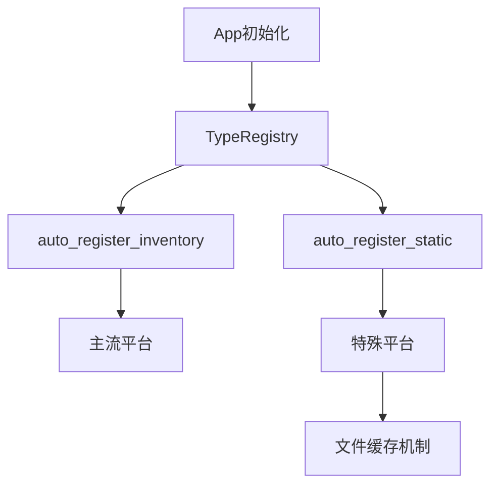

+++
title = "#15030 Reflect auto registration"
date = "2025-08-06T00:00:00"
draft = false
template = "pull_request_page.html"
in_search_index = false

[extra]
current_language = "zh-cn"
available_languages = {"en" = { name = "English", url = "/pull_request/bevy/2025-08/pr-15030-en-20250806" }, "zh-cn" = { name = "中文", url = "/pull_request/bevy/2025-08/pr-15030-zh-cn-20250806" }}
+++

### 技术分析报告：Reflect 自动注册机制

#### 基本信息
- **标题**: Reflect auto registration  
- **PR链接**: https://github.com/bevyengine/bevy/pull/15030  
- **作者**: eugineerd  
- **状态**: MERGED  
- **标签**: C-Usability, A-Reflection, X-Controversial, M-Needs-Release-Note, D-Modest, S-Needs-SME  
- **创建时间**: 2024-09-03T15:37:47Z  
- **合并时间**: 2025-08-06T01:40:33Z  
- **合并者**: cart  

#### 问题背景
在 Bevy 的反射系统中，开发者需要手动注册所有顶层反射类型：
```rs
#[derive(Reflect)]
struct Foo(Bar);

fn main() {
  app.register_type::<Foo>() // 容易遗漏此注册
}
```
遗漏注册会导致运行时反射失败（#3936）。虽然 #5781 解决了嵌套类型的自动注册，但顶层类型仍需手动处理，这在原型开发和组件调试时尤为不便。

#### 解决方案
实现非泛型 `#[derive(Reflect)]` 类型的自动注册：
```rs
#[derive(Reflect)]
pub struct Foo { a: usize }

fn main() {
  // 无需手动注册
  App::new().add_plugins(DefaultPlugins).run();
}
```
通过新增功能标志 `reflect_auto_register` 和 `reflect_auto_register_static` 控制实现方式：
- `auto_register_inventory`: 使用 `inventory` 库（支持主流平台）
- `auto_register_static`: 平台无关实现（备用方案）

#### 核心实现
1. **自动注册触发点**  
   在 App 初始化时自动注册反射类型：
   ```rs
   // bevy_app/src/app.rs
   #[cfg(feature = "reflect_auto_register")]
   app.insert_resource(AppTypeRegistry::new_with_derived_types());
   ```

2. **类型注册扩展**  
   新增 `register_derived_types` 方法收集派生类型：
   ```rs
   // bevy_reflect/src/type_registry.rs
   #[cfg(feature = "auto_register")]
   pub fn register_derived_types(&mut self) {
     crate::__macro_exports::auto_register::register_types(self);
   }
   ```

3. **派生宏扩展**  
   在 `#[derive(Reflect)]` 宏中生成注册代码：
   ```rs
   // bevy_reflect/derive/src/impls/common.rs
   #[cfg(feature = "auto_register_static")]
   unsafe extern "Rust" fn bevy_register_type(registry: &mut TypeRegistry) {
     <#type_path as RegisterForReflection>::__register(registry);
   }
   ```

4. **平台适配方案**  
   - **主流平台**：使用 `inventory` 收集注册函数
   ```rs
   // bevy_reflect/src/lib.rs
   #[cfg(feature = "auto_register_inventory")]
   inventory::submit!(AutomaticReflectRegistrations(registration_fn));
   ```
   - **特殊平台**：通过文件缓存注册函数名
   ```rs
   // 生成唯一函数名并写入文件
   let export_name = format!("_bevy_reflect_register_{}", uuid::Uuid::new_v4().as_u128());
   fs::write("target/bevy_reflect_type_registrations", export_name);
   ```

#### 技术权衡
1. **泛型类型限制**  
   自动注册仅支持非泛型类型，泛型类型仍需手动注册：
   ```rs
   #[derive(Reflect)]
   struct Generic<T> { field: T } // 无法自动注册
   ```

2. **WASM 体积影响**  
   | 构建配置                | 体积变化(KiB) | 百分比变化 |
   |-------------------------|---------------|------------|
   | wasm-release + wasm-bindgen | +2776        | +11.46%    |
   | wasm-opt -Oz + gzip    | +256          | +4.77%     |

3. **选择性退出机制**  
   通过 `#[reflect(no_auto_register)]` 显式禁用自动注册：
   ```rs
   #[derive(Reflect)]
   #[reflect(no_auto_register)]
   struct OptOut { data: String }
   ```

#### 关键文件变更
1. **反射核心逻辑** (`crates/bevy_reflect/src/lib.rs`)  
   - 新增自动注册模块架构
   - 实现两种注册方案适配器
   ```rs
   // 静态注册方案核心
   static REGISTRATION_FNS: Mutex<Vec<fn(&mut TypeRegistry)>> = ...;
   pub fn push_registration_fn(fn_ptr: fn(&mut TypeRegistry)) {
     REGISTRATION_FNS.lock().unwrap().push(fn_ptr);
   }
   ```

2. **派生宏实现** (`crates/bevy_reflect/derive/src/impls/common.rs`)  
   - 添加 `no_auto_register` 属性解析
   - 实现跨平台注册函数生成
   ```rs
   if meta.attrs().no_auto_register() {
     return None; // 跳过被标记的类型
   }
   ```

3. **注册加载器** (`crates/bevy_reflect/derive/src/lib.rs`)  
   - 新增 `load_type_registrations!` 宏
   - 文件扫描方式收集注册函数
   ```rs
   for file_path in fs::read_dir("target/bevy_reflect_type_registrations") {
     // 读取并解析注册函数名
   }
   ```

#### 影响与建议
1. **性能影响**  
   启动时间增加可忽略（Debug WASM <40ms，Native <25ms）

2. **使用建议**  
   - 主流平台：启用 `reflect_auto_register` 特性
   - 特殊平台：使用静态注册示例作为参考
   ```sh
   # 静态注册构建命令
   BEVY_REFLECT_AUTO_REGISTER_STATIC=1 cargo build --features reflect_auto_register_static
   ```

3. **最佳实践**  
   ```rs
   // 需要延迟注册时手动调用
   let mut registry = TypeRegistry::default();
   registry.register_derived_types();
   ```

#### 组件关系


#### 延伸阅读
1. [反射系统设计文档](https://github.com/bevyengine/bevy/blob/main/docs/architecture/reflection.md)  
2. [Inventory 跨平台原理](https://github.com/dtolnay/inventory#platform-support)  
3. [WASM 体积优化指南](https://rustwasm.github.io/docs/book/reference/code-size.html)