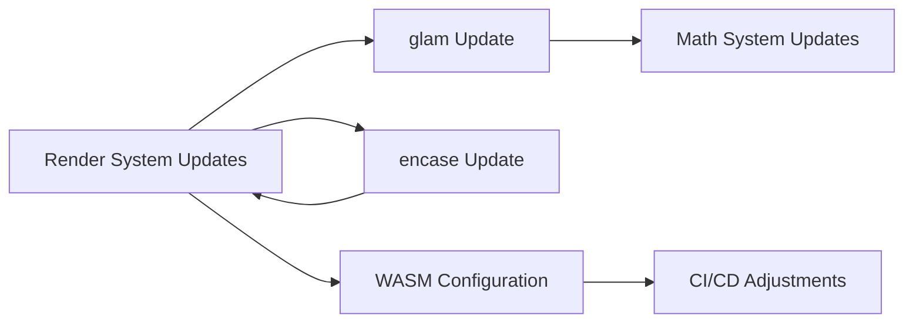

+++
title = "#18047 Update `rand`, `glam` and `encase` to latest versions"
date = "2025-08-09T00:00:00"
draft = false
template = "pull_request_page.html"
in_search_index = true

[taxonomies]
list_display = ["show"]

[extra]
current_language = "en"
available_languages = {"en" = { name = "English", url = "/pull_request/bevy/2025-08/pr-18047-en-20250809" }, "zh-cn" = { name = "中文", url = "/pull_request/bevy/2025-08/pr-18047-zh-cn-20250809" }}
labels = ["C-Dependencies", "A-Math", "X-Controversial", "D-Straightforward", "S-Needs-SME"]
+++

## Dependency Updates in Bevy: `rand`, `glam`, and `encase`

### Basic Information
- **Title**: Update `rand`, `glam` and `encase` to latest versions
- **PR Link**: https://github.com/bevyengine/bevy/pull/18047
- **Author**: Bluefinger
- **Status**: MERGED
- **Labels**: C-Dependencies, A-Math, M-Needs-Migration-Guide, X-Controversial, D-Straightforward, S-Needs-SME
- **Created**: 2025-02-26T14:02:01Z
- **Merged**: 2025-08-09T02:28:54Z
- **Merged By**: james7132

### Description
New `rand` version, which means updating `glam` and `encase` to support the newer ecosystem update. Does mean that this changes how WASM builds need to be done in order to configure `getrandom` correctly, but this can be remedied with updated docs.

#### Solution
Updating all needed dependencies to their compatible versions.

#### Testing
- Must pass CI for all checks, tests, not introduce breaking changes.

---

#### Migration Guide
With newer versions of `glam` & `encase`, the updated versions don't seem to have introduced breakages, though as always, best to consult their docs [1](https://docs.rs/glam/latest/glam/) [2](https://docs.rs/encase/0.11.0/encase/) for any changes.

`rand` changes are more extensive, with changes such as `thread_rng()` -> `rng()`, `from_entropy()` -> `from_os_rng()`, and so forth. `RngCore` is now split into infallible `RngCore` and fallible `TryRngCore`, and the `distributions` module has been renamed to `distr`. Most of this affects only internals, and doesn't directly affect Bevy's APIs. For the full set of changes, see `rand` [migration notes](https://rust-random.github.io/book/update-0.9.html).

`getrandom` is also updated, and will require additional configuration when building Bevy for WASM/Web (if also using `rand`). The full details of how to do this is in the `getrandom` docs [1](https://github.com/rust-random/getrandom?tab=readme-ov-file#opt-in-backends) [2](https://github.com/rust-random/getrandom?tab=readme-ov-file#webassembly-support).

### The Story of This Pull Request

#### The Problem and Context
The PR was initiated to update Bevy's dependencies to their latest versions. The primary driver was the new `rand` 0.9 release, which introduced breaking API changes. This update required corresponding updates to `glam` and `encase` to maintain compatibility across the ecosystem. The challenge was twofold: adapt to API changes in `rand` and configure WASM builds to work with the updated `getrandom` crate, which now requires explicit backend selection for WebAssembly targets.

#### The Solution Approach
The solution involved:
1. Updating version constraints in all relevant `Cargo.toml` files
2. Migrating `rand` API usage to match 0.9 changes
3. Adjusting WASM build configurations to specify the `wasm_js` backend for `getrandom`
4. Updating sampling implementations in `bevy_math` to work with new distribution APIs

Key decisions included maintaining backward compatibility where possible and providing clear migration guidance for users affected by `rand` API changes.

#### The Implementation
The implementation required widespread changes across the codebase:

**1. WASM Configuration Changes**
Added `RUSTFLAGS` configuration for WASM targets to specify the `wasm_js` backend for `getrandom`:

```diff
# .github/workflows/ci.yml
- run: cargo check --target wasm32-unknown-unknown
+ env:
+   RUSTFLAGS: --cfg getrandom_backend="wasm_js"
+ run: cargo check --target wasm32-unknown-unknown
```

**2. Dependency Version Updates**
Updated versions in Cargo manifests:

```toml
# Cargo.toml
-rand = "0.8.0"
-rand_chacha = "0.3.1"
+rand = "0.9.0"
+rand_chacha = "0.9.0"

# crates/bevy_math/Cargo.toml
-glam = { version = "0.29.3" }
-rand = { version = "0.8" }
+glam = { version = "0.30.1" }
+rand = { version = "0.9" }
```

**3. API Migration for `rand` 0.9**
Updated sampling code to use new APIs:

```rust
// Before:
let value = rand::thread_rng().gen_range(0.0..1.0);

// After:
let value = rand::rng().random_range(0.0..1.0);
```

**4. Distribution API Updates**
Adapted to module reorganization in `rand`:

```rust
// Before:
use rand::distributions::{Distribution, WeightedIndex};

// After:
use rand::distr::{Distribution, WeightedIndex};
```

**5. Sampling Logic Refinements**
Updated shape sampling implementations to use new APIs while maintaining correctness:

```rust
// Circle sampling before:
let theta = rng.gen_range(0.0..TAU);
let r_squared = rng.gen_range(0.0..=(self.radius * self.radius));

// After:
let theta = rng.random_range(0.0..TAU);
let r_squared = rng.random_range(0.0..=(self.radius * self.radius));
```

#### Technical Insights
The changes required careful attention to:
1. **Backend Configuration**: WASM builds now require explicit `getrandom_backend` configuration
2. **API Consistency**: New `random_*` methods provide more consistent sampling APIs
3. **Distribution Organization**: The `distr` module consolidates distribution-related functionality
4. **Error Handling**: Separation of fallible/infallible RNG traits improves error handling

#### The Impact
These updates:
1. Bring Bevy's dependencies up-to-date with the latest ecosystem improvements
2. Improve consistency in random sampling APIs
3. Require configuration changes for WASM targets
4. Introduce minor breaking changes in `rand` API usage patterns

### Visual Representation



### Key Files Changed

1. **`crates/bevy_math/src/sampling/shape_sampling.rs` (+65/-61)**
   - Updated all sampling methods to use new `rand` 0.9 APIs
   - Replaced `gen_range` with `random_range`
   - Updated distribution imports

```rust
// Before:
let theta = rng.gen_range(0.0..TAU);

// After:
let theta = rng.random_range(0.0..TAU);
```

2. **`examples/stress_tests/bevymark.rs` (+18/-13)**
   - Updated benchmark to use new random sampling APIs
   - Replaced `gen` with `random` for value generation

```rust
// Before:
let color = Color::linear_rgb(rng.gen(), rng.gen(), rng.gen());

// After:
let color = Color::linear_rgb(rng.random(), rng.random(), rng.random());
```

3. **`crates/bevy_math/src/sampling/standard.rs` (+14/-14)**
   - Updated standard distributions implementation
   - Migrated from `Standard` to `StandardUniform`

```rust
// Before:
impl Distribution<Dir2> for Standard

// After:
impl Distribution<Dir2> for StandardUniform
```

4. **`examples/ecs/iter_combinations.rs` (+11/-11)**
   - Updated entity generation to use new random APIs
   - Replaced `gen_range` with `random_range`

```rust
// Before:
let position = Vec3::new(rng.gen_range(-1.0..1.0), ...);

// After:
let position = Vec3::new(rng.random_range(-1.0..1.0), ...);
```

5. **`examples/gizmos/axes.rs` (+9/-9)**
   - Updated random transform generation
   - Replaced `rng.gen()` with `rng.random()`

```rust
// Before:
let x = rng.gen::<f32>() * range;

// After:
let x = rng.random::<f32>() * range;
```

### Further Reading
1. [`rand` Migration Guide](https://rust-random.github.io/book/update-0.9.html)
2. [`glam` Documentation](https://docs.rs/glam/latest/glam/)
3. [`encase` Documentation](https://docs.rs/encase/0.11.0/encase/)
4. [WebAssembly `getrandom` Configuration](https://github.com/rust-random/getrandom?tab=readme-ov-file#webassembly-support)