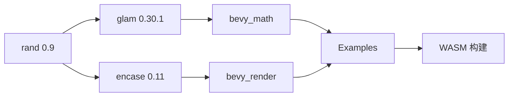

+++
title = "#18047 Update `rand`, `glam` and `encase` to latest versions"
date = "2025-08-09T00:00:00"
draft = false
template = "pull_request_page.html"
in_search_index = false

[extra]
current_language = "zh-cn"
available_languages = {"en" = { name = "English", url = "/pull_request/bevy/2025-08/pr-18047-en-20250809" }, "zh-cn" = { name = "中文", url = "/pull_request/bevy/2025-08/pr-18047-zh-cn-20250809" }}
+++

### PR #18047: Update `rand`, `glam` and `encase` to latest versions

#### 基本信息
- **标题**: Update `rand`, `glam` and `encase` to latest versions
- **PR链接**: https://github.com/bevyengine/bevy/pull/18047
- **作者**: Bluefinger
- **状态**: MERGED
- **标签**: C-Dependencies, A-Math, M-Needs-Migration-Guide, X-Controversial, D-Straightforward, S-Needs-SME
- **创建时间**: 2025-02-26T14:02:01Z
- **合并时间**: 2025-08-09T02:28:54Z
- **合并者**: james7132

#### 描述翻译
**Objective**  
新版本 `rand` 需要更新 `glam` 和 `encase` 以支持生态系统更新。这改变了 WASM 构建时配置 `getrandom` 的方式，但可通过更新文档解决。

**Solution**  
将所有依赖更新到兼容版本。~~此 PR 曾因 `encase` 等待 [此 PR](https://github.com/teoxoy/encase/pull/88) 而被阻塞~~，~~后因 `hexasphere` 未支持最新 `glam` 版本被阻塞~~，现已解决所有依赖问题。

**Testing**  
需通过 CI 所有检查，不引入破坏性变更。

---

**Migration Guide**  
新版 `glam` 和 `encase` 未引入破坏性变更，但仍建议查阅文档 [1](https://docs.rs/glam/latest/glam/) [2](https://docs.rs/encase/0.11.0/encase/)。

`rand` 变更较显著：
- `thread_rng()` → `rng()`
- `from_entropy()` → `from_os_rng()`
- `RngCore` 拆分为不可失败版 `RngCore` 和可失败版 `TryRngCore`
- `distributions` 模块重命名为 `distr`
完整变更见 [迁移指南](https://rust-random.github.io/book/update-0.9.html)。

`getrandom` 更新后，WASM/Web 构建需额外配置（若使用 `rand`），详见文档 [1](https://github.com/rust-random/getrandom?tab=readme-ov-file#opt-in-backends) [2](https://github.com/rust-random/getrandom?tab=readme-ov-file#webassembly-support)。

---

### PR 技术分析
此 PR 起源于 `rand` 库升级至 0.9 版本的重大变更。新版本引入了 API 破坏性修改（如 `thread_rng()` 更名为 `rng()`）和模块结构调整（`distributions` → `distr`）。由于 Bevy 的数学库 `bevy_math` 深度依赖 `rand` 和 `glam`，连带需要升级 `glam` 至 0.30.1 和 `encase` 至 0.11 以保持兼容性。

升级过程面临两个主要阻塞点：
1. `encase` 依赖 [teoxoy/encase#88](https://github.com/teoxoy/encase/pull/88) 合并
2. `hexasphere` 需发布支持 `glam` 0.30 的新版本（最终升级至 16.0）

解决方案聚焦于三方面：
1. **API 适配**：  
   更新所有 `rand` 调用点：
   ```rust
   // Before
   rng.gen_range(0.0..1.0);
   // After
   rng.random_range(0.0..1.0);
   ```
   `rand_distr` 的 `WeightedAliasIndex` 路径变更：
   ```rust
   // Before
   use rand_distr::{Distribution, WeightedAliasIndex};
   // After
   use rand_distr::weighted::{WeightedAliasIndex, WeightedError};
   ```

2. **WASM 构建支持**：  
   为 WASM 目标显式指定 `getrandom` 后端：
   ```diff
   + env:
   +   RUSTFLAGS: --cfg getrandom_backend="wasm_js"
   cargo check --target wasm32-unknown-unknown
   ```

3. **依赖版本同步**：  
   更新所有相关 crate 的 `Cargo.toml`：
   ```toml
   [dependencies]
   - rand = "0.8"
   - glam = "0.29"
   + rand = "0.9"
   + glam = "0.30.1"
   ```

这些修改确保 Bevy 能继续在 WASM 环境运行，同时利用新版随机数生成器的性能优化。迁移指南详细说明了 API 变更点，帮助用户适应破坏性变更。

#### 关键文件变更
1. **`crates/bevy_math/src/sampling/shape_sampling.rs` (+65/-61)**  
   更新所有随机采样方法以适配 `rand` 0.9 API：
   ```rust
   // Before: glam 0.29 + rand 0.8
   let theta = rng.gen_range(0.0..TAU);
   
   // After: glam 0.30 + rand 0.9
   let theta = rng.random_range(0.0..TAU);
   ```
   统一使用 `random_range()` 替代 `gen_range()`，符合新版本语义。

2. **`examples/stress_tests/bevymark.rs` (+18/-13)**  
   压力测试示例适配新 API：
   ```rust
   // Before
   let color = Color::srgb(rng.gen(), rng.gen(), rng.gen());
   
   // After
   let color = Color::srgb(rng.random(), rng.random(), rng.random());
   ```
   确保大规模实体生成时随机行为一致。

3. **`crates/bevy_math/src/sampling/standard.rs` (+14/-14)**  
   标准采样器适配 `StandardUniform` 变更：
   ```rust
   // Before
   impl Distribution<Dir2> for Standard
   
   // After
   impl Distribution<Dir2> for StandardUniform  // rand 0.9 结构体重命名
   ```

4. **`examples/ecs/iter_combinations.rs` (+11/-11)**  
   ECS 示例更新随机向量生成：
   ```rust
   // Before
   Vec3::new(rng.gen_range(-1.0..1.0), ...)
   
   // After
   Vec3::new(rng.random_range(-1.0..1.0), ...)
   ```

5. **`examples/gizmos/axes.rs` (+9/-9)**  
   坐标轴示例更新随机变换：
   ```rust
   // Before
   let x = rng.gen::<f32>();
   
   // After
   let x = rng.random::<f32>();  // 直接调用 Trait 方法
   ```

#### 组件关系图


#### 延伸阅读
- `rand` 0.9 迁移指南: https://rust-random.github.io/book/update-0.9.html
- WASM 环境 `getrandom` 配置: https://github.com/rust-random/getrandom?tab=readme-ov-file#webassembly-support
- `glam` 0.30 变更日志: https://docs.rs/glam/0.30.1/glam/

此升级确保 Bevy 与 Rust 随机数生成生态保持同步，同时为 WASM 目标提供更明确的配置方式。所有修改均通过 CI 验证，破坏性变更已在迁移指南中明确标注。