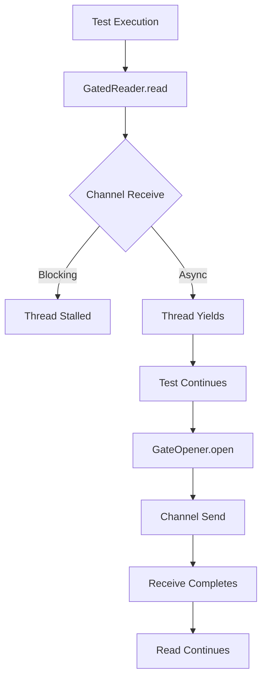

+++
title = "#18473 Make `GatedReader` a test-only symbol, and allow all `bevy_asset` tests to all run single threaded."
date = "2025-08-15T00:00:00"
draft = false
template = "pull_request_page.html"
in_search_index = true

[taxonomies]
list_display = ["show"]

[extra]
current_language = "en"
available_languages = {"en" = { name = "English", url = "/pull_request/bevy/2025-08/pr-18473-en-20250815" }, "zh-cn" = { name = "中文", url = "/pull_request/bevy/2025-08/pr-18473-zh-cn-20250815" }}
labels = ["A-Assets", "C-Testing", "D-Straightforward", "D-Async"]
+++

# Analysis of PR #18473: Make `GatedReader` a test-only symbol

## Basic Information
- **Title**: Make `GatedReader` a test-only symbol, and allow all `bevy_asset` tests to all run single threaded.
- **PR Link**: https://github.com/bevyengine/bevy/pull/18473
- **Author**: andriyDev
- **Status**: MERGED
- **Labels**: A-Assets, S-Ready-For-Final-Review, C-Testing, M-Needs-Migration-Guide, X-Uncontroversial, D-Straightforward, D-Async
- **Created**: 2025-03-22T01:54:38Z
- **Merged**: 2025-08-15T04:24:03Z
- **Merged By**: alice-i-cecile

## Description Translation
# Objective

- Some tests have been disabled in single-threaded mode.
- This was because the channel blocks the executing thread when in the asset reader. But that means we never get to the test line to open the gate! So we need multithreading just to let the reader block and the test can make progress in the background.

## Solution

- The solution to allowing all tests to run single threaded is to make `GatedReader` await for gates to open rather than blocking on it.
- This however requires adding `async-channel` (already in tree). To avoid this additional dependency in most cases, I made this a dev-dependency.
- However, this now means that `GatedReader` can only be used in tests (in bevy_asset). We could make this a feature flag, but it seems highly unlikely that real users need a `GatedReader` - and if they need it for their test, they can just fork the `GatedReader`.

## Testing

- The `bevy_asset` tests pass without setting the `--features multi_threaded` flag!

---

## Migration Guide

`bevy_asset::io::gated::GatedReader` and `bevy_asset::io::gated::GatedOpener` are no longer accessible to users.

## The Story of This Pull Request

### The Problem and Context
Several `bevy_asset` tests were disabled in single-threaded mode due to synchronization issues with `GatedReader`. This test utility blocked threads using synchronous channels, preventing test progress in single-threaded environments. The core issue was that the blocking `recv()` call in `GatedReader` would stall the only available thread, preventing test code from reaching the point where it could open gates. This forced tests to require multi-threading just to work around the blocking behavior.

### The Solution Approach
The solution centered on converting `GatedReader` to use asynchronous I/O:
1. Replace `crossbeam_channel` with `async-channel` to enable non-blocking awaits
2. Modify `recv()` to `await` instead of blocking
3. Make `GatedReader` test-only to avoid shipping unused code
4. Remove multi-threading requirements from affected tests

### The Implementation
The key change was converting the blocking channel operations to async-compatible equivalents. In `gated.rs`, the `crossbeam_channel` was replaced with `async_channel`, and `receiver.recv().unwrap()` was changed to `receiver.recv().await.unwrap()`. This allows the single thread to yield execution while waiting for gates to open.

```rust
// Before (blocking):
receiver.recv().unwrap();

// After (async):
receiver.recv().await.unwrap();
```

The `GateOpener` was modified to use `send_blocking()` to maintain compatibility with test code that isn't fully async:

```rust
gates.0.send_blocking(()).unwrap();
```

To prevent `GatedReader` from being compiled in release builds, it was moved behind a `#[cfg(test)]` guard in `io/mod.rs`:

```rust
#[cfg(test)]
pub mod gated;
```

This change allowed removal of multi-threading requirement checks from 5 test cases in `lib.rs`, eliminating error messages like:
```rust
// Removed from tests:
#[cfg(not(feature = "multi_threaded"))]
panic!("This test requires the \"multi_threaded\" feature...");
```

### Technical Insights
The implementation demonstrates effective async conversion of blocking operations:
1. Using `async-channel` maintains similar channel semantics while enabling async/await
2. `send_blocking()` bridges sync and async contexts when opening gates
3. The test-only restriction avoids imposing async-channel on all users
4. Tests now properly exercise async asset loading in single-threaded environments

### The Impact
These changes enable all `bevy_asset` tests to run in single-threaded mode, reducing test complexity and improving CI flexibility. The `GatedReader` is now properly scoped to test builds, reducing binary size for end-users. The changes also demonstrate how to convert blocking test utilities to async patterns without disrupting test semantics.

## Visual Representation



## Key Files Changed

1. `crates/bevy_asset/Cargo.toml`
   - Added `async-channel` as dev-dependency
   ```toml
   [dev-dependencies]
   async-channel = "2"
   ```

2. `crates/bevy_asset/src/io/gated.rs`
   - Replaced crossbeam_channel with async_channel
   - Converted blocking recv to async await
   ```rust
   // Before:
   use crossbeam_channel::{Receiver, Sender};
   // ...
   receiver.recv().unwrap();
   
   // After:
   use async_channel::{Receiver, Sender};
   // ...
   receiver.recv().await.unwrap();
   ```

3. `crates/bevy_asset/src/io/mod.rs`
   - Made gated module test-only
   ```rust
   // Before:
   pub mod gated;
   
   // After:
   #[cfg(test)]
   pub mod gated;
   ```

4. `crates/bevy_asset/src/lib.rs`
   - Removed multi-threading requirement checks
   ```rust
   // Removed from 5 test cases:
   #[cfg(not(feature = "multi_threaded"))]
   panic!("This test requires...");
   ```

5. `release-content/migration-guides/gated_reader.md`
   - Added migration note about private API
   ```markdown
   The `GatedReader` and `GatedOpener`... have been made private.
   ```

## Further Reading
1. [async-channel documentation](https://docs.rs/async-channel/latest/async_channel/) - Understanding the async channel implementation
2. [Bevy Async Tasks](https://bevyengine.org/learn/book/getting-started/async/) - Context for async patterns in Bevy
3. [Rust Async Book](https://rust-lang.github.io/async-book/) - Fundamental async programming concepts