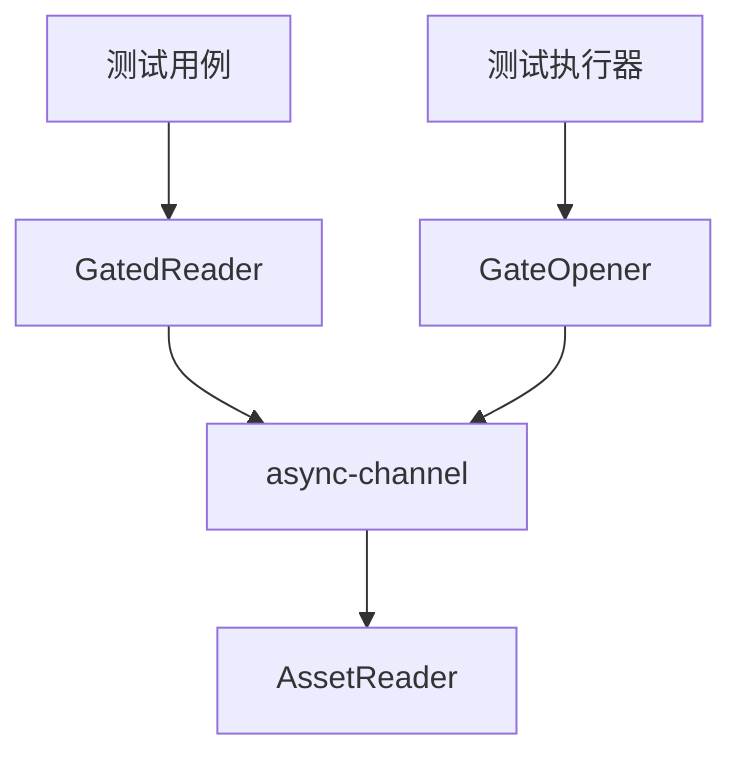

+++
title = "#18473 Make `GatedReader` a test-only symbol, and allow all `bevy_asset` tests to all run single threaded."
date = "2025-08-15T00:00:00"
draft = false
template = "pull_request_page.html"
in_search_index = false

[extra]
current_language = "zh-cn"
available_languages = {"en" = { name = "English", url = "/pull_request/bevy/2025-08/pr-18473-en-20250815" }, "zh-cn" = { name = "中文", url = "/pull_request/bevy/2025-08/pr-18473-zh-cn-20250815" }}
+++

### Make `GatedReader` a test-only symbol, and allow all `bevy_asset` tests to all run single threaded.

## 基本信息
- **标题**: Make `GatedReader` a test-only symbol, and allow all `bevy_asset` tests to all run single threaded.
- **PR链接**: https://github.com/bevyengine/bevy/pull/18473
- **作者**: andriyDev
- **状态**: 已合并
- **标签**: A-Assets, S-Ready-For-Final-Review, C-Testing, M-Needs-Migration-Guide, X-Uncontroversial, D-Straightforward, D-Async
- **创建时间**: 2025-03-22T01:54:38Z
- **合并时间**: 2025-08-15T04:24:03Z
- **合并人**: alice-i-cecile

## 描述翻译

### 目标
- 部分测试在单线程模式下被禁用
- 原因是当位于asset reader中时，通道会阻塞执行线程。这意味着测试代码无法执行到打开gate的代码行！因此我们需要多线程才能让reader阻塞，同时测试代码能在后台继续执行。

### 解决方案
- 允许所有测试在单线程下运行的解决方案是让`GatedReader`等待gate打开，而不是阻塞线程。
- 这需要引入`async-channel`（已在依赖树中）。为避免在大多数情况下增加此额外依赖，我将其设为dev-dependency。
- 但这意味着`GatedReader`只能用于测试（在bevy_asset中）。我们可以为其添加feature flag，但真实用户需要`GatedReader`的可能性极低——如果他们需要在测试中使用，可以直接fork`GatedReader`。

### 测试验证
- 在不设置`--features multi_threaded`标志的情况下，`bevy_asset`测试全部通过！

---

## 迁移指南
`bevy_asset::io::gated::GatedReader`和`bevy_asset::io::gated::GatedOpener`不再对用户开放。

## PR技术分析

### 问题背景
在`bevy_asset`的测试套件中，多个测试（如`load_dependencies`、`failure_load_states`等）强制要求使用多线程模式运行。这些测试依赖`GatedReader`实现同步控制，但原始实现使用阻塞式通道（`crossbeam_channel`）导致单线程环境死锁：当测试线程执行到`GatedReader`时被阻塞，无法执行后续打开gate的代码，形成永久等待状态。

### 解决方案设计
核心思路是将阻塞操作改为异步等待：
1. 将`crossbeam_channel`替换为`async_channel`实现非阻塞等待
2. 限制`GatedReader`仅在测试环境中编译，避免生产代码负担
3. 移除测试中强制多线程的panic逻辑

权衡考虑：
- 引入`async-channel`作为dev-dependency而非主依赖，避免影响生产构建
- 不提供feature flag因真实场景无需此功能
- 牺牲`GatedReader`的公共访问性（用户可自行fork）

### 实现细节
#### 1. 通道机制改造
将阻塞式`recv()`改为异步`recv().await`：

```rust
// crates/bevy_asset/src/io/gated.rs
// 修改前
use crossbeam_channel::{Receiver, Sender};
// ...
receiver.recv().unwrap();

// 修改后
use async_channel::{Receiver, Sender};
// ...
receiver.recv().await.unwrap();
```

对应地，发送端使用`send_blocking()`保持同步接口：

```rust
// 修改前
gates.0.send(()).unwrap();

// 修改后
gates.0.send_blocking(()).unwrap();
```

#### 2. 测试专用隔离
通过条件编译将`gated`模块限制在测试环境：

```rust
// crates/bevy_asset/src/io/mod.rs
// 修改前
pub mod gated;

// 修改后
#[cfg(test)]
pub mod gated;
```

#### 3. 清理测试约束
移除5个测试中强制多线程的panic逻辑：

```rust
// crates/bevy_asset/src/lib.rs
// 修改前
#[cfg(not(feature = "multi_threaded"))]
panic!("This test requires ...");

// 修改后
// 完全移除panic代码块
```

### 技术影响
1. **单线程测试支持**：所有`bevy_asset`测试现在可在单线程环境执行
2. **依赖优化**：
   - 主代码库不增加新依赖
   - `async-channel`仅作为dev-dependency引入
3. **API精简**：
   - 移除非必要公共接口（用户不应在生产环境使用测试工具）
   - 通过`#[cfg(test)]`精确控制编译范围
4. **维护性提升**：消除特殊编译标志（`multi_threaded`）简化测试流程

### 性能考量
- **零运行时开销**：生产构建完全排除`GatedReader`相关代码
- **测试效率**：异步等待避免线程阻塞，提高测试调度效率

## 组件关系图



## 关键文件变更

### 1. 通道实现改造
**文件**: `crates/bevy_asset/src/io/gated.rs`  
将阻塞通道替换为异步通道，解决单线程死锁问题：

```diff
- use crossbeam_channel::{Receiver, Sender};
+ use async_channel::{Receiver, Sender};

  let gates = gates
      .entry_ref(path.as_ref())
-     .or_insert_with(crossbeam_channel::unbounded);
+     .or_insert_with(async_channel::unbounded);

- gates.0.send(()).unwrap();
+ gates.0.send_blocking(()).unwrap();

- receiver.recv().unwrap();
+ receiver.recv().await.unwrap();
```

### 2. 模块可见性控制
**文件**: `crates/bevy_asset/src/io/mod.rs`  
限制`gated`模块仅在测试环境编译：

```diff
- pub mod gated;
+ #[cfg(test)]
+ pub mod gated;
```

### 3. 测试约束清理
**文件**: `crates/bevy_asset/src/lib.rs`  
移除5个测试中的多线程强制要求：

```diff
  #[test]
  fn load_dependencies() {
-     #[cfg(not(feature = "multi_threaded"))]
-     panic!("This test requires ...");
      // 测试主体保持不变
  }
```

### 4. 依赖管理
**文件**: `crates/bevy_asset/Cargo.toml`  
添加仅用于测试的异步通道依赖：

```toml
[dev-dependencies]
async-channel = "2"
```

### 5. 迁移指南
**文件**: `release-content/migration-guides/gated_reader.md`  
新增用户迁移说明：

```markdown
---
title: `GatedReader` and `GatedOpener` are now private.
pull_requests: [18473]
---

The `GatedReader` and `GatedOpener` for `bevy_asset` have been made private...
```

## 延伸阅读
1. [async-channel文档](https://docs.rs/async-channel/latest/async_channel/)：了解异步通道实现机制
2. [Rust条件编译](https://doc.rust-lang.org/reference/conditional-compilation.html)：掌握`#[cfg]`属性用法
3. [Bevy异步资产加载](https://bevyengine.org/learn/book/next/assets/)：理解资产系统异步设计原理