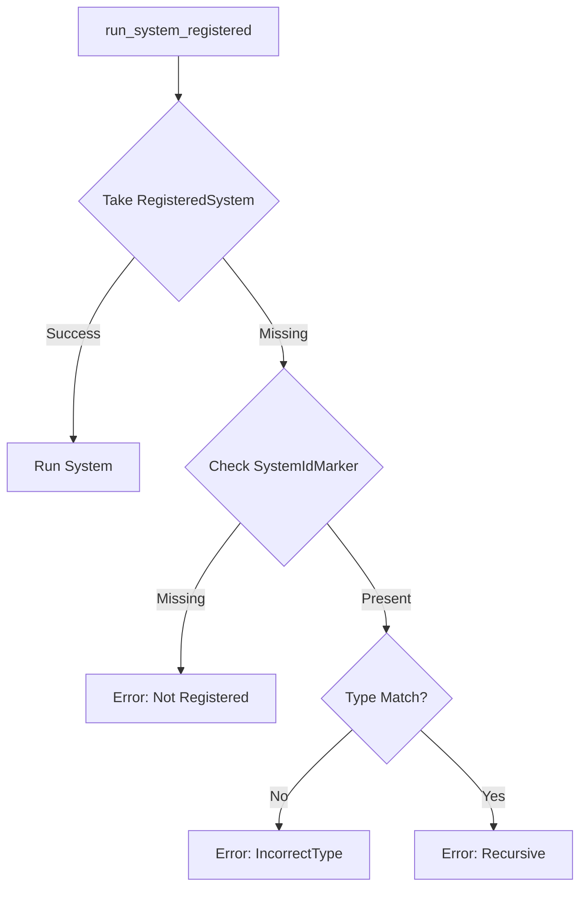

+++
title = "#19011 Improve error for when you try running a one-shot system with wrong `SystemId` type"
date = "2025-08-06T00:00:00"
draft = false
template = "pull_request_page.html"
in_search_index = true

[taxonomies]
list_display = ["show"]

[extra]
current_language = "en"
available_languages = {"en" = { name = "English", url = "/pull_request/bevy/2025-08/pr-19011-en-20250806" }, "zh-cn" = { name = "中文", url = "/pull_request/bevy/2025-08/pr-19011-zh-cn-20250806" }}
labels = ["A-ECS", "C-Usability", "D-Straightforward"]
+++

### Improve Error for Running One-Shot System with Wrong `SystemId` Type

#### Basic Information
- **Title**: Improve error for when you try running a one-shot system with wrong `SystemId` type
- **PR Link**: https://github.com/bevyengine/bevy/pull/19011
- **Author**: hukasu
- **Status**: MERGED
- **Labels**: A-ECS, C-Usability, S-Ready-For-Final-Review, M-Needs-Migration-Guide, X-Uncontroversial, D-Straightforward
- **Created**: 2025-05-01T14:16:37Z
- **Merged**: 2025-08-06T17:34:30Z
- **Merged By**: alice-i-cecile

#### Description
# Objective

Improve error message when running a one-shot system with a `SystemId` of wrong type. 

## Solution

Added a resource to keep track of running one-shot systems, and return `Recursive` error if a system gets run before the end of their previous invocation. The error for not being able to `take` a `RegisteredSystem` is now `MaybeWrongType`.

## Testing

Minimal reproduction from #19005

## Showcase

```
// Old
2025-05-01T12:42:54.305283Z  WARN bevy_ecs::error::handler: Encountered an error in command `bevy_ecs::system::commands::command::run_system<()>::{{closure}}`: System SystemId(4v1#4294967300) tried to run itself recursively
2025-05-01T12:42:54.305311Z  WARN bevy_ecs::error::handler: Encountered an error in command `bevy_ecs::system::commands::command::run_system_with<bevy_ecs::system::input::In<&str>>::{{closure}}`: System SystemId(5v1#4294967301) tried to run itself recursively

// New
2025-05-05T14:21:44.918145Z  WARN bevy_ecs::error::handler: Encountered an error in command `bevy_ecs::system::commands::command::run_system<()>::{{closure}}`: Could not get system from `SystemId`, entity was `SystemId<(), Result<(), BevyError>>`
2025-05-05T14:21:44.918177Z  WARN bevy_ecs::error::handler: Encountered an error in command `bevy_ecs::system::commands::command::run_system_with<bevy_ecs::system::input::In<&str>>::{{closure}}`: Could not get system from `SystemId<In<&str>>`, entity was `SystemId<In<&str>, Result<(), BevyError>>`
```

## TODO
- [x] Add `TypeId` to `SystemIdMarker`
- [x] Migration guide for new enum variant

#### The Story of This Pull Request

**The Problem and Context**  
When running one-shot systems via `SystemId`, developers encountered misleading "recursive system" warnings when accidentally using a `SystemId` with mismatched input/output types. The original error (`RegisteredSystemError::Recursive`) incorrectly implied the system was running itself, when the actual issue was a type mismatch. This caused confusion during debugging, as seen in issue #19005. The core limitation was that `SystemIdMarker` lacked type information to distinguish between actual recursion and type errors.

**The Solution Approach**  
The fix enhances type tracking in `SystemIdMarker` by storing `TypeId` and type names for both input (`I`) and output (`O`) generics. When a system execution fails due to missing `RegisteredSystem`, we now:
1. Check if the entity has a `SystemIdMarker`
2. Compare expected vs. actual type IDs
3. Return `IncorrectType` error for mismatches while preserving `Recursive` for genuine recursion cases

**Implementation Details**  
We introduced `TypeIdAndName` to bundle type metadata:

```rust
struct TypeIdAndName {
    type_id: TypeId,
    name: DebugName,
}
```

`SystemIdMarker` was expanded to store this metadata for input/output types:

```rust
pub struct SystemIdMarker {
    input_type_id: TypeIdAndName,
    output_type_id: TypeIdAndName,
}
```

The key error-handling logic in `run_system_registered` now distinguishes errors:

```rust
let Some(RegisteredSystem { ... }) = entity.take::<RegisteredSystem<I, O>>() else {
    let Some(system_id_marker) = entity.get::<SystemIdMarker>() else { ... };
    
    // Type mismatch check
    if system_id_marker.input_type_id.type_id != TypeId::of::<I>()
        || system_id_marker.output_type_id.type_id != TypeId::of::<O>()
    {
        return Err(RegisteredSystemError::IncorrectType(...));
    }
    return Err(RegisteredSystemError::Recursive(...));
};
```

A new error variant generates targeted messages:

```rust
#[error("Could not get system from `{}`, entity was `SystemId<{}, {}>`", ...)]
IncorrectType(SystemId<I, O>, SystemIdMarker),
```

**Technical Insights**  
Storing `TypeId` enables precise error differentiation without runtime overhead. The solution:
- Maintains backward compatibility
- Adds minimal memory footprint (two `TypeIdAndName` structs)
- Uses zero-cost abstractions like `TypeId::of`
- Preserves existing recursion detection

**The Impact**  
Debugging one-shot systems becomes significantly easier with explicit type mismatch errors. The PR also:
- Adds a migration guide for the new error variant
- Includes a test validating error behavior
- Maintains identical performance characteristics
- Improves API clarity by distinguishing recursion from type errors

#### Visual Representation


#### Key Files Changed

**1. `crates/bevy_ecs/src/system/system_registry.rs` (+87/-16)**  
Added type metadata to `SystemIdMarker` and refined error handling:
```rust
// Before:
#[derive(Component, Default)]
pub struct SystemIdMarker;

// After:
#[derive(Debug, Default, Clone, Component)]
pub struct SystemIdMarker {
    input_type_id: TypeIdAndName,
    output_type_id: TypeIdAndName,
}

// Error handling before:
.take::<RegisteredSystem<I, O>>()
.ok_or(RegisteredSystemError::Recursive(id))?;

// Error handling after:
else {
    // Type checking logic
    if mismatch {
        return Err(RegisteredSystemError::IncorrectType(...));
    }
    return Err(RegisteredSystemError::Recursive(...));
};
```

**2. `release-content/migration-guides/incorrect-type-error-on-run-system-command.md` (+7/-0)**  
Added migration note for new error variant:
```markdown
---
title: Improve error when using `run_system` command with a `SystemId` of wrong type
pull_requests: [19011]
---

Added a new error to `RegisteredSystemError` to inform of use of `run_system` command and its
variants with a `SystemId` of wrong type.
```

#### Further Reading
- [Bevy ECS System Documentation](https://bevyengine.org/learn/book/ecs/systems/)
- [Rust TypeId API](https://doc.rust-lang.org/std/any/struct.TypeId.html)
- [Error Handling in Bevy](https://github.com/bevyengine/bevy/blob/main/ERROR_HANDLING.md)