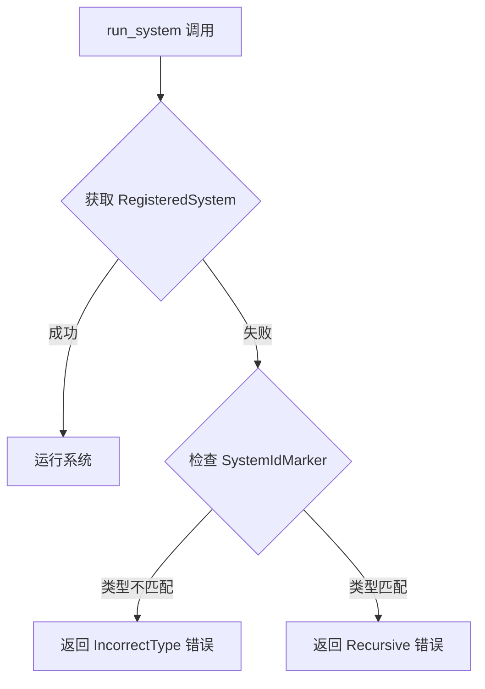

+++
title = "#19011 Improve error for when you try running a one-shot system with wrong `SystemId` type"
date = "2025-08-06T00:00:00"
draft = false
template = "pull_request_page.html"
in_search_index = false

[extra]
current_language = "zh-cn"
available_languages = {"en" = { name = "English", url = "/pull_request/bevy/2025-08/pr-19011-en-20250806" }, "zh-cn" = { name = "中文", url = "/pull_request/bevy/2025-08/pr-19011-zh-cn-20250806" }}
labels = ["A-ECS", "C-Usability", "D-Straightforward"]
+++

# PR 分析报告：改进当使用错误类型的 SystemId 运行一次性系统时的错误提示

## Basic Information
- **Title**: Improve error for when you try running a one-shot system with wrong `SystemId` type
- **PR Link**: https://github.com/bevyengine/bevy/pull/19011
- **Author**: hukasu
- **Status**: MERGED
- **Labels**: A-ECS, C-Usability, S-Ready-For-Final-Review, M-Needs-Migration-Guide, X-Uncontroversial, D-Straightforward
- **Created**: 2025-05-01T14:16:37Z
- **Merged**: 2025-08-06T17:34:30Z
- **Merged By**: alice-i-cecile

## Description Translation
### 目标
改进当使用错误类型的 `SystemId` 运行一次性系统时的错误消息。

### 解决方案
添加一个资源来跟踪运行中的一次性系统，如果系统在前一次调用结束前再次运行，则返回 `Recursive` 错误。无法 `take` 一个 `RegisteredSystem` 的错误现在改为 `MaybeWrongType`。

### 测试
来自 #19005 的最小复现

### 展示
```
// 旧版
2025-05-01T12:42:54.305283Z  WARN bevy_ecs::error::handler: Encountered an error in command `bevy_ecs::system::commands::command::run_system<()>::{{closure}}`: System SystemId(4v1#4294967300) tried to run itself recursively
2025-05-01T12:42:54.305311Z  WARN bevy_ecs::error::handler: Encountered an error in command `bevy_ecs::system::commands::command::run_system_with<bevy_ecs::system::input::In<&str>>::{{closure}}`: System SystemId(5v1#4294967301) tried to run itself recursively

// 新版
2025-05-05T14:21:44.918145Z  WARN bevy_ecs::error::handler: Encountered an error in command `bevy_ecs::system::commands::command::run_system<()>::{{closure}}`: Could not get system from `SystemId`, entity was `SystemId<(), Result<(), BevyError>>`
2025-05-05T14:21:44.918177Z  WARN bevy_ecs::error::handler: Encountered an error in command `bevy_ecs::system::commands::command::run_system_with<bevy_ecs::system::input::In<&str>>::{{closure}}`: Could not get system from `SystemId<In<&str>>`, entity was `SystemId<In<&str>, Result<(), BevyError>>`
```

### TODO
- [x] 添加 `TypeId` 到 `SystemIdMarker`
- [x] 为新枚举变体添加迁移指南

## The Story of This Pull Request

### 问题和背景
在 Bevy ECS 中，一次性系统(one-shot system)通过 `SystemId` 标识和运行。当开发者错误地使用类型不匹配的 `SystemId` 调用系统时，原有实现会返回模糊的错误信息"System tried to run itself recursively"。这个错误信息具有误导性，因为实际问题是类型不匹配而非递归调用。这种混淆增加了调试难度，特别是在处理复杂系统时。

### 解决方案
核心思路是在 `SystemIdMarker` 中存储系统的类型信息(TypeId)，并在运行系统时验证类型匹配性。具体实现分为三个关键部分：

1. **增强 SystemIdMarker**：添加输入/输出类型信息存储
2. **改进错误处理**：引入新的错误变体区分类型错误和递归错误
3. **精确类型验证**：在运行系统时执行严格的类型检查

### 实现细节
**SystemIdMarker 重构**：
```rust
// 旧版
#[derive(Component, Default)]
pub struct SystemIdMarker;

// 新版
#[derive(Debug, Default, Clone, Component)]
pub struct SystemIdMarker {
    input_type_id: TypeIdAndName,
    output_type_id: TypeIdAndName,
}

impl SystemIdMarker {
    fn typed_system_id_marker<I: 'static, O: 'static>() -> Self {
        Self {
            input_type_id: TypeIdAndName::new::<I>(),
            output_type_id: TypeIdAndName::new::<O>(),
        }
    }
}
```
新的 `SystemIdMarker` 现在包含：
- `input_type_id`：存储系统输入类型的 TypeId 和类型名称
- `output_type_id`：存储系统输出类型的 TypeId 和类型名称
`TypeIdAndName` 辅助结构体负责封装类型信息，其 `new<T>()` 方法自动获取指定类型的元数据。

**运行系统时的类型验证**：
```rust
let Some(RegisteredSystem {
    mut initialized,
    mut system,
}) = entity.take::<RegisteredSystem<I, O>>()
else {
    let Some(system_id_marker) = entity.get::<SystemIdMarker>() else {
        return Err(RegisteredSystemError::SystemIdNotRegistered(id));
    };
    if system_id_marker.input_type_id.type_id != TypeId::of::<I>()
        || system_id_marker.output_type_id.type_id != TypeId::of::<O>()
    {
        return Err(RegisteredSystemError::IncorrectType(
            id,
            system_id_marker.clone(),
        ));
    }
    return Err(RegisteredSystemError::Recursive(id));
};
```
当无法获取 `RegisteredSystem` 组件时，这段逻辑：
1. 检查是否存在 `SystemIdMarker`
2. 比较期望类型与实际存储的类型 TypeId
3. 类型不匹配时返回 `IncorrectType` 错误
4. 类型匹配但无法获取系统时，才返回 `Recursive` 错误

**新增错误类型**：
```rust
#[error("Could not get system from `{}`, entity was `SystemId<{}, {}>`", 
    DebugName::type_name::<SystemId<I, O>>(), 
    .1.input_type_id.name, 
    .1.output_type_id.name)]
IncorrectType(SystemId<I, O>, SystemIdMarker),
```
新错误变体提供详细信息：
- 期望的系统类型名称
- 实际存储的输入类型名称
- 实际存储的输出类型名称

### 测试验证
新增的测试用例验证类型错误处理：
```rust
#[test]
fn wrong_system_type() {
    fn test() -> Result<(), u8> { Ok(()) }
    
    let mut world = World::new();
    let entity = world.register_system_cached(test).entity();
    
    match world.run_system::<u8>(SystemId::from_entity(entity)) {
        Ok(_) => panic!("Should fail with wrong SystemId type"),
        Err(RegisteredSystemError::IncorrectType(_, _)) => (),
        Err(err) => panic!("Wrong error: `{:?}`", err),
    }
}
```
这个测试：
1. 注册返回 `Result<(), u8>` 的系统
2. 尝试用 `u8` 输出类型运行系统
3. 验证返回 `IncorrectType` 错误而非其他错误

### 影响和意义
1. **调试效率提升**：错误信息现在明确指示类型不匹配问题，减少误判
2. **错误分类精确化**：区分真正的递归错误和类型错误
3. **API 健壮性增强**：在系统注册时捕获类型信息，提供运行时验证
4. **向后兼容**：通过迁移指南说明变化，不影响现有正确用法

## Visual Representation



## Key Files Changed

### crates/bevy_ecs/src/system/system_registry.rs (+87/-16)
**修改目的**：实现类型验证核心逻辑和错误处理  
**关键变更**：
1. `SystemIdMarker` 添加类型信息存储
```rust
// 添加类型信息存储
pub struct SystemIdMarker {
    input_type_id: TypeIdAndName,
    output_type_id: TypeIdAndName,
}
```
2. 运行系统时的类型验证逻辑
```rust
if system_id_marker.input_type_id.type_id != TypeId::of::<I>()
    || system_id_marker.output_type_id.type_id != TypeId::of::<O>()
{
    return Err(RegisteredSystemError::IncorrectType(
        id,
        system_id_marker.clone(),
    ));
}
```
3. 新增错误变体和显示逻辑
```rust
#[error("Could not get system from `{}`, entity was `SystemId<{}, {}>`", 
    DebugName::type_name::<SystemId<I, O>>(), 
    .1.input_type_id.name, 
    .1.output_type_id.name)]
IncorrectType(SystemId<I, O>, SystemIdMarker),
```

### release-content/migration-guides/incorrect-type-error-on-run-system-command.md (+7/-0)
**修改目的**：记录API变更和错误处理改进  
**新增内容**：
```markdown
---
title: Improve error when using `run_system` command with a `SystemId` of wrong type
pull_requests: [19011]
---

Added a new error to `RegisteredSystemError` to inform of use of `run_system` command and its
variants with a `SystemId` of wrong type.
```

## Further Reading
1. [Bevy ECS 系统文档](https://bevyengine.org/learn/book/ecs/system/)
2. [Rust TypeId 文档](https://doc.rust-lang.org/std/any/struct.TypeId.html)
3. [错误处理最佳实践](https://doc.rust-lang.org/book/ch09-00-error-handling.html)