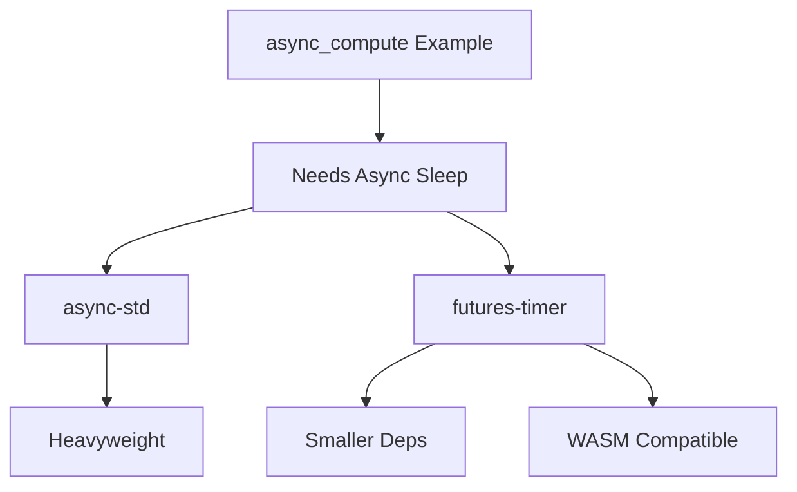

+++
title = "#19113 examples: migrate async sleep to `futures-timer`; drop `async-std`"
date = "2025-08-27T00:00:00"
draft = false
template = "pull_request_page.html"
in_search_index = true

[taxonomies]
list_display = ["show"]

[extra]
current_language = "en"
available_languages = {"en" = { name = "English", url = "/pull_request/bevy/2025-08/pr-19113-en-20250827" }, "zh-cn" = { name = "中文", url = "/pull_request/bevy/2025-08/pr-19113-zh-cn-20250827" }}
labels = ["C-Bug", "C-Examples", "D-Straightforward"]
+++

# Title

## Basic Information
- **Title**: examples: migrate async sleep to `futures-timer`; drop `async-std`
- **PR Link**: https://github.com/bevyengine/bevy/pull/19113
- **Author**: VitalyAnkh
- **Status**: MERGED
- **Labels**: C-Bug, C-Examples, S-Ready-For-Final-Review, D-Straightforward
- **Created**: 2025-05-07T10:06:09Z
- **Merged**: 2025-08-27T10:52:35Z
- **Merged By**: james7132

## Description Translation
The original description is in English and is preserved exactly as-is:

# Objective

- Fixes #19055 

## Solution

- Replace `async-std` with `futures-timer`.

## Testing

CI

## The Story of This Pull Request

This PR addresses a dependency optimization issue in Bevy's async compute example. The problem was straightforward: the example was using `async-std` solely for its sleep functionality, which introduced an unnecessary heavyweight dependency for a simple timing operation.

The core issue (#19055) was that `async-std` brought in substantial additional code and dependencies when all that was needed was a simple async sleep function. This created unnecessary bloat in the example and potentially confused developers about Bevy's async dependencies.

The solution approach was pragmatic: replace `async-std` with `futures-timer`, a lighter-weight crate specifically designed for timer functionality in async contexts. This change maintains the same functionality while reducing dependency overhead significantly.

From an implementation perspective, the changes were minimal but effective. The key modification was in the async task where sleep was needed:

```rust
// Before:
async_std::task::sleep(duration).await;

// After:
Delay::new(duration).await;
```

This change required updating both the dependency declaration in `Cargo.toml` and the import statement in the example file. The `futures-timer` crate was configured with WebAssembly support through the `wasm-bindgen` and `gloo-timers` features, ensuring cross-platform compatibility.

The technical insight here is about dependency management in Rust projects. While `async-std` provides a full async runtime, `futures-timer` focuses specifically on timer functionality, making it a more appropriate choice when only timing operations are needed. This aligns with the principle of using the smallest possible dependency for the required functionality.

The impact of this change is reduced binary size and cleaner dependency graph for the example, without any loss of functionality. It also provides a better example to developers about appropriate dependency choices in async Rust programming.

## Visual Representation



## Key Files Changed

### `Cargo.toml`
**Changes**: Replaced `async-std` dependency with `futures-timer`
**Purpose**: Remove heavyweight dependency while maintaining functionality

```toml
# Before:
async-std = "1.13"

# After:
futures-timer = { version = "3", features = ["wasm-bindgen", "gloo-timers"] }
```

### `examples/async_tasks/async_compute.rs`
**Changes**: Updated import and sleep implementation
**Purpose**: Use new timer dependency while preserving example behavior

```rust
// Before:
use async_std::task::sleep;

async {
    async_std::task::sleep(duration).await;
}

// After:
use futures_timer::Delay;

async {
    Delay::new(duration).await;
}
```

## Further Reading

- `futures-timer` crate documentation: https://docs.rs/futures-timer
- Async Rust patterns: https://rust-lang.github.io/async-book/
- Bevy async tasks guide: https://bevyengine.org/learn/books/introduction/async-tasks