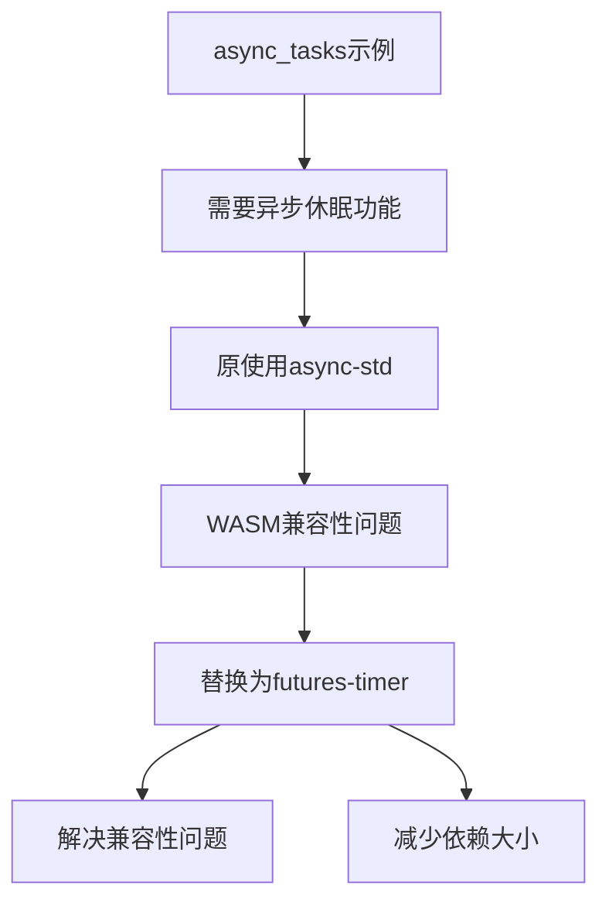

+++
title = "#19113 examples: migrate async sleep to `futures-timer`; drop `async-std`"
date = "2025-08-27T00:00:00"
draft = false
template = "pull_request_page.html"
in_search_index = false

[extra]
current_language = "zh-cn"
available_languages = {"en" = { name = "English", url = "/pull_request/bevy/2025-08/pr-19113-en-20250827" }, "zh-cn" = { name = "中文", url = "/pull_request/bevy/2025-08/pr-19113-zh-cn-20250827" }}
labels = ["C-Bug", "C-Examples", "D-Straightforward"]
+++

# Title

## Basic Information
- **Title**: examples: migrate async sleep to `futures-timer`; drop `async-std`
- **PR Link**: https://github.com/bevyengine/bevy/pull/19113
- **Author**: VitalyAnkh
- **Status**: MERGED
- **Labels**: C-Bug, C-Examples, S-Ready-For-Final-Review, D-Straightforward
- **Created**: 2025-05-07T10:06:09Z
- **Merged**: 2025-08-27T10:52:35Z
- **Merged By**: james7132

## Description Translation
**目标**
- 修复 #19055

**解决方案**
- 用 `futures-timer` 替换 `async-std`。

**测试**
CI

## The Story of This Pull Request

这个PR解决了一个简单的依赖管理问题。在Bevy的async_tasks示例中，原本使用async-std库来实现异步休眠功能，但这种方式在某些环境下存在问题，特别是WebAssembly（WASM）环境。

问题的核心在于async-std库对WASM的支持不够完善。当开发者尝试在WASM环境中运行包含async-std的Bevy示例时，会遇到兼容性问题，这限制了示例代码的适用范围和演示价值。

开发者VitalyAnkh选择了futures-timer作为替代方案，这是一个更轻量级且对WASM支持更好的异步定时器库。futures-timer提供了与async-std类似的API，但具有更好的跨平台兼容性，特别是通过其wasm-bindgen和gloo-timers特性对WASM环境的原生支持。

从技术实现角度看，这个变更非常直接。只需要修改两处：
1. 在Cargo.toml中将async-std依赖替换为futures-timer
2. 在示例代码中将async_std::task::sleep替换为futures_timer::Delay::new

这种修改保持了相同的功能语义 - 都是实现异步延迟，但使用了不同的底层实现。futures-timer的Delay类型提供了与async-std的sleep函数相同的await接口，使得迁移变得简单且无侵入性。

这个变更的影响是积极的：它解决了WASM环境下的兼容性问题，同时减少了项目的依赖负担。async-std是一个相对较大的异步运行时库，而futures-timer是一个专门用于定时功能的轻量级库，这种替换符合软件工程中的"最小依赖"原则。

从工程实践角度看，这个PR展示了良好的依赖管理策略：当发现某个依赖项存在环境兼容性问题时，寻找更专注、更轻量的替代方案通常是比引入复杂变通方案更好的选择。

## Visual Representation



## Key Files Changed

### 1. `Cargo.toml`
**变更描述**：将async-std依赖替换为futures-timer，并启用wasm-bindgen和gloo-timers特性以确保WASM兼容性。

**代码变更**：
```toml
# 变更前：
async-std = "1.13"

# 变更后：
futures-timer = { version = "3", features = ["wasm-bindgen", "gloo-timers"] }
```

### 2. `examples/async_tasks/async_compute.rs`
**变更描述**：将异步休眠的实现从async_std::task::sleep替换为futures_timer::Delay::new。

**代码变更**：
```rust
// 变更前：
async_std::task::sleep(duration).await;

// 变更后：
Delay::new(duration).await;
```

**新增导入**：
```rust
use futures_timer::Delay;
```

## Further Reading

1. [futures-timer crate文档](https://docs.rs/futures-timer/) - 了解futures-timer库的API和使用方法
2. [Bevy异步任务指南](https://bevyengine.org/learn/books/async-tasks/) - Bevy官方文档中关于异步任务处理的章节
3. [Rust和WebAssembly](https://rustwasm.github.io/docs/book/) - 学习如何在Rust中开发WASM应用
4. [异步Rust编程](https://rust-lang.github.io/async-book/) - 深入了解Rust的异步编程模型