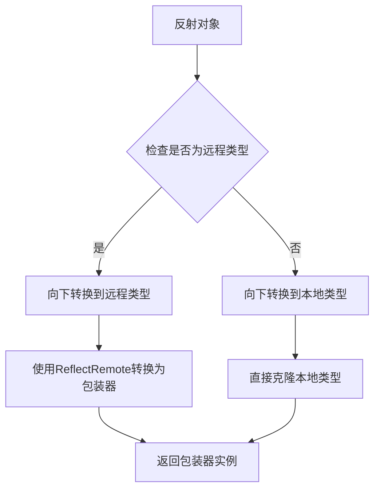

+++
title = "#19158 bevy_reflect: Fix `FromReflect` derive for opaque remote wrappers"
date = "2025-08-28T00:00:00"
draft = false
template = "pull_request_page.html"
in_search_index = false

[extra]
current_language = "zh-cn"
available_languages = {"en" = { name = "English", url = "/pull_request/bevy/2025-08/pr-19158-en-20250828" }, "zh-cn" = { name = "中文", url = "/pull_request/bevy/2025-08/pr-19158-zh-cn-20250828" }}
+++

# bevy_reflect: Fix `FromReflect` derive for opaque remote wrappers

## 基本信息
- **标题**: bevy_reflect: Fix `FromReflect` derive for opaque remote wrappers
- **PR链接**: https://github.com/bevyengine/bevy/pull/19158
- **作者**: MrGVSV
- **状态**: 已合并
- **标签**: C-Bug, S-Ready-For-Final-Review, A-Reflection, D-Straightforward, D-Macros
- **创建时间**: 2025-05-10T06:41:25Z
- **合并时间**: 2025-08-28T23:05:06Z
- **合并者**: alice-i-cecile

## 描述翻译
### Objective
修复 #19017

### Solution
`FromReflect`派生逻辑对于不透明类型没有正确处理远程反射。本PR通过使其向下转换到远程类型，然后转换回包装器来修复此问题。

### Testing
可以通过运行以下命令进行本地测试：
```
cargo test -p bevy_reflect
```

## 本PR的故事

这个PR解决了一个在Bevy反射系统中关于不透明远程包装器的具体问题。问题出现在当使用`#[reflect(opaque)]`和`#[reflect_remote(...)]`属性组合时，`FromReflect`派生无法正确处理类型的序列化和反序列化。

问题的核心在于`FromReflect` trait的实现逻辑没有考虑到远程类型的情况。在Bevy的反射系统中，远程类型允许开发者包装外部crate中的类型，使其能够参与Bevy的反射系统。当这些类型被标记为不透明(opaque)时，系统应该能够正确处理它们的反射操作。

在修复之前，`impl_opaque`函数中的代码直接尝试将反射对象向下转换为当前类型：

```rust
#FQClone::clone(
    <dyn #bevy_reflect_path::PartialReflect>::try_downcast_ref::<#type_path #ty_generics>(reflect)?
)
```

这种方法对于本地类型有效，但对于远程包装器类型会失败，因为反射对象实际上是底层远程类型的实例，而不是包装器类型本身。

解决方案是检查是否存在远程类型，如果存在，先向下转换到远程类型，然后使用`ReflectRemote` trait将其转换回包装器：

```rust
let downcast = match meta.remote_ty() {
    Some(remote) => {
        let remote_ty = remote.type_path();
        quote! {
            <Self as #bevy_reflect_path::ReflectRemote>::into_wrapper(
                #FQClone::clone(
                    <dyn #bevy_reflect_path::PartialReflect>::try_downcast_ref::<#remote_ty>(reflect)?
                )
            )
        }
    }
    None => quote! {
        #FQClone::clone(
            <dyn #bevy_reflect_path::PartialReflect>::try_downcast_ref::<#type_path #ty_generics>(reflect)?
        )
    },
};
```

这个修改确保了无论是本地不透明类型还是远程包装的不透明类型，都能正确地从反射对象中重建实例。

为了验证修复的有效性，PR添加了一个全面的测试用例`should_serialize_opaque_remote_type`。这个测试模拟了真实的使用场景：定义一个外部crate中的类型，使用`#[reflect_remote]`创建包装器，然后测试完整的序列化和反序列化流程。

测试验证了以下关键点：
1. 远程类型能够正确序列化为字符串
2. 序列化后的数据能够正确反序列化回原始对象
3. 反序列化后的对象与原始对象相等

这个修复虽然代码量不大，但解决了反射系统中一个重要的边界情况，确保了不透明远程包装器类型能够与其他反射类型一样正常工作。

## 可视化表示



## 关键文件变更

### `crates/bevy_reflect/derive/src/from_reflect.rs` (+20/-5)
这个文件包含了`FromReflect`派生宏的核心逻辑。主要修改在`impl_opaque`函数中，添加了对远程类型的特殊处理。

**修改前:**
```rust
pub(crate) fn impl_opaque(meta: &ReflectMeta) -> proc_macro2::TokenStream {
    // ... 省略部分代码 ...
    quote! {
        impl #impl_generics #bevy_reflect_path::FromReflect for #type_path #ty_generics #where_from_reflect_clause  {
            fn from_reflect(reflect: &dyn #bevy_reflect_path::PartialReflect) -> #FQOption<Self> {
                #FQOption::Some(
                    #FQClone::clone(
                        <dyn #bevy_reflect_path::PartialReflect>::try_downcast_ref::<#type_path #ty_generics>(reflect)?
                    )
                )
            }
        }
    }
}
```

**修改后:**
```rust
pub(crate) fn impl_opaque(meta: &ReflectMeta) -> proc_macro2::TokenStream {
    // ... 省略部分代码 ...
    let downcast = match meta.remote_ty() {
        Some(remote) => {
            let remote_ty = remote.type_path();
            quote! {
                <Self as #bevy_reflect_path::ReflectRemote>::into_wrapper(
                    #FQClone::clone(
                        <dyn #bevy_reflect_path::PartialReflect>::try_downcast_ref::<#remote_ty>(reflect)?
                    )
                )
            }
        }
        None => quote! {
            #FQClone::clone(
                <dyn #bevy_reflect_path::PartialReflect>::try_downcast_ref::<#type_path #ty_generics>(reflect)?
            )
        },
    };

    quote! {
        impl #impl_generics #bevy_reflect_path::FromReflect for #type_path #ty_generics #where_from_reflect_clause  {
            fn from_reflect(reflect: &dyn #bevy_reflect_path::PartialReflect) -> #FQOption<Self> {
                #FQOption::Some(#downcast)
            }
        }
    }
}
```

### `crates/bevy_reflect/src/lib.rs` (+35/-0)
添加了一个完整的测试用例，验证不透明远程类型的序列化和反序列化功能。

**新增的测试代码:**
```rust
// https://github.com/bevyengine/bevy/issues/19017
#[test]
fn should_serialize_opaque_remote_type() {
    mod external_crate {
        use serde::{Deserialize, Serialize};
        #[derive(Clone, Debug, PartialEq, Serialize, Deserialize)]
        pub struct Vector2<T>(pub [T; 2]);
    }

    #[reflect_remote(external_crate::Vector2<i32>)]
    #[derive(Clone, Debug, PartialEq, Serialize, Deserialize)]
    #[reflect(Serialize, Deserialize)]
    #[reflect(opaque)]
    struct Vector2Wrapper([i32; 2]);

    #[derive(Reflect, Debug, PartialEq)]
    struct Point(#[reflect(remote = Vector2Wrapper)] external_crate::Vector2<i32>);

    let point = Point(external_crate::Vector2([1, 2]));

    let mut registry = TypeRegistry::new();
    registry.register::<Point>();
    registry.register::<Vector2Wrapper>();

    let serializer = ReflectSerializer::new(&point, &registry);
    let serialized = ron::to_string(&serializer).unwrap();
    assert_eq!(serialized, r#"{"bevy_reflect::tests::Point":((((1,2))))}"#);

    let mut deserializer = Deserializer::from_str(&serialized).unwrap();
    let reflect_deserializer = ReflectDeserializer::new(&registry);
    let deserialized = reflect_deserializer.deserialize(&mut deserializer).unwrap();
    let point = <Point as FromReflect>::from_reflect(&*deserialized).unwrap();
    assert_eq!(point, Point(external_crate::Vector2([1, 2])));
}
```

## 进一步阅读

- [Bevy反射系统文档](https://docs.rs/bevy_reflect/latest/bevy_reflect/)
- [Rust属性宏编程指南](https://doc.rust-lang.org/reference/procedural-macros.html)
- [Serde序列化框架](https://serde.rs/)
- [Bevy引擎官方文档](https://bevyengine.org/learn/)