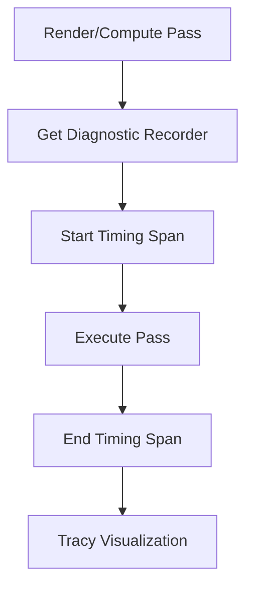

+++
title = "#19191 Record render diagnostics for all engine passes"
date = "2025-08-06T00:00:00"
draft = false
template = "pull_request_page.html"
in_search_index = true

[taxonomies]
list_display = ["show"]

[extra]
current_language = "en"
available_languages = {"en" = { name = "English", url = "/pull_request/bevy/2025-08/pr-19191-en-20250806" }, "zh-cn" = { name = "中文", url = "/pull_request/bevy/2025-08/pr-19191-zh-cn-20250806" }}
labels = ["C-Feature", "A-Rendering", "D-Modest"]
+++

## Record render diagnostics for all engine passes

### Basic Information
- **Title**: Record render diagnostics for all engine passes
- **PR Link**: https://github.com/bevyengine/bevy/pull/19191
- **Author**: jf908
- **Status**: MERGED
- **Labels**: C-Feature, A-Rendering, S-Ready-For-Final-Review, D-Modest
- **Created**: 2025-05-12T19:10:48Z
- **Merged**: 2025-08-06T16:29:47Z
- **Merged By**: alice-i-cecile

### Description Translation
# Objective

- Fixes #16742

## Solution

- Adds GPU spans for all the engine's render and compute passes. Related passes have been grouped into a single span (following the same convention as bloom, which was already implemented).

## Testing

- Tested all the various rendering features on Windows 11 + Vulkan and also some on DirectX.

## Showcase

A tracy graph with lots of rendering features enabled:


## Follow up

* Nesting spans - there are 2 problems I encountered that stopped me from implementing this
  1. Spans have to be declared in the same scope so it's not clear how to group passes across nodes in the render graph. Possibly a skill issue on my part :)
  2. Nested spans appear incorrectly in tracy (all on the same y axis). I don't know if this is a bug in tracy, a bug in the tracy_client crate or something to do with the multithreading workaround `end_zone()` hack but I couldn't really get it to work. I left a nested span in meshlet_visibility_buffer_raster for each shadow view so you can see what it looks like by trying the meshlet example (let me know if I should remove it).
* Improve developer usability - after writing the same code over and over I started to feel like bevy should have its own create render/compute pass functions so it can instrument them automatically. It would also make it less likely for future PRs to forget to add diagnostics.

## Additional notes

There were talks on render crate refactors happening - I think the changes are small enough that rebases won't be difficult but also feel free to delay merging until later if it'll get in the way.

### The Story of This Pull Request

#### The Problem and Context
Prior to this PR, Bevy lacked comprehensive GPU profiling instrumentation across its rendering passes. Issue #16742 specifically highlighted the need for better diagnostics to analyze GPU performance. Without detailed timing information for each render and compute pass, performance optimization was challenging. Developers couldn't easily identify bottlenecks in complex rendering pipelines using tools like Tracy. The technical constraint was that instrumentation needed to be added to every pass without significantly impacting performance or code readability.

#### The Solution Approach
The solution involved systematically adding GPU timing spans to all render and compute passes throughout Bevy's rendering systems. The author followed these principles:
1. Use Bevy's existing `RecordDiagnostics` trait to instrument passes
2. Group related passes under single spans where appropriate (following bloom pass convention)
3. Maintain consistent labeling for easier trace analysis
4. Handle both render passes (via `pass_span`) and compute passes (via `time_span`)
5. Add debug groups for multi-pass operations

The implementation required modifications across 28 files in the codebase. The author considered nested spans for hierarchical grouping but encountered technical limitations with Tracy visualization and render graph node scoping.

#### The Implementation
The changes followed a consistent pattern across all rendering systems:
1. Retrieve `diagnostic_recorder` from render context
2. Create a timing span before pass execution
3. End the span after pass completion
4. Update pass labels for consistency

For example, in the FXAA pass (`crates/bevy_anti_aliasing/src/fxaa/node.rs`):

```rust
// Before:
let mut render_pass = render_context
    .command_encoder()
    .begin_render_pass(&pass_descriptor);

// After:
let diagnostics = render_context.diagnostic_recorder();
// ...
let mut render_pass = render_context
    .command_encoder()
    .begin_render_pass(&pass_descriptor);
let pass_span = diagnostics.pass_span(&mut render_pass, "fxaa");

// ... pass execution ...

pass_span.end(&mut render_pass);
```

Compute passes received similar treatment, as seen in the auto exposure pass (`crates/bevy_core_pipeline/src/auto_exposure/node.rs`):

```rust
// Before:
let mut compute_pass = render_context
    .command_encoder()
    .begin_compute_pass(&ComputePassDescriptor { ... });

// After:
let diagnostics = render_context.diagnostic_recorder();
let mut compute_pass = ...;
let pass_span = diagnostics.time_span(&mut compute_pass, "auto_exposure");

// ... compute operations ...

pass_span.end(&mut compute_pass);
```

#### Technical Insights
The implementation revealed several important insights:
1. **Span Management**: The `RecordDiagnostics` API requires explicit span management around pass execution. The pattern `let span = diagnostics...` followed by `span.end()` ensures proper scope.
2. **Label Consistency**: Pass labels were standardized to lowercase snake_case for uniformity in traces.
3. **Debug Groups**: For complex multi-pass operations (like SSAO), debug groups provide additional context in profiling tools:

```rust
render_context.command_encoder().push_debug_group("smaa");
let time_span = diagnostics.time_span(render_context.command_encoder(), "smaa");
// ... passes ...
time_span.end(render_context.command_encoder());
render_context.command_encoder().pop_debug_group();
```

4. **Nesting Challenges**: Attempts to nest spans faced technical hurdles:
   - Spans require declaration in the same lexical scope
   - Tracy visualization issues with nested spans
   - The meshlet visibility buffer pass demonstrates experimental nesting:

```rust
// In meshlet_visibility_buffer_raster_node.rs
for shadow_view in shadow_views {
    let pass_span = diagnostics.time_span(
        render_context.command_encoder(),
        shadow_view.pass_name.clone(),
    );
    // ... sub-pass operations ...
    pass_span.end(render_context.command_encoder());
}
```

#### The Impact
These changes provide comprehensive GPU profiling capabilities throughout Bevy's rendering pipeline:
- All major passes now appear in Tracy with consistent labeling
- Developers can identify performance bottlenecks at the pass level
- The changes add minimal overhead (only span recording operations)
- Pass execution times can be compared across different hardware and configurations
- Future optimization work will have built-in measurement capabilities

The implementation demonstrates that systematic instrumentation can be added across a complex rendering architecture with minimal disruption. The consistent pattern makes it easier to maintain and extend instrumentation in future development.

### Visual Representation



### Key Files Changed

1. **`crates/bevy_pbr/src/render/gpu_preprocess.rs` (+29/-13)**
   - Added instrumentation to GPU preprocessing compute passes
   - Key changes:
```rust
// Before: 
let mut compute_pass = command_encoder.begin_compute_pass(&ComputePassDescriptor {
    label: Some("early mesh preprocessing"),
});

// After:
let diagnostics = render_context.diagnostic_recorder();
let mut compute_pass = command_encoder.begin_compute_pass(&ComputePassDescriptor {
    label: Some("early_mesh_preprocessing"),  // Updated label
});
let pass_span = diagnostics.time_span(&mut compute_pass, "early_mesh_preprocessing");
// ... pass execution ...
pass_span.end(&mut compute_pass);
```

2. **`crates/bevy_pbr/src/ssao/mod.rs` (+20/-21)**
   - Instrumented SSAO passes and added debug groups
   - Key changes:
```rust
// Added debug group and top-level span
let command_encoder = render_context.command_encoder();
command_encoder.push_debug_group("ssao");
let time_span = diagnostics.time_span(command_encoder, "ssao");

// Each sub-pass instrumented
let mut preprocess_depth_pass = command_encoder.begin_compute_pass(&ComputePassDescriptor {
    label: Some("ssao_preprocess_depth"),  // Updated label
});
// ... pass execution ...
```

3. **`crates/bevy_pbr/src/meshlet/material_shade_nodes.rs` (+20/-3)**
   - Added spans to meshlet material passes
   - Key changes:
```rust
// Before:
let mut render_pass = render_context.begin_tracked_render_pass(RenderPassDescriptor {
    label: Some("meshlet_prepass"),
});

// After:
let diagnostics = render_context.diagnostic_recorder();
let mut render_pass = ...;
let pass_span = diagnostics.pass_span(&mut render_pass, "meshlet_material_prepass");
// ... pass execution ...
pass_span.end(&mut render_pass);
```

4. **`crates/bevy_pbr/src/atmosphere/node.rs` (+13/-2)**
   - Instrumented atmosphere LUT generation and sky rendering
   - Key changes:
```rust
// Atmosphere LUTs
let mut luts_pass = command_encoder.begin_compute_pass(&ComputePassDescriptor {
    label: Some("atmosphere_luts"),  // Updated label
});
let pass_span = diagnostics.time_span(&mut luts_pass, "atmosphere_luts");
// ... pass execution ...
pass_span.end(&mut luts_pass);

// Sky rendering
let mut render_sky_pass = command_encoder.begin_render_pass(...);
let pass_span = diagnostics.pass_span(&mut render_sky_pass, "render_sky");
// ... pass execution ...
pass_span.end(&mut render_sky_pass);
```

5. **`crates/bevy_pbr/src/meshlet/visibility_buffer_raster_node.rs` (+14/-0)**
   - Added experimental nested spans for shadow views
   - Key changes:
```rust
render_context.command_encoder().push_debug_group("meshlet_visibility_buffer_raster");
let time_span = diagnostics.time_span(
    render_context.command_encoder(),
    "meshlet_visibility_buffer_raster",
);

for shadow_view in shadow_views {
    let pass_span = diagnostics.time_span(
        render_context.command_encoder(),
        shadow_view.pass_name.clone(),  // Individual span per shadow view
    );
    // ... sub-pass operations ...
    pass_span.end(render_context.command_encoder());
}

time_span.end(render_context.command_encoder());
```

### Further Reading
1. [Tracy Profiler documentation](https://github.com/wolfpld/tracy)
2. [Bevy Render Graph documentation](https://bevyengine.org/learn/book/rendering/render-graph/)
3. [GPU Command Buffer Instrumentation Best Practices](https://gpuopen.com/learn/gpu-profiling-command-buffer-instrumentation/)

### Full Code Diff
<details>
<summary>View full diff (28 files modified)</summary>

```diff
diff --git a/crates/bevy_anti_aliasing/src/contrast_adaptive_sharpening/node.rs b/crates/bevy_anti_aliasing/src/contrast_adaptive_sharpening/node.rs
index 070b57099707e..c1e6ccdda02c3 100644
--- a/crates/bevy_anti_aliasing/src/contrast_adaptive_sharpening/node.rs
+++ b/crates/bevy_anti_aliasing/src/contrast_adaptive_sharpening/node.rs
@@ -3,6 +3,7 @@ use std::sync::Mutex;
 use crate::contrast_adaptive_sharpening::ViewCasPipeline;
 use bevy_ecs::prelude::*;
 use bevy_render::{
+    diagnostic::RecordDiagnostics,
     extract_component::{ComponentUniforms, DynamicUniformIndex},
     render_graph::{Node, NodeRunError, RenderGraphContext},
     render_resource::{
@@ -66,6 +67,8 @@ impl Node for CasNode {
             return Ok(());
         };
 
+        let diagnostics = render_context.diagnostic_recorder();
+
         let view_target = target.post_process_write();
         let source = view_target.source;
         let destination = view_target.destination;
@@ -110,11 +113,14 @@ impl Node for CasNode {
         let mut render_pass = render_context
             .command_encoder()
             .begin_render_pass(&pass_descriptor);
+        let pass_span = diagnostics.time_span(&mut render_pass, "contrast_adaptive_sharpening");
 
         render_pass.set_pipeline(pipeline);
         render_pass.set_bind_group(0, bind_group, &[uniform_index.index()]);
         render_pass.draw(0..3, 0..1);
 
+        pass_span.end(&mut render_pass);
+
         Ok(())
     }
 }
diff --git a/crates/bevy_anti_aliasing/src/fxaa/node.rs b/crates/bevy_anti_aliasing/src/fxaa/node.rs
index 8881607cba4e4..54d2afd33e736 100644
--- a/crates/bevy_anti_aliasing/src/fxaa/node.rs
+++ b/crates/bevy_anti_aliasing/src/fxaa/node.rs
@@ -3,6 +3,7 @@ use std::sync::Mutex;
 use crate::fxaa::{CameraFxaaPipeline, Fxaa, FxaaPipeline};
 use bevy_ecs::{prelude::*, query::QueryItem};
 use bevy_render::{
+    diagnostic::RecordDiagnostics,
     render_graph::{NodeRunError, RenderGraphContext, ViewNode},
     render_resource::{
         BindGroup, BindGroupEntries, Operations, PipelineCache, RenderPassColorAttachment,
@@ -42,6 +43,8 @@ impl ViewNode for FxaaNode {
             return Ok(());
         };
 
+        let diagnostics = render_context.diagnostic_recorder();
+
         let post_process = target.post_process_write();
         let source = post_process.source;
         let destination = post_process.destination;
@@ -61,7 +64,7 @@ impl ViewNode for FxaaNode {
         };
 
         let pass_descriptor = RenderPassDescriptor {
-            label: Some("fxaa_pass"),
+            label: Some("fxaa"),
             color_attachments: &[Some(RenderPassColorAttachment {
                 view: destination,
                 depth_slice: None,
@@ -76,11 +79,14 @@ impl ViewNode for FxaaNode {
         let mut render_pass = render_context
             .command_encoder()
             .begin_render_pass(&pass_descriptor);
+        let pass_span = diagnostics.pass_span(&mut render_pass, "fxaa");
 
         render_pass.set_pipeline(pipeline);
         render_pass.set_bind_group(0, bind_group, &[]);
         render_pass.draw(0..3, 0..1);
 
+        pass_span.end(&mut render_pass);
+
         Ok(())
     }
 }
diff --git a/crates/bevy_anti_aliasing/src/smaa/mod.rs b/crates/bevy_anti_aliasing/src/smaa/mod.rs
index cafab566a0732..d54dff8e9ce5d 100644
--- a/crates/bevy_anti_aliasing/src/smaa/mod.rs
+++ b/crates/bevy_anti_aliasing/src/smaa/mod.rs
@@ -53,6 +53,7 @@ use bevy_math::{vec4, Vec4};
 use bevy_reflect::{std_traits::ReflectDefault, Reflect};
 use bevy_render::{
     camera::ExtractedCamera,
+    diagnostic::RecordDiagnostics,
     extract_component::{ExtractComponent, ExtractComponentPlugin},
     render_asset::RenderAssets,
     render_graph::{
@@ -824,6 +825,10 @@ impl ViewNode for SmaaNode {
             return Ok(());
         };
 
+        let diagnostics = render_context.diagnostic_recorder();
+        render_context.command_encoder().push_debug_group("smaa");
+        let time_span = diagnostics.time_span(render_context.command_encoder(), "smaa");
+
         // Fetch the framebuffer textures.
         let postprocess = view_target.post_process_write();
         let (source, destination) = (postprocess.source, postprocess.destination);
@@ -864,6 +869,9 @@ impl ViewNode for SmaaNode {
             destination,
         );
 
+        time_span.end(render_context.command_encoder());
+        render_context.command_encoder().pop_debug_group();
+
         Ok(())
     }
 }
diff --git a/crates/bevy_anti_aliasing/src/taa/mod.rs b/crates/bevy_anti_aliasing/src/taa/mod.rs
index 658e31aa586f6..263ebd00436ff 100644
--- a/crates/bevy_anti_aliasing/src/taa/mod.rs
+++ b/crates/bevy_anti_aliasing/src/taa/mod.rs
@@ -20,6 +20,7 @@ use bevy_math::vec2;
 use bevy_reflect::{std_traits::ReflectDefault, Reflect};
 use bevy_render::{
     camera::{ExtractedCamera, MipBias, TemporalJitter},
+    diagnostic::RecordDiagnostics,
     prelude::{Camera, Projection},
     render_graph::{NodeRunError, RenderGraphContext, RenderGraphExt, ViewNode, ViewNodeRunner},
     render_resource::{
@@ -181,6 +182,9 @@ impl ViewNode for TemporalAntiAliasNode {
         ) else {
             return Ok(());
         };
+
+        let diagnostics = render_context.diagnostic_recorder();
+
         let view_target = view_target.post_process_write();
 
         let taa_bind_group = render_context.render_device().create_bind_group(
@@ -198,7 +202,7 @@ impl ViewNode for TemporalAntiAliasNode {
 
         {
             let mut taa_pass = render_context.begin_tracked_render_pass(RenderPassDescriptor {
-                label: Some("taa_pass"),
+                label: Some("taa"),
                 color_attachments: &[
                     Some(RenderPassColorAttachment {
                         view: view_target.destination,
@@ -217,12 +221,16 @@ impl ViewNode for TemporalAntiAliasNode {
                 timestamp_writes: None,
                 occlusion_query_set: None,
             });
+            let pass_span = diagnostics.pass_span(&mut taa_pass, "taa");
+
             taa_pass.set_render_pipeline(taa_pipeline);
             taa_pass.set_bind_group(0, &taa_bind_group, &[]);
             if let Some(viewport) = camera.viewport.as_ref() {
                 taa_pass.set_camera_viewport(viewport);
             }
             taa_pass.draw(0..3, 0..1);
+
+            pass_span.end(&mut taa_pass);
         }
 
         Ok(())
diff --git a/crates/bevy_core_pipeline/src/auto_exposure/node.rs b/crates/bevy_core_pipeline/src/auto_exposure/node.rs
index 222efe5c62bd0..c7f88dfb28d6f 100644
--- a/crates/bevy_core_pipeline/src/auto_exposure/node.rs
+++ b/crates/bevy_core_pipeline/src/auto_exposure/node.rs
@@ -10,6 +10,7 @@ use bevy_ecs::{
     world::{FromWorld, World},
 };
 use bevy_render::{
+    diagnostic::RecordDiagnostics,
     globals::GlobalsBuffer,
     render_asset::RenderAssets,
     render_graph::*,
@@ -98,6 +99,8 @@ impl Node for AutoExposureNode {
             return Ok(());
         };
 
+        let diagnostics = render_context.diagnostic_recorder();
+
         let compute_bind_group = render_context.render_device().create_bind_group(
             None,
             &pipeline.histogram_layout,
@@ -122,9 +125,10 @@ impl Node for AutoExposureNode {
             render_context
                 .command_encoder()
                 .begin_compute_pass(&ComputePassDescriptor {
-                    label: Some("auto_exposure_pass"),
+                    label: Some("auto_exposure"),
                     timestamp_writes: None,
                 });
+        let pass_span = diagnostics.time_span(&mut compute_pass, "auto_exposure");
 
         compute_pass.set_bind_group(0, &compute_bind_group, &[view_uniform_offset.offset]);
         compute_pass.set_pipeline(histogram_pipeline);
@@ -136,6 +140,8 @@ impl Node for AutoExposureNode {
         compute_pass.set_pipeline(average_pipeline);
         compute_pass.dispatch_workgroups(1, 1, 1);
 
+        pass_span.end(&mut compute_pass);
+
         Ok(())
     }
 }
diff --git a/crates/bevy_core_pipeline/src/core_3d/main_transmissive_pass_3d_node.rs b/crates/bevy_core_pipeline/src/core_3d/main_transmissive_pass_3d_node.rs
index ec108b8753924..37d359785bfd6 100644
--- a/crates/bevy_core_pipeline/src/core_3d/main_transmissive_pass_3d_node.rs
+++ b/crates/bevy_core_pipeline/src/core_3d/main_transmissive_pass_3d_node.rs
@@ -5,6 +5,7 @@ use bevy_ecs::{prelude::*, query::QueryItem};
 use bevy_image::ToExtents;
 use bevy_render::{
     camera::{ExtractedCamera, MainPassResolutionOverride},
+    diagnostic::RecordDiagnostics,
     render_graph::{NodeRunError, RenderGraphContext, ViewNode},
     render_phase::ViewSortedRenderPhases,
     render_resource::{RenderPassDescriptor, StoreOp},
@@ -53,6 +54,8 @@ impl ViewNode for MainTransmissivePass3dNode {
             return Ok(());
         };
 
+        let diagnostics = render_context.diagnostic_recorder();
+
         let physical_target_size = camera.physical_target_size.unwrap();
 
         let render_pass_descriptor = RenderPassDescriptor {
@@ -95,6 +98,8 @@ impl ViewNode for MainTransmissivePass3dNode {
 
                     let mut render_pass =
                         render_context.begin_tracked_render_pass(render_pass_descriptor.clone());
+                    let pass_span =
+                        diagnostics.pass_span(&mut render_pass, "main_transmissive_pass_3d");
 
                     if let Some(viewport) = camera.viewport.as_ref() {
                         render_pass.set_camera_viewport(viewport);
@@ -106,10 +111,14 @@ impl ViewNode for MainTransmissivePass3dNode {
                     {
                         error!("Error encountered while rendering the transmissive phase {err:?}");
                     }
+
+                    pass_span.end(&mut render_pass);
                 }
             } else {
                 let mut render_pass =
                     render_context.begin_tracked_render_pass(render_pass_descriptor);
+                let pass_span =
+                    diagnostics.pass_span(&mut render_pass, "main_transmissive_pass_3d");
 
                 if let Some(viewport) = Viewport::from_viewport_and_override(
                     camera.viewport.as_ref(),
@@ -121,6 +130,8 @@ impl ViewNode for MainTransmissivePass3dNode {
                 if let Err(err) = transmissive_phase.render(&mut render_pass, world, view_entity) {
                     error!("Error encountered while rendering the transmissive phase {err:?}");
                 }
+
+                pass_span.end(&mut render_pass);
             }
         }
 
diff --git a/crates/bevy_core_pipeline/src/deferred/copy_lighting_id.rs b/crates/bevy_core_pipeline/src/deferred/copy_lighting_id.rs
index 9a23c0e34d752..68d1634160f8a 100644
--- a/crates/bevy_core_pipeline/src/deferred/copy_lighting_id.rs
+++ b/crates/bevy_core_pipeline/src/deferred/copy_lighting_id.rs
@@ -8,6 +8,7 @@ use bevy_ecs::prelude::*;
 use bevy_image::ToExtents;
 use bevy_render::{
     camera::ExtractedCamera,
+    diagnostic::RecordDiagnostics,
     render_resource::{binding_types::texture_2d, *},
     renderer::RenderDevice,
     texture::{CachedTexture, TextureCache},
@@ -77,6 +78,8 @@ impl ViewNode for CopyDeferredLightingIdNode {
             return Ok(());
         };
 
+        let diagnostics = render_context.diagnostic_recorder();
+
         let bind_group = render_context.render_device().create_bind_group(
             "copy_deferred_lighting_id_bind_group",
             &copy_deferred_lighting_id_pipeline.layout,
@@ -84,7 +87,7 @@ impl ViewNode for CopyDeferredLightingIdNode {
         );
 
         let mut render_pass = render_context.begin_tracked_render_pass(RenderPassDescriptor {
-            label: Some("copy_deferred_lighting_id_pass"),
+            label: Some("copy_deferred_lighting_id"),
             color_attachments: &[],
             depth_stencil_attachment: Some(RenderPassDepthStencilAttachment {
                 view: &deferred_lighting_id_depth_texture.texture.default_view,
@@ -98,10 +101,14 @@ impl ViewNode for CopyDeferredLightingIdNode {
             occlusion_query_set: None,
         });
 
+        let pass_span = diagnostics.pass_span(&mut render_pass, "copy_deferred_lighting_id");
+
         render_pass.set_render_pipeline(pipeline);
         render_pass.set_bind_group(0, &bind_group, &[]);
         render_pass.draw(0..3, 0..1);
 
+        pass_span.end(&mut render_pass);
+
         Ok(())
     }
 }
diff --git a/crates/bevy_core_pipeline/src/deferred/node.rs b/crates/bevy_core_pipeline/src/deferred/node.rs
index ffd51763ca88b..db983c9043567 100644
--- a/crates/bevy_core_pipeline/src/deferred/node.rs
+++ b/crates/bevy_core_pipeline/src/deferred/node.rs
@@ -7,6 +7,7 @@ use bevy_render::render_graph::ViewNode;
 use bevy_render::view::{ExtractedView, NoIndirectDrawing};
 use bevy_render::{
     camera::ExtractedCamera,
+    diagnostic::RecordDiagnostics,
     render_graph::{NodeRunError, RenderGraphContext},
     render_phase::{TrackedRenderPass, ViewBinnedRenderPhases},
     render_resource::{CommandEncoderDescriptor, RenderPassDescriptor, StoreOp},
@@ -131,6 +132,8 @@ fn run_deferred_prepass<'w>(
         return Ok(());
     };
 
+    let diagnostic = render_context.diagnostic_recorder();
+
     let mut color_attachments = vec![];
     color_attachments.push(
         view_prepass_textures
@@ -223,6 +226,7 @@ fn run_deferred_prepass<'w>(
             occlusion_query_set: None,
         });
         let mut render_pass = TrackedRenderPass::new(&render_device, render_pass);
+        let pass_span = diagnostic.pass_span(&mut render_pass, label);
         if let Some(viewport) =
             Viewport::from_viewport_and_override(camera.viewport.as_ref(), resolution_override)
         {
@@ -251,6 +255,7 @@ fn run_deferred_prepass<'w>(
             }
         }
 
+        pass_span.end(&mut render_pass);
         drop(render_pass);
 
         // After rendering to the view depth texture, copy it to the prepass depth texture
diff --git a/crates/bevy_core_pipeline/src/dof/mod.rs b/crates/bevy_core_pipeline/src/dof/mod.rs
index 0e65c4d0a4dfa..51ec0b97af61d 100644
--- a/crates/bevy_core_pipeline/src/dof/mod.rs
+++ b/crates/bevy_core_pipeline/src/dof/mod.rs
@@ -32,6 +32,7 @@ use bevy_math::ops;
 use bevy_reflect::{prelude::ReflectDefault, Reflect};
 use bevy_render::{
     camera::{PhysicalCameraParameters, Projection},
+    diagnostic::RecordDiagnostics,
     extract_component::{ComponentUniforms, DynamicUniformIndex, UniformComponentPlugin},
     render_graph::{
         NodeRunError, RenderGraphContext, RenderGraphExt as _, ViewNode, ViewNodeRunner,
@@ -354,6 +355,8 @@ impl ViewNode for DepthOfFieldNode {
         let view_uniforms = world.resource::<ViewUniforms>();
         let global_bind_group = world.resource::<DepthOfFieldGlobalBindGroup>();
 
+        let diagnostics = render_context.diagnostic_recorder();
+
         // We can be in either Gaussian blur or bokeh mode here. Both modes are
         // similar, consisting of two passes each. We factor out the information
         // specific to each pass into
@@ -448,6 +451,9 @@ impl ViewNode for DepthOfFieldNode {
             let mut render_pass = render_context
                 .command_encoder()
                 .begin_render_pass(&render_pass_descriptor);
+            let pass_span =
+                diagnostics.pass_span(&mut render_pass, pipeline_render_info.pass_label);
+
             render_pass.set_pipeline(render_pipeline);
             // Set the per-view bind group.
             render_pass.set_bind_group(0, &view_bind_group, &[view_uniform_offset.offset]);
@@ -459,6 +465,8 @@ impl ViewNode for DepthOfFieldNode {
             );
             // Render the full-screen pass.
             render_pass.draw(0..3, 0..1);
+
+            pass_span.end(&mut render_pass);
         }
 
         Ok(())
diff --git a/crates/bevy_core_pipeline/src/motion_blur/node.rs b/crates/bevy_core_pipeline/src/motion_blur/node.rs
index 5fb8eeebcdc02..00e4d4df873d5 100644
--- a/crates/bevy_core_pipeline/src/motion_blur/node.rs
+++ b/crates/bevy_core_pipeline/src/motion_blur/node.rs
@@ -1,5 +1,6 @@
 use bevy_ecs::{query::QueryItem, world::World};
 use bevy_render::{
+    diagnostic::RecordDiagnostics,
     extract_component::ComponentUniforms,
     globals::GlobalsBuffer,
     render_graph::{NodeRunError, RenderGraphContext, ViewNode},
@@ -59,6 +60,8 @@ impl ViewNode for MotionBlurNode {
             return Ok(());
         };
 
+        let diagnostics = render_context.diagnostic_recorder();
+
         let post_process = view_target.post_process_write();
 
         let layout = if msaa.samples() == 1 {
@@ -81,7 +84,7 @@ impl ViewNode for MotionBlurNode {
         );
 
         let mut render_pass = render_context.begin_tracked_render_pass(RenderPassDescriptor {
-            label: Some("motion_blur_pass"),
+            label: Some("motion_blur"),
             color_attachments: &[Some(RenderPassColorAttachment {
                 view: post_process.destination,
                 depth_slice: None,
@@ -92,11 +95,14 @@ impl ViewNode for MotionBlurNode {
             timestamp_writes: None,
             occlusion_query_set: None,
         });
+        let pass_span = diagnostics.pass_span(&mut render_pass, "motion_blur");
 
         render_pass.set_render_pipeline(pipeline);
         render_pass.set_bind_group(0, &bind_group, &[]);
         render_pass.draw(0..3, 0..1);
 
+        pass_span.end(&mut render_pass);
+
         Ok(())
     }
 }
diff --git a/crates/bevy_core_pipeline/src/msaa_writeback.rs b/crates/bevy_core_pipeline/src/msaa_writeback.rs
index 4b63de7dad131..f1a833047fbb1 100644
--- a/crates/bevy_core_pipeline/src/msaa_writeback.rs
+++ b/crates/bevy_core_pipeline/src/msaa_writeback.rs
@@ -8,6 +8,7 @@ use bevy