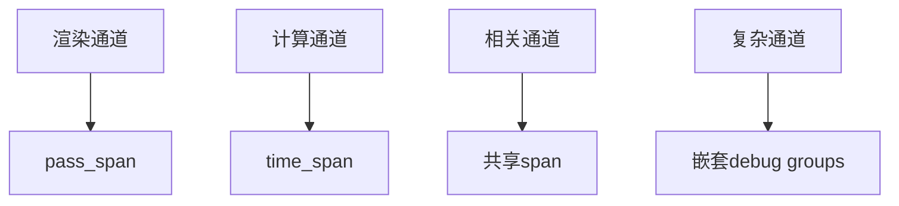

+++
title = "#19191 Record render diagnostics for all engine passes"
date = "2025-08-06T00:00:00"
draft = false
template = "pull_request_page.html"
in_search_index = false

[extra]
current_language = "zh-cn"
available_languages = {"en" = { name = "English", url = "/pull_request/bevy/2025-08/pr-19191-en-20250806" }, "zh-cn" = { name = "中文", url = "/pull_request/bevy/2025-08/pr-19191-zh-cn-20250806" }}
+++

# 技术分析报告：PR #19191 - Record render diagnostics for all engine passes

## 基本信息
- **标题**: Record render diagnostics for all engine passes
- **PR链接**: https://github.com/bevyengine/bevy/pull/19191
- **作者**: jf908
- **状态**: 已合并
- **标签**: C-Feature, A-Rendering, S-Ready-For-Final-Review, D-Modest
- **创建时间**: 2025-05-12T19:10:48Z
- **合并时间**: 2025-08-06T16:29:47Z
- **合并者**: alice-i-cecile

## 描述翻译
### Objective
- 修复 #16742

### Solution
- 为引擎所有渲染和计算通道添加GPU spans。相关通道已分组到单个span中（遵循与bloom相同的约定，后者已实现）。

### Testing
- 在Windows 11 + Vulkan上测试了各种渲染功能，部分在DirectX上测试。

### Showcase
启用了多种渲染功能的Tracy性能分析图：


### Follow up
* **嵌套spans** - 遇到两个阻止实现的问题：
  1. Spans必须在相同作用域声明，不清楚如何跨渲染图节点分组通道（可能是本人技术问题）
  2. 嵌套spans在tracy中显示不正确（全在同一y轴）。不确定是tracy bug、tracy_client crate bug还是多线程解决方案`end_zone()`的问题
* **开发者体验优化** - 重复编写相同代码后，认为bevy应有自己的渲染/计算通道创建函数以自动添加诊断，减少未来PR遗漏诊断的可能性

### Additional notes
渲染crate重构正在进行中 - 这些改动足够小，rebase不会困难，但如果冲突可延迟合并

## PR技术分析

### 问题背景
渲染引擎缺乏统一的性能诊断支持，开发者难以精确分析各渲染通道的GPU耗时。现有实现中，仅少数通道（如bloom）包含性能测量代码，导致：
1. 性能分析不完整，无法定位瓶颈
2. 不同通道实现不一致
3. 新增通道易遗漏诊断代码

问题#16742明确提出需要为所有渲染通道添加GPU性能分析支持。

### 解决方案
核心方案是为每个渲染和计算通道添加标准化的诊断span：
1. 引入`RecordDiagnostics` API统一管理诊断
2. 在所有渲染通道中包裹`pass_span`
3. 在所有计算通道中包裹`time_span`
4. 相关通道分组共享span（如SMAA的子通道）
5. 添加调试组（debug groups）增强层级关系



### 实现细节
实现遵循统一模式：
1. 获取诊断记录器：`let diagnostics = render_context.diagnostic_recorder();`
2. 创建span：`let span = diagnostics.pass_span(&mut render_pass, "pass_name");`
3. 执行通道操作
4. 结束span：`span.end(&mut render_pass);`

#### 关键修改模式
**渲染通道示例** (FXAA):
```rust
// Before:
let mut render_pass = command_encoder.begin_render_pass(&descriptor);
render_pass.draw(0..3, 0..1);

// After:
let diagnostics = render_context.diagnostic_recorder();
let mut render_pass = command_encoder.begin_render_pass(&descriptor);
let pass_span = diagnostics.pass_span(&mut render_pass, "fxaa"); // 新增

render_pass.draw(0..3, 0..1);

pass_span.end(&mut render_pass); // 新增
```

**计算通道示例** (Auto Exposure):
```rust
// Before:
let mut compute_pass = command_encoder.begin_compute_pass(&descriptor);
compute_pass.dispatch_workgroups(1, 1, 1);

// After:
let diagnostics = render_context.diagnostic_recorder();
let mut compute_pass = command_encoder.begin_compute_pass(&descriptor);
let pass_span = diagnostics.time_span(&mut compute_pass, "auto_exposure"); // 新增

compute_pass.dispatch_workgroups(1, 1, 1);

pass_span.end(&mut compute_pass); // 新增
```

### 技术洞察
1. **API设计**：
   - `pass_span()`用于渲染通道，自动关联`RenderPass`
   - `time_span()`用于计算通道和命令编码器
   - span生命周期通过RAII模式管理

2. **性能考量**：
   - 轻量级设计，不添加运行时开销
   - Tracy仅在启用时收集数据
   - 避免深层嵌套以防Tracy显示问题

3. **调试组增强**：
   复杂通道添加层级关系：
   ```rust
   // SMAA示例：
   render_context.command_encoder().push_debug_group("smaa");
   let time_span = diagnostics.time_span(..., "smaa");
   // ...子通道操作
   time_span.end(...);
   render_context.command_encoder().pop_debug_group();
   ```

### 影响分析
1. **性能分析能力**：
   - 完整覆盖所有渲染阶段
   - Tracy中可直观查看各通道耗时
   - 识别性能瓶颈更精准

2. **代码维护**：
   - 统一模式减少实现差异
   - 为自动化诊断奠定基础
   - 新增通道需遵循此模式

3. **开发者体验**：
   - 文档中强调需为新增通道添加诊断
   - 暴露了嵌套span的技术挑战
   - 提出未来API改进方向

## 关键文件变更

### crates/bevy_pbr/src/render/gpu_preprocess.rs (+29/-13)
**变更原因**：为GPU预处理添加统一诊断  
**关键修改**：
```rust
// 新增诊断span
let diagnostics = render_context.diagnostic_recorder();
let mut compute_pass = ...;
let pass_span = diagnostics.time_span(&mut compute_pass, "early_mesh_preprocessing"); // 新增

// ...预处理逻辑

pass_span.end(&mut compute_pass); // 新增
```

### crates/bevy_pbr/src/ssao/mod.rs (+20/-21)
**变更原因**：SSAO通道添加分层诊断  
**关键修改**：
```rust
let diagnostics = render_context.diagnostic_recorder();
command_encoder.push_debug_group("ssao"); // 新增调试组
let time_span = diagnostics.time_span(command_encoder, "ssao"); // 新增

{
    let mut preprocess_pass = ...;
    // 子通道操作
}

time_span.end(command_encoder);
command_encoder.pop_debug_group(); // 结束组
```

### crates/bevy_pbr/src/meshlet/material_shade_nodes.rs (+20/-3)
**变更原因**：Meshlet材质通道添加诊断  
**关键修改**：
```rust
let diagnostics = render_context.diagnostic_recorder();
let mut render_pass = ...;
let pass_span = diagnostics.pass_span(&mut render_pass, "meshlet_material_prepass"); // 新增

// ...渲染操作

pass_span.end(&mut render_pass); // 新增
```

### crates/bevy_pbr/src/atmosphere/node.rs (+13/-2)
**变更原因**：大气渲染通道添加诊断  
**关键修改**：
```rust
// 大气LUT计算
let mut luts_pass = ...;
let pass_span = diagnostics.time_span(&mut luts_pass, "atmosphere_luts"); // 新增
// ...计算操作
pass_span.end(&mut luts_pass);

// 天空渲染
let mut render_sky_pass = ...;
let pass_span = diagnostics.pass_span(&mut render_sky_pass, "render_sky"); // 新增
// ...渲染操作
pass_span.end(&mut render_sky_pass);
```

### crates/bevy_pbr/src/meshlet/visibility_buffer_raster_node.rs (+14/-0)
**变更原因**：实验性嵌套span实现  
**关键修改**：
```rust
// 外层span
let time_span = diagnostics.time_span(encoder, "meshlet_visibility_buffer_raster");

for shadow_view in &shadow_views {
    // 内层span (实验性)
    let pass_span = diagnostics.time_span(encoder, shadow_view.pass_name.clone());
    // ...阴影渲染操作
    pass_span.end(encoder);
}

time_span.end(encoder);
```

## 延伸阅读
1. [Tracy性能分析工具](https://github.com/wolfpld/tracy)
2. [Bevy渲染架构概览](https://bevyengine.org/learn/book/getting-started/rendering/)
3. [WebGPU RenderPass文档](https://gpuweb.github.io/gpuweb/#render-passes)
4. [原始issue #16742](https://github.com/bevyengine/bevy/issues/16742)