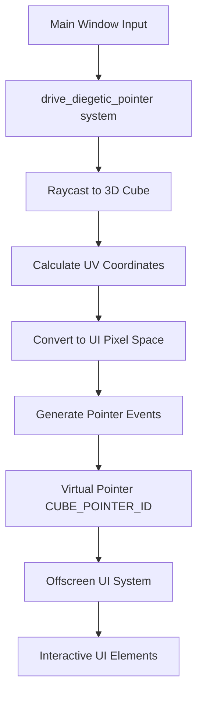

+++
title = "#19199 Diegetic UI example"
date = "2025-08-14T00:00:00"
draft = false
template = "pull_request_page.html"
in_search_index = true

[taxonomies]
list_display = ["show"]

[extra]
current_language = "en"
available_languages = {"en" = { name = "English", url = "/pull_request/bevy/2025-08/pr-19199-en-20250814" }, "zh-cn" = { name = "中文", url = "/pull_request/bevy/2025-08/pr-19199-zh-cn-20250814" }}
labels = ["C-Examples", "A-UI", "A-Picking"]
+++

# Analysis of PR #19199: Diegetic UI example

## Basic Information
- **Title**: Diegetic UI example
- **PR Link**: https://github.com/bevyengine/bevy/pull/19199
- **Author**: aevyrie
- **Status**: MERGED
- **Labels**: C-Examples, A-UI, S-Ready-For-Final-Review, X-Uncontroversial, A-Picking
- **Created**: 2025-05-13T03:37:13Z
- **Merged**: 2025-08-14T19:03:40Z
- **Merged By**: alice-i-cecile

## Description Translation
https://github.com/user-attachments/assets/e7b428b9-4705-4d0a-8322-c7a80994b1a4

This demonstrates general-purpose world-space picking. This is not limited to bevy_ui, it works with any render target and any picking backend, e.g. this could be a viewport/portal in 3d space, it could be a custom UI system, bevy_egui, sprites, etc, etc.

Because this uses UV coordinates, it also works with anything that can be mapped to a surface, so you can display UIs on curved surfaces, etc.

https://github.com/user-attachments/assets/2926a5a1-16c9-4179-85fa-83a69fd55a96

### Discussion

- This illustrates some of the improvements I think we need to make to picking - the picking ID should be removed in favor of a pointer kind - you might have multiple mouse pointers on multiple surfaces, with different unique IDs. It's probably worth revisiting if we can use Entity as the ID instead of a custom one. When I first wrote this, I ran into some unexpected issues that caused with pointers being despawned and getting a new ID. We will just need to be careful of edge cases there.

## The Story of This Pull Request

The PR addresses the challenge of creating interactive UI elements rendered on 3D objects within Bevy's engine. Previously, the `render_ui_to_texture` example demonstrated static UI rendering on a 3D cube but lacked interactivity. This limitation prevented developers from implementing diegetic UIs - UI elements that exist within the game world rather than as screen overlays.

The core problem was mapping 2D mouse input to 3D surfaces. Bevy's input system natively handles screen-space coordinates but doesn't automatically translate these to UV coordinates on textured 3D objects. Without this translation, UI elements rendered on 3D surfaces couldn't receive pointer events.

To solve this, the implementation introduces a virtual pointer system that bridges the gap between screen input and 3D surfaces:
1. A custom pointer ID (`CUBE_POINTER_ID`) identifies interactions specifically with the cube's UI surface
2. The `drive_diegetic_pointer` system handles the coordinate translation:
   - Casts rays to detect intersections with the 3D cube
   - Converts hit UV coordinates to pixel positions in the UI texture
   - Generates synthetic pointer events targeting the offscreen UI render target
3. The UI setup was enhanced with interactive elements:
   - A draggable node with hover effects replaces the static text
   - Event observers handle drag, hover, and exit interactions

The system works by:
1. Calculating the UI texture's physical dimensions
2. Raycasting to find cube intersections and their UV coordinates
3. Converting UVs to pixel coordinates relative to the UI texture
4. Synthesizing pointer move, press, and release events
5. Routing these events to the offscreen UI through the custom pointer ID

Performance considerations:
- Raycasting is performed each frame but optimized to only process active rays
- Coordinate conversions are minimal mathematical operations
- Event generation only occurs when state changes (position or button state)

This approach demonstrates a pattern applicable beyond UI - any texture-based surface interaction can use similar techniques. The solution intentionally avoids modifying core engine systems, instead showing how to extend existing picking functionality through custom systems and event handling.

## Visual Representation



## Key Files Changed

### `examples/ui/render_ui_to_texture.rs` (+142/-18)
Transformed a static UI-on-cube demo into an interactive diegetic UI example. Added custom pointer handling, raycasting, and interactive UI components.

Key modifications:
1. Added custom pointer ID and virtual pointer driver system
```rust
const CUBE_POINTER_ID: PointerId = PointerId::Custom(Uuid::from_u128(90870987));

// ... in main()
.add_systems(First, drive_diegetic_pointer.in_set(PickingSystems::Input))
```

2. Replaced static UI with interactive draggable element
```rust
// Before:
parent.spawn((
    Text::new("This is a cube"),
    // ... text styling
));

// After:
parent
    .spawn((
        Node { /* absolute positioning */ },
        BorderRadius::all(Val::Px(10.)),
        BackgroundColor(BLUE.into()),
    ))
    .observe(|pointer: On<Pointer<Drag>>, ...| { /* drag handling */ })
    .observe(|pointer: On<Pointer<Over>>, ...| { /* hover effect */ })
    .observe(|pointer: On<Pointer<Out>>, ...| { /* exit effect */ })
    .with_children(|parent| {
        parent.spawn(Text::new("Drag Me!"));
    });
```

3. Implemented coordinate translation and event synthesis
```rust
fn drive_diegetic_pointer(...) -> Result {
    // Get UI texture dimensions
    let size = target_info.physical_size.as_vec2();
    
    // Raycast to cube and calculate UI position
    for (_id, ray) in rays.iter() {
        for (_cube, hit) in raycast.cast_ray(*ray, &raycast_settings) {
            let position = size * hit.uv.unwrap();
            // Generate move event when position changes
            pointer_input.write(PointerInput::new(
                CUBE_POINTER_ID,
                Location { target: target.clone(), position },
                PointerAction::Move { delta: position - *cursor_last },
            ));
        }
    }
    
    // Translate mouse clicks to UI events
    for window_event in window_events.read() {
        if let WindowEvent::MouseButtonInput(input) = window_event {
            // ... determine button and action
            pointer_input.write(PointerInput::new(
                CUBE_POINTER_ID,
                Location { target: target.clone(), position: *cursor_last },
                action,
            ));
        }
    }
}
```

## Further Reading
1. Bevy UI Documentation:  
   https://bevyengine.org/learn/book/getting-started/ui/
2. Bevy Picking System Architecture:  
   https://github.com/bevyengine/bevy/tree/main/crates/bevy_picking
3. Render Target Concepts:  
   https://learnopengl.com/Advanced-OpenGL/Framebuffers
4. UV Mapping Fundamentals:  
   https://en.wikipedia.org/wiki/UV_mapping
5. Ray Casting Techniques:  
   https://www.scratchapixel.com/lessons/3d-basic-rendering/minimal-ray-tracer-rendering-simple-shapes