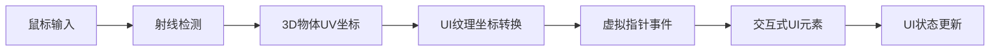

+++
title = "#19199 Diegetic UI example"
date = "2025-08-14T00:00:00"
draft = false
template = "pull_request_page.html"
in_search_index = false

[extra]
current_language = "zh-cn"
available_languages = {"en" = { name = "English", url = "/pull_request/bevy/2025-08/pr-19199-en-20250814" }, "zh-cn" = { name = "中文", url = "/pull_request/bevy/2025-08/pr-19199-zh-cn-20250814" }}
+++

# Diegetic UI example

## 基本信息
- **标题**: Diegetic UI example
- **PR链接**: https://github.com/bevyengine/bevy/pull/19199
- **作者**: aevyrie
- **状态**: MERGED
- **标签**: C-Examples, A-UI, S-Ready-For-Final-Review, X-Uncontroversial, A-Picking
- **创建时间**: 2025-05-13T03:37:13Z
- **合并时间**: 2025-08-14T19:03:40Z
- **合并者**: alice-i-cecile

## 描述翻译
https://github.com/user-attachments/assets/e7b428b9-4705-4d0a-8322-c7a80994b1a4

这个示例展示了通用的世界空间拾取(world-space picking)。它不限于bevy_ui，可用于任何渲染目标和任何拾取后端，例如这可以是3D空间中的视口/门户(viewport/portal)，可以是自定义UI系统、bevy_egui、精灵(sprites)等。

由于它使用UV坐标，它也可以与任何可以映射到表面的内容配合使用，因此你可以在曲面等表面上显示UI。

https://github.com/user-attachments/assets/2926a5a1-16c9-4179-85fa-83a69fd55a96

### 讨论
- 这个示例说明了我认为我们需要对拾取系统进行的一些改进 - 应该移除拾取ID，改用指针类型(pointer kind) - 你可能在多个表面上拥有多个鼠标指针，每个都有不同的唯一ID。可能值得重新考虑是否可以使用Entity作为ID而不是自定义ID。当我最初编写这个示例时，遇到了一些意外问题，这些问题与指针被销毁并获得新ID有关。我们只需要小心处理这些边缘情况。

## 这个PR的故事

### 问题和背景
在游戏开发中，diegetic UI（场景内UI）是一种常见需求，它指直接存在于游戏世界中的UI元素（如角色手持的平板设备上的界面）。Bevy引擎需要提供一个示例来演示如何将UI渲染到纹理并应用到3D物体表面，同时支持交互功能。原有示例`render_ui_to_texture.rs`仅展示了基本的UI渲染到立方体的功能，缺乏交互能力。开发者需要理解：
1. 如何将UI事件系统与3D场景中的物体关联
2. 如何处理UV坐标空间到UI空间的映射
3. 如何为3D表面的UI元素创建虚拟指针事件

### 解决方案
作者通过以下技术方案实现了diegetic UI示例：
1. 创建自定义虚拟指针(CUBE_POINTER_ID)处理3D表面的UI交互
2. 使用射线检测(ray casting)将屏幕坐标转换为3D物体表面的UV坐标
3. 将UV坐标映射到UI纹理空间生成虚拟指针事件
4. 重构UI元素使其可交互（可拖拽、悬停效果）

### 实现细节
核心实现位于新增的`drive_diegetic_pointer`系统：
```rust
fn drive_diegetic_pointer(
    mut cursor_last: Local<Vec2>,
    mut raycast: MeshRayCast,
    rays: Res<RayMap>,
    cubes: Query<&Mesh3d, With<Cube>>,
    ui_camera: Query<&Camera, With<Camera2d>>,
    primary_window: Query<Entity, With<PrimaryWindow>>,
    windows: Query<(Entity, &Window)>,
    images: Res<Assets<Image>>,
    manual_texture_views: Res<ManualTextureViews>,
    mut window_events: EventReader<WindowEvent>,
    mut pointer_input: EventWriter<PointerInput>,
) -> Result {
    // 获取UI纹理尺寸
    let target = ...;
    let target_info = ...;
    let size = target_info.physical_size.as_vec2();

    // 射线检测处理
    let raycast_settings = MeshRayCastSettings {
        visibility: RayCastVisibility::VisibleInView,
        filter: &|entity| cubes.contains(entity),
        early_exit_test: &|_| false,
    };
    for (_id, ray) in rays.iter() {
        for (_cube, hit) in raycast.cast_ray(*ray, &raycast_settings) {
            let position = size * hit.uv.unwrap();
            if position != *cursor_last {
                // 发送指针移动事件
                pointer_input.write(PointerInput::new(...));
                *cursor_last = position;
            }
        }
    }

    // 处理鼠标按钮事件
    for window_event in window_events.read() {
        if let WindowEvent::MouseButtonInput(input) = window_event {
            // 转换鼠标事件为指针事件
            pointer_input.write(PointerInput::new(...));
        }
    }
    Ok(())
}
```

### 技术洞察
1. **UV坐标映射**：核心创新点在于利用射线检测获取3D物体表面的UV坐标，然后将其映射到UI纹理空间：
   ```rust
   let position = size * hit.uv.unwrap();
   ```
   这种方法使UI可以显示在任意形状的3D表面上

2. **虚拟指针系统**：创建专用指针ID(CUBE_POINTER_ID)隔离3D表面的UI事件：
   ```rust
   const CUBE_POINTER_ID: PointerId = PointerId::Custom(Uuid::from_u128(90870987));
   ```

3. **事件桥接**：系统将原生鼠标事件转换为UI系统可处理的PointerInput事件：
   ```rust
   pointer_input.write(PointerInput::new(
       CUBE_POINTER_ID,
       Location { target: target.clone(), position: *cursor_last },
       action,
   ));
   ```

### 影响
1. 提供了diegetic UI的标准实现模式
2. 演示了如何扩展Bevy的拾取系统处理自定义场景
3. 暴露了当前拾取系统的潜在改进点（如使用Entity替代自定义ID）
4. 示例性能经过优化（如使用`cursor_last`缓存减少不必要的事件发送）

## 视觉表示



## 关键文件更改

### `examples/ui/render_ui_to_texture.rs`
该文件被完全重构，从静态UI展示变为交互式diegetic UI示例。

#### 主要变更：
1. 添加虚拟指针系统和事件处理
```rust
// 新增
const CUBE_POINTER_ID: PointerId = PointerId::Custom(Uuid::from_u128(90870987));

// 在main()中注册系统
.add_systems(First, drive_diegetic_pointer.in_set(PickingSystems::Input))
```

2. 重构UI为可交互元素
```rust
// 之前：静态文本
parent.spawn((
    Text::new("This is a cube"),
    TextFont { font_size: 40.0, ..default() },
    TextColor::BLACK,
));

// 之后：可拖拽面板
parent.spawn((
    Node { position_type: PositionType::Absolute, ... },
    BorderRadius::all(Val::Px(10.)),
    BackgroundColor(BLUE.into()),
))
.observe(|pointer: On<Pointer<Drag>>, ...| { /* 拖拽处理 */ })
.observe(|pointer: On<Pointer<Over>>, ...| { /* 悬停效果 */ })
.with_children(|parent| {
    parent.spawn((Text::new("Drag Me!"), ...));
});
```

3. 优化3D场景设置
```rust
// 之前
Transform::from_xyz(0.0, 0.0, 15.0).looking_at(Vec3::ZERO, Vec3::Y)
const ROTATION_SPEED: f32 = 0.5;

// 之后
Transform::from_xyz(0.0, 0.0, 5.0).looking_at(Vec3::ZERO, Vec3::Y)
const ROTATION_SPEED: f32 = 0.1; // 减慢旋转速度
```

## 延伸阅读
1. [Bevy Picking 系统文档](https://docs.rs/bevy_picking/latest/bevy_picking/)
2. [UV映射原理](https://en.wikipedia.org/wiki/UV_mapping)
3. [Diegetic UI设计模式](https://www.gamedeveloper.com/design/the-diegetic-interface)
4. [Bevy渲染目标文档](https://bevyengine.org/learn/book/features/render-target/)