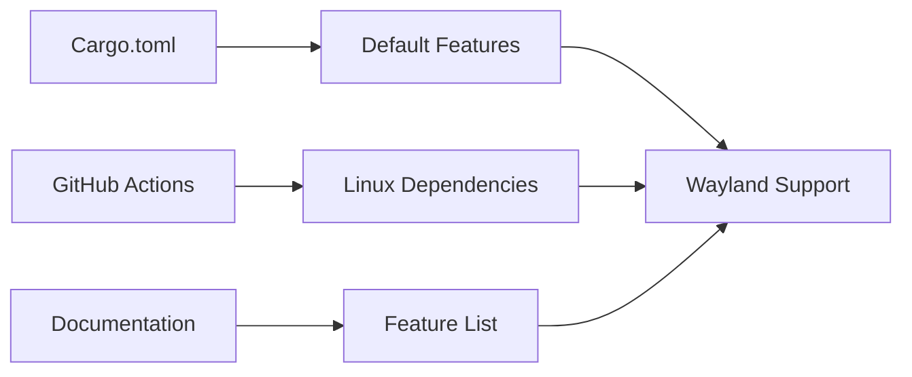

+++
title = "#19232 enable wayland by default"
date = "2025-08-02T00:00:00"
draft = false
template = "pull_request_page.html"
in_search_index = true

[taxonomies]
list_display = ["show"]

[extra]
current_language = "en"
available_languages = {"en" = { name = "English", url = "/pull_request/bevy/2025-08/pr-19232-en-20250802" }, "zh-cn" = { name = "中文", url = "/pull_request/bevy/2025-08/pr-19232-zh-cn-20250801" }}
labels = ["D-Trivial", "A-Rendering", "C-Usability", "X-Controversial", "S-Waiting-on-Author", "S-Needs-SME"]
+++

## Title
Enable Wayland by Default in Bevy Engine

## Basic Information
- **Title**: enable wayland by default
- **PR Link**: https://github.com/bevyengine/bevy/pull/19232
- **Author**: BenjaminBrienen
- **Status**: MERGED
- **Labels**: D-Trivial, A-Rendering, C-Usability, X-Controversial, S-Waiting-on-Author, S-Needs-SME
- **Created**: 2025-05-16T13:13:25Z
- **Merged**: 2025-08-01T23:32:40Z
- **Merged By**: cart

## Description Translation
# Objective

- Fixes #4106
- Fixes #13340

## Solution

Just one commit to add `wayland` to the default features indeed

### Why should it be merged?

The discussion in #4106 seems to be overwhelmingly positive toward adding `wayland` to the default features, as it can greatly improve user experience for Linux users who use Wayland.

Many of the most popular Linux Desktop Environments (DE) like KDE Plasma Desktop and GNOME have Wayland support. With the release of Plasma 6, Wayland is now used by default, and in GNOME, Wayland has been the default for quite a while now.

With Plasma and GNOME, the most popular Linux DEs, now defaulting to Wayland, it seems like enabling Wayland support would truly indeed positively affect quite a lot of Linux users indeed.

Copied from #10792

## The Story of This Pull Request

This PR addresses long-standing requests from Linux users to improve Bevy's out-of-the-box experience on modern Linux desktop environments. The core issue (#4106) documented that Bevy applications would fail to run on Wayland-based systems unless users explicitly enabled the Wayland feature. This created friction for Linux users, particularly those on distributions like GNOME and KDE Plasma where Wayland has become the default display server.

The solution is straightforward: add `wayland` to Bevy's default features in Cargo.toml. This change means Bevy applications will automatically support Wayland without requiring manual configuration. The implementation required coordinated updates across three files:

1. **Cargo.toml**: Added `wayland` to the default features list
2. **Documentation**: Updated the cargo features documentation to reflect the new default
3. **CI Configuration**: Modified GitHub Actions to install Wayland dependencies by default

The decision was informed by the growing adoption of Wayland in major Linux desktop environments. GNOME has used Wayland as its default since 2016, and KDE Plasma made the switch in its sixth major release. With these being the most popular Linux desktop environments, enabling Wayland by default significantly improves the experience for a large segment of Bevy's Linux user base.

The change was controversial (as indicated by the "X-Controversial" label) due to potential impacts on:
1. Users who prefer X11 and might need to explicitly disable Wayland
2. Potential compatibility issues with older systems
3. Increased dependency footprint for Linux users

However, the benefits for the majority of modern Linux users outweighed these concerns. The PR went through extended review (created May 16, merged August 1) with labels indicating it needed SME (Subject Matter Expert) review and author follow-up before final approval.

## Visual Representation



## Key Files Changed

### 1. Cargo.toml
**Change**: Added `wayland` to default features  
**Why**: Enable Wayland support by default  
**Impact**: All Bevy applications will now support Wayland without manual configuration

```diff
# File: Cargo.toml
# Before:
default = [
  "vorbis",
  "webgl2",
  "x11",
  "debug",
  "zstd_rust",
]

# After:
default = [
  "vorbis",
  "webgl2",
  "x11",
+ "wayland",
  "debug",
  "zstd_rust",
]
```

### 2. docs/cargo_features.md
**Change**: Moved `wayland` from optional to default features section  
**Why**: Accurately document the new default behavior  
**Impact**: Users see correct feature status in documentation

```diff
# File: docs/cargo_features.md
# Before:
|vorbis|OGG/VORBIS audio format support|
|webgl2|Enable some limitations to be able to use WebGL2...|
|x11|X11 display server support|
|zstd_rust|For KTX2 Zstandard decompression...|

...

|wav|WAV audio format support|
|wayland|Wayland display server support|
|web|Enables use of browser APIs...|

# After:
|vorbis|OGG/VORBIS audio format support|
|wayland|Wayland display server support|
|webgl2|Enable some limitations to be able to use WebGL2...|
|x11|X11 display server support|
|zstd_rust|For KTX2 Zstandard decompression...|

...

|wav|WAV audio format support|
|web|Enables use of browser APIs...|
```

### 3. .github/actions/install-linux-deps/action.yml
**Change**: Set Wayland dependencies to install by default  
**Why**: Ensure CI environments match new default configuration  
**Impact**: CI builds automatically get required Wayland dependencies

```diff
# File: .github/actions/install-linux-deps/action.yml
# Before:
  wayland:
    description: Install Wayland (libwayland-dev)
    required: false
    default: "false"

# After:
  wayland:
    description: Install Wayland (libwayland-dev)
    required: false
    default: "true"
```

## Further Reading
1. [Wayland Architecture](https://wayland.freedesktop.org/architecture.html)
2. [Bevy Linux Support Discussion](https://github.com/bevyengine/bevy/issues/4106)
3. [KDE Plasma 6 Release Notes](https://kde.org/announcements/plasma/6/6.0.0/)
4. [GNOME Wayland Transition](https://help.gnome.org/misc/release-notes/3.22/)