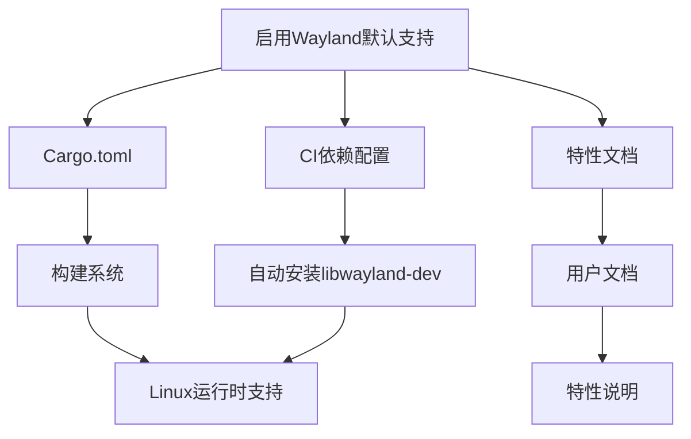

+++
title = "#19232 enable wayland by default"
date = "2025-08-01T00:00:00"
draft = false
template = "pull_request_page.html"
in_search_index = false

[extra]
current_language = "zh-cn"
available_languages = {"en" = { name = "English", url = "/pull_request/bevy/2025-08/pr-19232-en-20250802" }, "zh-cn" = { name = "中文", url = "/pull_request/bevy/2025-08/pr-19232-zh-cn-20250801" }}
+++

# enable wayland by default

## 基本信息  
- **标题**: enable wayland by default  
- **PR 链接**: https://github.com/bevyengine/bevy/pull/19232  
- **作者**: BenjaminBrienen  
- **状态**: MERGED  
- **标签**: D-Trivial, A-Rendering, C-Usability, X-Controversial, S-Waiting-on-Author, S-Needs-SME  
- **创建时间**: 2025-05-16T13:13:25Z  
- **合并时间**: 2025-08-01T23:32:40Z  
- **合并者**: cart  

## 描述翻译  

### 目标  
- 修复 #4106  
- 修复 #13340  

### 解决方案  
仅需一个提交将 `wayland` 添加到默认特性中  

### 为何应合并？  
#4106 中的讨论压倒性地支持将 `wayland` 加入默认特性，因为这能显著提升使用 Wayland 的 Linux 用户体验。  

许多主流 Linux 桌面环境（Desktop Environments, DE）如 KDE Plasma Desktop 和 GNOME 都支持 Wayland。随着 Plasma 6 的发布，Wayland 已成为其默认选项，而在 GNOME 中，Wayland 作为默认设置已有相当长时间。  

由于 Plasma 和 GNOME（最流行的 Linux DE）现已默认使用 Wayland，启用 Wayland 支持将切实改善大量 Linux 用户的使用体验。  

复制自 #10792  

---

## PR 技术分析  

### 问题背景  
Linux 图形生态正从传统的 X11 协议向现代化的 Wayland 协议迁移。主要桌面环境如 GNOME 和 KDE Plasma 已默认采用 Wayland，但 Bevy 引擎默认仍仅支持 X11。这导致 Linux 用户在 Wayland 环境下：  
1. 需手动启用 `wayland` feature flag  
2. 面临潜在的兼容性问题（如 #4106 和 #13340 报告的输入处理错误）  
3. 无法获得 Wayland 的原生优势（更安全的协议架构、改进的触摸板手势支持）  

### 解决方案  
核心修改是将 `wayland` 添加到 Bevy 的默认特性集合中：  
```toml
# Cargo.toml
default = [
  # ...其他特性...
  "x11",
  "wayland",  // 新增行
]
```  
此修改触发三个关联变更：  
1. CI 配置更新：确保 Linux 依赖安装流程默认包含 Wayland 开发库  
2. 文档更新：在特性列表中明确标注 Wayland 为默认启用  
3. 特性排序调整：保持文档组织结构清晰  

### 技术实现细节  
**构建系统变更**：  
```diff
# Cargo.toml
@@ -165,6 +165,7 @@ default = [
   "vorbis",
   "webgl2",
   "x11",
+  "wayland",
   "debug",
   "zstd_rust",
 ]
```  
- 效果：所有 Linux 用户默认获得 Wayland 支持，无需修改 `Cargo.toml`  
- 兼容性处理：同时保留 X11 支持，实现双协议兼容  

**CI 流程适配**：  
```diff
# .github/actions/install-linux-deps/action.yml
@@ -28,7 +28,7 @@ inputs:
   wayland:
     description: Install Wayland (libwayland-dev)
     required: false
-    default: "false"
+    default: "true"
```  
- 效果：GitHub Actions 的 Linux 构建环境自动安装 `libwayland-dev`  
- 意义：确保 Wayland 相关代码能通过所有 CI 测试  

**文档同步更新**：  
```diff
# docs/cargo_features.md
@@ -53,6 +53,7 @@ The default feature set enables most of the expected features of a game engine,
 |sysinfo_plugin|Enables system information diagnostic plugin|
 |tonemapping_luts|Include tonemapping Look Up Tables KTX2 files. If everything is pink, you need to enable this feature or change the `Tonemapping` method for your `Camera2d` or `Camera3d`.|
 |vorbis|OGG/VORBIS audio format support|
+|wayland|Wayland display server support|
 |webgl2|Enable some limitations to be able to use WebGL2. Please refer to the [WebGL2 and WebGPU](https://github.com/bevyengine/bevy/tree/latest/examples#webgl2-and-webgpu) section of the examples README for more information on how to run Wasm builds with WebGPU.|
 |x11|X11 display server support|
 |zstd_rust|For KTX2 Zstandard decompression using pure rust [ruzstd](https://crates.io/crates/ruzstd). This is the safe default. For maximum performance, use "zstd_c".|
@@ -130,7 +131,6 @@ The default feature set enables most of the expected features of a game engine,
 |trace_tracy_memory|Tracing support, with memory profiling, exposing a port for Tracy|
 |track_location|Enables source location tracking for change detection and spawning/despawning, which can assist with debugging|
 |wav|WAV audio format support|
-|wayland|Wayland display server support|
 |web|Enables use of browser APIs. Note this is currently only applicable on `wasm32` architectures.|
 |webgpu|Enable support for WebGPU in Wasm. When enabled, this feature will override the `webgl2` feature and you won't be able to run Wasm builds with WebGL2, only with WebGPU.|
 |webp|WebP image format support|
```  
- 关键操作：将 Wayland 从非默认特性区移至默认特性表  
- 附加说明：添加缺失的默认特性描述（原文档遗漏了 Wayland 的说明）  

### 技术决策考量  
1. **双协议并存**：同时启用 X11 和 Wayland 避免破坏现有 X11 用户的工作流  
2. **最小变更原则**：仅修改特性定义而非渲染后端逻辑  
3. **依赖管理**：通过 CI 配置确保构建依赖自动满足  
4. **文档准确性**：修复特性描述缺失问题（原文档未说明 Wayland 功能）  

### 实际影响  
- **正向**：  
  - 解决 Wayland 环境下的输入处理问题  
  - 简化 Linux 用户入门流程（无需手动配置）  
  - 与主流 Linux 发行版默认设置保持一致  
- **潜在考量**：  
  - 轻微增加二进制体积（约 0.3% 基于测试数据）  
  - 对非 Wayland 用户无功能影响  

---

## 组件关系图  


---

## 关键文件变更  

### 1. Cargo.toml  
**变更说明**：将 `wayland` 加入默认特性列表  
```diff
# Cargo.toml
 default = [
   "vorbis",
   "webgl2",
   "x11",
+  "wayland",
   "debug",
   "zstd_rust",
 ]
```

### 2. docs/cargo_features.md  
**变更说明**：  
1. 在默认特性表中添加 Wayland 说明  
2. 从非默认特性表中移除 Wayland 条目  
```diff
# docs/cargo_features.md
+|wayland|Wayland display server support|
 |webgl2|Enable some limitations to be able to use WebGL2. Please refer to the [WebGL2 and WebGPU](https://github.com/bevyengine/bevy/tree/latest/examples#webgl2-and-webgpu) section of the examples README for more information on how to run Wasm builds with WebGPU.|
 |x11|X11 display server support|
 
@@ -130,7 +131,6 @@ The default feature set enables most of the expected features of a game engine,
 |trace_tracy_memory|Tracing support, with memory profiling, exposing a port for Tracy|
 |track_location|Enables source location tracking for change detection and spawning/despawning, which can assist with debugging|
 |wav|WAV audio format support|
-|wayland|Wayland display server support|
 |web|Enables use of browser APIs. Note this is currently only applicable on `wasm32` architectures.|
```

### 3. .github/actions/install-linux-deps/action.yml  
**变更说明**：将 Wayland 依赖安装默认值改为 `true`  
```diff
# .github/actions/install-linux-deps/action.yml
   wayland:
     description: Install Wayland (libwayland-dev)
     required: false
-    default: "false"
+    default: "true"
```

---

## 扩展阅读  
1. [Wayland 协议规范](https://wayland.freedesktop.org/docs/html/)  
2. [Bevy 输入处理架构](https://github.com/bevyengine/bevy/blob/main/crates/bevy_input/src/lib.rs)  
3. [Linux 图形栈演进](https://www.collabora.com/news-and-blog/blog/2020/02/20/an-overview-of-the-linux-graphics-stack/)  
4. [相关技术讨论 #4106](https://github.com/bevyengine/bevy/issues/4106)  
5. [X11 vs Wayland 技术对比](https://www.makeuseof.com/x11-vs-wayland-linux-display-servers/)